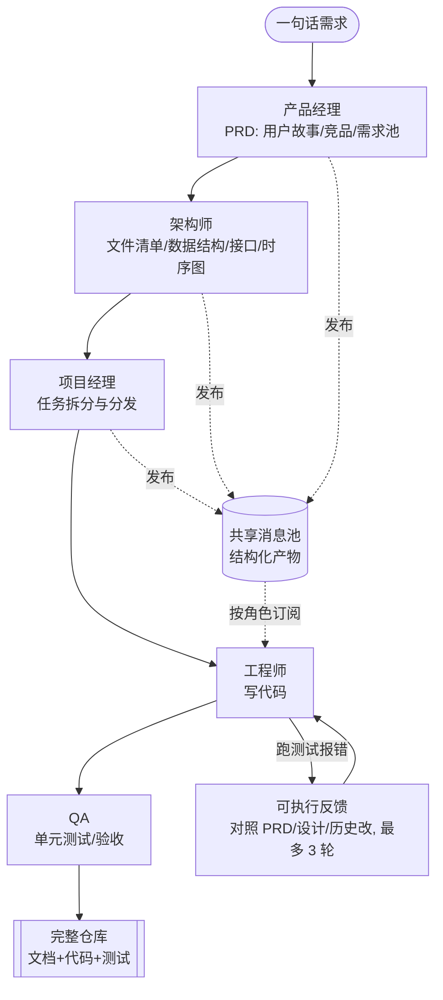

# Paper · 论文本身

## 一句话总结

MetaGPT 把"一句话需求 → 一个完整软件"交给一支 **LLM 多智能体团队**来做,核心招数是:**别让 agent 们自由聊天**(那样会把幻觉一层层传下去、越错越多),而是把人类软件公司的**标准作业流程(SOP)**写进提示里——每个角色(产品/架构/项目/工程/测试)产出**结构化的文档**(PRD、接口设计、任务单、代码、测试),通过一个**共享消息池 + 按角色订阅**协作,工程师还会**真跑代码、按报错自我纠正**。一句话:`Code = SOP(Team)`。[^arxiv][^repo]

## 问题(Problem)

- 把多个 LLM **天真地串起来**做复杂任务,会因为**幻觉一层层级联**导致逻辑前后矛盾——前一步编错了,后面全跟着错。[^arxiv]
- 而且 agent 之间常常是**无效闲聊**("你好、在吗、你觉得呢"),既烧 token 又引入噪声。[^arxiv]
- 缺的是:**把成熟的人类协作流程(谁先做什么、产物长什么样、怎么验收)**注入进去,让中间结果**可被有领域常识的角色检查**,从源头压住错误。

> [!key] 立场
> MetaGPT 的价值是**工程范式**:用 SOP + 结构化产物 + 消息池协作,把"多 agent 怎么不互相带偏"这件事做成了可复现的工程,而不是靠更强的单模型。看它学**怎么编排一支 agent 团队**。

## 关键术语(Key terms)

| 术语 | 大白话解释 |
| --- | --- |
| **SOP(标准作业流程)** | 人类公司里"需求→设计→排期→写码→测试"的固定流程。MetaGPT 把它编码成提示序列,让 agent 照章办事而非自由发挥。[^sop] |
| **角色专精(role specialization)** | 给每个 agent 一个明确职责 + 该产出的工件,像真公司里的产品经理/架构师/工程师。[^roles] |
| **结构化通信接口** | agent 之间传的不是大白话对话,而是有 schema 的文档/图(PRD、接口表、时序图),减少歧义。[^comm] |
| **共享消息池 + 发布订阅** | 所有产物丢进一个公共池;每个角色**按自己关心的**去订阅(工程师订阅 PRD+设计,不被 QA 反馈淹没),省掉一对一索要。[^comm] |
| **可执行反馈(executable feedback)** | 工程师写完代码**真去运行**,报错就对照 PRD/设计/历史消息改,最多重试 3 次。[^feedback] |

## 核心方法(Core method)

把一句话需求灌进一条**装配线**,每个角色是 React 式的循环(看消息池→该我了就干→把产物发回池):[^roles]

1. **产品经理** → 写 **PRD**(用户故事、竞品分析、需求池)。
2. **架构师** → 出**系统设计**(文件清单、数据结构、接口定义、时序图)。
3. **项目经理** → 把设计**拆成任务单**分发。
4. **工程师** → 按任务**写代码**。
5. **QA 工程师** → 写**单元测试**并验收。

两个让它"不带偏"的关键设计:
- **结构化产物代替闲聊**:角色之间传的是带 schema 的文档,信息密度高、歧义低。[^comm]
- **可执行反馈闭环**:代码生成后真跑,报错→翻历史消息+对照 PRD/设计/代码改→再跑,最多 3 轮。这把"靠人眼 review"换成"靠运行结果纠错"。[^feedback]

## 架构 / 流程(Architecture / pipeline)



## 创新点(Innovation points)

| 创新 | 新在哪 | 为什么重要 |
| --- | --- | --- |
| 把 SOP 注入多 agent | `Code = SOP(Team)`:用人类流程约束协作 | 中间结果可被角色检查,从源头压住级联幻觉 |
| 结构化产物代替对话 | 传 PRD/接口/时序图等带 schema 的工件,不传闲聊 | 降歧义、降 token 浪费、可验收 |
| 共享消息池 + 发布订阅 | 公共池 + 按角色订阅,而非一对一索要 | 防信息过载,角色只拿自己关心的 |
| 可执行反馈闭环 | 工程师真跑代码、按报错自纠(≤3 轮) | 用运行结果纠错,显著提代码质量 |

## 实验 / 证据(Experiments / evidence)

**代码基准(pass@1):**[^bench]
- HumanEval:**85.9%**
- MBPP:**87.7%**

**SoftwareDev 数据集(7 个代表性任务,与 ChatDev 对比):**[^softdev]

| 指标 | ChatDev | MetaGPT(无反馈) | MetaGPT |
| --- | ---: | ---: | ---: |
| 可执行性(1–4) | 2.25 | 3.67 | **3.75** |
| 运行耗时(秒) | 762 | 503 | 541 |
| Token 用量 | 19,292 | 24,613 | 31,255 |
| 代码总行数 | 77.5 | 194.6 | 251.4 |
| 生产率(tokens/行,越低越好) | 248.9 | 126.5 | **124.3** |
| 人工修订成本 | 2.5 | 2.25 | **0.83** |
| 任务完成率 | — | — | **100%** |

**消融:**[^abl]
- **角色有用**:在"只有工程师"的基线上加产品/架构/项目经理,可执行性 1.0 → 4.0、人工修订 10 → 2.5(代价是 token 略增)。
- **可执行反馈有用**:HumanEval **+4.2%**、MBPP **+5.4%**;可执行性 3.67 → 3.75;人工修订 2.25 → **0.83**。

> [!warn] 别被带偏
> 1. **Token 更贵**:MetaGPT 比 ChatDev 用更多 token(31,255 vs 19,292),换来的是更高可执行性与更低人工修订——是"质量换成本",上线要算账。[^softdev]
> 2. **任务范围有限**:SoftwareDev 是 7 个相对小型、明确的编程任务;别外推成"能造任意复杂软件"。
> 3. **幻觉没被消灭**,只是被结构化压低;作者自己也承认仍存在。[^arxiv]

## 限制与风险(Limitations and risks)

- **上下文窗口**限制了 agent 能看到的信息;**幻觉仍在**(结构化只是缓解)。[^arxiv]
- **依赖好需求 + 领域知识**:用户得给足够清楚的需求,初始还需有人定义角色画像与通信 schema。[^arxiv]
- **协议僵化**:作者指出当前优化只改"角色专精的约束提示",**没改结构化通信接口本身**,动态协议演化是未来工作(Appendix A.1)。[^arxiv]
- 伦理:对就业/技能、AI 生成代码的透明与问责、隐私安全的担忧。[^arxiv]

## 先读什么(What to read first)

1. **Abstract + Introduction** —— 为什么"天真串联 LLM"会级联出错。[^arxiv]
2. **方法节(SOP + 五角色 + 通信)+ 框架图** —— 吃透装配线与消息池/订阅。
3. **可执行反馈那一节** —— 它是质量提升的关键来源。[^feedback]
4. **实验 + 消融表** —— 角色与可执行反馈各贡献了多少。[^abl]
5. **仓库** —— `Code = SOP(Team)` 哲学 + 抽象(Role/Action/Environment/Team 在代码里,README 未逐一展开)。[^repo]

## 技术细节(选读)

（以下为选读：想自己复现机制时再看）

> 读者**跳过本层也能完整理解主深读**;这里是给"想自己搭一支 agent 团队"的 builder 看的机制级细节。所有具体结论标注原文 §/图;凡原文未写清的明确写"原文未明确"。引用基于 arXiv:2308.00352(MetaGPT,ICLR 2024)全文。
>
> **重要(防张冠李戴)**:MetaGPT **不使用任何强化学习 / REINFORCE**。它的"优化"全靠**SOP 约束 + 结构化产物 + 可执行反馈纠错**,以及一个**改约束提示**的递归自改进(附录 A.1)——这是 prompt 级的适配,**不是策略梯度**。把 REINFORCE 归给 MetaGPT 是错误的(那是 GPTSwarm)。

### SOP 是怎么"编码"进 agent 团队的

**大白话。** 人类软件公司不会让一屋子人自由发挥,而是有一套固定流程:先写需求、再做设计、再排期、再写码、再测试,每一步都有**固定格式的交付物**(PRD、设计文档、任务单……)。MetaGPT 干的事就是**把这套流程"硬编码"进一串提示词**,让每个 agent 只在自己那一环按规定格式产出东西,而不是漫无目的地聊。`Code = SOP(Team)` 是仓库 README 的口号式概括,**论文正文里并没有这条公式**(原文是描述性地讲 SOP 编码,不是一个方程)。

**精确机制(原文 §3.1):**
- 原文措辞:"MetaGPT encodes Standardized Operating Procedures (SOPs) into prompt sequences for more streamlined workflows"(把 SOP 编码进**提示序列**)。
- SOP 落地为三件具体的事(§3.1):
  1. **角色专属约束**(role-specific constraints)——写进每个 agent 的 profile;
  2. **顺序化的工作流**——产品经理 → 架构师 → 项目经理 → 工程师 → QA,固定流向;
  3. **每次交接强制结构化产出**——上一环必须产出规定格式的文档,下一环才接得住。
- 角色行为模式:所有 agent 都遵循 **ReAct 式**行为循环(原文 §3.1 引 Yao et al. 2022:"All agents adhere to the React-style behavior")——观察(看消息池)→ 行动(轮到自己就执行 action)→ 把产物发回池。

**关于"角色的形式化定义":** 原文**没有给数学元组**(没有 `Role = (name, goal, constraints, actions)` 这种正式记号)。它是描述性的(§3.1):"we specify the agent's profile, which includes their **name, profile, goal, and constraints** for each role. We also initialize the specific **context and skills** for each role." 即一个角色 ≈(名字 / 画像 / 目标 / 约束 / 上下文 / 技能·工具)的集合。把它叫"形式化"是过度解读——这是**结构化的提示模板**,不是形式系统。

### 每个角色产出什么结构化工件,被什么 schema 约束

**大白话。** MetaGPT 的核心赌注是:**agent 之间传"带格式的文档",而不是传"自由对话"**。文档有固定结构(文件清单、接口表、数据结构、时序图),歧义低、可验收;自由对话则容易把幻觉一层层传下去。原文 §3.2 明确这一对比:"agents in MetaGPT communicate through **documents and diagrams (structured outputs) rather than dialogue**",显式区别于 ChatDev 的非结构化聊天。

**精确机制(原文 §3.1 / 图 3 装配线;附录 B.2 给了具体样例):**

| 角色 | 产出的结构化工件 | 约束它的"schema"(原文给出的字段/形态) |
| --- | --- | --- |
| **产品经理 Product Manager** | PRD(产品需求文档) | User Stories(用户故事)、Competitive Analysis(竞品分析)、Requirement Pool(需求池);附录 B.2 的需求池是**带优先级的二元组列表**,如 `[("Design a user-friendly GUI...", "P0"), ...]` |
| **架构师 Architect** | 系统设计 | File List(文件清单,如 `["main.py", "color_picker.py", "gui.py", "tests.py"]`)、Data Structures(数据结构)、Interface Definitions(接口定义)、Sequence Flow(时序图) |
| **项目经理 Project Manager** | 任务分解 | Task List(任务单)+ 角色/职责分配 |
| **工程师 Engineer** | 代码 | 按设计实现的 classes / functions(受架构师的文件清单与接口定义约束) |
| **QA 工程师 QA Engineer** | 单元测试与验收 | Unit Tests / Test Coverage |

要点:**下游角色被上游产物的 schema "锁住"**——工程师写哪些文件、实现哪些接口,不是自由发挥,而是被架构师产出的"文件清单 + 接口定义"框定(这正是"结构化通信"压制级联幻觉的机制:每一步的输出都有可对照的骨架)。**原文未明确**:这些 schema 是否有机器可校验的严格语法(如 JSON Schema 强校验),论文层面是以**约定格式 + 提示约束**实现,而非形式化语法校验。

### 共享消息池 + 发布/订阅,为什么打败"全员广播"

**大白话。** 最朴素的多 agent 通信是"谁都跟谁一对一说话"——N 个 agent 就有 N² 条对话通道,既乱又烧 token,而且每个 agent 会被一堆**跟自己无关**的消息淹没。MetaGPT 改成**一个公共池**:所有人把产物丢进池子;每个 agent **只按自己关心的**去池子里"订阅/捞取"自己需要的——架构师只盯产品经理的 PRD,根本不去看 QA 的测试反馈。这样既不用挨个索要,也不会被无关信息刷屏。

**精确机制(原文 §3.2,Communication Protocol):**
- **存储 / 访问(共享消息池 shared message pool)**:"we introduce a shared message pool that allows all agents to exchange messages directly. These agents **not only publish their structured messages in the pool but also access messages from other entities transparently**. Any agent can directly retrieve required information from the shared pool"。即**所有结构化消息集中存放**,任何 agent 都能**透明地直接读取**,不必点对点向源头索要。
- **订阅怎么决定"我读什么"(role-specific interest)**:"agents utilize **role-specific interests** to extract relevant information. They can **select information to follow based on their role profiles**." 即**订阅由角色画像驱动**——一个角色"关心什么"写在它的 profile 里,据此从池中过滤。原文举例:"the **Architect** mainly focuses on **PRDs** provided by the Product Manager, while documents from roles such as the QA Engineer might be of **lesser concern**."
- **为什么 pub/sub 胜过一对一全连接**:原文点名先前工作的弊端——"communicating this information each time in a **one-to-one manner** ... can **complicate the communication topology, resulting in inefficiencies**"(一对一会让通信拓扑复杂化、低效)。pub/sub 把"谁需要谁的什么"从 O(N²) 显式连线降为"发布到池 + 按兴趣订阅"。
- **顺带做了执行同步**:"in practical implementations, an agent **activates its action only after receiving all its prerequisite dependencies**"——一个 agent 只有在**前置依赖(它订阅的那些产物)全部到齐**后才触发自己的动作。这既是通信机制,也顺手实现了**装配线的次序控制**(无需额外调度器去"叫号")。

```mermaid
flowchart TD
  subgraph POOL[共享消息池 shared message pool]
    PRD[PRD]
    DESIGN[系统设计/接口/时序图]
    TASKS[任务单]
    CODE[代码]
    TESTS[测试]
  end
  PM[产品经理] -->|发布 PRD| PRD
  ARCH[架构师] -->|发布 设计| DESIGN
  PJM[项目经理] -->|发布 任务| TASKS
  ENG[工程师] -->|发布 代码| CODE
  QA[QA] -->|发布 测试| TESTS
  PRD -. 订阅(role-specific interest) .-> ARCH
  DESIGN -. 订阅 .-> PJM
  TASKS -. 订阅 .-> ENG
  PRD -. 订阅 .-> ENG
  DESIGN -. 订阅 .-> ENG
  CODE -. 订阅 .-> QA
  note[每个角色只在"前置依赖全到齐"后才触发动作 §3.2]
```

### 可执行反馈闭环——代码怎么真跑、报错怎么回喂、改几轮

**大白话。** 光靠"人/模型读一遍代码"挑不出运行期 bug。MetaGPT 让工程师**自己写测试、真把代码跑起来**;跑挂了,就拿着报错回头对照需求和设计去改,改完再跑,直到通过或到达重试上限。把"靠人眼 review"换成"靠运行结果纠错",这是论文里质量提升最实的来源。

**精确机制(原文 §3.3,Iterative programming with executable feedback;图 2 右半部分):**
1. 工程师据设计/PRD 生成初版代码;
2. 工程师**自己写并执行单元测试**(代码被真实运行,不是想象其行为);
3. 运行/测试结果回喂给工程师;
4. 若失败:"the Engineer **debugs the code before resuming programming**"——工程师改 bug 再继续;
5. **循环上限**:"This iterative testing process continues until the **test is passed** or a maximum of **3 retries** is reached."(测试通过或最多 3 次重试为止)。
6. **改代码时工程师读什么**:"checks **past messages stored in memory** and compares them with the **PRD, system design, and code files**"——回看记忆里的历史消息,并与 PRD / 系统设计 / 代码文件**逐一对照**后再改。这正是"结构化产物"派上用场之处:有可对照的骨架,改 bug 才不会越改越偏。

**效果(原文 Table 1 / 消融,§4):** 可执行反馈把 SoftwareDev 的可执行性从 3.67 → 3.75、人工修订成本从 2.25 → **0.83**;MBPP pass@1 **+5.4%**(绝对值)。即这一闭环是把"能跑"和"少返工"拉起来的关键开关。

> **再次强调**:这一闭环是**确定性的执行-报错-重写**循环(deterministic execute→error→revise),**不是 RL**——没有奖励信号、没有策略更新、没有梯度。它靠的是"运行结果"这个客观真相 + 结构化对照。

### 角色装配线端到端走一遍

**大白话。** 一句话需求进去,像工厂流水线一样,一个工位产出一份带格式的交付物、传给下一个工位,最后吐出一整套"文档 + 代码 + 测试"的仓库。

**精确机制(原文 §3.1 Workflow across Agents;装配线见图 3):**

```text
用户一句话需求
  → 产品经理:深入分析需求 → 产出结构化 PRD(用户故事/竞品/需求池)
  → 架构师:把需求翻译成系统设计组件(文件清单/数据结构/接口/时序图)
  → 项目经理:做任务分发(把设计拆成任务单 + 分配)
  → 工程师:实现指定的 classes 与 functions(进入可执行反馈闭环, ≤3 轮自纠)
  → QA 工程师:写单元测试并验收
  → 输出:完整软件仓库
```

原文概括(§3.1):"upon obtaining user requirements, the **Product Manager** undertakes a thorough analysis ... The structured PRD is then passed to the **Architect**, who translates the requirements into system design components ... the **Project Manager** for task distribution. **Engineers** proceed to execute the designated classes and functions ..."。每一棒的"交接"都不是对话,而是**结构化产物经由消息池被下游按订阅取走**——装配线的"传送带"就是上一节讲的 pub/sub 池。附录 B 给了一个画图 App GUI 的完整 demo 执行。

**递归自改进(原文附录 A.1,容易被误读为 RL,这里澄清):** "Prior to each project, every agent ... reviews previous feedback and makes necessary adjustments to their **constraint prompts**." 即**每个新项目开始前,agent 回看上次的反馈,改自己的"约束提示"**。这是**meta-prompt 级的适配**(下一轮换更好的提示),**不是策略梯度/RL**。而且论文自己指出其局限:当前这种优化**只改"角色专精的约束提示",没改结构化通信接口本身**——动态协议演化被列为未来工作(附录 A.1)。

### 一句话定位(给跳读者)

主深读已讲清 `SOP + 结构化产物 + 消息池 + 可执行反馈` 的总图;本层只多给四件复现级事实:**(1)** SOP = 把"角色约束 + 固定流向 + 强制结构化交付"编码进提示序列(无 `Code=SOP(Team)` 公式,那是 README 口号);**(2)** 每个角色产出**带固定字段的工件**(PRD 需求池是带优先级二元组、架构师给文件清单+接口),下游被上游 schema 锁住;**(3)** 通信是**共享池 + 按角色画像订阅**,"依赖到齐才触发动作"顺手管了次序,胜过 O(N²) 一对一;**(4)** 可执行反馈是**真跑代码→对照 PRD/设计/代码改→最多 3 轮**的确定性循环。**全程无 RL / 无 REINFORCE**——这是与 GPTSwarm 的根本分界。

## 后续演化 · 这方法后来怎样了

下列为 2026-06-05 经独立核实的前向脉络(谁优化/替换/扩展了本工作)。

- **AFlow: Automating Agentic Workflow Generation**(arXiv:2410.10762)— 用 MCTS 在代码化工作流空间搜索,取代手写 SOP;+5.7% 平均,GPT-4o 级 HumanEval 仅 4.55% 推理成本 _[置信度:中]_。
- **MetaGen: Self-Evolving Roles and Topologies for Multi-Agent LLM Reasoning**(arXiv:2601.19290)— 推理时按每条 query 自进化角色与拓扑;全文 Table1 对 MetaGPT/GPTSwarm 基线大幅领先 _[置信度:高]_。
- **MetaAgent: Auto-Constructing Multi-Agent Systems via FSM**(arXiv:2507.22606)— 用有限状态机自动构建多智能体系统,替代人工设计的 SOP 工作流 _[置信度:中]_。
- **Data Interpreter: An LLM Agent for Data Science**(arXiv:2402.18679)— MetaGPT 团队的领域落地:动态分层图规划,DABench 75.9%→94.9% _[置信度:高]_。
- **SPO: Self-Supervised Prompt Optimization**(arXiv:2502.06855)— MetaGPT 团队的提示自优化,1.1%–5.6% 的现有方法成本 _[置信度:高]_。
- **MacNet: Scaling LLM Multi-Agent Collaboration**(arXiv:2406.07155)— 用 DAG 组织 1000+ 智能体协作,规模化 MetaGPT 式协作 _[置信度:中]_。

[^arxiv]: 论文 *MetaGPT: Meta Programming for a Multi-Agent Collaborative Framework*,arXiv:2308.00352(ICLR 2024)。https://arxiv.org/abs/2308.00352
[^sop]: 同上,方法节(SOP 编码进提示序列;`Code = SOP(Team)`)。
[^roles]: 同上,角色节(产品经理/架构师/项目经理/工程师/QA 及各自工件;React 式行为循环)。
[^comm]: 同上,通信节(共享消息池 + 发布订阅按角色订阅;结构化通信接口/schema 代替自由对话)。
[^feedback]: 同上,可执行反馈节(工程师运行代码、对照 PRD/设计/历史消息纠错,最多重试 3 次)。
[^bench]: 同上,代码基准(HumanEval pass@1 85.9%;MBPP pass@1 87.7%)。
[^softdev]: 同上,SoftwareDev 表(可执行性 3.75 vs ChatDev 2.25;生产率 124.3 tokens/行;人工修订 0.83;Token 用量 31,255;任务完成率 100%)。
[^abl]: 同上,消融(角色:可执行性 1.0→4.0、修订 10→2.5;可执行反馈:HumanEval +4.2%、MBPP +5.4%、修订 2.25→0.83)。
[^repo]: 代码仓库 `FoundationAgents/MetaGPT`,https://github.com/FoundationAgents/MetaGPT(68.5k★,MIT;`metagpt "Create a 2048 game"` 一句话需求→`./workspace` 全套产物;哲学 `Code = SOP(Team)`)。
