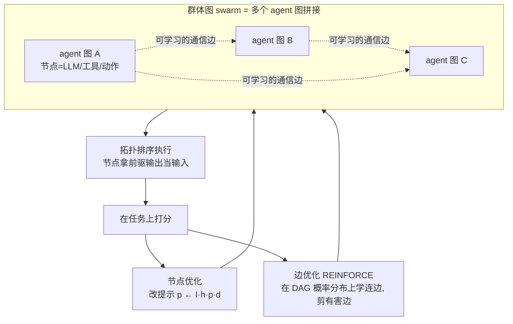
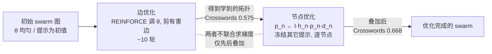

# Paper · 论文本身

## 一句话总结

GPTSwarm 把一个语言 agent 看成一张**计算图**(节点=一次 LLM 调用/工具/动作,边=信息怎么流),把多个 agent 拼成一张更大的**群体图(swarm)**;关键是这张图**可以被自动优化**——既能在节点里**自动改提示词**,又能用强化学习(REINFORCE)**自动学"谁该连谁"**,把没用甚至有害的连边**剪掉**。一句话:**把"怎么编排一群 agent"从手工搭线,变成可梯度优化的图。**[^arxiv][^repo]

## 问题(Problem)

- 现在搭多 agent 系统,**拓扑(谁跟谁通信、谁先谁后)几乎全靠人手设计**,换个任务就得重搭,也没法保证搭得最优。
- 同时,**单个 agent 内部的提示词**也常靠人调。
- 这两件事——**节点内的提示**和**节点间的连边**——本质都是"图上的参数"。如果能把 agent 和 swarm 统一成一张图,就能**用统一的优化器同时优化提示和拓扑**,让系统自己变好(这正是"自进化"的一种具体形态)。[^arxiv]

> [!key] 立场
> GPTSwarm 的价值是**一个统一的抽象 + 一套优化器**:agent=图、swarm=图、优化=在图上调提示和连边。它让"多 agent 编排"从手艺活变成可学习的结构。看它学**怎么把 agent 系统变成可优化对象**。

## 关键术语(Key terms)

| 术语 | 大白话解释 |
| --- | --- |
| **节点 / 边 / 图** | 节点 = 一次操作(LLM 推理、工具、函数、动作);边 = 信息从哪个节点流到哪个节点;一个 agent = 一张有向无环图 `G=(N,E,F,o)`(N 节点、E 边、F 例程、o 输出节点)。[^abstr] |
| **群体图(composite graph / swarm)** | 把 K 个 agent 图拼起来,新加的边 = agent 之间的**通信通道**。[^abstr] |
| **节点优化** | 自动改每个节点的提示词:节点存输入输出历史 `h`,用改写器 `I` 迭代更新 `p ← I(h, p, d)`(d=该节点该干嘛的描述)。[^nodeopt] |
| **边优化** | 不直接挑离散的边,而是在"**所有可能 DAG 的概率分布**"上优化,用 **REINFORCE** 无偏梯度学哪些边该留,**剪掉有害/无用连边**。[^edgeopt] |

## 核心方法(Core method)

把 agent 和 swarm 都表示成图后,在图上做**两层优化**:

1. **节点优化(改提示)**:每个节点维护历史 `h`,用改写函数 `I` 按"该节点的目标描述 `d`"迭代更新提示 `p`。相当于让每个 agent 自己把话术调好。[^nodeopt]
2. **边优化(改拓扑)**:把"选哪些边"松弛成"在所有可行 DAG 上的概率分布",用 **REINFORCE** 估梯度去优化这个分布(论文 Eq.2 给了无偏估计)。优化后会**把没用甚至有害的连边剪掉**——比如对抗设置里,优化器会把"捣乱 agent"的边断开。[^edgeopt]

执行时按**拓扑排序**跑(Algorithm 1):每个节点拿前驱的输出当输入,一路算到输出节点。[^abstr]

## 架构 / 流程(Architecture / pipeline)



## 创新点(Innovation points)

| 创新 | 新在哪 | 为什么重要 |
| --- | --- | --- |
| agent / swarm 统一成图 | 单 agent 和多 agent 用同一套图抽象 | 编排变成可操作、可优化的对象 |
| 两层优化(节点 + 边) | 同时优化提示词与图拓扑 | 提示和"谁连谁"都不再手调 |
| 边优化做成可微 | 把离散选边松弛成 DAG 概率分布 + REINFORCE | 能用梯度自动学拓扑、剪有害边 |
| 自动剪枝有害连接 | 对抗 agent 的边被自动断开 | 系统对"坏队友"有鲁棒性 |

## 实验 / 证据(Experiments / evidence)

**Mini Crosswords(边优化主战场):**[^crossword]
- 初始分布:**0.465**(±0.0509)
- 边优化 10 轮后:**0.575**(±0.0275);**再加节点优化:0.668**(±0.0060)
- 换 GPT-4-Turbo:**0.800**(±0.0616);此前 SoTA(ToT + GPT-4):0.675
- 密度对照:固定 0.125 概率的分布约 32.80 条边只到 0.510,而学到的分布约 32.76 条边却到 0.575 → **提升来自"连对边",不是"连更多边"**。

**HumanEval(节点优化):**without 优化 **0.76** → 节点优化 8 轮 **0.88**(±0.007)。[^humaneval]

**协作 MMLU:**优化后的 swarm 比基线提升 **+2.1% ± 1.1%**(5 个种子平均)。[^mmlu]

**GAIA(7×ToT agent + 自一致):**[^gaia]

| 难度 | GPT-4-Turbo | AutoGPT | GPTSwarm |
| --- | ---: | ---: | ---: |
| Level 1 | 20.75 | 13.21 | **30.56±3.25** |
| Level 2 | 5.81 | 0 | **20.93±1.27** |
| Level 3 | 0 | 3.85 | **3.85±2.43** |
| 平均 | 9.70 | 4.85 | **18.45(+90.2%)** |

**消融**:边优化单独 0.575 → 叠加节点优化 0.668;自一致(self-consistency)优于"选最好"。[^abl]

> [!warn] 别被带偏
> 1. **最难的问题没解决**:GAIA Level 3 提升 **0%**——边/节点优化在最硬任务上还撑不住,是 scalability 难点。[^gaia]
> 2. **优化要花 API 钱**:作者明说因 API 成本高,GPT-4-Turbo 那组只在单一图分布上评,优化本身有真实开销。[^crossword]
> 3. **工具能力受限**:43.9% 的 GAIA 任务需要真正网页浏览,但当时实现只下载 URL / 查 Google,**不做网站内导航**——分数受工具拖累,不全是编排的锅。[^lim]

## 限制与风险(Limitations and risks)

- **最难任务无提升**(GAIA L3 = 0%);拓扑优化对极难推理的天花板未知。[^gaia]
- **优化成本**:REINFORCE 要采样多张图跑任务,token/钱不便宜,大规模优化要算账。[^crossword]
- **工具瓶颈**:浏览/导航能力弱会盖过编排收益(43.9% 任务受影响)。[^lim]
- **图规模**:边数随 agent 数组合爆炸,超大 swarm 的可优化性未充分验证。

## 先读什么(What to read first)

1. **Abstract + 图抽象定义(`G=(N,E,F,o)` 与 composite graph)** —— 先建立"agent=图、swarm=图"的心智模型。[^abstr]
2. **边优化那节(REINFORCE + DAG 概率分布)** —— 这是论文最核心的创新。[^edgeopt]
3. **Mini Crosswords 实验 + 密度对照** —— 看"连对边" vs "连更多边"。[^crossword]
4. **GAIA Table** —— 看群体图在真实任务上的提升与天花板。[^gaia]
5. **仓库** —— `swarm.graph / environment / optimizer` 三块;`Swarm(["IO","IO","IO"], "gaia")` 一行起一个群体。[^repo]

## 技术细节(选读)

（以下为选读：想自己复现机制时再看）

> 读者**跳过本层也能完整理解主深读**;这里是给"想自己复现"的 builder 看的机制级细节。所有具体结论都标注了原文 §/图/式;凡原文未写清的,明确写"原文未明确"。引用基于 arXiv:2402.16823 **v3**(ICML 2024 正式版,2024-08-22 修订)的 HTML 全文。

### 边优化为什么能用 REINFORCE,以及它到底在优化什么

**大白话先建直觉。** 想象你要决定"一群 agent 里,谁该把话传给谁"。如果直接枚举"留哪些边、剪哪些边",这是个**离散的组合选择**——边一多就爆炸,而且离散选择**没法求导**,梯度优化用不上。GPTSwarm 的招数是把"硬选择"换成"软概率":**给每一条潜在的边挂一个 0~1 的概率 `θ_i`(读作"这条边有多大概率被启用")**。这样"这张图长什么样"就变成了一个**概率分布**;优化目标不再是"挑一张最好的图",而是"调这些概率,让从分布里随机抽出来的图平均表现最好"。把离散选择软化成概率,就能求导了——这就是把拓扑搜索变成可梯度优化的全部关键。

**精确机制。**

- **优化对象**:不是某一张确定的图,而是一个**由 `θ` 参数化的、所有可行 DAG(有向无环图 directed acyclic graph)上的分布 `D_θ`**。优化目标(原文 §2.3.1,**式 1**):

  ```
  arg max_{θ∈Θ}  𝔼_{G'∼D_θ}[ u_τ(G') ]
  ```

  读法:在所有可能的 `θ` 里,找一组让"从分布 `D_θ` 抽出的图 `G'` 在任务 `τ` 上的效用 `u_τ` 的**期望**"最大的 `θ`。这里 `u_τ` 是**任务效用函数**,原文只给了它的"类型"——"把候选图映射到实数"的函数(§2.3),**没有给统一的数学定义**;具体到每个任务它是任务相关的打分,比如 Mini Crosswords 里 `u_τ` = "图返回的解里,正确填入单词数最多的那个的 best state word accuracy"(§3.2)。

- **每条边怎么挂概率 / 怎么采样一张图**(原文 §2.3.2):每条潜在边 `e_i` 配一个独立参数 `θ_i ∈ [0,1]`,采样时**逐条边按伯努利(Bernoulli)分布独立决定启用与否**。一张被采出来的图 `G` 的概率是各边伯努利概率的**连乘**(原文 §2.3.2):

  ```
  p_θ(G) = ∏_{i=1}^{d}  { θ_i ,   若 (N, E ∪ ({e_j}_{j=1}^{i-1} ∩ ℰ) ∪ {e_i}) 仍是 DAG
                        { 0   ,   否则
  ```

  这里 `d` = 潜在边总数,`ℰ` = 可学习的(agent 之间的)新增边集合。**关键细节**:连乘里那个分段条件就是**无环保证**——逐条边加入时,如果加上 `e_i` 会让当前图出现环,这条边的概率直接置 0(即**永不启用**)。所以分布只在合法 DAG 上有支撑,采样天然不会采出带环的图(原文 §2.3.2:"If including `e_i` causes a cycle in current `G'`, then the edge would not be included")。

- **REINFORCE 梯度估计器**(原文 §2.3.3,**式 2**):

  ```
  ∇_θ 𝔼_{G_ℰ∼D_θ}[ u_τ(G_ℰ) ]  ≈  (1/M) ∑_{i=1}^{M}  û_τ(G_i) · ∇_θ log p_θ(G_i)
  ```

  读法(这是 REINFORCE 的标准形式,"用对数似然的梯度乘以拿到的回报"):抽 `M` 张图 `G_i ∼ D_θ`,每张实际跑任务拿到效用估计 `û_τ(G_i)`,用它给 `∇_θ log p_θ(G_i)`(让这张图更/更不可能被采到的方向)加权,平均即为期望效用对 `θ` 的无偏梯度估计。直觉:**跑得好的图,就把它用到的那些边的概率往上推;跑得差的,往下压。** 这就是"剪掉没用/有害边"的来源——有害边所在的图反复拿低效用,其边概率被持续压低直至趋零。

- **方差 / baseline 怎么处理**:式 2 里**没有写显式的 baseline/advantage 项**(原文主式里只有无偏估计 `û_τ`)。论文是在**附录 D.3.1**里、**仅对 Mini Crosswords** 做了一个手工方差缩减:"To reduce the variance in gradient estimation with the REINFORCE algorithm, we adjust the utility by subtracting a constant of **0.4**"——即把效用整体减去常数 0.4 当作一个**固定基线(constant baseline)**。注意这是任务专属的工程手段,**不是通用的、可学习的 baseline 网络**;论文未提供自适应基线。

- **超参数**(原文附录 D):优化器 **Adam**(β₁=0.9, β₂=0.999);学习率与采样数**按任务不同**——MMLU 用 lr=0.1、`M=4`;Mini Crosswords 用 lr=0.4、`M=20`。边优化通常跑约 10 轮(§3.2)。

- **有害边怎么被剪**(原文 §3.1,图 2 / 图 10):对抗实验里放 `k` 个诚实 agent + `k` 个对抗 agent(对抗 agent 被"故意编程去诱导 LLM 给错答案",配置记作如 2T2A / 3T3A)。边优化后,**通往对抗 agent 的连边概率被压到接近 0**,优化后 swarm 的得分"渐近对齐"只有诚实 agent 的基线(原文 §3.1,图 2);图 10 直接可视化了 2T2A 在优化前(所有潜在边都画上)与优化后(只剩真正启用的边、对抗 agent 被孤立)的对比。

**给 builder 的伪代码(忠实复述原文 Algorithm 2 的逻辑,变量名对齐式 1/式 2):**

```text
# 边优化(原文 Algorithm 2,§2.3)
初始化 θ ∈ ℝ^d                       # 每条潜在边一个概率参数
repeat ~10 次:
    采样 M 张图 {G_1..G_M} ~ D_θ      # 逐边伯努利;遇环则该边置0,保证DAG
    for each G_i:
        û_i ← 在任务 τ 上实际执行 G_i 得到的效用估计   # 见 Algorithm 1 执行
        (Mini Crosswords 专属: û_i ← û_i − 0.4)        # 固定baseline降方差(附录D.3.1)
    g ← (1/M) Σ_i û_i · ∇_θ log p_θ(G_i)                # 式2,REINFORCE估计
    θ ← Adam 更新(θ, g, lr)                              # MMLU lr=0.1/M=4; Crosswords lr=0.4/M=20
return θ                                                 # 收敛后高概率边=学到的拓扑
```

### DAG 上的执行顺序与无环保证

**大白话。** 一张图要"跑起来",必须先确定**谁先算、谁后算**:一个节点要用到前驱的输出,所以前驱必须先算完。把这个依赖关系排成一条线,就是**拓扑排序(topological sort)**——保证你算到任何一个节点时,它依赖的所有节点都已经算好了。能这么排的前提是图**无环**(有环就会"A 等 B、B 等 A"死锁),而前面边采样阶段已经保证了这一点。

**精确机制(原文 Algorithm 1,Graph Execution):**

```text
# 单图执行(原文 Algorithm 1)
for n in TopologicalSort(N):          # 按拓扑序遍历节点
    z_n ← { f_v(z_v, x) : v ∈ pre(n) }   # 收集所有前驱 v 的输出,作为 n 的上下文
return f_o(z_o, x)                     # 输出节点 o 的结果即整图输出 ŷ
```

要点:
- `pre(n)` = 节点 `n` 的**前驱集合**(predecessors);原文明确"The set of predecessors of node `n` is denoted by `pre(n)`"(§2.2)。
- 每个节点 `n` 套用自己的**例程 `f_n`**(routine):可以是一次 LLM 推理、一次工具调用、一个函数、或一个具身动作(原文 §2.2 列举:"LLM inference, tool use, function calls, and various embodied actions")。
- **无环不是执行期处理的,而是构造期保证的**:执行阶段不做任何环检测/打破环的操作;无环性在**边采样阶段**就由"遇环则该边概率=0"强制了(§2.3.2)。所以 GPTSwarm 始终工作在 DAG 上,**不支持显式回路/循环**(若需要"多轮迭代"得靠展开成更多节点,原文未把循环作为一等公民讨论)。

### 节点优化(改提示)与边优化(改拓扑)如何分工与配合

**大白话。** 一张图上有两类"可调参数":**节点里的提示词**(每个 agent 怎么说话)和**节点间的连边**(谁连谁)。GPTSwarm 把它们分成两个独立优化器:**节点优化**只动提示、不动连线;**边优化**只动连线、不动提示。两者不联合求一个梯度,而是**先后叠加**使用。

**精确机制。**

- **节点优化更新式**(原文 §2.4):

  ```
  p_n ← I(h_n, p_n, d_n) ,  对所有 n ∈ N
  ```

  - `p_n` = 节点当前提示词;
  - `h_n` = 该节点的**输入-输出历史**(执行图时收集到的 `((z_n, x), 输出)` 对集合);
  - `d_n` = 该节点**职责的自然语言描述**(如 "a Python code generator");
  - `I` = **提示优化函数**;原文点名"现成的提示优化方法,如 **OPRO**(Yang et al., 2023),可被描述为这样一个函数 `I`"(§2.4)。即 `I` 不是 GPTSwarm 新发明的,而是把已有的 prompt-优化器接到每个节点上。

- **为什么能逐节点独立优化**:原文给了一个**假设**(原文措辞是 hypothesize,不是证明)——"for every optimization step, it is sufficient to update each node-level prompt individually, **assuming that all other prompts are fixed**"(§2.4)。即优化某个节点提示时,**冻结其它所有节点的提示**,把它当作一个局部子问题。这是工程近似,论文未给最优性保证。

- **两者怎么配合(关键、且与某些早期预印本不同)**:在 **Mini Crosswords** 上,论文是**先边优化、再在其结果上叠加节点优化**:边优化 10 轮 → 0.575(±0.0275),**在此基础上再做节点优化** → **0.668(±0.0060)**(原文 §3.2 / 附录 D.2)。附录 D.2 明确了此处节点优化优化的是**swarm 里各节点的提示**:"For each node `n`, `p_n` corresponds to the initial prompt, `h_n` consists of the input-output pairs obtained by executing the graphs on the 20 Mini Crosswords problems"。

  > **复现者注意**:这套"先结构、后提示"的顺序,emergentmind 的综述概括为"structural improvements precede or complement prompt-level refinements"(结构先于/补充提示级微调)。但论文**没有把节点+边写成一个联合梯度**,也**没有反复交替迭代两者**——它是**一次性的两阶段叠加**(edge → node),不是 alternating optimization。HumanEval 那组则是**只做节点优化**(0.76 → 0.88,§3.3),不涉及边优化。"联合/交替优化"在原文中**未实现也未给算法**——属于原文未覆盖的部分。



### 边上到底流的是什么

**大白话。** 一条边 `(u, v)` 的物理含义很朴素:**把节点 `u` 算出来的东西,作为上下文喂给节点 `v`**。流的内容不是什么特制协议,就是**自然语言字符串**(LLM 节点之间传的就是文本)。

**精确机制(原文 §2.2):**
- 边定义"操作之间的信息流"(information flow between operations)。一条边 `(u,v)` 的作用是:把 `f_u` 的输出,纳入 `v` 的上下文 `z_v`(对照 Algorithm 1 里 `z_n ← {f_v(z_v,x) : v∈pre(n)}`)。
- 传输的数据类型:原文明确"inputs and outputs are **strings in natural language**, but may take on other data types more generally"(§2.2)。即**默认是自然语言文本**,框架上允许其它数据类型,但论文实现以字符串为主。
- **原文未明确**的部分(复现者需自己定):没有规定**结构化的消息 schema、序列化格式、消息头/路由元数据**;当一个节点有**多个前驱**时,各前驱输出**如何拼接/排序**进上下文,原文也未给统一规范——这点与 MetaGPT 那种"带 schema 的结构化文档 + 发布订阅"形成对比,是 GPTSwarm 留白、由实现决定的地方。

### 一句话定位(给跳读者)

主深读已经讲清"agent=图、swarm=图、两层优化"的心智模型;本层只多给三件复现级事实:**(1)** 边优化把离散选边软化成逐边伯努利概率,用 REINFORCE(式 2)按"图跑得好不好"推拉边概率、自动剪有害边,无环由采样期"遇环置 0"保证;**(2)** 执行靠拓扑排序(Algorithm 1),不支持显式循环;**(3)** 节点优化与边优化**不联合**,Mini Crosswords 上是 edge→node 两阶段叠加(0.465→0.575→0.668),边上流的就是自然语言字符串、无强制 schema。

## 后续演化 · 这方法后来怎样了

下列为 2026-06-05 经独立核实的前向脉络(谁优化/替换/扩展了本工作)。

- **MetaGen: Self-Evolving Roles and Topologies for Multi-Agent LLM Reasoning**(arXiv:2601.19290)— GPTSwarm 离线优化静态图 → MetaGen 推理时重写角色+拓扑:HumanEval 95.1% vs 69.6%(+25.5pp)、MMLU 93.5% vs 60.1%(+33.4pp)、token −85.7% _[置信度:高]_。
- **Graph-GRPO: Stabilizing Multi-Agent Topology Learning via GRPO**(arXiv:2603.02701)— 用 GRPO 替代 GPTSwarm 的 REINFORCE 优化通信图拓扑(具体数字需正文核实,已剔除)_[置信度:中]_。
- **MASS: Multi-Agent Design — Optimizing Prompts and Topologies**(arXiv:2502.02533)— 三阶段优化(块级 prompt + workflow 拓扑 + 全局 prompt),改进图/拓扑优化路线 _[置信度:中]_。
- **AFlow: Automating Agentic Workflow Generation**(arXiv:2410.10762)— 以代码化工作流 + MCTS 搜索替代图结构边优化 _[置信度:中]_。
- **MacNet: Scaling LLM Multi-Agent Collaboration**(arXiv:2406.07155)— DAG 组织 1000+ 智能体,延伸图式多智能体规模 _[置信度:中]_。

[^arxiv]: 论文 *GPTSwarm: Language Agents as Optimizable Graphs*,arXiv:2402.16823(ICML 2024)。https://arxiv.org/abs/2402.16823
[^abstr]: 同上,图抽象节(节点=LLM/工具/函数/动作;`G=(N,E,F,o)`;composite graph 的 agent 间边=通信通道;Algorithm 1 拓扑排序执行)。
[^nodeopt]: 同上,节点优化节(节点存历史 h,改写器 `p ← I(h,p,d)`)。
[^edgeopt]: 同上,边优化节(在可行 DAG 概率分布上优化,REINFORCE 无偏梯度 Eq.2;剪有害/对抗边,Fig.11)。
[^crossword]: 同上,Mini Crosswords(初始 0.465±0.0509;边优化 10 轮 0.575±0.0275;+节点 0.668±0.0060;GPT-4-Turbo 0.800±0.0616;前 SoTA ToT+GPT-4 0.675;密度对照 0.125 分布 0.510±0.0552)。
[^humaneval]: 同上,HumanEval(无优化 0.76 → 节点优化 8 轮 0.88±0.007)。
[^mmlu]: 同上,协作 MMLU(优化 swarm 较基线 +2.1%±1.1%,5 seeds)。
[^gaia]: 同上,GAIA Table 1(GPTSwarm 平均 18.45 vs GPT-4-Turbo 9.70,+90.2%;L1 30.56±3.25 / L2 20.93±1.27 / L3 3.85±2.43)。
[^abl]: 同上,消融(边优化 0.575 → +节点 0.668;自一致优于选最好;提升来自连对边非连更多边)。
[^lim]: 同上,局限/未来工作(43.9% 任务需网页浏览,实现仅下载 URL/查 Google 不做站内导航;API 成本限制评估范围)。
[^repo]: 代码仓库 `metauto-ai/GPTSwarm`,https://github.com/metauto-ai/GPTSwarm(1k★;`swarm.graph`/`swarm.environment`/`swarm.optimizer`;`Swarm(["IO","IO","IO"], "gaia")` API;边概率更新/剪枝可视化)。
