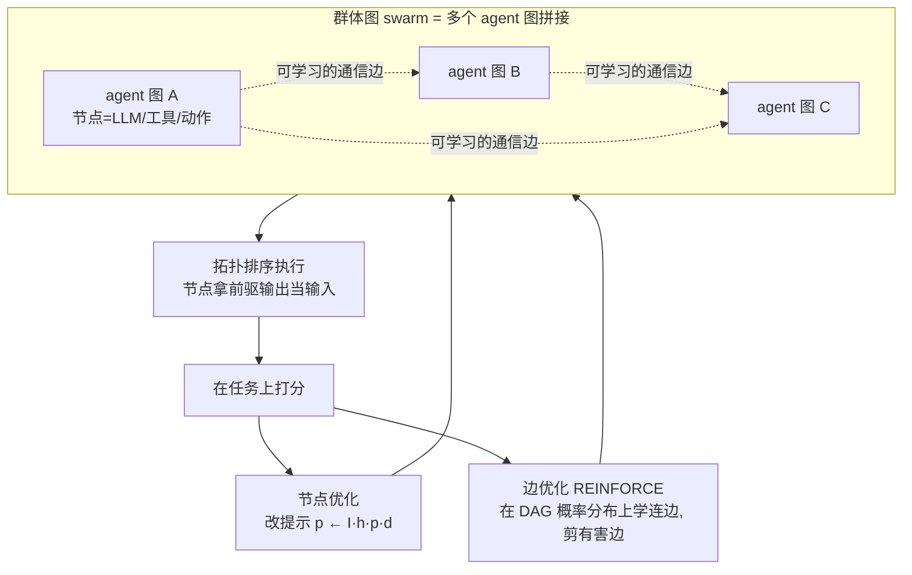

# Paper · 论文本身

## 一句话总结

GPTSwarm 把一个语言 agent 看成一张**计算图**(节点=一次 LLM 调用/工具/动作,边=信息怎么流),把多个 agent 拼成一张更大的**群体图(swarm)**;关键是这张图**可以被自动优化**——既能在节点里**自动改提示词**,又能用强化学习(REINFORCE)**自动学"谁该连谁"**,把没用甚至有害的连边**剪掉**。一句话:**把"怎么编排一群 agent"从手工搭线,变成可梯度优化的图。**[^arxiv][^repo]

## 问题(Problem)

- 现在搭多 agent 系统,**拓扑(谁跟谁通信、谁先谁后)几乎全靠人手设计**,换个任务就得重搭,也没法保证搭得最优。
- 同时,**单个 agent 内部的提示词**也常靠人调。
- 这两件事——**节点内的提示**和**节点间的连边**——本质都是"图上的参数"。如果能把 agent 和 swarm 统一成一张图,就能**用统一的优化器同时优化提示和拓扑**,让系统自己变好(这正是"自进化"的一种具体形态)。[^arxiv]

> [!key] 立场
> GPTSwarm 的价值是**一个统一的抽象 + 一套优化器**:agent=图、swarm=图、优化=在图上调提示和连边。它让"多 agent 编排"从手艺活变成可学习的结构。看它学**怎么把 agent 系统变成可优化对象**。

## 关键术语(Key terms)

| 术语 | 大白话解释 |
| --- | --- |
| **节点 / 边 / 图** | 节点 = 一次操作(LLM 推理、工具、函数、动作);边 = 信息从哪个节点流到哪个节点;一个 agent = 一张有向无环图 `G=(N,E,F,o)`(N 节点、E 边、F 例程、o 输出节点)。[^abstr] |
| **群体图(composite graph / swarm)** | 把 K 个 agent 图拼起来,新加的边 = agent 之间的**通信通道**。[^abstr] |
| **节点优化** | 自动改每个节点的提示词:节点存输入输出历史 `h`,用改写器 `I` 迭代更新 `p ← I(h, p, d)`(d=该节点该干嘛的描述)。[^nodeopt] |
| **边优化** | 不直接挑离散的边,而是在"**所有可能 DAG 的概率分布**"上优化,用 **REINFORCE** 无偏梯度学哪些边该留,**剪掉有害/无用连边**。[^edgeopt] |

## 核心方法(Core method)

把 agent 和 swarm 都表示成图后,在图上做**两层优化**:

1. **节点优化(改提示)**:每个节点维护历史 `h`,用改写函数 `I` 按"该节点的目标描述 `d`"迭代更新提示 `p`。相当于让每个 agent 自己把话术调好。[^nodeopt]
2. **边优化(改拓扑)**:把"选哪些边"松弛成"在所有可行 DAG 上的概率分布",用 **REINFORCE** 估梯度去优化这个分布(论文 Eq.2 给了无偏估计)。优化后会**把没用甚至有害的连边剪掉**——比如对抗设置里,优化器会把"捣乱 agent"的边断开。[^edgeopt]

执行时按**拓扑排序**跑(Algorithm 1):每个节点拿前驱的输出当输入,一路算到输出节点。[^abstr]

## 架构 / 流程(Architecture / pipeline)

## 创新点(Innovation points)

| 创新 | 新在哪 | 为什么重要 |
| --- | --- | --- |
| agent / swarm 统一成图 | 单 agent 和多 agent 用同一套图抽象 | 编排变成可操作、可优化的对象 |
| 两层优化(节点 + 边) | 同时优化提示词与图拓扑 | 提示和"谁连谁"都不再手调 |
| 边优化做成可微 | 把离散选边松弛成 DAG 概率分布 + REINFORCE | 能用梯度自动学拓扑、剪有害边 |
| 自动剪枝有害连接 | 对抗 agent 的边被自动断开 | 系统对"坏队友"有鲁棒性 |

## 实验 / 证据(Experiments / evidence)

**Mini Crosswords(边优化主战场):**[^crossword]
- 初始分布:**0.465**(±0.0509)
- 边优化 10 轮后:**0.575**(±0.0275);**再加节点优化:0.668**(±0.0060)
- 换 GPT-4-Turbo:**0.800**(±0.0616);此前 SoTA(ToT + GPT-4):0.675
- 密度对照:固定 0.125 概率的分布约 32.80 条边只到 0.510,而学到的分布约 32.76 条边却到 0.575 → **提升来自"连对边",不是"连更多边"**。

**HumanEval(节点优化):**without 优化 **0.76** → 节点优化 8 轮 **0.88**(±0.007)。[^humaneval]

**协作 MMLU:**优化后的 swarm 比基线提升 **+2.1% ± 1.1%**(5 个种子平均)。[^mmlu]

**GAIA(7×ToT agent + 自一致):**[^gaia]

| 难度 | GPT-4-Turbo | AutoGPT | GPTSwarm |
| --- | ---: | ---: | ---: |
| Level 1 | 20.75 | 13.21 | **30.56±3.25** |
| Level 2 | 5.81 | 0 | **20.93±1.27** |
| Level 3 | 0 | 3.85 | **3.85±2.43** |
| 平均 | 9.70 | 4.85 | **18.45(+90.2%)** |

**消融**:边优化单独 0.575 → 叠加节点优化 0.668;自一致(self-consistency)优于"选最好"。[^abl]

> [!warn] 别被带偏
> 1. **最难的问题没解决**:GAIA Level 3 提升 **0%**——边/节点优化在最硬任务上还撑不住,是 scalability 难点。[^gaia]
> 2. **优化要花 API 钱**:作者明说因 API 成本高,GPT-4-Turbo 那组只在单一图分布上评,优化本身有真实开销。[^crossword]
> 3. **工具能力受限**:43.9% 的 GAIA 任务需要真正网页浏览,但当时实现只下载 URL / 查 Google,**不做网站内导航**——分数受工具拖累,不全是编排的锅。[^lim]

## 限制与风险(Limitations and risks)

- **最难任务无提升**(GAIA L3 = 0%);拓扑优化对极难推理的天花板未知。[^gaia]
- **优化成本**:REINFORCE 要采样多张图跑任务,token/钱不便宜,大规模优化要算账。[^crossword]
- **工具瓶颈**:浏览/导航能力弱会盖过编排收益(43.9% 任务受影响)。[^lim]
- **图规模**:边数随 agent 数组合爆炸,超大 swarm 的可优化性未充分验证。

## 先读什么(What to read first)

1. **Abstract + 图抽象定义(`G=(N,E,F,o)` 与 composite graph)** —— 先建立"agent=图、swarm=图"的心智模型。[^abstr]
2. **边优化那节(REINFORCE + DAG 概率分布)** —— 这是论文最核心的创新。[^edgeopt]
3. **Mini Crosswords 实验 + 密度对照** —— 看"连对边" vs "连更多边"。[^crossword]
4. **GAIA Table** —— 看群体图在真实任务上的提升与天花板。[^gaia]
5. **仓库** —— `swarm.graph / environment / optimizer` 三块;`Swarm(["IO","IO","IO"], "gaia")` 一行起一个群体。[^repo]

[^arxiv]: 论文 *GPTSwarm: Language Agents as Optimizable Graphs*,arXiv:2402.16823(ICML 2024)。https://arxiv.org/abs/2402.16823
[^abstr]: 同上,图抽象节(节点=LLM/工具/函数/动作;`G=(N,E,F,o)`;composite graph 的 agent 间边=通信通道;Algorithm 1 拓扑排序执行)。
[^nodeopt]: 同上,节点优化节(节点存历史 h,改写器 `p ← I(h,p,d)`)。
[^edgeopt]: 同上,边优化节(在可行 DAG 概率分布上优化,REINFORCE 无偏梯度 Eq.2;剪有害/对抗边,Fig.11)。
[^crossword]: 同上,Mini Crosswords(初始 0.465±0.0509;边优化 10 轮 0.575±0.0275;+节点 0.668±0.0060;GPT-4-Turbo 0.800±0.0616;前 SoTA ToT+GPT-4 0.675;密度对照 0.125 分布 0.510±0.0552)。
[^humaneval]: 同上,HumanEval(无优化 0.76 → 节点优化 8 轮 0.88±0.007)。
[^mmlu]: 同上,协作 MMLU(优化 swarm 较基线 +2.1%±1.1%,5 seeds)。
[^gaia]: 同上,GAIA Table 1(GPTSwarm 平均 18.45 vs GPT-4-Turbo 9.70,+90.2%;L1 30.56±3.25 / L2 20.93±1.27 / L3 3.85±2.43)。
[^abl]: 同上,消融(边优化 0.575 → +节点 0.668;自一致优于选最好;提升来自连对边非连更多边)。
[^lim]: 同上,局限/未来工作(43.9% 任务需网页浏览,实现仅下载 URL/查 Google 不做站内导航;API 成本限制评估范围)。
[^repo]: 代码仓库 `metauto-ai/GPTSwarm`,https://github.com/metauto-ai/GPTSwarm(1k★;`swarm.graph`/`swarm.environment`/`swarm.optimizer`;`Swarm(["IO","IO","IO"], "gaia")` API;边概率更新/剪枝可视化)。
