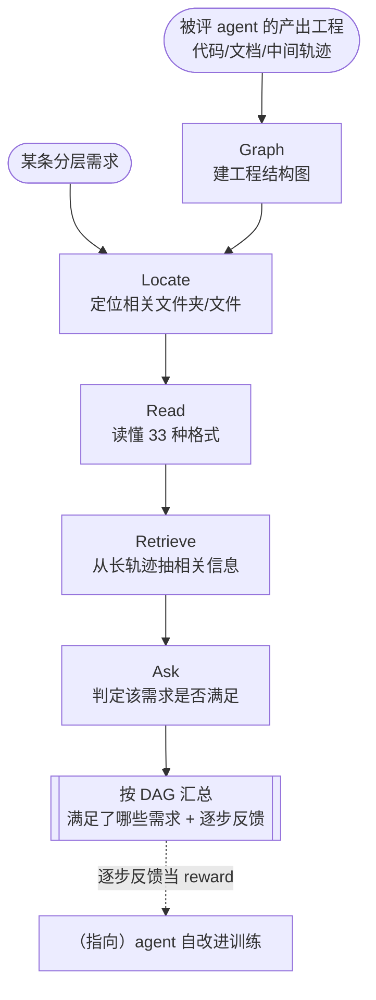

# Paper · 论文本身

## 一句话总结

评估一个 agent,不该只看它最后答得对不对,而该像人一样**看它整条"想了什么、做了什么"的轨迹**。Agent-as-a-Judge 就是**用一个 agent 系统去评另一个 agent 系统**:它有"建工程图谱/定位文件/读多种格式/检索长轨迹/判断需求是否满足"几个模块,能在过程中给出**逐步反馈**。结果是:它跟人类评审的一致性远高于"LLM 当裁判",而**时间和成本只有人工的约 1/40**。[^arxiv][^repo]

## 问题(Problem)

- 现在评 agent 主要两条路,都不够:**人工评**最准但极贵(DevAI 评一遍要 ~86.5 小时);**LLM 当裁判(LLM-as-a-Judge)**便宜快但只盯最终输出,**不看中间过程**,对有依赖关系的复杂任务判得不准。[^arxiv]
- 但 agent 的价值恰恰在**过程**:它一步步规划、调工具、写文件。只看终点,既评不准,也给不出"哪一步做对/做错"的反馈。
- 缺的是一种**像人一样看完整轨迹、还能逐步给反馈**、同时又便宜可规模化的评估方式。而这种"逐步反馈"还能直接当**训练 agent 的奖励信号**。[^arxiv]

> [!key] 立场
> Agent-as-a-Judge 把"评 agent"本身做成了一个 agent 任务:用模块化能力读懂整条轨迹、逐需求判定。它既是更好的评测,也是**自改进的奖励来源**——这正是我们站里冷审门的同类思想。

## 关键术语(Key terms)

| 术语 | 大白话解释 |
| --- | --- |
| **三种裁判** | **Human**(人工,最准最贵)/ **LLM**(只看最终输出,便宜但不准)/ **Agent**(用 agent 看完整轨迹 + 逐步反馈)。[^arxiv] |
| **DevAI 基准** | 55 个真实"自动 AI 开发"任务,带 **365 条分层需求**(按依赖排成 DAG)+ 125 条更软的可选偏好。[^devai] |
| **逐步反馈即奖励** | 过程级、一步步的评价信号,可直接当训练 agent 的 reward(指向自改进)。[^repo] |
| **gray-box / black-box** | 灰盒=能看到人工收集的中间轨迹(判得更好但实际难拿);黑盒=只看最终产物。[^lim] |

## 核心方法(Core method)

把"评一个开发 agent 产出的工程"拆成几个模块化能力,**消融后从 8 个精简到 5 个**:[^modules]

1. **Graph** — 把产出工程建成结构图(文件/模块/依赖/代码片段)。
2. **Locate** — 根据某条需求定位到相关文件夹/文件。
3. **Read** — 读懂 **33 种格式**(代码、图片、视频、文档…)。
4. **Retrieve** — 从又长又乱的轨迹文本里抽出相关信息。
5. **Ask** — 判断"这条需求到底满没满足"。

> [!key] 哪些模块被砍掉(诚实记一笔)
> 初版有 8 个模块,消融发现 **search / planning / memory 拖后腿**被去掉——尤其 **memory 会放大错误传播**;而当时 agent 产出的工程只有几百行代码,**search 模块也用不上**。留下的 5 个才是有效组合。[^modules][^lim]

判定时按需求的 DAG 依赖逐条 Ask,汇总成"这个 agent 满足了哪些需求"。

## 架构 / 流程(Architecture / pipeline)

## 创新点(Innovation points)

| 创新 | 新在哪 | 为什么重要 |
| --- | --- | --- |
| 用 agent 评 agent | 不止 LLM 看终答,而是 agent 看完整轨迹 | 对有依赖的复杂任务判得准得多 |
| 过程级逐步反馈 | 给"哪一步对/错"的反馈,而非一个总分 | 可直接当训练 agent 的奖励信号(自改进) |
| DevAI 基准 | 55 任务 / 365 分层需求(DAG 依赖) | 给"自动 AI 开发"提供了细粒度可判定的评测 |
| 模块消融到 5 个 | 砍掉 search/planning/memory(memory 放大错误) | 精简而有效,诚实暴露哪些没用 |

## 实验 / 证据(Experiments / evidence)

**与人类共识的一致性(灰盒,考虑任务依赖):Agent 远超 LLM 当裁判:**[^align]

| 被评系统 | Agent-as-a-Judge | LLM-as-a-Judge |
| --- | ---: | ---: |
| MetaGPT | **92.07%** | 68.86% |
| GPT-Pilot(v0.2.13) | **86.61%** | 71.85% |
| OpenHands(CodeAct v1.9) | **90.16%** | 70.76% |

- 人类共识本身(3 人多数投票)一致性 **95.08%**;Agent-as-a-Judge 已接近,且在部分任务上**超过单个人类评审**。[^align]
- 人类个体之间分歧不小(个体错误率 6–24%、相互分歧 10–30%),靠多数投票才降到 ~6% → 说明"人工评"本身也不是金标准。[^human]

**成本与时间(对比 3 位人类专家):**[^cost]
- 人工:**86.5 小时**(58h 评 + 28.5h 共识辩论),约 **$1,297.50**(按 $15/小时)。
- Agent:**118.43 分钟**,**$30.58** API 费。
- **省 97.72% 时间、97.64% 成本。**

> [!warn] 别被带偏
> 1. **被评 agent 本身做得很差**:DevAI 上最好的 agent(GPT-Pilot/OpenHands)考虑依赖后只满足约 **29% 的需求**,55 个任务里**只有 1 个被完全做完**——这是说明任务难,不是 Agent-as-a-Judge 的功劳。[^findings]
> 2. **灰盒的前提在现实里难满足**:它依赖**人工收集的中间轨迹**才判得最好,而这种轨迹"现实中几乎拿不到"。[^lim]
> 3. **"裁判更准"不等于"裁判完美"**:仍低于人类共识 95.08%,且偏置/可优化空间作者承认未解。

## 限制与风险(Limitations and risks)

- **依赖中间轨迹**:最佳表现的灰盒设置在实际中难落地。[^lim]
- **模块仍不完美**:search/planning 弱、memory 会放大错误(已砍);小工程用不上 search。[^modules]
- **自动优化未做**:Agent-as-a-Judge 自身的提示/工作流自动优化留作未来工作;当 reward 用于自改进尚属探索。[^lim]
- **未达人类共识**:一致性仍 < 95.08%,有偏置风险。[^align]

## 先读什么(What to read first)

1. **Abstract + 三种裁判对比** —— 为什么"只看终答"不够。[^arxiv]
2. **DevAI 设计(365 分层需求 + DAG)** —— 评测为什么能做到细粒度。[^devai]
3. **5 模块 + 消融** —— 哪些模块有效、memory 为何被砍。[^modules]
4. **对齐表 + 成本表** —— Agent vs LLM vs Human 的准度与代价。[^align][^cost]
5. **仓库** —— `run_ask.py` / `run_aaaj.py`,DevAI 在 HF;逐步反馈"可当 reward"。[^repo]

[^arxiv]: 论文 *Agent-as-a-Judge: Evaluate Agents with Agents*,arXiv:2410.10934(Meta AI)。https://arxiv.org/abs/2410.10934
[^devai]: 同上,DevAI 基准(55 任务、365 分层需求按 DAG 依赖、125 条可选偏好;自动 AI 开发域)。
[^modules]: 同上,架构/消融(初版 8 模块→留 5:Graph/Locate/Read(33 格式)/Retrieve/Ask;砍 search/planning/memory,memory 放大错误传播)。
[^align]: 同上,对齐结果(灰盒:MetaGPT 92.07% vs 68.86%;GPT-Pilot 86.61% vs 71.85%;OpenHands 90.16% vs 70.76%;人类共识 95.08%)。
[^cost]: 同上,成本对比(人工 86.5h≈$1,297.50;Agent 118.43min、$30.58;省 97.72% 时间、97.64% 成本)。
[^findings]: 同上,主要发现(最佳 agent 考虑依赖仅满足 ~29% 需求;55 任务中仅 1 个被完全完成)。
[^human]: 同上,人类评审可靠性(个体错误率 6–24%、分歧 10–30%,多数投票降至 ~6%)。
[^lim]: 同上,局限/未来工作(灰盒轨迹现实难拿;小工程用不上 search;自动提示/工作流优化留待未来;过程监督 reward 用于自改进尚探索)。
[^repo]: 代码仓库 `metauto-ai/agent-as-a-judge`,https://github.com/metauto-ai/agent-as-a-judge(773★;`run_ask.py`/`run_aaaj.py`;DevAI 数据在 Hugging Face;"逐步反馈可作 reward signal for further agentic training")。
