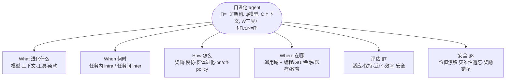

# Paper · 论文本身

> 这是一篇**综述**。结构按"它提出的分类框架"组织,不是单篇方法。

## 一句话总结

这篇综述给"**自进化 agent**"(能从自己的经历/反馈里持续变强、而不是停在出厂状态的 agent)画了一张全景地图,用四个问题把整片领域钉清楚:**进化什么(What)、何时进化(When)、怎么进化(How)、在哪进化(Where)**;并把"agent 系统"形式化成 `Π=(架构 Γ, 大模型 ψ, 上下文 C, 工具 W)`,把"自进化"定义成一个**把 Π 变成更好的 Π′** 的过程。它是理解"怎么造一个越用越强的 agent"的目录式入口。[^arxiv][^repo]

## 这篇综述要回答什么(Problem)

- 静态 LLM 部署后**不会变**;但真实环境是开放、交互、会变的,需要 agent **边用边学**。
- 大量论文在做"让 agent 自己变好"(改记忆、改提示、造工具、改架构、用 RL 自训…),但**散、没统一坐标系**,难比较、难复用。
- 综述要做的就是建坐标系:用 **What/When/How/Where** 四轴,把这些工作归位,并给出**自进化 agent 的定义、评估方法、安全风险**,把它定位成"静态 LLM → ASI(超级智能)"之间的**中间形态**。[^arxiv]

> [!key] 立场(为什么这篇对我们最重要)
> 这正是我们北极星 **L1 自进化 / L2 导师 / L3 研究** 的"零件目录"。它的四轴 = 我们造自己学习 agent 时"该动哪个部件、什么时候动、用什么方法动"的设计图。看它**把整片自进化领域的可复用模式一次性归档**。

## 关键术语(Key terms)

| 术语 | 大白话解释 |
| --- | --- |
| **自进化 agent** | 基于轨迹/反馈**改自己**(内部参数 / 上下文状态 / 工具集 / 架构)以提升未来表现的 agent。三条门槛:① 更新依赖经验 ② 更新有**持久、改变策略**的效果 ③ 有自主探索机制。[^def] |
| **形式化** | agent 系统 `Π = (Γ, {ψ}, {C}, {W})`(Γ 架构 / ψ 大模型 / C 上下文 / W 工具);自进化 = 一个变换 `f(Π, τ, r) = Π′`(拿轨迹 τ 和反馈 r 把 Π 升级)。环境建成 POMDP。[^formal] |
| **Intra- vs Inter-test-time** | 进化发生在"一次任务内"(in-context/SFT/RL 即时调)还是"任务之间"(跨任务积累)。[^when] |
| **stability-plasticity(稳定-可塑权衡)** | 学新东西又不忘旧东西的矛盾;学太狠会"灾难性遗忘"。[^safety] |

## 它提出的分类框架(核心)

四个轴(综述第 3–6 章):[^what][^when][^how][^where]

1. **What 进化什么**:**模型**(策略/经验)· **上下文**(记忆/提示)· **工具**(造工具/用熟/选择)· **架构**(单 agent / 多 agent)。
2. **When 何时进化**:**intra-test-time**(任务内:in-context、SFT、RL)vs **inter-test-time**(任务间)。
3. **How 怎么进化**:**基于奖励**(文本/内部/外部/隐式反馈)· **模仿/示范学习** · **群体/进化式** · online/offline · on/off-policy。
4. **Where 在哪进化**:**通用域**(记忆、模型-agent 协同进化、课程训练)+ **专用域**(编程、GUI、金融、医疗、教育)。

## 框架图(Taxonomy)

## 代表工作与脉络(Representative works)

综述把大量方法归进四轴,常被引的代表(按它列举):**Reflexion / Expel**(文本反馈式自改进)、**Voyager**(终身 skill 库)、**Promptbreeder / TextGrad / DSPy**(提示/管线自优化)、**Mem0**(记忆进化)、**ADAS / AFlow / SICA / Alita**(架构/工作流自动设计)、**ToolGen**(工具进化)、**STaR / RAGEN / WebRL / ReMA**(自训/课程 RL)。[^methods][^repo]

> 读法:**不用全读**。先按"你要进化哪个部件(What)"定位到对应章节,再顺着代表方法往下挖。

## 诚实判断与盲区(Limitations / blind spots)

> [!warn] 这是综述,不是新方法
> 它的价值是**坐标系 + 目录**,**不证明**任何单一方法最好;具体效果要回到原论文看。把它当"地图"用,别当"性能背书"。

- **安全是真难题,且未解**:综述自己点名——**价值漂移**(自改进系统目标悄悄跑偏)、**灾难性遗忘**(stability-plasticity 权衡)、**奖励错配**驱动有害进化、多 agent 协同进化的涌现行为。[^safety]
- **评估尚不成熟**:长程"终身学习"评估方法仍在早期;现有基准(如 TRACE 连续学习、PDDL/Gym 环境)覆盖有限。[^eval]
- **ASI 框架偏愿景**:"通往超级智能"是定位叙事,不是已达成的结论;自进化 agent 被定位成静态 LLM 与 ASI 之间的**中间态**。[^goal]

## 评估与安全(怎么衡量一个自进化 agent)

- **五个目标维度(§7)**:**适应性**(应对新任务)· **保持**(学新不忘旧)· **泛化**(跨任务/域迁移)· **效率**(算力/样本)· **安全**(对抗与分布漂移下的鲁棒)。[^eval]
- **三种评估范式**:静态评测 / 短程自适应评测 / 长程终身学习评测。[^eval]

## 先读什么(What to read first)

1. **定义 + 形式化 `Π=(Γ,ψ,C,W)`、`f(Π,τ,r)=Π′`** —— 先建立统一语言。[^def][^formal]
2. **第 3 章 What** —— 你想让 agent 进化哪个部件,直接定位。[^what]
3. **第 5 章 How** —— 奖励/模仿/群体三类方法的取舍。[^how]
4. **§7 评估 + §8 安全** —— 怎么衡量、有哪些坑(价值漂移/遗忘)。[^eval][^safety]
5. **配套 awesome-list** —— 按四轴持续更新的论文清单,当 agent-only 栏的脉络源。[^repo]

## 后续演化 · 这方法后来怎样了

下列为 2026-06-05 经独立核实的前向脉络(谁优化/替换/扩展了本工作)。

- **A Comprehensive Survey of Self-Evolving AI Agents**(arXiv:2508.07407)— 姊妹综述:四组件优化回路视角,与 What/When/How/Where 互补(本站已深读)_[置信度:高]_。
- **Darwin Gödel Machine: Open-Ended Evolution of Self-Improving Agents**(arXiv:2505.22954)— 自修改代码 + 树状归档的开放式自进化,被综述列为代表方向 _[置信度:中]_。

[^arxiv]: 综述 *A Survey of Self-Evolving Agents: On Path to Artificial Super Intelligence*(What, When, How, and Where to Evolve),arXiv:2507.21046(v4)。https://arxiv.org/abs/2507.21046
[^def]: 同上,自进化 agent 定义(改内部参数/上下文/工具/架构以提升未来表现;三条门槛:经验依赖 / 持久且改变策略 / 自主探索)。
[^formal]: 同上,形式化(`Π=(Γ,{ψ},{C},{W})`;`f(Π,τ,r)=Π′`;环境为 POMDP)。
[^what]: 同上,第 3 章 What to Evolve(模型/上下文/工具/架构)。
[^when]: 同上,第 4 章 When to Evolve(intra-test-time vs inter-test-time)。
[^how]: 同上,第 5 章 How to Evolve(奖励式/模仿/群体进化;online-offline;on/off-policy)。
[^where]: 同上,第 6 章 Where to Evolve(通用域 + 编程/GUI/金融/医疗/教育)。
[^methods]: 同上,各章代表方法(Reflexion/Expel/Voyager/Promptbreeder/TextGrad/DSPy/Mem0/ADAS/AFlow/SICA/Alita/ToolGen/STaR/RAGEN/WebRL/ReMA 等)。
[^eval]: 同上,第 7 章评估(适应/保持/泛化/效率/安全;静态/短程/长程三范式;TRACE、DSPy、PDDL/Gym)。
[^safety]: 同上,第 8.3 节涌现风险(价值漂移、灾难性遗忘 stability-plasticity、奖励错配)。
[^goal]: 同上,目标框定(通往 ASI;自进化 agent = 静态 LLM 与 ASI 之间的中间态)。
[^repo]: 配套 awesome-list `CharlesQ9/Self-Evolving-Agents`,https://github.com/CharlesQ9/Self-Evolving-Agents(1.2k★;按 §3–6 What/When/How/Where 组织;代表:Reflexion/Voyager/STaR/WebRL 等)。
