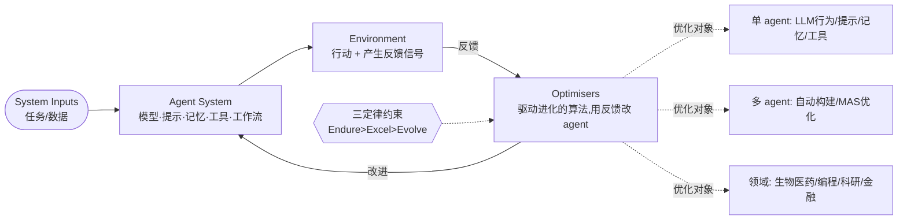

# Paper · 论文本身

> 这是一篇**综述**(EvoAgentX 团队)。结构按"它提出的框架"组织。与同期综述 `2507.21046` 互补:那篇按 **What/When/How/Where 四问** 切;**这篇按"优化反馈回路 + 优化对象"切**,并多给了两样东西——一条**四阶段发展路线(MOP→MOA→MAO→MASE)**和一组**自进化三定律(Endure/Excel/Evolve)**。

## 一句话总结

这篇综述把"自进化 AI agent"统一成**一个优化反馈回路**:**系统输入(System Inputs)→ agent 系统(Agent System)→ 环境(Environment)→ 优化器(Optimisers)**,优化器拿环境反馈去**改 agent 系统**,如此循环。它先用**四阶段发展路线**把"从静态基础模型走到终身自进化系统"讲成一条历史脉络,再用**自进化三定律(安全优先于性能、性能优先于进化)**给这类系统立约束,最后把散落的方法按"**优化哪个对象**"归成:**单 agent 优化 / 多 agent 优化 / 领域专用优化 / 评估** 四大块——是一张"**连接基础模型与终身 agent 系统**"的工程地图。[^arxiv][^repo]

## 这篇综述要回答什么(Problem)

- 基础模型(LLM)是**静态**的;但要做"会终身学习、越用越强"的 agent 系统,需要一套**把反馈变成自我改进**的机制。综述给"自进化 AI agent"下的定义:*"能通过与环境交互,持续、系统地优化自身内部组件,以适应变化的任务/上下文/资源,同时保证安全、提升性能的自主系统"*。[^arxiv]
- 现有自进化方法很多(改提示、改记忆、造工具、改多 agent 拓扑、领域微调…),但**缺一个统一的优化视角**把它们串起来。
- 综述的答案三件套:**(a)一条四阶段发展路线**把历史讲清;**(b)一个四组件优化回路**当统一语言;**(c)一组三定律**当安全约束;再按"优化对象"分类,让你能定位"我要优化的是单 agent 的哪个部件,还是多 agent 的结构,还是某个领域"。[^arxiv]

> [!key] 立场(它和 2507.21046 怎么配)
> 两篇是**两把不同的尺子**量同一片领域:`2507.21046` 问"进化什么/何时/怎么/在哪";本篇问"**这个优化回路里,你在优化哪个对象**",并额外立了**安全约束(三定律)**。前者偏**过程视角**,后者偏**优化器视角 + 安全视角**。对我们造 L1,两张图叠起来用最全。

## 关键术语(Key terms)

| 术语 | 大白话解释 |
| --- | --- |
| **四组件优化回路** | **System Inputs**(喂进来的任务/数据)→ **Agent System**(被优化的对象:模型+提示+记忆+工具+工作流)→ **Environment**(它行动、产生反馈信号的地方)→ **Optimisers**(驱动进化的算法,拿反馈改 agent 系统)。回路反复迭代。[^arxiv] |
| **四阶段发展路线** | MOP→MOA→MAO→MASE,见下文"发展路线"。把"从冻结的基础模型,到终身自进化的多 agent 群"讲成四步演进。[^arxiv][^emergent] |
| **自进化三定律** | Endure(安全优先)> Excel(性能其次)> Evolve(自主进化最后);后位定律受前位约束。给自改进系统立的硬约束。[^arxiv][^hf] |
| **单 agent 优化** | 优化一个 agent 内部四件:**LLM 行为**(训练/测试时)/ **提示** / **记忆** / **工具**;外加把它们**统一**优化。[^repo] |
| **多 agent 优化** | 优化多 agent 系统:**自动构建**(automatic construction)+ **MAS 结构/工作流**优化。[^repo] |
| **领域专用优化** | 在具体领域里做自进化:生物医药 / 编程 / 科研 / 金融法律 / 其它。[^repo] |

## 发展路线:从静态模型到自进化群(四阶段)

综述把这条领域脉络讲成四步演进(命名以原文为准,核心含义如下):[^arxiv][^emergent]

1. **MOP — Model Offline Pretraining(模型离线预训练)**:基础模型在静态语料上预训练,部署后**冻结**——能力强但不进化。
2. **MOA — Model Online Adaptation(模型在线适配)**:部署后用微调 / adapter / RLHF 做有限的在线学习,**改的是模型参数**。
3. **MAO — Multi-Agent Orchestration(多 agent 编排)**:多个 LLagent 通过消息交换 + 工作流协作,**不改模型参数**,靠组织取胜。
4. **MASE — Multi-Agent Self-Evolving(多 agent 自进化)**:终身、闭环的自进化——agent 群**自主**迭代提示/记忆/工具用法/交互模式。本篇的落点就在这一步。

> 读法:这条线告诉你"自进化"不是凭空冒出的,而是"参数微调(MOA)→ 组织协作(MAO)→ 闭环自改进(MASE)"的自然延伸;我们造的 L1 正处在 MAO 往 MASE 过渡的位置。

## 它提出的框架(核心:四组件回路)

把任意自进化系统都看成同一个回路,各组件的定义(原文措辞):[^arxiv][^emergent]

- **System Inputs**:喂进来的**数据 / 任务**。
- **Agent System**:**被优化的对象**(模型 + 提示 + 记忆 + 工具 + 工作流)。
- **Environment**:**提供反馈信号**的地方(评估指标、执行结果等)。
- **Optimisers**:**驱动进化的算法**,拿环境反馈去更新 agent 系统。

回路反复跑:输入→agent 行动→环境给反馈→优化器改 agent→再行动……区别只在"优化器改的对象"不同。

## 自进化三定律(Three Laws,本篇的安全立场)

综述给这类系统立了一组**带优先级**的约束(仿阿西莫夫机器人三定律的写法):[^arxiv][^hf]

1. **Endure(安全适配)** — 任何自我修改**必须先保住安全与稳定**。
2. **Excel(性能保持)** — 在不违反第一定律的前提下,**保持或提升任务性能**。
3. **Evolve(自主进化)** — 在不违反前两条的前提下,**自主优化内部组件**以应对变化。

> [!key] 为什么这组定律重要
> 它把"自进化"和"乱进化"区分开:**安全 > 性能 > 进化** 的优先级,意味着一个会自改的系统不能为了刷分而牺牲安全。这正是我们做 L1 自改进时该内化的护栏次序。

## 分类:四大优化对象(Taxonomy)

按"优化器改的对象"分四大块,子类与代表方法(取自官方 awesome-list 的实际目录):[^repo]

1. **单 agent 优化(§1)**
   - **1.1 LLM 行为优化** — *训练式*(SFT:ToRA、STaR、MAS-GPT;RL:Self-Rewarding LM、Agent Q、R-Zero)+ *测试时*(反馈式:CodeT、Math-Shepherd;搜索式:Tree of Thoughts、Buffer of Thoughts;推理式:START、CoRT)。
   - **1.2 提示优化** — 编辑式(GrIPS、TEMPERA)/ 进化式(EvoPrompt、Promptbreeder、GEPA)/ 生成式(APE、PromptAgent)/ 文本梯度式(TextGrad、REVOLVE)。
   - **1.3 记忆优化** — 长上下文管理与巩固(MemoryBank、A-MEM、Mem0、Memento)。
   - **1.4 工具优化** — 训练式(ToolLLM、ToolEVO;RL:ReTool、ToolRL)/ 推理时(EASYTOOL、ToolChain*、MCP-Zero)/ **工具功能本身的优化**(CREATOR、CLOVA、Alita)。
   - **1.5 统一优化** — 跨组件一起优化(EvoAgent 等)。
2. **多 agent 优化(§2)**
   - **2.1 自动多 agent 构建** — 自动搭多 agent 系统(如 MetaAgent 用有限状态机生成工作流)。
   - **2.2 MAS 优化** — 工作流生成/架构搜索(AFlow、ADAS、Flow)+ 框架(MetaGPT、AutoGen、DSPy)+ 多 agent 训练(MAS-GPT、Chain-of-Agents)+ 专门法(FlowReasoner、ScoreFlow、MermaidFlow)。
3. **领域专用优化(§3)** — 生物医药(MDAgents、ChemCrow、DrugAgent)/ 编程(OpenHands、Self-Debug)/ 科研(PiFlow)/ 金融法律(FinRobot、FinCon;AgentCourt、LegalGPT)/ 其它(SEAgent 自主操作电脑等)。
4. **评估(§4)** — 基于基准(工具:ToolBench;Web:WebArena、BrowseComp;代码:SWE-bench;GUI:OSWorld、AndroidWorld;通用协作:GAIA、AgentBench)+ 基于 LLM(LLM-as-a-Judge、Agent-as-a-Judge)+ **安全/对齐/鲁棒性**(AgentHarm、RedCode、AGrail)。

## 框架图(Optimisation loop + 分类)

## 诚实判断与盲区(Limitations / blind spots)

> [!warn] 这是综述的边界
> 1. **综述是地图不是背书**:它统一了视角、分了类、立了定律,但**不证明**某方法最好;效果回原论文看。
> 2. **抓取交代(已升级)**:本卡片现基于**多源交叉核实**——四组件回路、四阶段发展路线、三定律均经 arXiv 摘要 + HF 论文页 + 作者主页 + alphaXiv/EmergentMind 摘要互证;分类与代表方法取自**作者的官方 awesome-list 实际目录**。**arXiv HTML/ar5iv 转换仍失败**(无逐行正文),故 body 级的**具体数字/逐节论证**未核实处一律不写,以 PDF 原文为准。[^arxiv][^repo][^hf][^emergent]

- **与 2507.21046 高度重叠**:同期、同主题,差别在切法(优化器+安全视角 vs What/When/How/Where);价值在**互补**,不是各自独占。
- **安全/伦理**:作为终身自改进系统,价值漂移、失控自修改等风险适用——本篇用**三定律 + 评估章的安全/对齐/鲁棒性基准**正面回应(具体基准如 AgentHarm/RedCode/AGrail,效果以原文为准)。

## 先读什么(What to read first)

1. **四阶段发展路线 + 四组件回路图** —— 先建立"从 MOP 到 MASE 的演进"和"输入→agent→环境→优化器"的统一心智。[^arxiv]
2. **三定律(Endure>Excel>Evolve)** —— 把"自改进的护栏次序"刻进脑子,再谈优化。[^arxiv][^hf]
3. **单 agent 优化章(§1)** —— 提示/记忆/工具/LLM行为,最常用、最便宜的自进化。[^repo]
4. **多 agent 优化章(§2)** —— 自动构建 + MAS 优化(接 GPTSwarm/MetaGPT 那条线)。[^repo]
5. **领域专用 + 评估章(§3-4)** —— 看它在真实领域怎么落地、怎么衡量(含安全基准)。[^repo]
6. **配套 awesome-list** —— 按四大块持续更新,当 agent-only 栏的脉络源。[^repo]

[^arxiv]: 综述 *A Comprehensive Survey of Self-Evolving AI Agents: A New Paradigm Bridging Foundation Models and Lifelong Agentic Systems*,arXiv:2508.07407(v1 2025-08-10,v2 2025-08-31)。作者(已核实):Jinyuan Fang, Yanwen Peng, Xi Zhang, Yingxu Wang, Xinhao Yi, Guibin Zhang, Yi Xu, Bin Wu, Siwei Liu, Zihao Li, Zhaochun Ren, Nikos Aletras, Xi Wang, Han Zhou, Zaiqiao Meng。四组件回路:System Inputs(数据/任务)/ Agent System(优化对象)/ Environment(反馈信号)/ Optimisers(驱动进化的算法)。https://arxiv.org/abs/2508.07407
[^repo]: 官方配套 awesome-list `EvoAgentX/Awesome-Self-Evolving-Agents`,https://github.com/EvoAgentX/Awesome-Self-Evolving-Agents(顶层目录:发展路线 / 概念框架 / 1 单 agent 优化〔1.1 LLM行为 1.2 提示 1.3 记忆 1.4 工具 1.5 统一〕/ 2 多 agent 优化〔2.1 自动构建 2.2 MAS优化〕/ 3 领域专用〔生物医药/编程/科研/金融法律/其它〕/ 4 评估〔基准/LLM/安全〕;代表方法以 README 实际条目为准)。
[^hf]: HuggingFace 论文页 https://huggingface.co/papers/2508.07407 ——确认三定律 Endure/Excel/Evolve(安全>性能>进化的优先级)与四组件框架。
[^emergent]: EmergentMind / alphaXiv 摘要页(2508.07407)——确认四阶段发展路线 MOP(Model Offline Pretraining)→MOA(Model Online Adaptation)→MAO(Multi-Agent Orchestration)→MASE(Multi-Agent Self-Evolving)及各阶段含义。https://www.emergentmind.com/papers/2508.07407
