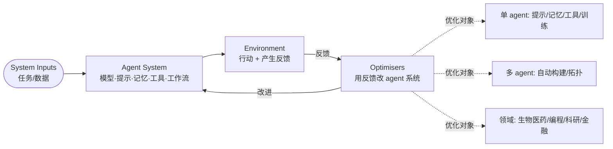

# Paper · 论文本身

> 这是一篇**综述**(EvoAgentX 团队)。结构按"它提出的框架"组织。与同期综述 `2507.21046` 互补:那篇按 **What/When/How/Where 四问** 切;**这篇按"优化反馈回路 + 优化对象"切**。

## 一句话总结

这篇综述把"自进化 AI agent"统一成**一个优化反馈回路**:**系统输入(System Inputs)→ agent 系统(Agent System)→ 环境(Environment)→ 优化器(Optimisers)**,优化器拿环境反馈去**改 agent 系统**,如此循环。它把散落的自进化方法按"**优化哪个对象**"归成:**单 agent 优化 / 多 agent 优化 / 领域专用优化 / 评估** 四大块——是一张"**连接基础模型与终身 agent 系统**"的工程地图。[^arxiv][^repo]

## 这篇综述要回答什么(Problem)

- 基础模型(LLM)是**静态**的;但要做"会终身学习、越用越强"的 agent 系统,需要一套**把反馈变成自我改进**的机制。
- 现有自进化方法很多(改提示、改记忆、造工具、改多 agent 拓扑、领域微调…),但**缺一个统一的优化视角**把它们串起来。
- 综述的答案:**用一个四组件优化回路当统一语言**,再按"优化对象"分类,让你能定位"我要优化的是单 agent 的哪个部件,还是多 agent 的结构,还是某个领域"。[^arxiv]

> [!key] 立场(它和 2507.21046 怎么配)
> 两篇是**两把不同的尺子**量同一片领域:`2507.21046` 问"进化什么/何时/怎么/在哪";本篇问"**这个优化回路里,你在优化哪个对象**"。前者偏**过程视角**,后者偏**优化器视角**。对我们造 L1,两张图叠起来用最全。

## 关键术语(Key terms)

| 术语 | 大白话解释 |
| --- | --- |
| **四组件优化回路** | **System Inputs**(喂进来的任务/数据)→ **Agent System**(被优化的 agent:模型+提示+记忆+工具+工作流)→ **Environment**(它行动、产生反馈的地方)→ **Optimisers**(拿反馈改 agent 系统)。[^arxiv] |
| **单 agent 优化** | 优化一个 agent 内部:LLM 行为(训练)/ 提示 / 记忆 / 工具 / 统一优化。[^repo] |
| **多 agent 优化** | 优化多 agent 系统:自动构建(automatic construction)+ MAS 结构/通信优化。[^repo] |
| **领域专用优化** | 在具体领域里做自进化:生物医药 / 编程 / 科研 / 金融法律。[^repo] |

## 它提出的框架(核心)

把任意自进化系统都看成同一个回路,只是"优化器改的对象"不同:[^arxiv][^repo]

1. **单 agent 优化** — 在一个 agent 内部优化:**LLM 行为/训练**(如 ToRA、STaR 自举)、**提示**(如 APE 自动提示工程)、**记忆**、**工具**、以及把这些**统一**起来优化。
2. **多 agent 优化** — 优化"一群 agent 怎么组织":**自动构建**多 agent 系统 + **MAS 拓扑/通信**优化(代表:MetaGPT、AutoGen、DSPy 管线编译)。
3. **领域专用优化** — 把自进化落到**生物医药 / 编程 / 科研 / 金融法律**等具体场景。
4. **评估** — 怎么衡量:**基于基准** + **基于 LLM** 的评估。

## 框架图(Optimisation loop + 分类)

## 代表工作与脉络(Representative works)

按它的官方清单归类的代表:[^repo]
- **单 agent · 训练**:ToRA(工具集成推理)、STaR(用推理自举推理)。
- **单 agent · 测试时**:Tree of Thoughts、self-consistency。
- **单 agent · 提示**:APE(LLM 即人类级提示工程师)。
- **多 agent**:MetaGPT、AutoGen、DSPy。

> 读法:先按"你要优化单 agent / 多 agent / 某领域"定位到对应大块,再顺代表方法挖。

## 诚实判断与盲区(Limitations / blind spots)

> [!warn] 这是综述 + 本次抓取的边界
> 1. **综述是地图不是背书**:它统一了视角、分了类,但**不证明**某方法最好;效果回原论文看。
> 2. **抓取边界(诚实交代)**:本篇 arXiv HTML/ar5iv 当时**转换失败无法读全文**,本卡片的框架(四组件回路)取自**官方摘要**,分类与代表方法取自**作者的官方 awesome-list**;**body 级的细节/数字以 PDF 原文为准**,未核实处一律不写。[^arxiv][^repo]

- **与 2507.21046 高度重叠**:同期、同主题,差别在切法(优化器视角 vs What/When/How/Where);价值在**互补**,不是各自独占。
- **安全/伦理**:作为终身自改进系统,价值漂移、失控自修改等风险同样适用(综述设有安全/伦理讨论,具体以原文为准)。

## 先读什么(What to read first)

1. **摘要 + 四组件回路图** —— 先建立"输入→agent→环境→优化器"的统一心智。[^arxiv]
2. **单 agent 优化章** —— 提示/记忆/工具/训练,最常用、最便宜的自进化。[^repo]
3. **多 agent 优化章** —— 自动构建 + 拓扑优化(接 GPTSwarm/MetaGPT 那条线)。[^repo]
4. **领域专用 + 评估章** —— 看它在真实领域怎么落地、怎么衡量。[^repo]
5. **配套 awesome-list(2.2k★)** —— 按四大块持续更新,当 agent-only 栏的脉络源。[^repo]

[^arxiv]: 综述 *A Comprehensive Survey of Self-Evolving AI Agents: A New Paradigm Bridging Foundation Models and Lifelong Agentic Systems*,arXiv:2508.07407。作者(已核实):Jinyuan Fang, Yanwen Peng, Xi Zhang, Yingxu Wang, Xinhao Yi, Guibin Zhang, Yi Xu, Bin Wu, Siwei Liu, Zihao Li, Zhaochun Ren, Nikos Aletras, Xi Wang, Han Zhou, Zaiqiao Meng。框架(取自摘要):四组件回路 System Inputs / Agent System / Environment / Optimisers。https://arxiv.org/abs/2508.07407
[^repo]: 官方配套 awesome-list `EvoAgentX/Awesome-Self-Evolving-Agents`,https://github.com/EvoAgentX/Awesome-Self-Evolving-Agents(2.2k★;分类:1 单 agent 优化 / 2 多 agent 优化 / 3 领域专用 / 4 评估;代表:ToRA、STaR、ToT、self-consistency、APE、MetaGPT、AutoGen、DSPy)。
