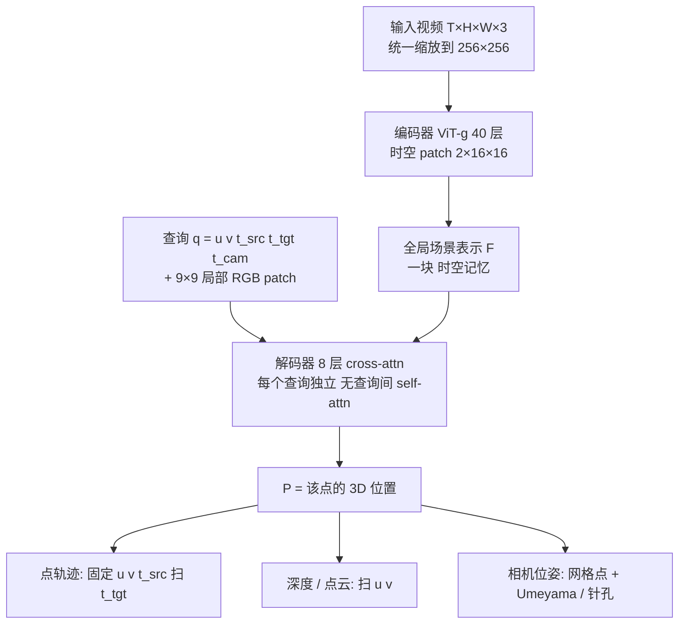

# Paper · 论文本身

> CVPR 2026 最佳论文(Best Paper)。Google DeepMind × Oxford × UCL。注意:这是一篇**计算机视觉感知**工作,不是 agent 论文——放进来是因为它是今年视觉圈的里程碑,且"快到能实时的 4D 感知"恰好是具身/视频类 AI 应用的底座。[^arxiv]

## 一句话总结

给一段普通视频,以前要搞清楚"画面里每个点在三维空间里、在每个时刻、在哪",得**拼好几个专用模型 + 跑很慢的"测试时优化"**。这篇把这件事压成**一个前馈 transformer**:编码器先一口气看完整段视频,把它压成一块"时空记忆";解码器是一个**可以随机寻址的读取头**——你给它一个坐标(哪个像素、哪个时刻、从哪个相机视角看),它就直接吐出那个点的**三维位置**。深度图、3D 点轨迹、相机位姿,全都只是"换一种问法"问同一个接口。[^abs]

## 问题(Problem)

- "从视频重建动态 3D 场景"(行话叫 **4D 重建**,4D = 3D 空间 + 时间)是 CV 的老大难。过去的主流路线有三种毛病:[^arxiv]
  - **拼装**:像 MegaSaM,要把"单目深度、度量深度、运动分割"等一堆现成模型拼成流水线;像 VGGT,虽是一个网络但给每种输出**配一个专用解码头**。零件越多越难训、越慢。[^abs]
  - **慢**:为了让几何在帧间一致,传统管线要做**测试时优化(test-time optimization)**——每段新视频都现场迭代调参,几秒钟的片子能跑几分钟。[^abs]
  - **缺动态对应**:现有前馈方法大多**给不出"动态物体上同一个点跨帧的对应关系"**;SpatialTrackerV2 能处理动态,但靠**昂贵的迭代精修**。[^abs]
- 还有个隐藏的规模问题:**"每帧把所有像素一次性解码出来"**(dense per-frame decoding)的算力是 O(H×W)/帧,想给视频里**每个像素**都求出跨帧 3D 对应,根本跑不起。[^method]

> [!key] 立场
> 这篇的价值不是"又一个更准的深度网络",而是**把四件本来各做各的事(深度 / 点云 / 跨帧点轨迹 / 相机位姿)统一进一个前馈模型的同一个解码接口**,并且顺手把速度做到了"能实时"的量级。它证明了一个朴素但重要的判断:**4D 重建不需要测试时优化,也不需要一堆专用头——一个设计得当的"按需查询"接口就够了。**

## 关键术语(Key terms)

| 术语 | 大白话解释 |
| --- | --- |
| **4D 重建** | 从视频里恢复"每个点的 3D 位置 + 它随时间怎么动"。比单张图的 3D 多了"时间"这一维。[^arxiv] |
| **前馈(feedforward)模型** | 输入进去,一遍算出结果,**不在测试时反复迭代优化**。对就是"快"的来源。[^abs] |
| **查询接口(query)** | 这篇的灵魂。一个查询写成 `q = (u, v, t_src, t_tgt, t_cam)`:源帧里的某个像素 (u,v)、它在哪一帧(t_src)、你想知道它在**哪个时刻**(t_tgt)的位置、用**哪个相机**当坐标系原点(t_cam)。模型回你一个 3D 坐标。[^query] |
| **时空对应(spatio-temporal correspondence)** | "源帧这个点,跑到目标帧变成了哪个 3D 位置"——也就是 3D 点轨迹。动态场景里最难、也最值钱的一块。[^abs] |
| **全局场景表示 F** | 编码器把整段视频压成的那块"时空记忆"(`F ∈ ℝ^{N×C}`),解码器所有查询都从它里面取信息。[^method] |
| **占用网格(occupancy grid)** | 一个加速技巧:跟踪所有像素时,把"已经被某条轨迹路过的像素"标记掉,不再为它新起一条轨迹,省掉大量重复计算。[^occ] |

## 核心方法(Core method)

把它想成**"一块可寻址的 4D 记忆 + 一个读取头"**。三件事串起来:

1. **编码器(读全片,建记忆)**:一个 **ViT-g(40 层,时空 patch 2×16×16)** 一次性吃下整段视频,产出全局场景表示 `F ∈ ℝ^{N×C}`,里面已经编码了跨帧的对应与运动。[^method]
2. **解码器(按需读取)**:一个**轻量的 8 层 cross-attention** 解码器。关键设计:**每个查询完全独立处理,查询之间不做 self-attention**。你丢一个查询 `q`,它输出 `P = D(q, F) ∈ ℝ³`,即那个点的 3D 位置。[^method]
3. **"换问法"解锁所有任务**:同一个接口,改一下查询参数就变成不同任务——[^query]
   - **点轨迹**:固定 (u,v,t_src),让 t_tgt = t_cam 扫过所有帧 → 这个点的跨帧 3D 轨迹。
   - **点云 / 深度**:让 (u,v) 扫满整帧(深度则令 t_src = t_tgt = t_cam)。
   - **相机外参**:在网格点上取一组 3D 点,用 **Umeyama 算法**从两个参考帧的 3D 坐标解出相机位姿。
   - **相机内参**:用网格点 + 针孔模型反解焦距 `f_x = p_z(u−0.5)/p_x`。

> [!key] 补丁①:为什么"按需查询"能既快又能做到"全像素"
> 老办法是**每帧把所有像素一起解码**(O(H×W)/帧),想做全像素跨帧对应就爆炸。D4RT 把解码拆成**一个个独立的查询、按需算**:训练时**每段只随机采 2,048 个查询**(稀疏),推理时想稀疏(几条轨迹)想稠密(全像素)都行,**不用重训**。要做"全像素跟踪"时再用**占用网格(Algorithm 1)**避开重复,带来 **5–15× 加速**。[^occ]

> [!key] 补丁②:一个看似不起眼、实测很关键的小零件——9×9 局部 RGB patch
> 每个查询除了坐标,还会带上**源帧里以 (u,v) 为中心的 9×9 像素 RGB 小块**做嵌入。作者发现这一手**大幅提升性能**(保住细节、帮助物体分割)。消融见下方。[^patch]

## 架构 / 流程(Architecture / pipeline)

## 创新点(Innovation points)

| 创新 | 新在哪 | 为什么重要 |
| --- | --- | --- |
| 统一的"按点查询"解码接口 | 不再给每种输出配专用头;一个接口靠改查询参数覆盖 深度/点云/轨迹/位姿 | 一个模型一遍训练,任务全包;工程上极简 |
| 查询相互独立(无 self-attention) | 解码器不让查询之间互相 attend | 任意稀疏/稠密查询都行、可并行、可扩展;消融显示开了 self-attn 反而大跌 |
| 稀疏查询训练 + 占用网格推理 | 训练每段只采 2,048 查询;推理按需、用占用网格去重 | 把"全像素 4D"从算不起变成可实时(5–15× 提速) |
| 纯前馈、无测试时优化 | 一遍前馈出几何一致结果,不现场迭代 | 速度比上一代快一两个数量级(见下) |

## 实验 / 证据(Experiments / evidence)

**怎么训的**:在 **11 个数据集**(BlendedMVS、Co3Dv2、Dynamic Replica、Kubric、MVS-Synth、PointOdyssey、ScanNet++、ScanNet、Tartanair、VirtualKitti、Waymo Open)上,**48 帧/段 @256×256**,每段 **2,048 个查询**(在深度/运动突变处过采样),**batch 1 × 64 块 TPU,500k 步约 2 天**;AdamW(wd 0.03,lr 1e-4 余弦退火到 1e-6)。复合损失以**归一化 3D 位置的 L1** 为主(`sign(x)·log(1+|x|)` 压远点),外加 2D 重投影、法向余弦、可见性 BCE、运动向量、置信度加权等(权重 λ₃D=1.0 / λ₂D=0.1 / λ_normal=0.5 / …)。[^train]

**主结果——多基准 SOTA(节选 verbatim 表值):**

| 任务 / 基准 | 指标 | D4RT | 最强对手 |
| --- | --- | ---: | ---: |
| 4D 跟踪 TAPVid-3D(相机系,无 GT 内参)[^t4] | AP_D3D ↑ | **0.345** | SpatialTrackerV2 0.100 |
| 4D 跟踪 TAPVid-3D(同上)[^t4] | AJ ↑ | **0.257** | SpatialTrackerV2 0.064 |
| 视频深度 Sintel(scale-only)[^t5] | AbsRel ↓ | **0.171** | SpatialTrackerV2 0.209 / π³ 0.241 |
| 视频深度 KITTI(scale-and-shift)[^t5] | AbsRel ↓ | **0.051** | π³ 0.053 |
| 相机位姿 Sintel[^t6] | ATE ↓ | **0.065** | MegaSaM 0.074 / VGGT 0.168 |

**速度才是杀手锏(交叉核对 arXiv 与 DeepMind 博客):**
- **位姿估计 200+ FPS**,比 **VGGT 快 9×**、比 **MegaSaM 快 100×**。[^arxiv]
- 同样目标帧率下产出的轨迹数,比对手多 **18–300×**(Table 3:60 FPS 时 D4RT 550 条 vs SpatialTrackerV2 29 条;1 FPS 时 40,180 条 vs 2,290 条)。[^t3]
- 直观一点:**一分钟视频约 5 秒跑完(单块 TPU),上一代最多要 10 分钟**(≈120×)。[^blog]

**消融(哪些零件真有用):**
- **9×9 局部 RGB patch**:去掉后 AbsRel(S) 0.302→0.366、ATE 0.091→0.173——明显变差。patch 取 9–12 像素最好。[^abl]
- **骨干越大越好**:ViT-B 0.319 → ViT-L 0.256 → ViT-H 0.226 → ViT-g 0.191(AbsRel(S))。[^abl]
- **预训练很关键**:随机初始化 AbsRel(S) 0.738,VideoMAE 预训练降到 0.302。[^abl]
- **辅助损失**:去掉 2D 重投影损失最伤(+0.071 AbsRel),法向损失次之(+0.043);可见性/置信度影响很小。[^abl]
- **查询独立是对的**:早期实验里让查询间做 self-attention 会**明显掉点**,故最终不用。[^method]

> [!warn] 三处别被带偏
> 1. **"SOTA"的成本是巨型模型 + 重算力**:ViT-g 主干、64 块 TPU 训 2 天。个人/小团队**很难自己复现训练**。
> 2. **强依赖带标注的合成/扫描数据**:11 个数据集都带 GT 几何监督;迁移到没有标注的真实长视频时的鲁棒性,论文没充分展开。[^train]
> 3. **官方未明确公开代码/权重**:截至论文与项目页,**没看到 GitHub/HF 权重链接**(只有项目页与联系邮箱)。"能不能直接用"目前**数据不足**。[^proj]

## 限制与风险(Limitations and risks)

- **作者没有正面给失败案例**:论文未设独立的 Limitations 小节列举失败模式,只在附录提到**省掉了回环检测/全局优化阶段(omit loop detection and optimization)**——暗示**很长序列**上可能漂移。[^arxiv]
- **训练需 GT 监督**:所有训练数据都带几何真值,纯野外无标注视频上的表现需自行验证。
- **相机模型假设**:默认针孔相机(可选非线性畸变精修),强畸变镜头需额外处理。
- **可复现性打问号**:代码/权重未确认公开 + 训练算力门槛高 ⇒ 短期内更多是"读思想"而非"拿来跑"。[^proj]

## 先读什么(What to read first)

1. **Abstract + Introduction** —— 抓住"统一接口 + 无测试时优化"这两个 claim。[^abs]
2. **方法节(查询定义 + 编码/解码结构)+ 上面的流程图** —— 吃透 `q=(u,v,t_src,t_tgt,t_cam) → 3D 位置` 这一个核心抽象。[^method]
3. **查询变体表** —— 看清"同一接口怎么变出 深度/点云/轨迹/位姿"。[^query]
4. **Table 3–6** —— 速度(Table 3)+ 三类任务精度(4/5/6)。[^t3][^t4][^t5][^t6]
5. **消融(Table 7/9/11 + 附录 D)** —— 9×9 patch、骨干规模、预训练、查询独立。[^abl]

## 谱系 · 它站在谁肩上 / 后续

> 这篇 2025-12 才挂出、2026-06 拿 CVPR 最佳,**前向演化(谁改进/替代了它)目前太新、暂无可核实工作**。先标清它**统一/超越的前作**(均为论文中对比对象):

- **VGGT** —— 前作:单网络但多专用解码头的 3D 重建;D4RT 用统一查询接口替掉多头,位姿快约 9×。[^arxiv]
- **MegaSaM** —— 前作:拼装式(多现成模型 + 测试时优化)动态 SfM;D4RT 纯前馈,快约 100×。[^arxiv]
- **SpatialTrackerV2** —— 前作:能处理动态但靠迭代精修;D4RT 在 TAPVid-3D 上大幅领先(AP_D3D 0.345 vs 0.100)。[^t4]
- **π³ / VideoMAE** —— 分别为深度对比对象 / 编码器预训练来源(预训练消融见上)。[^t5][^abl]

[^arxiv]: 论文 *Efficiently Reconstructing Dynamic Scenes One D4RT at a Time*,arXiv:2512.08924(2025-12),Google DeepMind × University of Oxford × UCL;**CVPR 2026 Best Paper**。作者 Chuhan Zhang、Guillaume Le Moing、Skanda Koppula、Ignacio Rocco、Liliane Momeni、Junyu Xie、Shuyang Sun、Rahul Sukthankar、Joëlle K. Barral、Raia Hadsell、Zoubin Ghahramani、Andrew Zisserman 等。https://arxiv.org/abs/2512.08924
[^abs]: 同上,Abstract(统一 transformer 联合推断 深度 / 时空对应 / 完整相机参数;核心创新=避开稠密逐帧解码与多专用头的"查询机制";无测试时优化)。
[^method]: 同上,方法节(编码器 ViT-g 40 层、时空 patch 2×16×16 → 全局表示 F∈ℝ^{N×C};解码器 8 层 cross-attention,查询完全独立、查询间不做 self-attention;`P=D(q,F)∈ℝ³`;稀疏查询训练 2,048/段)。
[^query]: 同上,查询接口与变体表(`q=(u,v,t_src,t_tgt,t_cam)`;点轨迹/点云/深度/外参 via Umeyama/内参 via 针孔 `f_x=p_z(u−0.5)/p_x`)。
[^patch]: 同上,查询的局部 RGB 上下文(以 (u,v) 为中心的 9×9 像素 patch 嵌入,助细节与分割)。
[^occ]: 同上,全像素跟踪的占用网格(Algorithm 1,标记已访问像素,5–15× 加速)。
[^train]: 同上,训练细节(11 数据集;48 帧 @256²;2,048 查询/段、几何突变处过采样;batch 1 × 64 TPU;500k 步约 2 天;AdamW wd 0.03,lr 1e-4→1e-6 余弦;复合损失,主损失=归一化 3D 位置 L1 `sign·log1p`,λ₃D=1.0/λ₂D=0.1/λ_normal=0.5/λ_vis=0.1/λ_disp=0.1/λ_conf=0.2)。
[^t3]: 同上,Table 3 吞吐(60 FPS:D4RT 550 vs SpatialTrackerV2 29;1 FPS:40,180 vs 2,290;"18–300× 更快/更多轨迹")。
[^t4]: 同上,Table 4 TAPVid-3D(相机系无 GT 内参:D4RT AJ 0.257 / AP_D3D 0.345 / OA 0.875 vs SpatialTrackerV2 0.064 / 0.100 / 0.865;世界系:D4RT AP_D3D 0.373 / L1 0.020 vs 0.101 / 0.139)。
[^t5]: 同上,Table 5 视频深度(Sintel scale-only AbsRel:D4RT 0.171 vs SpatialTrackerV2 0.209 vs π³ 0.241;KITTI scale-and-shift:D4RT 0.051 vs π³ 0.053)。
[^t6]: 同上,Table 6 相机位姿(Sintel ATE:D4RT 0.065 vs MegaSaM 0.074 vs VGGT 0.168;D4RT Pose AUC@30 = 83.5)。
[^abl]: 同上,消融(Table 7:9×9 patch 有无 AbsRel(S) 0.302 vs 0.366、ATE 0.091 vs 0.173;Table 9 骨干 ViT-B 0.319→ViT-L 0.256→ViT-H 0.226→ViT-g 0.191;Table 11 预训练 随机 0.738 vs VideoMAE 0.302;辅助损失:去 2D +0.071、去法向 +0.043、去位移 +0.011、去可见性/置信度 ≈0;附录 D:patch 9–12 最佳)。
[^blog]: Google DeepMind 博客 *D4RT: teaching AI to see the world in four dimensions*(最高 300× 效率;一分钟视频约 5 秒、单 TPU,上一代最多 10 分钟)。https://deepmind.google/blog/d4rt-teaching-ai-to-see-the-world-in-four-dimensions/
[^proj]: 项目页 https://d4rt-paper.github.io/(仅摘要级信息;**未见**代码 / 权重 / demo 链接;含联系邮箱)。代码与权重是否公开:数据不足。
