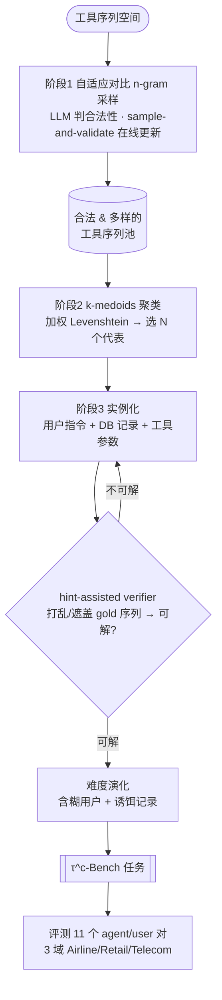

# Paper · 论文本身

## 一句话总结

TASTE 把"造 agent 评测"从"先写场景→再推工具调用序列"**反转**成"先采样多样的工具调用序列→再围着它合成完整任务":用自适应对比 n-gram 模型(靠 LLM 判合法性)采出又合法又覆盖广的工具序列,k-medoids 选代表,再做难度演化——造出 τ^c-Bench,让"快刷爆 τ²-Bench"的模型大跌(Gemini-3-Flash 从 0.82–0.94 跌到 0.28–0.61)。

## 问题(Problem)

- **工具型 agent**(调 API 改外部状态:下单、改账户、起草……)的评测基准(如 **τ²-Bench**:Airline/Retail/Telecom 三域)正在**饱和**——顶级模型快到天花板。
- **手工造任务极贵**:写自然语言指令 + 配环境 + 推导正确工具调用序列 + 验证目标状态"可达且一致"。
- **标准做法覆盖窄**:先写场景、再推工具序列 → 工具序列空间**从没被显式探索**,只覆盖作者随手选的那点组合。
- 论文先立**好基准的三条标准**:**有效性**(每个任务可自动验证、gold 终态可达)、**难度**(能区分不同能力的 agent)、**覆盖**(跨结构多样的工具使用模式,不重复采样)。其中**覆盖最被忽视**,作者用"**工具序列**(gold 轨迹里工具名的有序列表)"来量化它。

> [!key] 反转的洞见
> 既然覆盖 = 工具序列的多样性,那就**直接采样工具序列空间**,再合成任务——而不是从场景反推序列。这把"覆盖"从口号变成可构造的目标。

## 关键术语(Key terms)

| 术语 | 解释 |
| --- | --- |
| **工具型 agent / tool sequence** | agent 多步调用工具改环境;tool sequence = gold 轨迹里工具名的有序列表。 |
| **三条 desiderata** | 有效性(validity)/ 难度(difficulty)/ 覆盖(coverage)——好 agent 基准该同时满足。 |
| **自适应对比 n-gram 模型** | 对工具序列建 n-gram(单位是工具);分别统计"被 LLM 判**合法** vs **不合法**"序列里的 n-gram 计数,用两者**对比比值**算采样概率;在线 sample-and-validate 循环里不断更新。 |
| **k-medoids 聚类** | 从采样池里选 N 个(=基准规模)代表性序列;距离用**加权 Levenshtein(编辑距离)**,权重反映工具间语义/功能相似度。 |
| **hint-assisted verifier(提示辅助验证 agent)** | 给一个**被打乱/参数遮盖**的 gold 序列,让验证 agent 配合模拟用户去够到目标态 → 确认任务**可解**。 |
| **难度演化(difficulty evolution)** | 让模拟用户**更含糊、更不配合**,并往数据库塞**迷惑性诱饵**(如目标航线已满员)→ 提升交互难度。 |
| **τ²-Bench / τ^c-Bench** | 前者是现有 agent 基准;后者是 TASTE 造的"挑战版"扩展。 |

## 核心方法(Core method)

三阶段,各打一条 desiderata:
1. **采样(validity + coverage)**:训自适应对比 n-gram,对合法/不合法序列分别计数,按对比比值采样;sample-and-validate 在线更新 → 概率质量集中到**合法**序列,同时**探索**工具组合空间。
2. **选代表(coverage)**:k-medoids + 加权 Levenshtein,从池里选 N 个结构多样的代表序列。
3. **实例化 + 难度演化(validity + difficulty)**:每条序列→完整任务(用户指令 + 数据库记录 + 工具参数);规则检查 + hint-assisted verifier 确认可解;再做难度演化(含糊用户 + 诱饵记录)。

## 架构 / 流程(Architecture / pipeline)

## 创新点(Innovation points)

| 创新 | 新在哪 | 为什么重要 |
| --- | --- | --- |
| 反转任务构建 | 先采样工具序列、再合成任务(非"场景→推序列") | 显式覆盖工具组合空间,不再受作者随手选的偏置 |
| 自适应对比 n-gram | 用合法/不合法对比比值 + 在线更新采样 | 同时保**有效性**(集中到合法)和**覆盖**(探索组合) |
| 覆盖的可操作化 | 用工具序列 + TTR/编辑距离/熵 量化覆盖 | 把最被忽视的"覆盖"变成可测可优化的目标 |
| 难度演化 + 提示验证 | 可解性验证 + 含糊用户/诱饵 提升交互难度 | 任务既**保证可解**又**真的难** |

## 实验 / 证据(Experiments / evidence)

- 用 TASTE 造 **τ^c-Bench**(τ²-Bench 三域 Airline/Retail/Telecom 的挑战版),评测 **11 个 agent/user LLM 对**。
- **难度**:τ^c-Bench 上分数一致且大幅低于原版;**Gemini-3-Flash:原版 0.82–0.94 → τ^c 0.28–0.61**(近饱和的模型掉得最狠)。
- **覆盖**:agent 必须执行的**唯一工具组合数翻倍以上**;序列间加权编辑距离、TTR(type-token ratio,唯一 n-gram 占比)、工具频率熵均显著上升(具体倍数见原文表)。
- 结论:现有基准上的高分**往往是饱和,不是鲁棒解题能力**;自动造难+高覆盖基准 → 可持续、可扩展地评测未来 agent。代码 + τ^c-Bench 数据已开源。

> [!warn] 看证据的边界
> 我从 PDF 抽取(arXiv 暂无 HTML),**部分精确数字(各项覆盖指标的具体倍数、"up to X worse")在抽取里缺失/糊**,以原文 Table 为准。结论方向(近饱和模型大跌、工具组合翻倍)清晰可靠。

## 限制与风险(Limitations and risks)

- **依赖 LLM 判合法性**:n-gram 的有效性信号来自 LLM 判断,LLM 判错会污染采样分布(对比设计部分缓解)。
- **绑定 τ²-Bench 式环境**:需要可执行工具环境 + 终态可验证范式,迁到无明确终态的开放任务不直接。
- **难度演化靠启发式**(含糊用户/诱饵),"难"是否对应"真实世界难"需人审。
- 覆盖用工具序列度量,**忽略参数级/语义级**的细粒度多样性。

## 先读什么(What to read first)

1. Abstract + §1 + Figure 1(三阶段总览)—— 抓"反转"动机 + 三条 desiderata。
2. §方法的三阶段(n-gram 采样 / k-medoids / 实例化+难度演化)。
3. 主结果表(Gemini 等的 τ²→τ^c 掉分)+ 覆盖指标表(TTR/编辑距离/熵)。
4. 限制节。代码 + τ^c-Bench 数据:见论文 GitHub。
