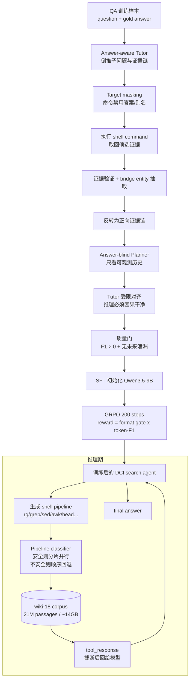

# Paper · 论文本身

## 一句话总结

GrepSeek 不是再给 RAG 换一个 retriever，而是把语料库当成一个可执行环境：一个 9B 搜索 agent 直接对 21M 段、约 14GB 的 Wikipedia 语料发 `rg` / `grep` / `head` 这类 shell 管道找证据；作者用「答案感知 Tutor 倒推证据链 + 答案盲 Planner 顺写因果轨迹」造冷启动数据，再用 GRPO 强化学习微调，并用语义保持的分片并行引擎把 shell 检索从顺序扫描做成最多 7.6x 加速的可交互工具。[^arxiv]

## 问题(Problem)

主流搜索 agent 仍然隔着一个检索器看世界：agent 交一个 query，索引系统返回 top-k 文档。这个接口很熟，但它也把很多事情提前焊死了：文档怎么切块、表示怎么预计算、相关性怎么排序，都在 agent 真正推理前决定。遇到精确实体名、稀有符号、跨文档桥接实体，agent 只能希望 retriever 没把关键证据过滤掉。[^intro]

Direct Corpus Interaction（DCI，直接语料交互）赌的是另一件事：让 agent 像读代码库一样读知识库，直接用 terminal 工具在原始文本上查、滤、数、截断、组合。这个想法同期已经有独立工作验证过，但多依赖 Claude 这类大闭源模型在推理期写命令，成本高，原文提到有时一个 query 可能到一小时量级。GrepSeek 要解决的是「能不能把 DCI 训练成小模型能力，并且让每次 shell 检索不慢到不可用」。[^method]

难点不只是「会不会写 `rg`」。作者说直接把基础模型丢进 RL 里学大语料交互会不稳定：命令过宽、取回上下文过长，甚至在 1024GB 主机内存机器上也出现 OOM。换句话说，先不给 agent 立规矩，RL 会先学会把语料库一把捞爆，而不是学会外科手术式检索。[^coldstart]

> [!key] 立场
> 这篇最值得学的不是「grep 比向量库强」这种口号，而是两层工程判断：第一，**检索接口也是 agent 能力的一部分**，top-k retriever 不是唯一入口；第二，**自由工具使用必须先被行为初始化，再被 RL 优化**。GrepSeek 的贡献在于把 DCI 从强模型推理期技巧推进到可训练、可测、可部署的 agent 技能，同时把边界也暴露得很清楚：精确词法锚点强时它很硬，表面形式漂移大时它会脆。

## 关键术语(Key terms)

| 术语 | 大白话解释 |
| --- | --- |
| **Direct Corpus Interaction / DCI（直接语料交互）** | 不先建 embedding index 或 BM25 top-k 接口，而是让 agent 直接在原始 corpus 上执行命令。例子：先 `rg -F "Walter W. Arndt"` 找人名，再用第二个 `rg` 过滤出生信息。它的好处是精确、可控、日志天然可审；坏处是没有语义排序。[^dci] |
| **answer-aware Tutor（答案感知 Tutor）** | 造训练数据时看得到标准答案的老师。它从答案往回倒推，逐 hop 找出能支持答案的证据命令。机制上像「先知道终点，再倒着铺一条真实能走的路」。[^coldstart] |
| **answer-blind Planner（答案盲 Planner）** | 造训练轨迹时看不到答案的规划者，只能根据问题和已经观察到的历史往前写推理和动作。它负责让轨迹像真实推理期一样因果干净，而不是泄漏未来答案。[^coldstart] |
| **target masking（目标屏蔽）** | Tutor 倒推时虽然知道答案，但写命令时不能把目标答案或别名直接放进检索词。否则训练样本会变成「拿答案搜答案」，部署时没法用。[^coldstart] |
| **GRPO（Group Relative Policy Optimization，组相对策略优化）** | 每个问题采样一组轨迹，用组内相对分数算优势，不需要单独 critic。这里论文实验配置的 reward 是「格式门 × token-level F1」：格式不合规直接 0，格式合规则按答案 token overlap 给分。[^reward] |
| **semantics-preserving sharded-parallel execution（语义保持的分片并行执行）** | 把 14GB corpus 按行切成多个 shard，能安全并行的 `rg | ... | head` 等管道就在 shard 上并发跑，再按规则合并；不能证明等价的命令就回退顺序执行。关键承诺是输出与单文件顺序执行 byte-exact 等价。[^engine] |

## 核心方法(Core method)

可以把 GrepSeek 想成一条「先铺轨、再开车、最后给路面提速」的装配线。

第一步是**铺轨**：作者先用 Qwen3.5-27B 做 Tutor 和 Planner，生成 10,000 条冷启动 SFT 轨迹。Tutor 看得到答案，所以它从最后一个证据目标倒着找：提一个不含答案词的 shell command，真实执行，检查取回文档是否支持当前目标；如果还没到第一 hop，就从当前证据里抽出桥接实体，继续往前倒推。等这条证据链被验证过，再把它反转成正常时间顺序。[^coldstart]

第二步是**把路走得像真实推理**：答案盲 Planner 不看未来证据，只凭当前历史草拟每一步 `think + command`；Tutor 再把 Planner 的推理受限地改写到已验证命令上，同时要求它只能引用当时已经观察到的信息。最后还要过两道质量门：最终答案对 gold answer 的 token-level F1 必须大于 0，整条轨迹还要由 coherence judge 检查是否存在未来信息泄漏。[^coldstart]

第三步是**训练开车**：Qwen3.5-9B 先在这些轨迹上 SFT，一轮训练学会基本格式、窄命令、`head` 限量和级联过滤；然后用 GRPO 在 NQ 与 HotpotQA 训练集上跑 200 steps，每题采 5 条轨迹，用格式门乘 token-level F1 做奖励。原文和源码配置都显示 paper “ours” 使用 F1 reward 且关闭长度惩罚；仓库 reward function 支持长度惩罚作为可选项，但这不是论文主结果配置。[^reward][^repo]

第四步是**给路面提速**：推理时每个 shell command 可能扫完整个 Wikipedia corpus。GrepSeek 的执行引擎先解析 pipeline，判断是否能在 line-aligned shards 上并行。可并行时按 pipeline 形状选择合并策略：纯 stateless 命令直接按 shard 顺序拼接；`head -n K` 先每 shard 截断再全局截断；`wc -l` 做计数求和；`sort | uniq | head` 用确定性 merge；凡是跨行/全局状态不安全的命令回退单文件顺序执行。[^engine]

## 架构 / 流程

## 创新点(Innovation points)

| 创新 | 新在哪 | 为什么重要 |
| --- | --- | --- |
| 把 DCI 训练进 9B 模型 | 不是每次靠强闭源模型临场写 shell，而是让小模型通过 SFT + GRPO 学成稳定工具使用能力 | DCI 才有机会从 demo 变成可部署系统，成本和延迟不再完全绑在最大模型上 |
| 答案感知倒推 + 答案盲顺写 | Tutor 利用答案保证证据链可执行，Planner 保证训练轨迹不泄漏未来 | 解决「知道答案才能造好轨迹，但训练时不能让 agent 偷看答案」这个矛盾 |
| 格式门 × F1 的长轨迹 reward | 不合规轨迹 0 分，合规轨迹按答案 token overlap 给连续分 | 对 shell 工具 agent 很关键：先防格式/协议崩坏，再优化答案质量 |
| 语义保持的分片并行 shell 引擎 | 自动识别哪些 pipeline 可并行、怎么合并，不能证明安全就回退 | 给 agent 工具提速但不改变观察结果，避免「优化层偷偷改语义」 |
| 公开承认词法边界 | PopQA 显著下降、diacritics/name variants 失败案例写进分析 | 让结论不滑向「向量库已死」，而是导向更实际的 hybrid 路线 |

## 实验 / 证据(Experiments / evidence)

**设置**：论文用七个 open-domain QA 基准：NQ、TriviaQA、PopQA、HotpotQA、2WikiMultihopQA、MuSiQue、Bamboogle。训练只用 NQ 与 HotpotQA；其余五个按分布外评估。语料是 2018 Wikipedia dump，21M passages，约 14GB。主指标是 token-level F1，附录报告 EM。所有 benchmark 数字均为论文自报，不是我本机复现。[^setup]

**主结果 Table 1（F1，自报）**：GrepSeek 的 micro-average F1 是 **0.5691**，高于最强 baseline Search-R1 + Qwen3-Embedding-4B 的 **0.5441**，并且论文标注总体提升显著。它在 **4/7** 数据集 F1 最高：NQ **0.5223**、HotpotQA **0.6231**、2Wiki **0.5178**、MuSiQue **0.3006**；其中 NQ、HotpotQA、2Wiki 标注显著提升。它在 TriviaQA **0.7673** 低于 best baseline **0.7734**，Bamboogle **0.6212** 低于 **0.6989**，PopQA **0.4861** 低于 **0.5101** 且标注显著下降。[^f1]

| 方法 | NQ | TriviaQA | PopQA | HotpotQA | 2Wiki | MuSiQue | Bamboogle | micro F1 |
| --- | ---: | ---: | ---: | ---: | ---: | ---: | ---: | ---: |
| Search-R1 + Qwen3-Embedding-4B | 0.5067 | 0.7693 | **0.5101** | 0.5591 | 0.4299 | 0.2878 | **0.6989** | 0.5441 |
| **GrepSeek** | **0.5223** | 0.7673 | 0.4861 | **0.6231** | **0.5178** | **0.3006** | 0.6212 | **0.5691** |

**附录 Table 8（EM，自报）**：GrepSeek micro-average EM 是 **0.4948**，高于 Search-R1 + Qwen3-Embedding-4B 的 **0.4722**；同样在 NQ、HotpotQA、2Wiki、MuSiQue 四项最好，在 PopQA 显著下降。[^em]

**消融 Table 2 / Table 9（自报）**：完整 GrepSeek F1 micro **0.5691**；去掉 GRPO 后是 **0.4249**；去掉 SFT 初始化后是 **0.3314**。EM micro 分别是 **0.4948 / 0.3569 / 0.2836**。原文还特别说明 `w/o SFT` 是训练崩溃前最后 checkpoint，因为直接从 base model 做 RL 不稳定。[^ablation]

**效率账 Figure 3（自报，350 个样本）**：GrepSeek 端到端延迟 **8.67s/query**，比 E5 baseline **4.77s** 和 Qwen3-4B embedding baseline **6.07s** 慢；慢的主要是 LLM 解码 **7.86s**，shell tool execution 只有 **0.81s**。但它的索引/内存账很强：运行时 host memory 约 **14GB**，对应原始 corpus；E5 需要 **70GB**，Qwen3-4B embedding 需要 **221GB**。离线 indexing 成本约 **1 minute**，对比 E5 **3.2 A100-hours**、Qwen3-4B **62.4 A100-hours**。[^eff]

**分片引擎 Figure 3d（自报）**：单 shard 顺序 shell latency **5.39s**，8 shards 降到 **1.22s**，32 shards 到 **0.71s**，最高约 **7.6x** 加速。注意这里是 shell command execution 相对顺序版的加速，不是端到端比 dense retriever 快。[^eff]

**行为分析 Table 3（自报）**：RL 从 step 10 到 200，commands/trajectory 从 **3.06** 降到 **2.56**；`head -n` 扫描行数从 **4.9** 到 **10.4**；response tokens 从 **4,251** 到 **6,409**；filter chain 约 **78-80%**，pipes/command 约 **2.0**。作者的解释是：SFT 先定住 `-F` 精确匹配、`head` 限量、级联过滤这些低层习语，RL 主要调高层策略：少发一点命令、每条命令取更多证据、推理写得更长。[^behavior]

**源码对照（我 clone 后实读，不是复现实验）**：仓库 `alirezasalemi7/grepseek` 在 HEAD `1f6ea58372defe774213e22c7650b7fd1b842ab8` 下包含 `sft/data_generation`、`sft`、`rl`、`inference`、`inference/parallel_search`、vendored `verl`。其中 `sft/data_generation/utils/pipeline.py` 实现 decomposition/backward/forward/coherence judge；`rl/grepseek/trainer/verl_integration/reward_function.py` 实现格式门、EM/F1 与可选长度惩罚；`rl/grepseek/trainer/config/grpo_trainer.yaml` 明确 paper “ours” 为 `reward_metric: f1` 且 `enable_length_decay: false`；`inference/parallel_search/pipeline.py` 和 `engine.py` 实现 conservative classifier 与 fallback；`test_byte_equivalence.py` 用 synthetic corpus 验证多种 pipeline strategy 与单文件输出一致。[^repo]

> [!warn] 别被带偏
> 1. **不要把 DCI 写成「不用检索」**。它仍然是检索，只是检索接口从 top-k retriever 变成 shell command environment。
> 2. **不要把 7.6x 当端到端优势**。端到端 GrepSeek 更慢，赢的是效果、内存与离线索引成本；解码仍是主要延迟。
> 3. **不要把 grep 神化**。PopQA 的显著下降正说明 exact string matching 对 diacritics、别名、surface-form variation 脆。

## 限制与风险(Limitations and risks)

**纯词法脆弱**：原文案例里，`Édouard Vaillant` 因为 diacritics / surface form 没命中，GrepSeek 最终答错；另一个 Citibank 案例说明 `rg` 没有 semantic ranking，权威页面可能被文件序里更早但不相关的命中埋掉。[^cases]

**只测一个实体密集语料**：主实验语料是 2018 Wikipedia，行级 passage、实体多、格式相对干净。企业文档、网页快照、PDF OCR、论坛噪声语料上的结论不能直接外推。

**短答案 reward 边界**：训练 reward 与主评测都是 QA token-F1 / EM。长文研究报告、拒答、引用质量、覆盖率这些 deep research 目标没有在本文里被直接优化。

**算力门槛仍高**：SFT 和 RL 实验配置是 4x NVIDIA A100 80GB，SFT 用 16,384 token sequence length，GRPO 200 steps；这不是普通 laptop 可复现实验。[^hyper]

**安全边界靠工具约束**：源码里确实有 read-only whitelist、禁止 redirection / chaining / command substitution / destructive commands 等校验；但如果生产系统把 shell 接口放宽，风险会迅速变成安全问题。[^repo]

## 先读什么(What to read first)

1. **Figure 1 + Introduction**：先理解它反对的不是 RAG 本身，而是「检索器只能返回 top-k chunk」这个窄接口。[^intro]
2. **§2.1.1 Cold-Start Data Generation**：这是最值得偷的部分，尤其是 target masking、backward verification、forward assembly、coherence judge。[^coldstart]
3. **§2.2 + Appendix B.2**：看分片并行为什么能 byte-exact，不要只记 7.6x。[^engine]
4. **Table 1 / Table 8**：把 F1 与 EM 两张主表一起看，尤其看 PopQA 的下降。[^f1][^em]
5. **§3.3 + Appendix D cases**：用成功/失败案例理解 DCI 的适用边界。[^cases]
6. **GitHub `inference/parallel_search` 与 `rl/.../reward_function.py`**：如果你想把它迁移到自己的系统，先读这两个实现，不要从 README 命令开始。[^repo]

## 技术细节(选读)

### 冷启动轨迹为什么要「倒推再顺写」

**大白话**：这像给学生出一份解题过程。老师知道答案，所以最容易倒着找证据；但学生考试时不知道答案，所以最后交给模型学的过程必须看起来像从问题一步步走到答案。

**精确机制**：Algorithm 1 先让 Tutor 把 `(question, gold answer)` 拆成子问题序列，然后从最后一个子问题往前执行 `Discover`。每个 `Discover` 最多 M 次提出 command、执行 command、用 judge 检查 retrieved document 是否支持当前 target answer；中间 hop 用 bridge extraction 从当前 document 找上一 hop 的答案。之后 chain 被 reverse，Planner 只根据 `q` 和 history draft 当前 reasoning/action，Tutor 的 `Align` 只能把 reasoning 改到已验证 command 上，且必须保持 history-grounded。最后 `F1(answer, gold)>0` 与 coherence judge 双门过滤。[^coldstart]

### 分片并行为什么不是「随便 parallel grep」

**大白话**：有些命令可以把书切成 32 份同时查，最后拼回来结果一样；有些命令一切就变味，比如全局行号、上下文窗口、原地修改。GrepSeek 的引擎是先问「切了之后还能不能完全一样」，不能证明就不切。

**精确机制**：classifier 要求 pipeline 第一段是 `rg` 或 `grep`，并排除 line-number、count mode、context window、filename-level metadata、in-place transformations 等跨 shard 不安全形状。安全策略包括 `CONCAT`、`HEAD`、`COUNT`、`SORTHEAD`、`SEQUENTIAL`。源码 `pipeline.py` 还把 `tail`、`awk "{print NR}"`、`rg -n` 等放入 fallback 或 byte-equivalence 测试覆盖。[^engine][^repo]

### 防张冠李戴：GrepSeek 和 Search-R1 / DCI-Agent 的区别

**大白话**：Search-R1 是训练 agent 用固定 retriever 搜得更好；GrepSeek 是把 retriever 换成 shell 环境并训练 agent 操作原始语料。DCI-Agent 类工作证明了强模型临场 shell search 有效；GrepSeek 的重点是把它训练成 9B 模型能力并做 execution engine。

**精确机制**：原文把 Search-R1 作为最强 trained retrieval baseline，retriever 可配 BM25、E5、Qwen3-Embedding-4B；GrepSeek 的 action 是 whitelisted Unix command 或 final answer。同期 DCI-Agent / “Is Grep All You Need?” 属于相邻 DCI 范式，不是 GrepSeek 的后续改进；把 GrepSeek 的 GRPO 说成训练 retriever ranking module 也是错的。[^related]

### 源码实现里一个容易忽略的点

**大白话**：论文主文讲的是「格式门 × F1」，但仓库 reward function 更通用，支持 EM/F1 与长度惩罚。读代码时不要把可选配置反推成论文主实验。

**精确机制**：`reward_function.py` 的 docstring 和参数支持 `enable_length_decay`、`penalty_mode` 等，但 `rl/grepseek/trainer/config/grpo_trainer.yaml` 注释写明 paper “ours” 是 F1 reward、length penalty OFF，配置为 `enable_length_decay: false`、`reward_metric: f1`。[^repo]

## 解法是怎么找到的(选读)

原文有一条很明确的发现链，可以写，但不能扩写成作者没说过的故事：作者先观察到**直接对 corpus-interaction policy 做 RL 不稳定**，表现为命令过宽、取回过多语料、上下文变长并诱发 VRAM/host RAM OOM；因此先构造冷启动 SFT 数据，让模型学会窄命令和因果一致工具使用，再做 GRPO。[^coldstart]

消融结果支持这条发现链：去掉 SFT 的 RL 变体不只是分数低，原文脚注说直接优化 base model highly unstable，`w/o SFT` 报的是 training collapse 前最后 checkpoint；去掉 GRPO 也掉分，但没有像去掉 SFT 那样崩。这个证据说明 SFT 在这里不是装饰，而是 RL 稳定性的前置条件。[^ablation]

## 后续演化 · 这方法后来怎样了

- **RISE: Towards Retrieving Interaction Spaces for Agentic Search（arXiv:2606.06880）**：后续相邻工作直接回应 DCI 的 scaling 问题，主张先用 retrieval 给 agent 构造 bounded interaction space，再让 agent 在空间内用 shell / read 工具交互；它不是 GrepSeek 的训练版延伸，而是对「无边界 DCI 扫全 corpus 会随规模退化」的系统性修正。_[置信度:高]_。[^rise]
- **GrepSeek 官方模型与数据发布**：HF 页面列出 `alireza7/GrepSeek-Qwen3.5-9B-GRPO`、`GrepSeek-Qwen3.5-9B-SFT` 两个模型和 `GrepSeek-ColdStart-SFT-10k` 数据集；这属于作者发布的可复现实验资产，不是第三方实测。_[置信度:高]_。[^hf]
- **DCI-Agent / “Is Grep All You Need?”**：这些是同期或先行相邻工作，帮助确立 DCI 这个范式，但不要写成 GrepSeek 的后续改进。GrepSeek 自己也在 related work 里把它们标成 contemporary / independently proposed。_[置信度:高]_。[^related]
- **第三方复现实测**：截至本次写作（2026-06-10）未找到可信第三方复现实验报告能独立验证 GrepSeek 表格数字；本文指标仍应标为论文自报。_[置信度:中]_。

[^arxiv]: 论文 *GrepSeek: Training Search Agents for Direct Corpus Interaction*, arXiv:2605.29307, submitted 2026-05-28。https://arxiv.org/abs/2605.29307
[^hf]: Hugging Face paper page, arxiv:2605.29307, upvote 104, models citing this paper: `alireza7/GrepSeek-Qwen3.5-9B-GRPO` 与 `alireza7/GrepSeek-Qwen3.5-9B-SFT`; dataset citing this paper: `alireza7/GrepSeek-ColdStart-SFT-10k`。https://huggingface.co/papers/2605.29307
[^intro]: 同上，Introduction：检索器 top-k index interface、DCI 作为 agent 直接操作 corpus 的替代接口；Figure 1 对比 retrieval-augmented agentic search 与 direct corpus interaction。
[^method]: 同上，§2 开头：同期 DCI 工作主要作为 inference-time prompting strategy，依赖 Claude 等强模型，可能计算昂贵、操作低效；GrepSeek 聚焦训练小模型与高效执行。
[^coldstart]: 同上，§2.1 / Algorithm 1 / §2.1.1：直接 RL 不稳定；answer-aware Tutor、answer-blind Planner、target masking、backward verification、forward assembly、coherence judge。
[^dci]: 同上，§2 DCI Search Agent：ReAct framework，corpus 每行一个 document，action 是 corpus interaction command 或 final answer，允许的 Unix tools 包括 `rg`、`grep`、`find`、`sed`、`awk`、`head`、`tail`、`cat`、`ls`、`wc`、`sort`、`cut`、`uniq`、`tr`。
[^reward]: 同上，§2.1.2 与 Appendix B.3：GRPO group size 5，trajectory reward `R = phi * R_ans`，其中 `R_ans` 是 max token-level F1，`phi` 是格式 gate；Table 6 给出 GRPO 超参。
[^engine]: 同上，§2.2 与 Appendix B.2 / Algorithm 2：line-aligned sharding、pipeline classification、CONCAT/HEAD/COUNT/SORTHEAD/SEQUENTIAL 合并策略、RAM-resident corpus、deterministic flags、persistent daemon。
[^setup]: 同上，§3.1 与 Appendix A：七个 QA benchmark、NQ/HotpotQA 训练、其余 OOD；wiki-18 corpus 21M documents/passages、约 14GB；总 evaluation size 51,713。
[^f1]: 同上，Table 1：F1 results，GrepSeek micro 0.5691；dataset-level 数字与显著性标注。
[^em]: 同上，Appendix Table 8：EM results，GrepSeek micro 0.4948；McNemar test for paired exact-match outcomes。
[^ablation]: 同上，Table 2 / Appendix Table 9：F1/EM ablation；§3.2 Ablations footnote 说明 `w/o SFT` 使用 collapse 前最后 checkpoint。
[^eff]: 同上，Figure 3 与 §3.2 latency paragraph：350 examples、32 CPU cores、A100 indexing for dense retrievers；8.67s vs 4.77s / 6.07s，14GB vs 70GB / 221GB，1 minute vs 3.2 / 62.4 A100-hours，5.39s→0.71s。
[^behavior]: 同上，§3.3 Retrieval Behavior 与 Table 3：commands/trajectory、lines scanned、response tokens、filter chain、pipes/cmd 的 RL step evolution。
[^cases]: 同上，Appendix D Case Studies：chemical formula / exact entity / name collision 成功案例，Citibank ranking limitation、Walter W. Arndt exact name、Édouard Vaillant diacritics failure。
[^hyper]: 同上，Appendix B.4 / Tables 5-7：SFT/GRPO/inference hyperparameters，4x A100 80GB for SFT/RL，2x A100 for inference serving，16,384 max sequence length。
[^related]: 同上，Related Work：Search-R1、Search-O1、CoSearch 与 Direct Interaction with Corpus；arXiv:2605.15184 *Is Grep All You Need?* 与 DCI-Agent work 被标为 contemporary/independent。
[^repo]: 本次 clone `https://github.com/alirezasalemi7/grepseek`，HEAD `1f6ea58372defe774213e22c7650b7fd1b842ab8`；实读 `README.md`、`sft/data_generation/utils/pipeline.py`、`rl/grepseek/trainer/verl_integration/reward_function.py`、`rl/grepseek/trainer/config/grpo_trainer.yaml`、`inference/tools.py`、`inference/parallel_search/{pipeline.py,engine.py}`、`inference/parallel_search/tests/test_byte_equivalence.py`。
[^rise]: *Towards Retrieving Interaction Spaces for Agentic Search*, arXiv:2606.06880v1, submitted 2026-06-05；abstract 与 Figure 1 说明 RISE 用 BM25 bounding 构造 interaction space，回应 unbounded DCI scaling 问题。https://arxiv.org/html/2606.06880v1
