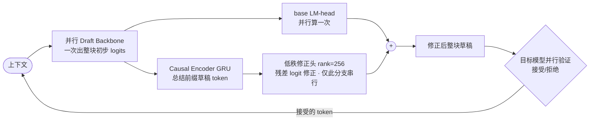

# Paper · 论文本身

## 一句话总结

Domino 把推测解码(speculative decoding)里"草稿质量 vs 草稿成本"的两难解开:先用**并行 backbone** 一次性出整块草稿分布,再用一个**轻量 Domino head**(GRU 因果编码 + 低秩残差修正)补回 token 间的因果依赖——只让便宜的修正分支串行,贵的 LM-head 仍并行跑一次。GSM8K-8B 拿到 **7.92× 加速 / 接受长度 10.03**,显著超 EAGLE-3 与 DFlash。

## 问题(Problem)

- **推测解码**:用一个轻量 draft 模型一次提议多个 token,再让大模型**并行验证**,减少昂贵的大模型调用,同时保持输出分布不变。
- 瓶颈是 **draft 质量 ↔ draft 成本** 的两难:
  - **自回归 drafter**(如 EAGLE-3):建模 token 间因果依赖→质量高,但**逐 token 串行**→慢(EAGLE-3 接受长度 4.86 却只 3.28× 加速)。
  - **并行 drafter**(如 DFlash):一次出整块→便宜,但**弱化块内依赖**→质量降(DFlash 3.42× 但接受长度掉到 4.03)。
- Domino:把**因果建模**与**昂贵的自回归执行**解耦,既要质量又不付串行代价。

## 关键术语(Key terms)

| 术语 | 解释 |
| --- | --- |
| **speculative decoding(推测解码)** | 小模型先草拟多 token,大模型并行验证接受/拒绝,加速且不改输出分布。 |
| **acceptance length(接受长度)** | 每轮草稿平均被大模型接受多少 token —— 越长越省大模型调用。 |
| **drafter(草稿器)** | 提议候选 token 的轻量模型。自回归=逐个出(准但慢);并行=一次出整块(快但糙)。 |
| **Domino head** | 轻量修正模块:GRU 因果编码器(hidden 1024)总结前缀 + 低秩(rank 256)残差头,对并行草稿 logits 做因果修正。 |
| **teacher-forced 因果编码** | 训练时用真值前缀(而非自生成的噪声前缀)喂因果编码器,稳定训练。 |
| **base-anchored 课程** | 损失权重从"基座 logits"线性退火到"修正后 logits":先练强并行 backbone,再把优化重心移到因果修正,防 backbone 崩。 |

## 核心方法(Core method)

两段式:
1. **Parallel Draft Backbone(基于 DFlash)**:一次前向出整块的初步 logits(并行,便宜)。
2. **Domino head(轻量修正)**:用 GRU 因果编码器总结前面草稿 token 的嵌入 → 低秩残差头把 [基座表示, 因果状态] 经 rank-256 瓶颈投影成**残差 logit 修正**。
**关键解耦**:贵的 base LM-head 对所有位置**只并行算一次**;只有便宜的低秩修正分支按 token 串行 —— 避免重复调用整个 LM-head。

## 架构 / 流程(Architecture / pipeline)

## 创新点(Innovation points)

| 创新 | 新在哪 | 为什么重要 |
| --- | --- | --- |
| 因果建模与执行解耦 | 并行 backbone 出块 + 低秩头只对修正串行 | 拿回自回归的质量,几乎不付串行成本(+5.3% 参数 / +2.8% 延迟 vs DFlash) |
| Teacher-forced 因果编码 | 训练用真值前缀而非自生成噪声前缀 | 稳定训练;消融 3.96→比 TTT 的 3.80 接受长度更好 |
| Base-anchored 课程 | 损失从基座 logits 退火到修正 logits | 防 backbone 坍塌;最终接受 4.19 vs 3.96 |

## 实验 / 证据(Experiments / evidence)

模型 Qwen3-4B / 8B。主结果(vs 自回归基线):

| 基准 | 方法 | 加速 | 接受长度 |
| --- | --- | --- | --- |
| GSM8K(8B) | EAGLE-3(16) | 2.21× | 3.27 |
| GSM8K(8B) | DFlash(16) | 5.21× | 6.59 |
| **GSM8K(8B)** | **Domino(16)** | **7.92×** | **10.03** |
| MBPP(8B) | Domino | 5.53× | 7.04 |

服务吞吐(SGLang,并发 16):Qwen3-8B GSM8K **3379 TPS vs DFlash 2533(+33%)**。
消融:teacher forcing(3.96>3.80)、base-anchored 课程(4.19>3.96)、Domino head 单独把 2.84×→3.31×。证据较扎实。

> [!note] 范围
> 论文自报端到端 5.49×(Transformers 后端)/ 5.8× 吞吐(SGLang);GSM8K 的 7.92× 是该基准上的峰值,别当通用数字。

## 限制与风险(Limitations and risks)

- **仅推理**,不降训练成本;且**主要适配 SGLang**,对其他服务框架兼容性未知。
- 加速**随硬件**(显存带宽/算力/kernel 效率)波动,部署需平台特定优化。
- 需要训练 draft head(非即插即用)。仓库较新(GitHub ~37★)。

## 先读什么(What to read first)

1. Figure 1(左/右)—— 延迟拆解 + 加速对比(动机)。
2. §3.1–3.3 —— 推测解码基础 + 质量-成本两难。
3. §4.1 + 两组件架构;Table 1 主结果。
4. §4.2 + Figure 4 —— 训练策略(teacher forcing、课程)。
5. §5.3 —— 消融。代码:`github.com/jianuo-huang/Domino`(Transformers + SGLang)。
