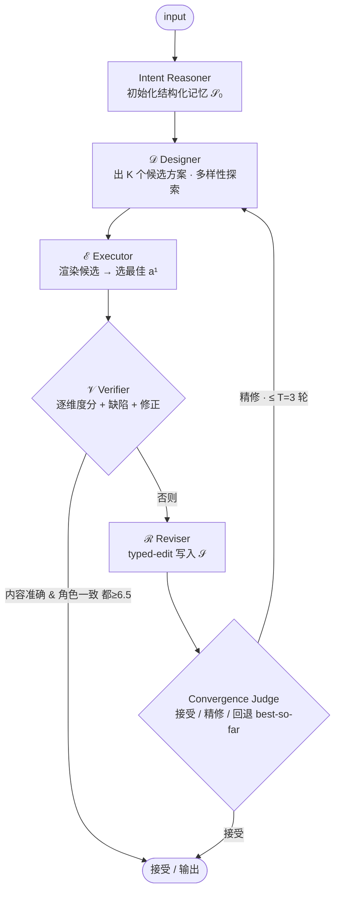

# Paper · 论文本身

## 一句话总结

Crafter 把"自动生成科学配图"从"换更强的生成模型"重构成"给现成图像生成器套一层 **harness(编排外壳)**":用一个带**结构化记忆**的多智能体循环反复诊断并定点修正局部错误,从而在不改模型结构的前提下泛化到多种图表类型与输入条件。

## 问题(Problem)

- 科学配图是**离散语义部件的结构化拼装**(框、箭头、标签、图标),而通用图像生成器在这种版面上**输出方差大**,会产生**局部错误**:乱码标签、错位连接线、丢部件。
- 现有自动配图系统两大缺陷:① 各自只针对**单一图表类型 + 纯文本输入**,覆盖不了研究者真实用到的多样性;② 产物是**栅格图(raster,像素图)**,无法局部修改。
- 作者的核心论断:**这不是"换个更强的 backbone"能解决的,需要的是一个 harness** —— 一层把现成生成引擎包起来、以"不断演化的结构化规格"为记忆、对单个失败点做定向纠正的编排层。

> [!key] 关键立场
> 论文把价值押在**编排与记忆结构**上,而不是生成模型本身。这正是"idea-first / 系统模式"型论文 —— 模型可替换,harness 是资产。

## 关键术语(Key terms)

| 术语 | 解释 |
| --- | --- |
| **Harness(编排外壳)** | 包在一个现成"引擎"(这里是图像生成器)外面的控制层:负责规划、调用、验收、修正,自身不产像素。 |
| **Raster / SVG** | Raster=像素栅格图(改一处要重画);SVG=矢量图,部件是可寻址的坐标对象,能**局部编辑**。 |
| **结构化规格 𝒮(spec / 结构化记忆)** | 一份可被"类型化编辑"修改的结构化文档,充当跨轮次的记忆,而不是把历史塞进越来越长的自由文本 prompt。 |
| **Typed edit(类型化编辑)** | 对 𝒮 的结构化操作(如"加约束""禁某类伪影""改某元素尺寸"),区别于自由文本改写。 |
| **Directive critic(指令式批评家)** | 验收者不给一个标量分"5/10",而给**逐维度分 + 指出缺陷 + 给出修正建议**的可执行反馈。 |
| **VLM-as-judge** | 用视觉语言模型(VLM)当评委给图打分。便宜可扩展,但**有自评偏置**,是本文证据的主要软肋。 |

## 核心方法(Core method)

Crafter 把整套系统抽象成在结构化规格 𝒮 上迭代的四个函数(§3.1):

- **Plan(规划)** `pₜ = 𝒟(input, 𝒮ₜ₋₁)` —— Designer 根据输入和当前记忆出方案
- **Render(渲染)** `aₜ = ℰ(pₜ)` —— Executor(现成图像模型)把方案画成栅格图
- **Diagnose(诊断)** `dₜ = 𝒱(aₜ, input, 𝒮)` —— Verifier 给出指令式诊断
- **Refine(精修)** `𝒮ₜ = ℛ(dₜ, 𝒮ₜ₋₁)` —— Reviser 把修正写成 typed edit 落进 𝒮

循环在验收通过或轮次预算 `T=3` 用尽时停止。**引擎可换、行为全在 prompt 里**,所以同一套架构无需改动就泛化到不同图表类型/输入条件。

落到 6 个智能体角色(实现上面 4 个函数 + 2 个辅助):

| 角色 | 职责 |
| --- | --- |
| 𝒟 Designer(方案生成) | 出 K∈{1,2,3} 个候选视觉框架(如"横幅版式""多栏网格") |
| ℰ Executor(图像后端) | 用 Nano Banana 2/Pro 等把每个方案渲染成栅格图 |
| 𝒱 Verifier(多维批评家) | 给 6 个维度分(内容准确/版面连贯/可读性/角色一致/美观/伪影)+ 指出缺陷 + 修正建议 |
| ℛ Reviser(规格精修) | 把修正写成 typed edit 落进 𝒮(不是自由文本) |
| Intent Reasoner | 从上下文/指令初始化 𝒮₀ |
| Convergence Judge | 每轮路由:接受 / 继续精修 / 回退到目前最好的 a* |

## 架构 / 流程(Architecture / pipeline)

**CraftEditor(栅格→可编辑 SVG)** 复用同一 harness 模式,分三段(每段都是一个 harness 循环):
1. **Extraction(提取)**:VLM 写"保留/删除"计划 → 图像编辑器在像素级执行(去重叠/杂物)→ 验收 → 必要时改计划(≤3 轮;47%/46%/7% 分别在第 1/2/3 轮收敛)。
2. **Processing(处理)**:给每个资产配字幕+定位,分类矢量/栅格,丢弃幻觉(空白/不匹配/纯文本)。
3. **Composition(合成)**:生成 2 个 SVG 骨架候选(温度 0.2/0.45)→ Convergence Judge 选优 → 拼入资产 → **混合批评家(VLM + 程序化检查器**:文字溢出、箭头端点、元素重叠、缺件)→ 改 SVG 源(≤4 轮,带 best-so-far 回退)。

## 创新点(Innovation points)

| 创新 | 新在哪 | 为什么重要 |
| --- | --- | --- |
| 引擎无关 harness | 任务专属行为全在 prompt,同架构跨图表类型/输入条件零改动 | 把"能力"和"具体生成器"解耦,模型升级即受益,泛化无需重训 |
| Typed edit 而非自由文本 | 用结构化规格记忆替代越堆越长的文本改写 | 避免"指令互相打架/静默矛盾";消融去掉它**总分 −8.90** |
| 指令式诊断 | 逐维度分 + 指出缺陷 + 修正建议,而非标量分 | 让"修"有可执行抓手;消融去掉 **−5.04** |
| best-so-far 回退 | 精修非单调时退回历史最优 | 给"迭代可能变差"上了安全阀 |
| CraftBench | 首个 3 图表类型 × 4 输入条件、279 样本、人标基准 | 把"多样性"做成可测,而非口号 |

## 实验 / 证据(Experiments / evidence)

**基准**:PaperBanana-Bench(292 张学术文生图配图)、CraftBench(279 样本,含文生图/掩码补全/草图/关键元素 4 种输入;学术/海报/信息图 3 风格)。
**指标**:VLM-as-judge(Gemini 3.5 Flash)按内容忠实/可读/输入保真/风格打分;宽松胜率 = {赢100,平50,输0} 的平均。

主结果(Table 2,Overall):

| 方法 | PaperBanana | CraftBench |
| --- | --- | --- |
| Nano Banana 2(裸生成器) | 11.13 | 19.90 |
| PaperBanana(agentic 基线,带 NB2) | 33.73 | 28.00 |
| **Crafter(带 NB2)** | **50.34** | **50.20** |
| Δ vs 裸生成器 | **+39.21** | **+30.30** |
| Δ vs agentic 基线 | **+16.61** | **+22.20** |

消融(Table 3,PaperBanana):去掉计划探索 −8.56 / 纠错层 −8.90 / 精修循环 −5.48 / 指令式批评家 −5.04 —— **四个组件各自独立必要**。
CraftEditor(Table 4,80 样本,3-VLM 集成):CraftEditor **8.04** > AutoFigure-Edit 6.91 > Edit-Banana 3.69;去掉智能体清洗 −0.33、去掉迭代合成 −2.15。

> [!warn] 对证据要存疑
> 主指标是 **VLM-as-judge**(模型当评委),存在自评/同源偏置;虽有人标和 3-VLM 集成缓解,但"赢基线 16~22 分"不能直接等同于人类质量提升那么多。

## 限制与风险(Limitations and risks)

- **成本**:约 **\$0.25/图 vs 基线 \$0.06**(约 4×),来自多智能体多轮 + 多模型调用。
- **复杂多面板图**:相互依赖约束多时,harness 仍吃力(作者列在 Appendix J)。
- **非单调收敛**:精修可能变差,靠 best-so-far 回退兜底,但说明循环本身不稳。
- **评测**:VLM-as-judge 偏置(见上)。
- **工程成熟度**:仓库 research-stage(2 commit、无测试、无 release)。

## 先读什么(What to read first)

1. §1 引言 + Figure 1(架构总览)—— 抓"为什么是 harness 不是更强模型"。
2. §3.1–3.2.3 —— harness 抽象 + 三大机制(多样性探索 / 结构化纠错层 / 验收-精修)。
3. Table 2 + Figure 5 —— 主结果与跨任务泛化。
4. Table 3 —— 消融(确认每个组件都有用)。
5. §3.3 + Figure 2 —— CraftEditor(栅格→SVG)。
6. 代码:`configs/default.yaml`(模型槽位)、`crafter/generation/`(生成智能体)、`craftbench/`(评测)。
