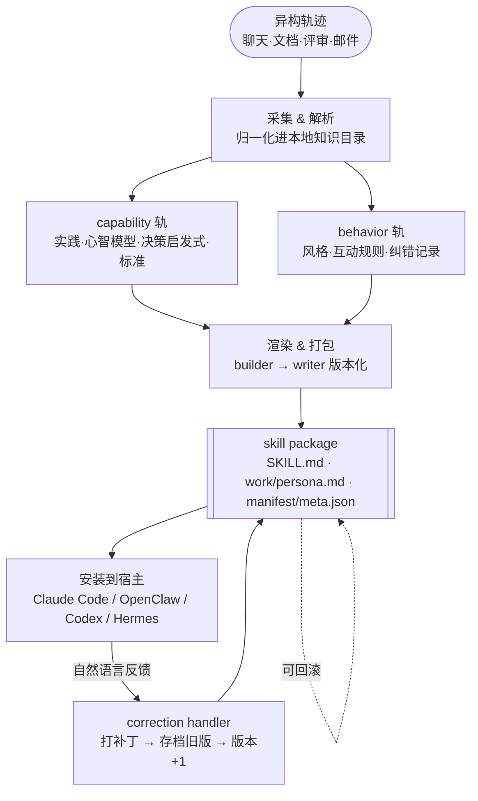

# Paper · 论文本身

## 一句话总结

COLLEAGUE.SKILL 把"一个人/角色的专长"从零散轨迹(聊天记录、设计文档、代码评审…)**端到端蒸馏**成一个**可检视、可纠正、可版本化、可跨 agent 宿主安装**的 skill package —— 贡献是**工件契约 + 工作流**(生成/纠错/回滚/安装),而不是"行为克隆得多像"。

## 问题(Problem)

- 现在期望 LLM agent 不只完成孤立任务,还要**承载某人的判断标准、决策习惯、表达风格**(person-grounded agent)。
- 难点:这些"可执行知识"**散落在异构轨迹里**(Slack、邮件、PDF、评审记录),不是写好的干净指令。
- 现有方案各有缺口:memory/检索系统把表示**藏在内部**(不可检视);persona 系统把**事实/判断/语气混为一谈**;skill 框架只给**打包格式**,没有"从轨迹到技能"的端到端流程。
- COLLEAGUE.SKILL 补的就是这个**端到端蒸馏工作流**,且产物是**显式、带来源边界与纠错历史的版本化工件**。

> [!key] 立场
> 论文价值在**工件设计 + 生命周期工作流**,不在算法。它明确"比行为克隆窄":产物是**可编辑的技术对象**,不是身份替身。

## 关键术语(Key terms)

| 术语 | 解释 |
| --- | --- |
| **trace-to-skill 蒸馏** | 把人的零散使用轨迹(聊天/文档/评审)自动提炼成结构化、可调用的"技能"。 |
| **person-grounded agent** | 承载某个具体人/角色的专长与风格的 agent(不是通用助手)。 |
| **capability track(能力轨)** | 技能包里装"做事的本事":实践、心智模型、决策启发式、技术标准。 |
| **behavior track(行为轨)** | 装"怎么表达/互动":沟通风格、互动规则、纠错记录。两轨**分开**避免把判断和语气混在一起。 |
| **skill package(技能包)** | 版本化工件:`SKILL.md`(可调用入口)+ `work.md`/`persona.md`(可编辑源)+ `manifest.json`/`meta.json`(安装/生命周期/画廊元数据)。 |
| **correction lifecycle(纠错生命周期)** | 用自然语言反馈("他不会这么说")→ 打补丁 → 存档旧版 → 版本号+1 → 重生成;可回滚。 |
| **domain preset(领域预设)** | 同一工作流的特化:colleague(企业私有轨迹)/ celebrity(公开证据+来源边界)/ relationship(私密互动+同意/本地控制)。 |

## 核心方法(Core method)

输入(目标人/角色的材料 + 轻量 profile + 来源范围)→ 四步:
1. **采集解析**:把 Slack/邮件/PDF/飞书/微信等归一化进本地知识目录。
2. **分析抽取(双轨并行)**:capability 轨抽实践/心智模型/决策启发式/标准;behavior 轨抽风格/互动规则/纠错记录。
3. **渲染打包**:builder 产结构化 Markdown,writer 归一化成版本化工件。
4. **输出 skill package**(schema v3:身份/预设家族/来源上下文/生成溯源/生命周期状态/兼容字段)。

技能包的**五个运行属性**:可移植(标准机制加载)、可检视(用前能读到规则/例子/限制)、可组合(完整 / 仅能力 / 仅人格 三个入口)、可纠正(打补丁保留旧态)、可治理(来源边界/免责声明/可删可分享)。

## 架构 / 流程(Architecture / pipeline)

## 创新点(Innovation points)

| 创新 | 新在哪 | 为什么重要 |
| --- | --- | --- |
| 显式可检视工件 | 用版本化、带来源边界的 skill package 替代"藏在内部的 memory" | 能审、能改、能回滚、能治理,而非黑盒 |
| capability / behavior 双轨 | 把"做事本事"和"表达风格"分开 | 避免 persona 系统把判断和语气混淆 |
| 纠错生命周期 | 自然语言反馈 →结构化补丁(能力补丁 / {scene,wrong,correct} 行为记录)→版本化 | 技能可持续演进且可追溯,不是一次性生成 |
| 跨宿主部署 | 同一包装可装进 Claude Code/OpenClaw/Codex/Hermes | 技能成为可流通资产(画廊 215 技能/165 贡献者) |

## 实验 / 证据(Experiments / evidence)

- **没有正式评测**。作者**明确承认**行为保真度是"open",需要"人评 + 任务评"(评审准确性、风格迁移、关系风险、引用质量)。
- 现有数字是**采用度**:画廊 215 skills / 55 meta-skills / 165 contributors / 累计 100k+ star;仓库约 19k star、1.9k fork、109 commits。作者自述这些"反映部署/分发面,而非任务表现"。
- 案例:Andrej Karpathy(celebrity)、字节 L2-1 工程师(colleague)、关系蒸馏 demo。

> [!warn] 证据很弱,别当性能背书
> 这是一篇**系统/工件论文**:它证明了"能把轨迹做成可纠正的技能包并被大量采用",**没证明**生成的技能"忠实复现了那个人"或"提升了下游工作"。看它学**设计**,不要把 star 数当效果。

## 限制与风险(Limitations and risks)

- **无保真度证明**(见上);定位"比行为克隆窄"。
- **纠错会编码编辑者偏见**;celebrity/relationship 变体有非自愿模拟、情感过度依附风险。
- **责任前提**:需显式参与、限定采集范围、访问控制、保留期限、合法来源、同意与脱敏审查;画廊须 opt-in + 可下架 + 免责声明。

## 先读什么(What to read first)

1. Abstract + §1 引言 —— 为什么"轨迹 ≠ 隐藏 memory"。
2. §3 系统总览 + Figure 1-2 —— 架构 + 预设。
3. §3.3 工件 schema 与 writer + Table 1 —— 运行契约。
4. §4.1–4.2 —— 生成 + 纠错工作流。
5. §9 限制 —— 诚实的风险评估。
6. 代码:`prompts/{intake,work_analyzer,persona_analyzer,*_builder,correction_handler}.md`、`tools/{skill_writer,version_manager}.py`、`skills/{colleague,relationship,celebrity}/`。
