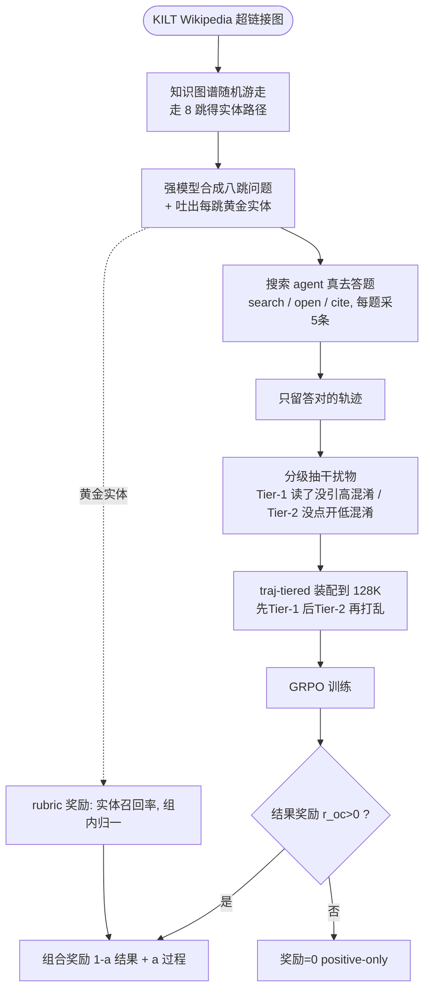

# Paper · 论文本身

## 一句话总结

让模型学会在「**几十万字、塞满相似干扰文档**」的长上下文里把关键信息找全、串对,一直是难题。LongTraceRL 的两招都很「接地气」:**数据上**,不再用随机抽来的、一眼能筛掉的无关文档当干扰,而是**让一个搜索 agent 真去答题,把它「读了却没引用」的文档当成最像、最难骗过去的干扰物**(高混淆度);**奖励上**,不再只看「最终答案对不对」(信号太稀、容易蒙对),而是用**推理链上每一跳该出现的「黄金实体(gold entity)」做细到实体级的过程打分(rubric reward)**,而且**只给答对的回答打这个过程分(positive-only)**,避免模型靠堆实体名刷分。在三个 4B–30B 推理模型、五个长上下文 benchmark 上**平均分均居首**,但**绝对增益不均**(4B 上 +5.7,8B 上仅 +1.1,见实验)——是「方向对、但收益对骨干敏感」,不是「碾压」。[^arxiv]

## 问题(Problem)

- 长上下文推理(long-context reasoning)的真实痛点不是「读不到」,而是**「在一大堆看着都相关的内容里,定位并整合真正有用的那几条」**。模型常见的失败:答案幻觉、只抓到碎片、引用了无关段落。[^arxiv]
- 用强化学习(RL)来练这个能力,现有做法有**两个硬伤**:
  1. **训练数据太容易**。干扰文档大多是**随机从无关文档里抽**的,和问题没语义关联,模型一眼就能筛掉——练不出「在高度相似内容里辨别」的能力。[^arxiv]
  2. **奖励信号太稀**。主流只用**结果奖励**(final answer 对=1,错=0)。当输入有几十万 token 时,这个信号又稀又吵:**模型可能走错路却蒙对答案**。论文给的例子:模型最终答对了「Moroccan-Swedish」,但中间那一跳引用的实体是错的(引了「Love Game」而非「Just Dance」)——结果奖励照样给满分,**中间的检索失败被掩盖了**。[^arxiv]
- 所以作者主张:长上下文 RL 要同时**把数据做难**(用真实搜索行为造高混淆干扰)和**把奖励做细**(给中间推理步打过程分),两者缺一不可。

> [!key] 立场
> 这篇的价值是**把「过程级监督」落到「实体级」这个非常细的粒度,并配一个防作弊的 positive-only 开关**;同时贡献了一个**用 agent 真实搜索轨迹造高难度训练数据**的可复用数据工厂。它赌的是:**长上下文 RL 的瓶颈一半在「干扰物够不够像」,一半在「奖励能不能管到中间步」**。看它学的是**「数据难度可量化、可设计」**和**「过程奖励要防 reward hacking(奖励作弊)」**这两条工程心法——而非某个新模型。证据维度是真实(三模型三规模 + 五 benchmark + 三组消融),但**绝对增益偏小**(4B 上 +5.7,8B 上仅 +1.1),这点要诚实记住。

## 关键术语(Key terms)

| 术语 | 大白话解释 |
| --- | --- |
| **长上下文推理(long-context reasoning)** | 在很长(几十万 token)的输入里跨多处定位、整合信息并多跳推理。难点是抗干扰。[^arxiv] |
| **RLVR(可验证奖励的强化学习)** | 用「能机器判对错的奖励」(如答案是否正确)做 RL。在数学等任务上有效,但搬到长上下文时奖励太稀。[^arxiv] |
| **干扰文档(distractor)** | 故意混进上下文、用来增加难度的非黄金证据文档。质量取决于它有多「像」真证据。 |
| **混淆度(confusability)** | 干扰文档骗过模型的能力。越和问题/推理链沾边,越难被筛掉,混淆度越高。[^tier] |
| **黄金实体(gold entity)** | 推理链每一跳上「应该被用到 / 被提到」的正确实体。本文用它做过程监督的打分依据。[^rubric] |
| **rubric reward(评分细则奖励)** | 不看最终答案,而看「回答里提到了多少条黄金实体」的过程分。粒度细到实体级。[^rubric] |
| **positive-only(只给正例)** | 过程分**只发给最终答对的回答**;答错的一律 0 分。防止模型靠堆实体名刷过程分。[^posonly] |
| **GRPO(组相对策略优化)** | 一种 RL 算法:同一题采一组回答,组内相对比较来定优势。本文在组内对 rubric 分做归一化。[^rubric] |

## 核心方法(Core method)

LongTraceRL 分两半:**一个造数据的流水线** + **一个改奖励的 RL 框架**。

**A. 数据工厂:用「真搜索轨迹」造高难度干扰**(类比:出一套刁钻考题,干扰项都是「学霸真做题时差点选错的选项」)
1. **知识图谱随机游走出题**:在 KILT 版 Wikipedia 的超链接图上,从一个种子实体出发走 **k=8 跳**(每步让 LLM 从最多 5 个未访问候选里挑最相关的),拿到一条多跳实体路径;再让强模型(如 GPT-5.2)据此**合成一道「必须逐跳推理、不能靠关键词匹配抄近路」的八跳问题**,并吐出每跳的黄金实体。[^kg]
2. **让搜索 agent 真去答这道题**:agent 能 search(发查询)/ open(读文档)/ cite(引用),记录完整轨迹;**每题采 5 条独立轨迹,只留答对的那条**(全错的题丢掉)——保证轨迹是真有目标的搜索行为。[^traj]
3. **分级抽干扰物**:从轨迹里(去掉黄金证据)分两档——**Tier-1(高混淆)= agent「读了却没引用」的文档**(它一度觉得值得读,最像);**Tier-2(低混淆)= 出现在搜索结果里但 agent 压根没点开的**(只是表面相关)。[^tier]
4. **traj-tiered 装配**:先塞 Tier-1(最难、最值钱),不够目标长度(128K)再补 Tier-2,最后全部打乱防位置捷径。[^tier]

**B. RL 框架:实体级过程奖励 + 防作弊开关**
- **结果奖励** `r_oc ∈ {0,1}`:LLM judge 判最终短答案对不对。[^rubric]
- **rubric 奖励** `r̂_rb`:回答里命中的黄金实体 / 全部黄金实体(实体召回率);再在 GRPO 的一组回答内**除以组内最大值归一化**到 [0,1](因不同题黄金实体数和难度不同)。[^rubric]
- **positive-only 组合**(核心防作弊):`r = (1−α)·r_oc + α·r_rb`,**但只在答对时**(`r_oc>0`)才算;答错直接 0。这样 rubric 分只在「答对的回答之间」分高下——奖励「答对且中间推理扎实」的,压低「蒙对的」。默认 α=0.3。[^posonly]

> [!key] 补丁①:rubric 分本质是「实体召回率」,不是「推理正确性」(别过度解读)
> rubric 奖励算的是「黄金实体在回答里出现了多少」,**它度量的是「有没有提到该提的实体」,不直接等于「推理逻辑对不对」**。正因为它是召回率,**才需要 positive-only 兜底**——否则模型会发现「把检索到的实体名一股脑列出来」就能刷高分,而不真推理(这正是 reward hacking)。[^posonly]

> [!key] 补丁②:为什么干扰物「越像越好」能量化?
> 作者用「干扰文档里**含至少一个黄金实体**的比例」来量难度:随机抽的干扰物几乎不含(Macro 1.35%),一眼能筛;而 Tier-1(读了没引)高达 **63.23%**——含黄金实体却不是答案,最难辨别。**这个难度排名几乎和下游分数排名一致**,坐实「干扰物难度是数据质量的关键驱动」。[^distract]

## 架构 / 流程(Architecture / pipeline)

## 创新点(Innovation points)

| 创新 | 新在哪 | 为什么重要 |
| --- | --- | --- |
| 用 agent 真实搜索轨迹造干扰 | 不是随机抽 / 不是 embedding 相似,而是「agent 读了没引」的真行为 | 干扰物贴近真实检索场景,混淆度可量化、可分级 |
| 实体级 rubric 奖励 | 过程监督细到「推理链每跳的黄金实体」,比 chunk/文档/工具级更细 | 能管到中间推理步,治「蒙对答案」的稀疏奖励问题 |
| positive-only 防作弊 | 过程分只发给答对的回答 | 防 reward hacking(堆实体名刷分),自我调节响应长度 |
| 难度可量化 | 用「干扰含黄金实体比例」量难度,且与下游分高度相关 | 把「数据难不难」从玄学变成可测的设计变量 |

## 实验 / 证据(Experiments / evidence)

> **自报 vs 实测(整节适用)**:下列所有分数、消融、训练配置(GPT-5.2 出题、k=8 跳、每题 K=5 轨迹、32×H800 等)均取自论文自己的表格/描述,属**论文自报**,本文未独立复现;HF upvotes 等社区数字为抓取当时快照。「平均分居首」指论文自报 Table 1 的口径,且增益对骨干敏感(下文 warn①)。

**设置**:训练集 **2,815 条**八跳长上下文 QA(128K 目标长度);三个推理模型 **Qwen3-4B-Thinking / DeepSeek-R1-0528-Qwen3-8B / Qwen3-30B-A3B-Thinking**;五个 benchmark **AA-LCR / MRCR / Frames / LongBench v2 / LongReason**;对照三个现有长上下文 RL 数据集(DocQA / LoongRL / LongRLVR),同算法同超参。GRPO,group size 8,200 步,32×H800。[^setup]

**主结果(Table 1,数值经 hf read 抽取):LongTraceRL 在三个规模上平均分都最高:**[^main]

| 骨干模型 | 基座(base) | 最强基线 | **LongTraceRL** | 增益 |
| --- | ---: | ---: | ---: | ---: |
| Qwen3-4B-Thinking | 53.3 | 56.5(LongRLVR) | **59.0** | **+5.7 over base / +2.5 over 最强基线** |
| DeepSeek-R1-0528-Qwen3-8B | 42.7 | — | **43.8** | **+1.1** |
| Qwen3-30B-A3B-Thinking | 60.5 | — | **63.7** | **+3.2** |

- **增益最大在最难的 AA-LCR**:Qwen3-4B 上 33.2 → 41.8(**+8.6**)。[^main]
- **基线甚至会拖后腿**:DocQA / LoongRL / LongRLVR 在 8B 骨干上反而把 42.7 拉到 40.6 / 40.1 / 40.9——**用错数据/奖励会负优化**。[^main]
- **rubric 奖励是主要功臣**:去掉它(LongTraceRL-GRPO,同数据)4B 平均从 **59.0 掉到 53.7**,增益几乎全没——证明赢在奖励设计,不只是数据。[^main]

**消融三连**:
- **α(过程分权重,Table 2)**:α=0.3 最好(59.0);α=0.1 信号太弱(AA-LCR 41.8→39.2);α=0.5 过强反伤(平均 57.1)——**过程分太重会冲淡答对目标、把模型推向「堆实体」捷径**。[^alpha]
- **干扰来源(Table 3/4)**:traj-tiered(59.0)> traj-random(随机混 Tier)> search(一次搜 top-100,56.7)> random(55.7);难度比例(含黄金实体)随之 50.03% > 42.16% > 15.00% > 1.35%——**难度与下游分严格同序**。[^distract]
- **positive-only(Table 5)**:去掉它(对错都给过程分)平均 59.0→57.1;AA-LCR 掉 4.8、MRCR 掉 5.3。机理:对错都给分会让「错回答也能靠堆实体拿分」,稀释了「真正解题」的梯度。训练曲线还显示约第 120 步很多 rollout 撞 32K 长度上限发不出答案、压低结果奖励,positive-only 会把策略**自我拉回**更短的回答——自带防长度爆炸的调节。[^posonly]

> [!warn] 三处别被带偏
> 1. **绝对增益偏小,别夸大**。8B 上只有 **+1.1**(42.7→43.8),远小于 4B 的 +5.7;方法**对规模/骨干不是均匀有效**。evidence_quality 给低分正因如此。
> 2. **rubric 分 = 实体召回,不是推理正确**。它靠 positive-only 才不被刷;脱离这个开关单用会助长 reward hacking(见补丁①)。
> 3. **数据全来自 Wikipedia(KILT)单一来源**。作者自承:虽迁移到金融/法律/代码 benchmark 还行,但**单源知识图谱可能限制推理模式多样性**;且干扰质量**依赖所用搜索 agent 的能力**,换个强/弱 agent 结果会变。[^limits]

## 限制与风险(Limitations and risks)

- **单一知识源**:训练问题全部源自 KILT Wikipedia,推理模式多样性可能受限(虽下游迁移尚可)。[^limits]
- **依赖 agent 能力**:干扰物质量取决于采集轨迹的那个搜索 agent;agent 强弱会改变干扰分布和难度,泛化性存疑。[^limits]
- **增益不稳定**:跨规模增益差异大(8B 仅 +1.1),方法收益对骨干敏感。[^main]
- **过程分是召回代理**:rubric 度量实体召回而非推理正确性,强依赖 positive-only 才不被作弊。[^posonly]

## 先读什么(What to read first)

1. **Abstract + §1 + Fig.1** —— 两个痛点(干扰太易、奖励太稀)和「蒙对答案」的例子。[^arxiv]
2. **§3.1 数据流水线 + Fig.2** —— KG 游走出题 → agent 轨迹 → 分级干扰 → traj-tiered 装配。[^kg]
3. **§3.2 + Eq.1–3** —— rubric 奖励(实体召回 + 组内归一)与 positive-only 组合。[^rubric]
4. **Table 1** —— 三规模主结果与去 rubric 消融。[^main]
5. **§4.3.2 + Table 3/4** —— 干扰难度(含黄金实体比例)与下游分严格同序,最有迁移价值的一段。[^distract]
6. **§4.3.3 + Fig.4** —— positive-only 防作弊的训练动态。[^posonly]

## 技术细节(选读)

> **rubric 奖励的组内归一化(为什么要除以组内最大值)**
> 大白话:不同题的黄金实体数和难度不同,原始召回率范围不一,不能直接比。精确机制:GRPO 每题采一组 G 个回答,把每个回答的原始 rubric 分 `r̂_rb` **除以这组里的最大值**(当最大>0 时),归一到 [0,1];这样不论题目难易,过程信号都可比。原文 Eq.2。[^rubric]

> **traj-tiered 的装配顺序与目标长度(防过度解读)**
> 大白话:先塞最难的,再用次难的补够长度。精确机制:从黄金段落起,先加 Tier-1(读了没引,最难),用尽后若没到目标长度 L(=128K)再补 Tier-2(没点开),全部 shuffle 防位置捷径。原文 §3.1.4。[^tier]

> **训练配置(可复现关键)**
> Slime 框架;最大 160K(128K prompt + 32K response);GRPO,G=8,global batch 128,200 步,常数 lr 2e-6;rollout 温度 1.0、评测温度 0.6、生成上限 32K;每 20 步存 checkpoint 取最优。32×H800。原文未给完整数据合成的算力/成本账,只给训练侧配置。[^setup]

## 后续演化 · 这方法后来怎样了

LongTraceRL 处在「长上下文 RL + 过程奖励」这条很热的赛道,下列为**论文自身引用、arXiv ID 可解析的同期/先行工作**(本文太新,尚无明确后继):

- **DeepDive**(arXiv:2509.10446)— 知识图谱随机游走出多跳题 + 多轮 RL 的**直接灵感来源**,本文的出题法承自它 _[置信度:高]_。[^kg]
- **LongRLVR**(arXiv:2603.02146)— 用 chunk 级 F_β 上下文奖励的并行工作,本文最强基线之一 _[置信度:高]_。[^main]
- **LongR**(arXiv:2602.05758)— 用冻结 verifier 衡量检索文档相对信息增益的 dense utility 奖励,并行赛道 _[置信度:高]_。
- **EAPO / 奖励协同进化**(Guan et al. 2026,arXiv:2601.10306)— 用协同进化奖励模型给证据抽取打 dense 过程分,问题同源、粒度更粗(非实体级)_[置信度:中]_。

[^arxiv]: 论文 *LongTraceRL: Learning Long-Context Reasoning from Search Agent Trajectories with Rubric Rewards*,arXiv:2605.31584(2026-05-29,Tsinghua University THU-KEG,Nianyi Lin / Jiajie Zhang / Lei Hou / Juanzi Li,HF upvotes 41)。https://arxiv.org/abs/2605.31584 · 代码/模型/数据 https://github.com/THU-KEG/LongTraceRL(4B/8B/30B 模型已开源)
[^kg]: 同上,§3.1.1(KILT Wikipedia 超链接图随机游走 k=8 跳,每步 LLM 从≤5 候选选最相关 + 周期性 mad walk 多样化;强模型如 GPT-5.2 合成八跳问题 + 吐黄金实体;承自 DeepSeek/DeepDive arXiv:2509.10446)。
[^traj]: 同上,§3.1.2(搜索 agent search/open/cite 记轨迹;每题采 K=5 独立轨迹,只留答对者,全错丢弃)。
[^tier]: 同上,§3.1.3–3.1.4(Tier-1=读了没引/高混淆,Tier-2=没点开/低混淆;traj-tiered 先 Tier-1 后 Tier-2 装配到 L=128K 再 shuffle)。
[^rubric]: 同上,§3.2 + Eq.1–2(rubric=黄金实体召回率;GRPO group size G;组内除以最大值归一到 [0,1])。
[^posonly]: 同上,§3.2 Eq.3 + §4.3.3 Fig.4(positive-only:仅 r_oc>0 时算 r=(1−α)r_oc+α·r_rb,否则 0;去掉它平均 59.0→57.1,AA-LCR −4.8、MRCR −5.3;约第 120 步撞 32K 上限→positive-only 自我拉回更短回答)。
[^setup]: 同上,§4.1(训练集 2,815 条八跳 128K;三模型;五 benchmark AA-LCR/MRCR/Frames/LongBench v2/LongReason;对照 DocQA/LoongRL/LongRLVR;Slime,GRPO G=8,batch 128,200 步,lr 2e-6,160K=128K+32K,32×H800;AA-LCR 跑 4 次、LongBench v2 跑 2 次取平均)。
[^main]: 同上,Table 1 + §4.2(Qwen3-4B 53.3→59.0 即 +5.7 over base / +2.5 over LongRLVR,AA-LCR 33.2→41.8 即 +8.6;8B 42.7→43.8;30B 60.5→63.7 即 +3.2;基线在 8B 上负优化至 40.6/40.1/40.9;去 rubric 的 LongTraceRL-GRPO 4B 59.0→53.7)。
[^alpha]: 同上,Table 2 + §4.3.1(α∈{0.1,0.3,0.5};α=0.3 最优 59.0,α=0.1 AA-LCR 41.8→39.2,α=0.5 平均 57.1)。
[^distract]: 同上,Table 3/4 + §4.3.2(traj-tiered 59.0 > traj-random > search 56.7 > random 55.7;含黄金实体 Macro 比例 50.03% > 42.16% > 15.00% > 1.35%,Tier-1 单独 63.23%;难度与下游分严格同序)。
[^limits]: 同上,§6 Limitations(单一 KILT Wikipedia 知识源限制推理模式多样性;干扰质量依赖所用搜索 agent 能力,agent 强弱改变轨迹分布)。
