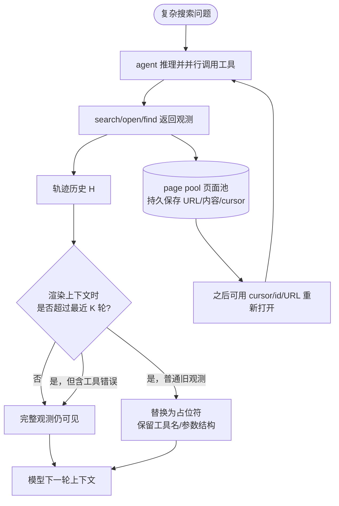
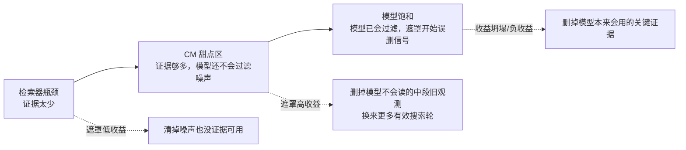

# Paper · 论文本身

## 一句话总结

这篇研究的核心不是“把 agent 历史截短会不会省 token”，而是给长程搜索 agent 的 **observation masking（观测遮罩：把旧工具输出换成占位符，但保留推理和工具调用结构）** 画了一张**适用区间图**：检索器太弱时，遮罩救不了没有证据的上下文；检索器够强但模型还不会从噪声里筛证据时，遮罩最有用；模型已经饱和时，遮罩反而会删掉它本来能用上的关键证据。[^arxiv]

## 看点（What to watch）

- **它把 context management（上下文管理）从默认技巧改成了条件处方。** 不是“历史越短越好”，而是“检索器、模型、任务难度”共同决定是否该遮罩。
- **它研究的是 agent/direct AutoSci 相关的真实问题。** 长程搜索 agent 会把搜索结果、网页内容、错误反馈、自己前面想过的话都塞进轨迹；这和 AutoSci 里的“边检索边推理边修正”非常同源。
- **它的机制解释很工程化。** 遮罩不是魔法压缩；它是在用“少看旧材料”换“多走几轮工具调用”。这笔交易在中等能力区间赚钱，在饱和区间亏钱。
- **它提醒我们别把强模型和弱模型用同一套记忆策略。** 弱模型需要帮它清噪；强模型可能已经会自己过滤，外部遮罩会变成误删。

> [!key] 立场
> 这篇的价值在于**把“要不要删 agent 历史”变成一个可测的系统设计问题**：先看没有上下文管理时系统有多强，再看检索器是否把证据带进来了，最后再决定是否遮罩旧观测。它不是提出一个更复杂的压缩器，而是用最小干预把“什么时候有用、为什么有用、什么时候会坏”拆开。

## 问题（Problem）

长程搜索 agent 的上下文不是普通聊天记录。它通常包含：

- 用户问题和系统提示；
- 每一步 reasoning（推理链）；
- 每一步 tool call（工具调用）；
- 搜索摘要、网页内容、定位结果、工具错误等 observation（观测）。

随着轮数变长，观测会变成上下文里的主体，旧网页和旧搜索结果大量堆积。最直觉的做法是把旧观测遮住，只给模型保留最近一段工具输出。但这里有一个关键矛盾：**旧观测可能已经没用了，也可能正是最后合成答案需要的证据。**[^method]

作者因此问了一个很具体的问题：当我们只做最轻量的旧观测遮罩，保持 scaffold（脚手架）、提示、评测协议不变，只改变模型和检索器时，遮罩到底在哪些系统配置里有用？

## 关键术语（Key terms）

| 术语 | 大白话解释 |
| --- | --- |
| **observation masking（观测遮罩）** | 超出保留窗口的旧工具输出不再完整放进模型上下文，而是换成一个占位符；推理文本和工具调用参数还留着。 |
| **stale observation（陈旧观测）** | 这里不是语义上“真的无关”，而是操作定义：超过最近若干轮保留窗口、因此可以被遮罩的观测。作者明确说这不等于它一定没用。[^method] |
| **CM / context management（上下文管理）** | 测试时对 agent 历史做剪枝、压缩、摘要或遮罩，目的是减少长上下文负担。本文只研究最小形式的 CM：观测遮罩。 |
| **page pool（页面池）** | 一个和模型上下文分离的持久网页仓库。即使某个网页内容在上下文里被遮罩，页面本身仍保存在池里，agent 可以用 cursor / id / URL 重新打开。[^method] |
| **retriever bottleneck（检索器瓶颈）** | 检索器没有把足够答案证据带进来；遮罩再怎么清噪也放大不了不存在的信号。 |
| **model-saturated（模型饱和）** | 模型已经能处理当前噪声和证据；外部遮罩的收益很小，甚至会删掉它本来会用的证据。 |
| **Trace-SNR（轨迹信噪比）** | 用轨迹里“命中金标准证据的页面”相对“非证据页面”的密度，近似衡量当前上下文里有多少可用信号。[^probe] |

## 核心方法（Core method）

可以把本文的遮罩机制想成一个做资料研究的人在桌上工作：

他每搜一次就把资料摊在桌上。桌子越堆越满，真正有用的纸条被无关网页和错误尝试盖住。遮罩策略不是把资料烧掉，而是把中间一大摞旧材料塞进文件柜，只在桌面上留下“这里曾经搜过什么、打开过什么”的索引卡。最近几页还摊着，所有网页原件仍在文件柜里，想要时可以按编号再拿出来。

这就是本文的系统设计：

1. agent 每轮产生 `reasoning -> tool calls -> observations`。
2. 渲染上下文时，只保留最近 `K` 轮观测；更旧的观测换成占位符。
3. 推理链和工具调用结构不遮罩。
4. 工具错误不遮罩，因为错误反馈是 agent 修正 malformed call / 网络失败等问题的依据。
5. 页面池独立保存所有打开过的页面，让被遮罩的网页仍可重新打开。[^method]

> [!warn] 别误读“stale”
> 本文的 stale 是**窗口规则下的可遮罩**，不是“事实已经无用”。作者特意强调，旧观测可能在计划改变后重新变得关键；这也是遮罩在强模型/饱和区间会翻车的根本原因。[^method]

## Regime map（区间图）

本文最重要的图不是某个单点提升，而是三段式区间：

这张图的判断变量不是模型大小本身，而是**检索 recall 与模型隐式过滤能力的错配**。如果检索器强到把证据带进来了，但模型还不擅长从长噪声轨迹里挑出证据，遮罩像是帮它清桌面；如果模型已经能自己清桌面，外部遮罩就像有人把它刚要引用的纸条收走。

## 创新点（Innovation points）

| 创新 | 新在哪 | 为什么重要 |
| --- | --- | --- |
| 区间化看 context management | 不把遮罩当通用技巧，而是按系统能力分区 | 真实 agent 产品需要按模型/检索器/任务调策略，而不是一套默认压缩 |
| 最小干预作为诊断工具 | 只遮罩旧观测，不引入摘要器/额外模型调用 | 更容易把性能变化归因到“旧观测是否有用” |
| page pool 与可见上下文解耦 | 内容从上下文里消失，但仍可按 cursor 重开 | 避免“遮罩=永久删除”，也让 agent 可以用工具补回证据 |
| 机制证据结合 attention 与工具行为 | 不只看 accuracy，还看模型看哪里、agent 重开哪里 | 解释为什么中间旧观测通常可删，也解释为什么偶尔会坏 |
| Trace-SNR probe | 用未遮罩轨迹的形状和证据密度预测遮罩可能救哪些 case | 把“什么时候会被救”从事后观察推进到可诊断信号 |

## 实验 / 证据（Experiments / evidence）

**实验设置。** 作者在四个 agentic search benchmark 上评测：BrowseComp-Plus（固定离线语料）、GAIA text-only、xBench-DeepSearch、BrowseComp-ZH。模型覆盖 open-weight tool-calling agents，从 4B 到 284B 参数；BrowseComp-Plus 上使用 BM25、Qwen3-Embedding-8B、AgentIR-4B 三类检索器，live-web benchmark 使用 Serper API。所有实验设置 `500` 轮上限，观测保留窗口 `K=5`，LLM-as-Judge 使用 GPT-5-mini；作者还自报随机抽样 `15%` LLM 判分结果做人审，人审与 LLM judge 一致率超过 `99.9%`。[^setup]

**先看 baseline 是否扎实。** 作者没有在一个很弱的 scaffold 上刷 CM 收益；他们的 No-CM scaffold 相比公开 matched model-retriever 数字更强：GPT-OSS-20B `+11.2` 点，GPT-OSS-120B `+12.4` 点，Tongyi-DeepResearch-30B-A3B `+12.6` 点。这意味着后面的 CM 增益是在较强 baseline 上测得，没那么容易被“原脚手架太烂”夸大。[^setup]

**Table 1 的三段 regime。**[^main]

| 区间 | 典型配置 | 关键数字 | 解释 |
| --- | --- | --- | --- |
| 检索器瓶颈 | BM25 + Qwen/GPT-OSS | BM25 recall 不超过 `0.55`；遮罩收益多在 `+6.2` 到 `+6.6` 点，Qwen3.6-35B-A3B 只有 `+2.7` | 证据少，清噪空间有限 |
| CM 甜点区 | Qwen3.5-35B-A3B + AgentIR | No-CM accuracy `62.9%`，recall `0.88`，遮罩后 accuracy `74.6%`，收益 `+11.7` 点 | 检索器把证据拿来了，但模型还没完全会过滤噪声 |
| 模型饱和 | GPT-OSS-120B / Tongyi-DeepResearch + AgentIR | GPT-OSS-120B 只 `+0.1` 点；Tongyi-DeepResearch 从 `80.7%` 降到 `79.6%`，即 `-1.1` 点 | 强模型本来能用证据，遮罩开始误删 |

**Live web 让坍塌更明显。** 在 GAIA 上，GPT-OSS-120B 从 No-CM `72.8%` 变成 CM `68.0%`，收益 `-4.8` 点，是作者观察到的最大负效应；同一个模型在 xBench 上却从 `70.0%` 到 `78.0%`，收益 `+8.0` 点。这个对照很关键：**区间不是模型身份决定的，而是模型在具体任务上的基线能力决定的。**[^main]

**遮罩不是少干活，而是换一种干活。** Table 1 的 `Δ calls/q` 显示，CM 往往让 agent 多调用工具。比如 GPT-OSS-120B + AgentIR 在 BrowseComp-Plus 上多 `68.7` 次工具调用/题，却只换来 `+0.1` 点；DeepSeek-V4-Flash-Max 多 `57.7` 次，换来 `+3.8` 点。作者在 Figure 4 进一步指出，遮罩救回来的 case 往往 token-efficient，而遮罩搞坏的 case 会因为重新搜索/重开页面消耗更多 rolling input tokens 和 turns；Qwen3.5-35B 的 fixes:breaks 大约 `3:1`，GPT-OSS-120B 大约 `1:1`，所以饱和区不是“没效果”，而是好坏抵消。[^tradeoff]

**Trace-SNR probe。** 作者从 No-CM 轨迹中抽 tool-observation prefix，用 gold document 命中密度构造 SNR，并用简单轨迹形状特征拟合，再看 CM rescue 是否在线性 probe 下可分。典型结果：GPT-OSS-120B+AgentIR 的 rescue AUC `0.74`，但净收益只有 `+0.1`；DS-V4-Flash-Max+AgentIR AUC `0.80`，收益约 `+3.8/+3.9` 点；Qwen3.5-4B+BM25 AUC `0.54` 且 SNR 很低。live-web xBench 没有 gold qrels，作者改用最终答案引用行作为弱 proxy，Qwen3.5-9B 与 DeepSeek-V4-Flash-Max 的 separability 接近 `0.70-0.71`，但收益不同，说明 separability 只是诊断信号，净收益还取决于 rescue/harm 平衡。[^probe]

**机制：模型本来就很少看中段旧观测。** Attention 分析显示，虽然观测 token 占最终上下文大头，模型每步 attention budget 更多给了自生成 reasoning：reasoning 合计 `53.7%`，tool observations 只有 `25.6%`。观测 attention 很前置：最近 `10%` 过去轮次拿到观测 attention 总量的 `65%`，到中点已累计 `80%`；再往前的旧观测几乎不被读。聚合曲线里，最近一轮约 `10%`，再前一轮观测降到 `1.7%`，之后接近 `0.7%`；reasoning 则在最早轮次回升到约 `4%`，呈不对称 U 形。[^attention]

**工具行为也支持这个解释。** Figure 7 显示，agent 重开页面时倾向于两个端点：刚拿到的最新页面，或者轨迹最开始的页面；中间页面很少被重新打开。CM 会强化这种 U 形行为。直觉上，遮罩删掉的是模型已经很少看、agent 也很少重开的“中段堆积物”。[^open]

**Ablation：脚手架细节很关键。** 在 AgentIR + BrowseComp-Plus 100 samples 上，作者消融两个设计：不保留工具错误、以及把精确 URL 改成模糊标题。Qwen3.5-4B 的 open error rate 从本文设计的 `18.60%` 升到 `22.61%`（不保留错误）或 `20.75%`（模糊标题）；Qwen3.5-9B 从 `20.41%` 升到 `24.56%` 或 `26.24%`。这说明“遮罩什么、不遮罩什么、页面如何寻址”不是边角料，会直接影响工具调用可靠性。[^ablation]

> [!warn] 三处别被带偏
> 1. **本文测的是最小 turn-based masking，不是最优上下文管理策略。** learned / attention-guided / semantic-adaptive 策略是否能避开饱和区坍塌，原文明确留作未来工作。[^limits]
> 2. **模型覆盖广但没有 frontier proprietary models。** 作者覆盖 open-weight 4B 到 284B，但由于算力、推理和 attention 分析限制，未评测闭源前沿模型。[^limits]
> 3. **regime map 是描述性，不是可直接预测的部署规则。** 它在 live-web 上有复现趋势，但是否适用于 SWE code localization、不同 scaffold、不同检索接口，仍需测试。[^limits]

## 限制与风险（Limitations and risks）

- **诊断强，预测弱。** 这篇给出了 regime 解释和 probe，但没有给出一个上线时自动决定“本题是否该遮罩”的成熟策略。
- **遮罩可能压掉安全/伦理边界信息。** 作者在 ethical considerations 中明确说，CM 可能无意中 suppress subtle but critical context，例如 disclaimers 或 edge-case safety warnings。[^ethics]
- **不能修复模型内生幻觉。** 它清的是外部上下文噪声，不解决 backbone 自身推理失败或 hallucination。[^ethics]
- **成本不是免费。** 遮罩减少单次可见旧观测，但会诱发更多 search/open/find；如果用在饱和区，可能花更多工具调用换来零收益或负收益。
- **代码与轨迹自称已释放。** 论文 TeX 给出的官方代码链接是 `i-DeepSearch/observation-masking`；本次只核验到论文源码中的 release URL，未运行代码，未实测仓库可复现性。[^code]

## 先读什么（What to read first）

1. **Abstract + Introduction**：先抓住问题为什么不是“越短越好”。[^arxiv]
2. **Section 2.2 / 2.3**：看清 observation masking 和 page pool，不要把遮罩误解成永久删除。[^method]
3. **Table 1 + Section 4**：这是 regime map 的核心证据。[^main]
4. **Section 5.1-5.3**：看 token-for-turn trade-off、Trace-SNR、attention/open 行为如何串成机制。[^tradeoff]
5. **Table 2 + Limitations**：看脚手架细节和边界条件。[^ablation]

## 后续演化 · 这方法后来怎样了

截至 2026-06-05，本次只核验到 arXiv v1 与论文源码中的代码链接。由于论文刚提交，尚无可稳定判断的“后续工作已优化/替代/扩展本文”的前向脉络。数据不足。

[^arxiv]: arXiv 摘要页，*Masking Stale Observations Helps Search Agents -- Until It Doesn't: A Regime Map and Its Mechanism*, arXiv:2606.00408v1，Submitted on 29 May 2026；作者列表为 Haoxiang Zhang, Qixin Xu, Zhuofeng Li, Lei Zhang, Pengcheng Jiang, Yu Zhang, Julian McAuley。https://arxiv.org/abs/2606.00408
[^method]: 同上，Section 2 Methodology，尤其 2.2 Observation Masking 与 2.3 Scaffold；Figure 2 给出最近 K 轮观测保留、旧观测占位符、reasoning/tool calls 不遮罩、page pool 可重开的机制。
[^setup]: 同上，Section 3 Experiment Setup 与 Appendix B/C；四个 benchmark、模型 4B-284B、三类离线 retriever、Serper live-web、500-turn limit、K=5、GPT-5-mini judge、15% 人审与 >99.9% agreement、自报 8 H100 服务设置。
[^main]: 同上，Table 1 与 Section 4 Main Results；BrowseComp-Plus 左表与 GAIA/xBench/BrowseComp-ZH 右表。
[^tradeoff]: 同上，Section 5.1 与 Figure 4；Qwen3.5-35B+AgentIR vs GPT-OSS-120B+AgentIR 的 fixed/broken transition 分析。
[^probe]: 同上，Section 5.2、Figure 5、Appendix D；Trace-SNR 定义、prefix sampling、ridge regression、AUC computation 与 live-web citation proxy。
[^attention]: 同上，Section 5.3.1、Figure 6、Appendix E；attention 捕获与聚合，150 trajectories/setting，reasoning vs observation attention mass。
[^open]: 同上，Section 5.3.2 与 Figure 7；open target 在 page pool 中的相对位置呈双峰/U 形。
[^ablation]: 同上，Section 5.4 与 Table 2；AgentIR + BrowseComp-Plus 100 samples 的 scaffold design ablations。
[^limits]: 同上，Limitations；最小 turn-based masking、open-weight 覆盖但非 exhaustive、regime framework descriptive rather than predictive。
[^ethics]: 同上，Ethical Considerations；低成本长程搜索可能扩大低质/误导内容生成，遮罩可能压掉关键安全上下文，高 benchmark 不等于高风险领域可靠。
[^code]: 同上，main.tex abstract 中的官方 release URL：https://github.com/i-DeepSearch/observation-masking；本次未运行代码，复现性未实测。
