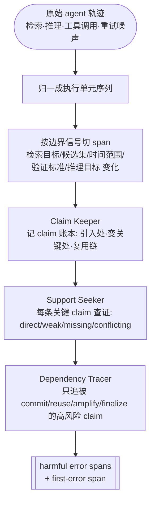

# Paper · 论文本身

## 一句话总结

深研 agent(Deep-Research Agent)的答案错了,只知道"错了"远远不够——这篇把一条**又长又乱的 agent 执行日志切成语义片段(span)**,造了第一个 **span 级"错在哪一步"的诊断基准 TELBench**,并提出一个**以"主张(claim)"为中心**的审计框架 **DRIFT**:先把 agent 一路上下的承诺记成账,再查每条承诺有没有证据撑,最后只把那些"被当真、被复用、并污染了最终答案"的片段判为有害错误。[^arxiv]

## 问题(Problem)

- 现在评一个深研 agent,主流做法是看**最终答案对不对 / 引用像不像 / 报告好不好**。这只能告诉你"成没成功",**告诉不了你"从哪一步开始不可靠"**。[^arxiv]
- 真实的 agent 错误**很少是最后一步突然冒出来的**。典型链条是:早期某个**没核实的判断**被后面一路当成既定前提反复使用,中间每一步看着都"有逻辑",最后答案错。
- 所以作者主张:一条深研轨迹应当被当成一份**"记录在案的决策过程"**——里面有 claim 怎么产生、被什么证据支持、在哪里被复用。只看终点,等于放弃了中间所有可诊断的信息。[^arxiv]

> [!key] 立场
> 这篇的价值是**把 agent 失败分析从"结果对错"推进到"过程可靠性"**(span 级 / claim 级 / 依赖级),并配套了**基准 + 方法 + 可复现代码**。它不是又一个"agent 会幻觉"的泛泛讨论,而是把问题钉到了**可度量、可比较**的粒度。

## 关键术语(Key terms)

| 术语 | 大白话解释 |
| --- | --- |
| **semantic span(语义片段)** | 把原始日志(满是工具重试、调度、包装)按"一个局部目标"切成块:规划、检索、验证、比较、收尾各算一段。比"一条条事件"粗,但刚好能定位错误传到了哪。[^seg] |
| **first-error span(首错片段)** | 轨迹里**最早**那个被标注为错误的片段。调试 agent 最想知道的就是它——从哪步起后面全被污染了。[^arxiv] |
| **claim(主张)** | agent 做出的、和决策相关的"承诺":选定某个实体、接受某个约束、认为检索已经够了、算出某个结果、或判定"答不出来"。[^ledger] |
| **consequential claim(关键主张)** | 不是随口试,而是被**当成既定前提**往下用的 claim。这是 DRIFT 判错的关键开关(见下方补丁说明)。 |
| **support 四档** | 一条 claim 的证据强度:**direct**(轨迹里有决定性支持)/ **weak**(有点相关但链条不全)/ **missing**(没证据)/ **conflicting**(证据与之矛盾)。[^arxiv] |

## 核心方法(Core method)

DRIFT 的主张是:**别直接判某个片段"错没错";先追 agent 一路立了哪些 claim,再查它们有没有证据,最后看没证据的 claim 有没有污染答案。** 三个模块串起来:

1. **Claim Keeper(记账)**:通读整条轨迹,维护一本 **claim 账本**——每条 claim 记下:在哪引入、**第一次变"关键(consequential)"是在哪一段**、后面哪些片段复用了它、类型与状态。形式上一条 claim 记成 `ck = (ak, ik, bk, Uk, τk, σk)`,其中 `bk` 就是"它第一次变关键的片段"。[^ledger]
2. **Support Seeker(查证)**:对每条**关键** claim,查它在轨迹证据里属于 direct / weak / missing / conflicting 哪一档。**注意:这一步还不直接出错误片段**,只暴露"支持风险"。[^arxiv]
3. **Dependency Tracer(追责)**:结合账本与查证结果,判断哪些"高风险 claim"**真的**导致了有害错误。只有当一条没证据/被矛盾的关键 claim 被 **commit / reuse / amplify / finalize**(被当真、被复用、被放大、被写进最终答案)时,相关片段才被标为 harmful error span。[^arxiv]

> [!key] 补丁①:span 到底怎么切出来的(原文给了,别只说"转成 span")
> 流程是:先把各框架五花八门的日志**归一成统一的"执行单元"序列**;再以"**检索目标 / 候选集 / 时间范围 / 验证标准 / 推理目标**这五样之一发生变化"作为**边界信号**来切段;同一个局部目标下的 query 改写、重试、相邻取证都**留在同一段**内。异常样本另有 LLM 辅助标注 + 人工最终裁定边界。[^seg]

> [!warn] 补丁②:"关键主张"原文**没给形式化算法**
> 论文只给了**判据直觉**——"在 query 里试一个候选名只是探索;把那个候选当成既定前提才算关键(consequential)"——并把"何时从探索变关键"交给 Claim Keeper 模块判断,**没有给出可复刻的形式化判定规则**。[^ledger] 这是复现该方法时最大的不确定点,照实标出,不替它补全。

## 架构 / 流程(Architecture / pipeline)

## 创新点(Innovation points)

| 创新 | 新在哪 | 为什么重要 |
| --- | --- | --- |
| span 级 / 首错定位的诊断基准 | 不是"最终答案对错",而是"哪一段最早开始坏" | 直接对应真实调试需求:定位污染源,而非"哪都可能有错" |
| claim 中心的可解释审计 | 把"找错"拆成 记账→查证→追责 三步,而非黑箱分类 | 能解释**为什么**某段被判错,可审、可改 |
| 探索 vs 承诺的区分 | 只对"被当真的关键 claim"追责,弱支持本身不算错 | 大幅降低"正常试探被误判为错"的噪声 |
| 真实长轨迹数据 | TELBench 取自真实深研轨迹(长、噪、混合失败探索),非短 CoT 或人造小例 | 贴近生产场景,迁移性强 |

## 实验 / 证据(Experiments / evidence)

**数据集 TELBench**:对 **465 个任务**(GAIA-val + XBench + 下采样 BrowseComp-test)、用 **GPT-5 / Gemini-2.5-Pro / Claude-Sonnet-4.5** 三个底座 + **MiroFlow / OAgent** 两个框架,跑出 **2,790 条**真实长轨迹,经 **7 位专家、每人 >300 小时**(LLM 高召回提候选 → 专家审改裁决)精标,得到 **1,000 条**验证集(**600 easy / 400 hard**)。[^data]

**核心结果(Table 2,verified-1K overall F1):DRIFT 显著强于把整条轨迹丢给 LLM 直接找错(bare):**[^t2]

| 底座 | Bare F1 | DRIFT F1 | 提升 |
| --- | ---: | ---: | ---: |
| DeepSeek-V3.2 | 22.46 | 50.51 | +28.05 |
| GPT-5.4 | 33.93 | 52.48 | +18.55 |
| Claude-Sonnet-4.6 | 21.89 | 54.91 | +33.02 |
| Gemini-2.5-Pro | 31.01 | 48.41 | +17.40 |

四个对照审计方式:**Bare LLM / Codex / Claude Code / DRIFT**——DRIFT 在所有底座上 overall F1 最高,且通用 agent 包装(Codex / Claude Code)并不稳定,有时反而更差。[^t2]

**三个值得记住的发现:**
- **过程错 ≠ 最终失败**:97.3% 的失败轨迹至少含一个错误片段;但 **36.9% 的成功轨迹也含**——agent 会犯局部错再恢复,也会过程带病却蒙对。**⇒ 只看 final accuracy 评 agent 是不够的。**[^recover]
- **最危险的不是检索,是决策与收尾**:按阶段归一的错误率——retrieval 仅 **2.9%**(片段最多、出错率最低),decision-making **60.5%**,finalization **51.8%**。**⇒ 别只优化 retriever,要优化证据核验 / 约束检查 / 主张承诺 / 答案合成。**[^stage]
- **首错仍然很难**:DRIFT 抬高了 span 级 F1,但 **first-error accuracy 仍明显偏低**(hard split 尤甚);"判断轨迹已不可靠"和"精确指出最早错点"是两种不同能力。更大的模型也不单调更好——瓶颈不只在底座容量,而在缺少适配长噪轨迹的诊断结构。[^arxiv]

**复现资源(走了一趟仓库,不只看 README 自报)**:仓库 `NJU-LINK/DRIFT` 的 `src/drift_open/` 含 `{cli, client, data, eval, prompts, runner, span_storage}`,提供 `bare`/`drift` 两档对照 runner 与 `drift-eval`。**TELBench 是加密发布的**:需 `hf download NJU-LINK/TELBench` 拉取 `TELBench.jsonl.enc` + passphrase,再跑 `scripts/decrypt_telbench.sh` 解密——不是明文直链。[^repo]

> [!warn] 三处别被带偏
> 1. **DRIFT 只查"轨迹内部一致性"**:Support Seeker 查的是"claim 有没有被 agent **自己看到的**证据支持",**不是"claim 在真实世界是否为真"**——如果 agent 检索到的网页本身自信地错了,DRIFT 可能照样判它 supported。
> 2. **token 成本不低**:多阶段审计,Gemini-2.5-Pro + DRIFT 平均 **53,043 token/轨迹**,远高于 bare 的 **11,182**(其余底座 DRIFT 约 1.8–3.2 万,涨幅小些)。上线要算成本/延迟。[^t5]
> 3. **标注难规模化**:7 人 ×300+ 小时换来 1,000 条,质量高但**贵、难扩**。[^data]

## 限制与风险(Limitations and risks)

- **真值瓶颈**:外部世界正确性未被校验(见上①),高影响证据缺一个独立 verifier 重新取证。
- **首错定位仍低**:调试最需要的能力恰恰最弱,是公开难题。[^arxiv]
- **方法核心有未披露处**:"关键主张"无形式化判定(补丁②),复刻 Claim Keeper 时需自定规则,可能影响可比性。[^ledger]
- **成本/规模**:审计 token 翻数倍、标注重人工,生产化与持续扩集都有压力。

## 先读什么(What to read first)

1. **Abstract + Introduction** —— 为什么只看最终答案不够。[^arxiv]
2. **方法节(DRIFT 三模块)+ 流程图** —— 吃透 Claim Keeper / Support Seeker / Dependency Tracer。
3. **Table 2** —— DRIFT vs Bare / Codex / Claude Code 的提升。[^t2]
4. **Appendix F 案例(snooker 例子)** —— 最好懂的一段:agent 过早选错候选比赛 → 后续一路围绕错候选取证强化 → 最终失败。
5. **Appendix C 错误分类** —— constraint handling / search-retrieval / evidence grounding / entity mapping / information processing / process control。

## 后续演化 · 这方法后来怎样了

下列为 2026-06-05 经独立核实的前向脉络(谁优化/替换/扩展了本工作)。

- **TRACE: Trajectory-Aware Comprehensive Evaluation for Deep Research Agents**(arXiv:2602.21230)— 并行赛道:层级轨迹效用函数评估深研 agent(WWW 2026)_[置信度:高]_。
- **TRAIL: Trace Reasoning and Agentic Issue Localization**(arXiv:2505.08638)— 先行工作:148 条人工标注轨迹 + 错误分类体系 _[置信度:高]_。
- **AgentRx: Diagnosing AI Agent Failures from Execution Trajectories**(arXiv:2602.02475)— 并行工作:跨域(API/incident/web)失败步骤定位 _[置信度:高]_。
- **Why Your Deep Research Agent Fails? On Hallucination Evaluation**(arXiv:2601.22984)— 先行工作:全研究轨迹幻觉评估 + PING 分类 + DeepHalluBench _[置信度:中]_。

[^arxiv]: 论文 *Where Do Deep-Research Agents Go Wrong? Span-Level Error Localization in Agent Trajectories*,arXiv:2606.02060(v2,2026-06-02),NJU-LINK Lab。https://arxiv.org/abs/2606.02060
[^data]: 同上,数据集构建节(TELBench:2,790 → 1,000;465 任务 = GAIA-val + XBench + 下采样 BrowseComp-test;7 标注者 ×300+ 小时)。
[^seg]: 同上,轨迹分段节(归一执行单元 + 五类边界信号 + LLM 辅助/人工裁定)。
[^ledger]: 同上,Claim Keeper 节(claim 账本 `ck=(ak,ik,bk,Uk,τk,σk)`,`bk`=首次变关键的片段;探索 vs 既定前提的判据直觉,无形式化算法)。
[^t2]: 同上,Table 2(verified-1K,overall macro-F1,四底座 Bare vs DRIFT;对照 Bare/Codex/Claude Code/DRIFT)。
[^stage]: 同上,Figure 9 / Appendix C.1(按阶段归一的错误率:retrieval 2.9% / decision 60.5% / finalization 51.8%)。
[^recover]: 同上,Appendix C.1(97.3% 失败轨迹含错误片段;36.9% 成功轨迹也含)。
[^t5]: 同上,Table 5(平均 token/轨迹:Gemini 11,182→53,043;DeepSeek 5,649→17,812;GPT-5.4 5,988→17,653;Claude 14,307→22,643)。
[^repo]: 代码仓库 `NJU-LINK/DRIFT`,https://github.com/NJU-LINK/DRIFT(`src/drift_open/{cli,client,data,eval,prompts,runner,span_storage}`;TELBench 经 `hf download NJU-LINK/TELBench` + `scripts/decrypt_telbench.sh` 解密;runner `--setting bare|drift`,`drift-eval`)。
