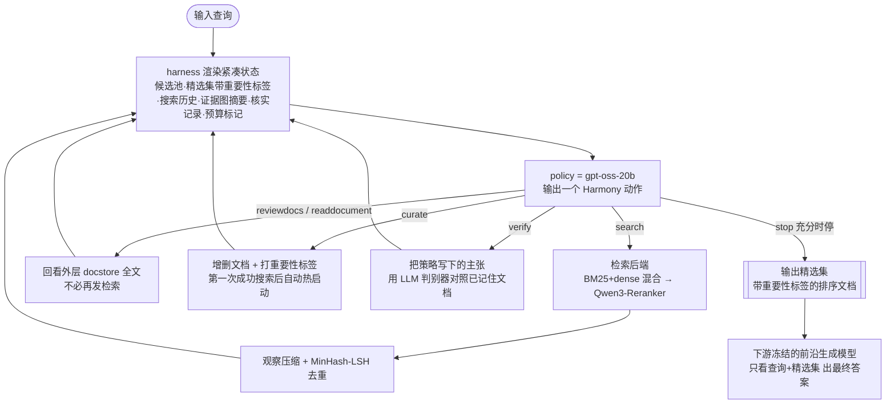

# Paper · 论文本身

## 一句话总结

训练一个搜索 agent 时,主流做法是让模型"边搜边记账"——既要决定下一步搜什么,又要在不断变长的对话里自己记住看过哪些文档、哪些证据有用、哪些约束还没满足、哪些主张已核实。这篇说:**把"记账"这种环境能更可靠维护的活儿从模型脑子里搬出去,交给一个外置的"工装(harness)"管;模型只留下真正需要语义判断的决定**(搜什么、留哪个、核什么、何时停)。在这套"外置状态 + 强化学习"的设计下,作者用一个 20B 小模型训出的检索 agent **Harness-1**,在八个检索基准上把"精选集召回(curated recall)"做到了开源同类里的最强,并在没训练过的迁移基准上反而涨得更多。[^arxiv]

## 问题(Problem)

- 现在的搜索 agent 通常被描述成"会调检索工具的语言模型":给个问题 → 发查询 → 读返回的证据 → 判断还缺什么 → 交出文档。但这只描述了**看得见的行为**,没说清那条**必须沿途搭起来的"搜索状态"**——看过哪些文档、哪些候选值得留、哪些约束还没覆盖、哪些实体把分散的证据连起来、哪些主张真的对着原文核过。[^arxiv]
- 这件事对**强化学习(RL)训练**尤其要命。让模型"同时学两件事"——语义搜索行为 + 例行状态管理——会让学习信号变差:难题的多次 rollout(一次完整的"问题→搜→读→交答案"的采样轨迹)可能拿到几乎一样的"空集奖励",无法区分好坏;工具一多就容易塌缩成"反复搜同一个"。当最终精选集为空或错了,奖励**根本说不清**到底是搜砸了、忘了证据、没核实、还是没选对。[^arxiv]
- 作者的立场:这两类活儿应当**分工**。"做语义决策"留给策略(policy,即被训练的那个模型);"维护可恢复的状态"交给环境侧的 harness。给策略一个**稳定的状态接口**去改进搜索行为,而不是逼它每一步都从一条只增不减的流水账里重新拼出"现在到底什么情况"。[^arxiv]

> [!key] 立场
> 这篇真正想立的概念叫 **stateful cognitive offloading(有状态的认知卸载)**:把"agent 该自己想 vs 该让环境替它记"的边界,当成**检索 agent 设计的一个核心变量**来研究,而不是当成实现细节。它不是又一个"我们也训了个搜索 agent"的工作,而是主张——**agent 性能的一大半,藏在你给它的那层接口(harness)里,不只藏在模型权重里**。[^related]

## 关键术语(Key terms)

| 术语 | 大白话解释 |
| --- | --- |
| **harness(工装/接口层)** | agent 和任务之间那层环境代码:它定义模型每步能做哪些动作、看到什么样的"观察",并在背后维护状态。论文实测:同一个模型换个 harness,表现能差出几十分——所以接口本身就是方法的一部分。[^related] |
| **policy(策略)** | 被强化学习训练的那个语言模型本身。它只负责"语义决策":搜什么、读/留哪个、核什么、何时停。[^arxiv] |
| **stateful cognitive offloading(有状态认知卸载)** | 把"记账类"工作从模型上下文里卸载到环境侧的持久状态上。模型像个只管做决定的指挥官,记录簿交给副官(harness)记。[^arxiv] |
| **curated set(精选集) & curated recall(精选召回)** | agent 最终主动挑出来、交给下游回答模型的那一小撮文档;精选召回 = 这撮里命中了多少真正相关的"金文档"。这是论文的主指标——衡量"选得准不准",不只是"搜得到没搜到"。[^metric] |
| **trajectory recall(轨迹召回)** | 整条 episode 里**任何地方碰到过**的相关文档占比。它是"发现能力"的上界诊断:轨迹召回高但精选召回低 = 看见了却没留住(选择问题,不是发现问题)。[^metric] |
| **evidence graph(证据图)** | harness 自动从文档里抽出实体/日期/年份,把跨文档的"桥接实体"连起来的轻量结构,提示策略下一步该顺着哪个线索追。注意:它是**正则(regex)抽取**的,不是完整实体链接系统。[^limit] |

## 核心方法(Core method)

DRIFT 式的一句话拆解:**别让模型在一条越滚越长的流水账里自己重建"现在什么情况";把状态外置成一个可编辑的接口,模型每一步的动作是"改这个状态",而不是"往流水账后面再加一段"。**

把 harness 想成一间**有副官记录簿的指挥所**:

1. **指挥官(policy)只下语义决定**:搜哪个、读/留哪个、核哪条主张、什么时候停。模型基于 `gpt-oss-20b`,每步输出**一个结构化的 Harmony 动作**(Harmony 是该模型家族的动作/消息格式)。[^method]
2. **副官(harness)替它管账**。每一步,harness 把一份**压缩后的当前状态**渲染给模型看,内容包括:候选池、精选集(带重要性标签)、搜索历史、证据图摘要、核实记录、上下文预算标记。模型的动作是**编辑这份状态**:`curate`(增删并给文档打重要性标签)、`verify`(把策略自己写下的主张拿去比对已记住的文档)、`reviewdocs`(重新渲染之前看过的文档,**不必再发一次检索调用**)。检索返回的观察在进入 prompt 前先被**压缩 + 去重**。[^method]
3. **两层记忆**:面向 prompt 的"内层"只放压缩摘要(省 token);"外层"docstore 存每个检索过 chunk 的全文与元数据,策略可用 `reviewdocs` 回看。这样 prompt 里装的是**可操作的搜索状态**,不是整条检索流水账。[^twotier]

> [!key] 补丁①:光把 harness 做"富"没用,关键是这三条让它"可训练"
> 作者明确指出——更丰富的 harness 不会自动变成适合 RL 的环境。会踩三个坑:每条 rollout 都从空精选集起步 → 早期奖励无法区分;派生状态太啰嗦 → 和真证据抢上下文;奖励只奖"发现" → 策略干脆不 curate/verify,塌缩成反复搜。所以三条**可训练性要求**:① **warm-started curation(热启动精选)**——第一次成功搜索后**自动种入一个初步精选集**,别让模型从零起步;② **compact derived-state rendering(紧凑派生状态渲染)**——靠重要性标签 + 证据图摘要 + 核实记录把状态压短;③ **diversity-preserving incentives(保多样性激励)**——用工具多样性奖励维持"搜→选→看→核"的节奏,别塌缩成单一动作。[^method]

> [!warn] 补丁②:reward 的具体权重/系数,PDF 数字层抽取不全
> 论文给了奖励的**结构**:终局奖励 = 搜索质量(轨迹覆盖 + 精选召回 + 答案证据)+ 工具多样性奖励 + 回合惩罚;**精选集为空就短路到一个下限**;并明确"召回权重是精度的 4 倍",且把"发现"和"选择"分开计(轨迹项奖在池子里找到的证据,精选项奖被选进最终输出的证据,**answer-miss 惩罚专门罚"找到了答案证据却没把它提升进精选集"**)。但各项**具体系数、turn cap、温度等超参的数值**在本次 PDF 文本层抽取中部分丢失,**以原文 Reward & Training Hyperparameters 附录为准**,此处不替它补数。[^reward]

## 架构 / 流程(Architecture / pipeline)

> [!key] 同一套渲染器贯穿三处
> teacher 监督数据生成、RL 的 replay rollout、最终评测,**用的是同一个状态渲染器和工具集**——这保证了"训练时见到的接口"和"上线时见到的接口"一致,是这套方法可复现的关键设计。[^method]

## 创新点(Innovation points)

| 创新 | 新在哪 | 为什么重要 |
| --- | --- | --- |
| 把 harness 设计当成 RL 的一等变量 | 不是"训个更强的策略",而是"先设计好状态接口,再让策略学着用它" | 同模型换 harness 差几十分 → 接口是性能的主因之一,值得单独优化 |
| 语义决策 vs 可恢复记账的显式分工 | 候选池/精选集/证据图/核实记录全交给环境侧维护,策略只下语义决定 | RL 信号不再被"重建状态"这件杂事污染,学习更稳、更省上下文 |
| 三条可训练性要求 | 热启动精选 + 紧凑派生状态 + 保多样性激励 | 直接回答"富 harness 为什么常常训不动",是可迁移的工程经验 |
| 小模型 + 迁移更强 | 20B 小模型,在**没训过的**基准上涨幅反而大于训练域 | 说明能力被搬进了"通用搜索状态上的操作",而非死记训练分布 |
| 全套开源 | 模型权重 + harness 代码 + 数据生成管线 + 训练 recipe 都将放出 | 复现门槛低,适合直接拿来改造成产品护栏 |

## 实验 / 证据(Experiments / evidence)

**训练配方(两段式)**:先 **SFT**——单个 teacher agent 在**完整 Harness-1 harness 内部**跑,只保留"格式合法 + 至少返回一个文档 + 最终精选召回达标"的轨迹,逐回合展开成监督样本,在 `gpt-oss-20b` 上用 **LoRA** 微调出冷启动 checkpoint;再 **RL**——从该 checkpoint 起,用 **on-policy CISPO**(一种策略梯度算法)+ 组内优势归一化,在训练查询上跑完整搜索 episode,**奖励相同的 rollout 组直接从梯度里丢掉**(否则没有学习信号)。训练用 Tinker 平台。[^method][^reward]

**评测基准(八个,分两类)**:
- **同源域(训练沾过)**:BrowseComp+(百科式多约束 web)、Web(合成)、Patents(USPTO office actions)、SEC Filings(金融文件)。
- **留出迁移域(完全没训过)**:LongSealQA、Seal0QA、FRAMES、HotpotQA(多跳/长上下文问答)。[^bench]
- 后端混用 Chroma 静态语料与实时 web(Serper + Jina);检索是 BM25+dense 混合后接 Qwen3-Reranker。[^bench]

**对照基线**:开源小模型 = Context-1、`gpt-oss-20b`、`gpt-oss-120B`、Tongyi DeepResearch、Search-R1、Qwen3-32B;前沿大模型 = Opus-4.6、Sonnet-4.6、Kimi-K2.5(对 Search-R1 / Tongyi 用各自发布的 harness,再用共享 reranker 标准化输出)。结果取三次运行平均。[^results]

**核心结果(Table:Search quality across benchmarks):**

| 指标 | 数值 | 出处 |
| --- | ---: | --- |
| Harness-1 八基准平均**精选召回** | **0.730** | 摘要 + Results 节,verbatim [^arxiv] |
| 比次强开源子 agent(Tongyi DeepResearch)高 | **+11.4** 分 | 摘要 + Results 节,verbatim [^results] |
| 相对前沿模型 | 平均精选召回**高于** Sonnet-4.6 / Kimi-K2.5 / gpt-oss-120B;**只有 Opus-4.6** 在平均上领先 | Results 节 [^results] |

**三个值得记住的发现:**
- **迁移涨得比训练域还多,这是机制最强的指纹**。一般机器学习预期"离训练数据越近涨得越多";这里相反——四个留出迁移基准(LongSealQA/Seal0QA/FRAMES/HotpotQA)上 Harness-1 相对最近开源基线的平均涨幅**大于**四个同源基准。作者解读:策略学到的是"在通用搜索状态上的操作"(精修热启动集、顺证据图读桥接实体、复查不确定候选、提升前先 verify、交出紧凑精选集),所以能跨域迁移。**⇒ 把行为先验搬进接口,小而专的训练就能迁移。**[^transfer]
- **差距主要在"选择"而非"发现"**。轨迹召回显示 Harness-1 通常**已经看到了**金文档;它和 Opus-4.6 在 BC+ 上的最终答案召回差距,主要是**没把看到的好文档提升进精选集**(selection gap),不是没搜到(discovery gap)。**⇒ 护栏要卡在"提升/承诺"那一步。**[^transfer]
- **拆掉 harness,训练好的策略会"退化成乱搜"**。推理时逐个关掉 harness 机制(不重训):七个机制里六个一关召回就掉,且行为一致——失败查询上"搜索动作占比上升、读文档/核实下降",策略退回**又宽又浅、永远聚不到相关文档**的搜法。单机制掉得最狠的四个:**重要性标签 / 句子级压缩 / 自动热启动 / 证据图**。把全部机制一起关,召回降幅大于任何单项。唯一例外:**内容去重(content dedup)关掉反而名义上略升召回**——因为它是**省 token 的机制不是提召回的机制**(BC+ 的金标里偶有近重复文档被 MinHash-LSH 合并掉),作者**如实报告而非藏起来**。[^ablation]

**下游答案质量(modular RAG)**:把各子 agent 的精选集喂给**冻结的前沿生成器**(Sonnet-4.6 / Opus-4.6 / Kimi-K2.5;并用 Closed-Book 与 Naive-RAG 锚定),生成器**只看查询 + 精选文档、看不到轨迹**——所以行间差异**只能归因于精选集质量**。结果:更好的精选集 → 更高答案准确率,Harness-1 的精选集在该模块化协议下压过其它开源子 agent。[^modular]

> [!warn] 三处别被带偏
> 1. **它只查"轨迹内一致",不查"现实世界为真"**:`verify` 用 LLM 判别器把主张对照 agent **自己检索到的**文档,如果检索到的网页本身自信地错了,仍可能被判 supported。生产里高影响主张需要独立 verifier 重新取证。[^limit]
> 2. **几个工程组件是"轻量近似"**:证据图是**正则**抽实体/日期(非实体链接),句子级 BM25 压缩在"相关性取决于篇章结构而非局部句子重叠"时可能误删有用上下文。[^limit]
> 3. **评测受基准规模/标注覆盖限制**:部分数据集置信区间不小,近重复或不全的 qrels 会影响召回类指标——作者明确说这些数字应理解为"特定基准 + harness 条件下的检索行为证据",不是真实世界可靠性的完整度量。[^limit]

## 限制与风险(Limitations and risks)

- **任务面窄**:为"证据寻找型检索"(needle-in-haystack / 多跳)设计;广度型调研、开放式报告生成、缺证据时的弃答、对抗性 web 环境**都不在本工作主范围**。[^limit]
- **真值瓶颈**:轨迹内一致 ≠ 真实为真(见上①),高影响证据缺独立重核。
- **工程近似的脆性**:正则证据图 / LLM 判别器 / 句子压缩在难、专、欠定的场景都可能出错。[^limit]
- **可训练性靠"喂奶"**:热启动精选 + 多样性奖励是把 harness 训得动的前提——换任务/换语料时这些机制的"调参"成本需要重新摊。
- **数字可复现性**:具体奖励系数与逐格 Table 数值以原文附录/表格为准(本次 PDF 文本层未能可靠抽取每格数字)。

## 先读什么(What to read first)

1. **Abstract + Introduction** —— "为什么把记账留在策略里是错的",以及 stateful cognitive offloading 的提法。[^arxiv]
2. **Harness 节 + State 表(Table 1)** —— 哪些状态由 harness 维护、哪些语义决策留给策略,是吃透全文的钥匙。[^method]
3. **Training: SFT and RL 节** —— teacher 窄监督 → CISPO RL,以及奖励如何分"发现 vs 选择"。[^reward]
4. **Results 节 + 迁移图** —— 0.730 / +11.4,以及"迁移涨得更多"这一机制指纹。[^results][^transfer]
5. **Component Ablation(含 Error Analysis 附录)** —— 关掉 harness 策略如何退化成乱搜;dedup 为何"反向有用"。[^ablation]
6. **Limitations, Ethics, and Broader Impact 附录** —— 任务面、轨迹内一致 vs 真值、工程近似的脆性。[^limit]

[^arxiv]: 论文 *Harness-1: Reinforcement Learning for Search Agents with State-Externalizing Harnesses*,arXiv:2606.02373(v1,2026-06-01),UIUC × Berkeley × Chroma(Pengcheng Jiang, Zhiyi Shi, Kelly Hong, Xueqiang Xu, Jiashuo Sun, Jimeng Sun, Hammad Bashir, Jiawei Han)。摘要 verbatim:"0.730 average curated recall ... outperforming the next strongest open search subagent by 11.4 points"。https://arxiv.org/abs/2606.02373
[^related]: 同上,Related Work / Tool orchestration vs stateful harnessing 节("the same model can vary by tens of points when placed in different harnesses";harness engineering 设计语言模型与任务之间的环境层)。
[^method]: 同上,Harness 节 + State 表 + "Policy actions as edits over working memory":基于 `gpt-oss-20b`,每步一个结构化 Harmony 动作;动作 `curate`/`verify`/`reviewdocs`;三条可训练性要求(warm-started curation / compact derived-state rendering / diversity-preserving incentives);同一渲染器用于 teacher / replay rollout / 评测。
[^reward]: 同上,Training: SFT and RL 节 + Reward & Training Hyperparameters 附录:teacher 单 agent 在 harness 内跑、保留达标轨迹逐回合展开;SFT 用 LoRA on `gpt-oss-20b`;RL = on-policy CISPO + 组内优势归一化 + terminal-only reward + 丢弃常数奖励组;奖励 = 搜索质量 + 答案证据 shaping + 工具多样性 + 回合惩罚,空精选集短路到下限,召回权重 4× 精度,answer-miss 罚"找到却没提升"。具体系数以附录表为准(PDF 数字层未能可靠抽取)。
[^metric]: 同上,Evaluation Recipe / Metric Definitions 节:Recall(在完整相关集上)/ Final-Answer Recall(仅在答案文档上)/ Trajectory Recall(整条 episode 碰到过的文档,发现上界诊断)。
[^twotier]: 同上,Two-Tier Memory and Working-Memory Rendering 附录:内层摘要进 prompt,外层 docstore 存每个检索 chunk 全文,经 `reviewdocs` 回看。
[^bench]: 同上,Experimental Setup / Benchmark Statistics 附录:八基准 = BrowseComp+ / Web(合成)/ Patents(USPTO)/ SEC Filings(同源)+ LongSealQA / Seal0QA / FRAMES / HotpotQA(留出迁移);后端 Chroma + Serper/Jina;检索 BM25+dense 混合 → Qwen3-Reranker。
[^results]: 同上,Results 节(Table:Search quality across benchmarks,三次运行平均):Harness-1 八基准平均精选召回 0.730,较次强开源子 agent Tongyi DeepResearch +11.4;平均高于 Sonnet-4.6 / Kimi-K2.5 / gpt-oss-120B,仅 Opus-4.6 平均领先。逐格数值以原文 Table 为准。
[^transfer]: 同上,Transfer pattern(Figure)+ Results 讨论:留出迁移四基准平均涨幅大于同源四基准;BC+ 上与 Opus-4.6 的最终答案召回差距主要是 selection gap 而非 discovery gap(轨迹召回相近)。逐项分数以原文图为准。
[^ablation]: 同上,Inference-Time Component Ablation(Table,BrowseComp+,同一训练 checkpoint,不重训)+ Component Ablation: Error Analysis 附录:七机制关六个掉召回,失败查询上"search 占比升、readdocument/verify 降";四大单项降幅 = 重要性标签 / 句子压缩 / 自动热启动 / 证据图;content dedup 关掉名义略升召回(它是省 token 机制,MinHash-LSH 偶合并近重复金文档),作者如实报告;全关降幅大于任何单项。
[^modular]: 同上,Modular RAG: Curated Sets Yield Higher Answer Accuracy 节 + Harness as Confound 节:精选集喂冻结前沿生成器(Sonnet-4.6 / Opus-4.6 / Kimi-K2.5;Closed-Book、Naive-RAG 锚定),生成器只见查询+精选集,行间差异归因于精选集质量;更好精选集 → 更高答案准确率。
[^limit]: 同上,Limitations, Ethics, and Broader Impact 附录:任务面限于证据寻找型检索(广度调研/报告生成/弃答/对抗 web 在外);证据图为正则抽取;verify 用 LLM 判别器可能出错;句子级 BM25 压缩可能误删篇章相关上下文;评测受基准规模/标注覆盖限制;系统不应被单独当作真值来源。
