# Paper · 论文本身

## 一句话总结

大家通常把 **PEFT(参数高效微调,尤其 LoRA)** 当成"全参数微调的省钱替代品"。这篇 Mind Lab 的**立场/纲领论文**换了个野心更大的框架:把一个小小的 LoRA 适配器看成**长在共享大模型之上的"持久个人状态"**——基座模型供给通用智能,适配器(不到 1% 的权重)承载某个人/某个 agent 的偏好、技能、工具习惯、记忆式更新。作者用**生物学类比**串起来:就像所有人共享 99.9% 的基因组、靠不到 0.1% 的差异撑起全部个体多样性,一个共享基座也能托起**几百万个持久的"个人模型"**。论文把这条路拆成**三条互相依赖的扩展轴**(Scale Up / Scale Down / Scale Out),每条配一组自家系统的证据。它**不是单一新方法,而是一份把多项自有工作(万亿级 LoRA RL、秩研究、记忆容量、群体多样性投票、MinT 基础设施)缝成一个愿景的综述式纲领**。[^arxiv]

## 问题(Problem)

- 前沿模型已经能写生产级代码、用工具、长上下文推理,但**"能干"不等于"是你的"**:一个强助手能回答更多问题、调更多工具,却**不一定能跨时间和某个人保持连续性**。[^intro]
- 长上下文、检索(RAG)、提示词、用户画像都能帮一点,但**都不够**:它们要么是临时的(提示),要么是外部的、每轮都要重新解读(检索)。一个真正的"个人模型"需要**能持久、能适应、能塑造未来行为的状态**。[^intro]
- 作者的主张:**PEFT/LoRA 是表示这种"局部个人状态"的实用载体**——适配器不存"整个人",也不替代检索(原始事实、文档仍放外部记忆),但它能承载"反复交互后沉淀下来的行为后果"(偏好、习惯、技能、工具用法),且**小到可以被命名、评测、服务、回滚、退役**,像一个有生命周期的工件。[^intro]
- 真正的工程问题是:这件事**能不能规模化**?于是拆成三条轴,而且**三轴是依赖链,不是并列分类**:Scale Up 没 Scale Down → 强先验贵到没法持续适配;Scale Down 没 Scale Up → 便宜但没杠杆的适配器;Scale Out 没有前两者 → 一堆弱的、用完即弃的变体,而非持久个人模型。[^axes]

> [!key] 立场
> 这篇**该当"框架与方向"读,不该当"严格实证"读**。它最大的贡献是**把"PEFT = 个人持久状态的可扩展单元"这个 reframe 讲透了**,并给出一条从"一个通用助手"到"千万个持久个人模型"的工程路线图。但要清醒:**每条轴的"证据"多是作者自家系统(Kimi K2、GLM5、MinT)的结果摘要或单点实验**,作者自己在多处反复标注"one seed per cell""一个社区、一个推荐器""不是普适定理""这个对照同时变了模型大小和训练方法、没干净隔离变量"。所以看它**学的是那套 reframe 和三轴依赖结构 + 一批可迁移的工程判断,而不是把任何单个数字当定论**。它对你的真正价值在 Career 栏会展开:这几乎就是 Kevin "外置大脑 / 陪伴 agent / 持久关系记忆"方向的学术化纲领。

## 关键术语(Key terms)

| 术语 | 大白话解释 |
| --- | --- |
| **PEFT / LoRA** | 参数高效微调 / 低秩适配:冻住大模型,只训一小撮(<1%)低秩矩阵来"调味"。本文把它从"省钱技巧"升格成"个人状态的载体"。[^arxiv] |
| **持久个人模型(persistent personal model)** | 共享基座 + 一个承载某人/某 agent 局部状态的 LoRA 适配器 + 上下文 + 工具 + 外部记忆,组成的、能跨交互保持连续性的实例。[^intro] |
| **三条扩展轴** | **Scale Up**=把共享先验做更强(让小更新更有杠杆);**Scale Down**=把可训练状态做更小更稳(降反复学习的边际成本);**Scale Out**=让大量持久适配器共存(从个体到群体)。三者是依赖链。[^axes] |
| **RL is prior-limited(RL 受先验限制)** | 强化学习只能强化"当前策略本就采样得到"的轨迹;基座越强,有用但不稳的行为越够得着,RL 才有东西可强化。[^scaleup] |
| **TIM(训练-推理失配)** | 大模型 RL 里,采样用推理引擎、训练用另一套后端;在 MoE 上,微小数值差会**改变专家路由**,导致"训练优化的根本不是当初采样的那条计算路径"。[^tim] |
| **LoRA-as-memory & 容量律** | 把适配器当有界记忆基质:能存多少,取决于"记忆 token 数 / 可训练参数"这个比值,超过某阈值就崩。[^memory] |
| **多样性投票(diversity voting)** | 同一基座训出许多只差数据顺序/掩码的 LoRA 变体,各出一个答案、多数投票——不同变体学到互补策略,聚合后准确率随模型数 k 上升。[^voting] |
| **MinT** | Mind Lab 的基础设施,把适配器当"策略记录 + 可寻址版本",管理它的身份、修订、训练溯源、评测、服务驻留(冷/温/热三档)。[^mint] |

## 核心方法(Core method)

这不是"一个算法",而是**三条轴各自的工程主张**。打个比方:**一座城市里千万个居民共享同一套基础设施(水电路),但各有各的房子和生活史。**

- **Scale Up——把"共享地基"打更强(让小改造更值钱)**:核心论断是 **RL 受先验限制**——强化学习只能强化模型本就采样得到的行为,基座越强,"有用但不稳"的推理/工具行为越够得着,小小的 LoRA 更新就能撬动巨大的行为变化。工程上他们做了**万亿级 LoRA RL**:在 Kimi K2(1.04T 总参 / 32.6B 激活的 MoE 推理模型)上,只训 dense + expert 层上的 LoRA、用 GRPO 在线优化、混合并行,把算力/通信压到全参数 RL 的约 10%。但一上规模就冒出**新的失败模式**(下面单列)。[^scaleup][^kimi]
- **Scale Down——把"个人状态"做到多小还能稳**:答案是"一个区间,不是一个阈值"。在 Qwen3-8B 上做了 **216 次 PPO 跑**(9 个 LoRA 秩 × 4 个 batch × 6 个种子,500 步)。结论:**秩 16–32 是部署默认区**(均值收益最高、下行风险低);**秩 1–4 是研究前沿区**——它们的**最好那一次种子已经追平秩 16/32,但跨种子均值塌、种子间方差大**,所以低秩"不是容量不够,而是优化不够(under-optimized, not under-capacity)";**秩 >64 是成本警告区**(只涨参数/显存不涨上限)。低秩之所以不稳,关键在初始化:他们提出 **OLoRA-tail** 作为"RL 原生初始化"——因为现成的 SVD 类初始化(PiSSA / MiLoRA)在 SFT 里好用,搬到 RLVR 反而会训练塌。[^scaledown][^init]
- **Scale Out——许多持久适配器共存能解锁什么**:三件事——① **LoRA 当记忆**有容量律(下面数字);② **Context Learning** 作为"写记忆"的策略(决定哪些上下文期的改进该被固化进适配器参数,本质是反复的 context distillation);③ **群体多样性 = 计算资源**:同一基座训许多只差数据顺序/掩码的 LoRA,多数投票聚合,准确率随模型数 k **以 ln(k) 近线性上升**。[^scaleout][^voting]

> [!key] 补丁:别把"万亿级 LoRA RL 省 10% 算力"误读成"LoRA 总是赢全参数训练"
> 作者自己澄清两点:① 那个"大基座 + 小 LoRA 胜过小模型全参 RL"的对照(Table 2)**同时变了模型大小和训练方法**,没干净隔离"先验强度"这一个变量,所以它**不是 LoRA 普遍优于全参数训练的排名**,只说明"预算固定时,先验强度可能比可训练面大小更重要"。② LoRA 与全参微调在遗忘行为、表示移动、更新几何上**并不等价**(LoRA 遗忘更少,但表示移动也不同),别简单当替代品。[^lora]

## 架构 / 流程(Architecture / pipeline)

```mermaid
flowchart TD
  BASE[(共享基座<br/>1T+ 参数, 强先验)] --> UP[Scale Up<br/>把先验做更强<br/>万亿级 LoRA RL, ~10% 算力]
  UP --> DOWN[Scale Down<br/>把适配器做更小更稳<br/>秩16-32默认 / 秩1-4前沿 / RL原生初始化]
  DOWN --> OUT[Scale Out<br/>许多持久适配器共存<br/>记忆容量律 + 多样性投票]
  OUT --> POP[(千万个持久个人模型<br/>各承载偏好/技能/记忆)]
  MINT[MinT 基础设施<br/>策略记录 + 适配器修订 + 冷/温/热驻留] -.托管.-> POP
  UP -.无 Down 则贵到没法持续适配.-> FAIL1[失败:强但养不起]
  DOWN -.无 Up 则便宜但没杠杆.-> FAIL2[失败:小但没用]
  OUT -.无前两者则一堆弃用变体.-> FAIL3[失败:多而弱]
```

## 创新点(Innovation points)

| 创新 | 新在哪 | 为什么重要 |
| --- | --- | --- |
| reframe:PEFT = 持久个人状态 | 把 LoRA 从"省钱微调"升格成"个体性的可扩展单元" | 给"千万个个人模型"提供了统一的组织框架 |
| 三轴依赖链 | Scale Up / Down / Out 不是并列分类,而是相互依赖、各有失败模式 | 把模糊的"个性化"拆成可分别攻关、又必须协同的工程问题 |
| 万亿级 LoRA RL 的可行性证明 | 在 1.04T MoE 上用 LoRA + GRPO 跑通在线 RL,~10% 算力 | 证明"强先验可被 PEFT 反复适配",而非只能当静态检查点 |
| 秩的"三区"经验律 | 低秩是"优化不够"而非"容量不够";秩 16–32 是默认区 | 指导适配器选型:别盲目堆秩,该投在初始化/方差控制上 |
| 群体多样性投票律 | 同基座 LoRA 变体投票,准确率 ≈ 0.386 + 0.0172·ln(k) | 把"模型数量"变成可测的扩展变量,廉价多样性即收益 |

## 实验 / 证据(Experiments / evidence)

> **自报 vs 实测(整节适用,且本篇尤其要警惕)**:本篇是**纲领论文**,下列数字多为**作者自家系统的结果摘要或单点实验**,均属**论文自报**;作者自己在多处标注"one seed per cell""一个社区/一个推荐器""不是普适定理"。本站未做任何独立复现。HF upvotes 为抓取当时快照,会变。**把这些当"方向性证据",别当定论。**

**Scale Up · 大先验 + 小 LoRA(Table 2,headroom-归一化收益)** [^t2]

| 模型 + 适配方式 | 可训练参数 | AIME25 归一化收益 | GPQA-D 归一化收益 |
| --- | ---: | ---: | ---: |
| DS-Distill-Qwen-1.5B,全参 RL | 1.5B | 8.33% | 25.00% |
| DS-Distill-Qwen-7B,LoRA r=64 | 0.16B | 11.31% | 27.23% |
| DS-Distill-Qwen-32B,LoRA r=8 | 0.07B | 20.61% | 33.02% |

- 大基座 + 小 LoRA(可训练参数反而更少)拿到更大的归一化收益——但**这个对照同时变了规模与方法,未干净隔离变量**(作者自陈),只支持"预算固定时先验强度可能更要紧"。[^t2]
- **Kimi K2**:1.04T 总 / 32.6B 激活 MoE,LoRA(dense+expert)+ GRPO,算力/通信 ≈ 全参 RL 的 **10%**;训练曲线平滑、奖励/成功率稳升。[^kimi]

**Scale Up 的代价 · 规模诱发的失败模式**
- **TIM(训练-推理失配)**:MoE 上微小数值差会改变专家路由 → 训练优化的不是采样时那条计算路径。**Router Replay R3**(录下 rollout 时的路由、训练时回放)把 PPO KL 散度压到 **step 46 时 0.000026**(其它跑法显著上升),并稳住梯度范数与下游准确率。[^tim]
- **GLM5 / GLM5.1 支持**:MoE + MLA + DSA(稀疏注意力)+ MTP + LoRA + 服务内核 + 检查点桥接,每个零件本地对、全系统却可能"训练-推理-桥接对模型的解释不一致"——**基础设施在前沿规模上变成了模型定义的一部分**,桥接是"语义保持"而非"文件格式转换"。[^glm5]

**Scale Down · Qwen3-8B 秩扫描** [^scaledown]
- **216 次 PPO 跑**(9 秩 × 4 batch × 6 种子,500 步,可验证奖励的数学语料)。三区:秩 **16–32 部署默认**;秩 **1–4 研究前沿**(最好种子追平 16/32,但均值塌、种子方差大 → "优化不够非容量不够");秩 **>64 成本警告**(footprint 涨、上限不涨)。

**Scale Out · 三组数字**
- **LoRA 记忆容量律**(DishNameBenchmark,Qwen3 系,**263 次跑**):当"记忆 token / 可训练参数"低于约 **10⁻³** 时准确率≈1,在 10⁻³–10⁻² 区间退化,超过约 **10⁻²** 崩到 0——即 LoRA 记忆有可测的容量上限。只训 MLP 上的 LoRA 最省参数。[^memory]
- **技能记忆(ALFWorld)**:从 Qwen3-235B 起,一个 rank-32 LoRA(Skill-0/MinT 配方)把验证均分从 **0.646 提到 0.845**。[^alfworld]
- **多样性投票(AIME24,Qwen3-30B,200 个评测源,每 k 取 30 次随机子集)**:协作(不同 LoRA 变体投票)准确率 **0.3644(k=1)→ 0.4267(k=10)→ 0.4633(k=100)→ 0.4867(k=198)**,相对基线 0.3727 最大 **+0.1140**;而"重复"(同一模型多次采样投票)在 k=24 就饱和到 0.4378。拟合 **acc ≈ 0.386 + 0.0172·ln(k)(R²≈0.888)**——随 k 以对数律递增。说明多样性来自不同 LoRA 轨迹的**互补策略**,不只是采样噪声。[^voting]

> [!warn] 四处别被带偏
> 1. **这是纲领,不是单一可复现工作**。它把多项自有系统缝成愿景;别期望"按论文跑就能复现",很多结果是系统级摘要。
> 2. **证据多为单点 / 单种子**。记忆容量、社会模拟、投票律作者都明说"一个受控设定,不是普适定理"——方向可信,数值别钉死。
> 3. **"个人模型 = 适配器"被作者自己反复设界**:PEFT **不存整个人、不替代检索、不单独解决记忆**;原始事实/文档仍在外部记忆,适配器只承载"行为后果"。
> 4. **强烈的产品/方向叙事**。最后落点是"不是一个万能助手,而是千万个持久个人助手"——这是愿景陈述,工程上仍是"方向而非已解决问题"(作者原话)。

## 限制与风险(Limitations and risks)

- **证据强度弱(作者自陈)**:多处 one-seed / 单社区 / 单推荐器;关键对照(Table 2)未隔离变量。这也是评分里 evaluation / evidence 都偏低的原因。
- **大量依赖自家闭源系统**:Kimi K2、GLM5、MinT 的细节与复现性外部无法核验;"~10% 算力""容量律"等都建立在其内部测量上。
- **可复现性**:万亿级 LoRA RL 远超个人/小团队算力;对你而言**可迁移的是框架与判断,而非实验本身**。
- **概念边界易被夸大**:"千万个人模型""个性即策略"等表述很有感染力,但作者自己反复降温——务必区分"愿景"与"已验证"。

## 先读什么(What to read first)

1. **Abstract + §1 Introduction + Figure 1(生物学类比)** —— reframe 的全貌与"共享 99.9% 基因 / <0.1% 差异"的类比。[^intro]
2. **§2 三条扩展轴 + Table 1** —— 三轴为何是依赖链、各自的失败模式。[^axes]
3. **§3.1–3.2(RL is prior-limited + LoRA as budgeted access)** —— 为什么强先验让小更新更有杠杆。[^scaleup]
4. **§3.4 Scale-Induced Failure Modes(TIM / R3 / GLM5)** —— 一上规模冒出的新失败面(本篇最扎实的工程部分)。[^tim]
5. **§4.1 秩扫描三区 + §4.1.2 RL 原生初始化** —— "低秩是优化不够非容量不够"。[^scaledown]
6. **§5.3 多样性投票(Figure 24)+ §6 MinT** —— 群体作为计算资源 + 托管它的基础设施。[^voting]

## 技术细节(选读)

> **MinT 把"适配器文件"升成"策略实例"(Table 8)**
> 大白话:一个个人模型不是一个 .bin 文件,而是一个能恢复、能审计、能回滚的身份。精确机制:**策略记录**(基座版本、LoRA 秩、目标模块、检查点、rollout 记录、导出修订)/ **策略会话**(训练器上的临时恢复:适配器张量 + 优化器矩 + 调度位 + 梯度)/ **适配器修订**(固定的、服务张量布局的导出件)/ **服务驻留**(冷=存储、温=CPU 缓存、热=GPU batch 槽)。把"匿名 LoRA 文件"变成"可恢复、可评分、可服务、可治理的策略人格"。[^mint]

> **Context Learning = 反复的 context distillation(LoRA 写记忆的策略)**
> 大白话:决定"哪些上下文期的改进该被固化进参数"。精确机制:它不是独立的 Scale Out 算法,而是 §5.1 里 LoRA-as-memory 的**写策略**——没有写策略时容量是硬上限,有了它,反复交互能选择性地把"行为上有用的状态"填进有限容量。[^scaleout]

## 后续演化 · 这方法后来怎样了

本篇是纲领,周围是它**自身引用、arXiv ID 可验证**的工作脉络(非"后来谁优化了它"):

- **LoRA**(arXiv:2106.09685)— 一切的地基,冻基座 + 低秩可训练矩阵 _[置信度:高]_。
- **PiSSA / MiLoRA** — SVD 类 LoRA 初始化,本文实测在 RLVR 下会训练塌,据此提出 OLoRA-tail _[置信度:高]_。[^init]
- **DeepSeek-R1 / Open-Reasoner-Zero** — "RL 释放潜在能力但受先验限制"的证据来源 _[置信度:高]_。[^scaleup]
- **MemGPT / 生成式 agent(Park 2023)** — 外部记忆 / 用户模拟的对照线,本文主张 LoRA 承载"行为后果"、原始事实仍走外部记忆 _[置信度:高]_。[^memory]

[^arxiv]: 论文 *On the Scaling of PEFT: Towards Million Personal Models of Trillion Parameters*,arXiv:2606.02437v2(2026-06-02;Mind Lab〔机构署名,contact@mindlab.ltd〕;HF upvotes 222)。这是一篇综述式立场/纲领论文,缝合多项自有工作。全文经 arXiv PDF 用 pdftotext 抽取(arXiv HTML / ar5iv 当时未渲染);headline 数字照写,图内 2D 表值以原文图表为准。https://arxiv.org/abs/2606.02437
[^intro]: 同上,§1 Introduction:能干≠是你的;长上下文/检索/提示/画像都不够;个人模型需持久可适应状态;PEFT 承载"行为后果",不存整个人、不替代检索。
[^axes]: 同上,§2 + Table 1:三轴是依赖链;Scale Up/Down/Out 各自的失败模式(强但养不起 / 便宜但没杠杆 / 多而弱)。
[^scaleup]: 同上,§3.1 "Why RL is Prior-Limited" + §3.2 "LoRA as Budgeted Access":RL 只能强化当前策略采样得到的轨迹;LoRA 把"强先验"以固定预算带进学习回路;引 DeepSeek-R1、Open-Reasoner-Zero。
[^lora]: 同上,§3.2 + Table 2 下方"A note on interpretation":对照同时变规模与方法、未隔离变量,非 LoRA 普遍胜全参;引 Biderman 2024(LoRA 遗忘更少)、Shuttleworth 2025(表示移动不等价)。
[^t2]: 同上,Table 2(motivating Mind Lab 万亿级 LoRA RL 研究的摘要值):1.5B 全参 RL(AIME25 +8.33% / GPQA-D +25.00%);7B LoRA r=64,0.16B(+11.31% / +27.23%);32B LoRA r=8,0.07B(+20.61% / +33.02%)。均为 headroom-归一化收益。
[^kimi]: 同上,§3.3 "Operationalizing Trillion-Scale LoRA RL":Kimi K2,1.04T 总 / 32.6B 激活 MoE,LoRA(dense+expert)+ GRPO + 混合并行;算力/通信 ≈ 全参 RL 的 10%;Fig.2 训练曲线平滑。
[^tim]: 同上,§3.4 + Fig.4/5:TIM(训练-推理失配),MoE 路由发散使训练对象偏移;Router Replay R3 录路由 + 回放,PPO KL 在 step 46 为 0.000026,稳住梯度与下游准确率。
[^glm5]: 同上,§3.4 "GLM5 and GLM5.1 support":MoE+MLA+DSA+MTP+LoRA+服务内核+检查点桥接的全栈语义对齐问题;基础设施在前沿规模成为模型定义的一部分。
[^scaledown]: 同上,§4.1.1 + Fig.8–11:Qwen3-8B PPO 秩扫描,216 跑(9 秩×4 batch×6 种子,500 步);秩 16–32 默认 / 秩 1–4 前沿("优化不够非容量不够",最好种子追平但均值塌)/ 秩 >64 成本警告。
[^init]: 同上,§4.1.2 + Fig.12:PiSSA(主奇异方向)/ MiLoRA(次奇异方向)在 RLVR 下可能不如标准 LoRA 且训练塌(本文复现);据此提出 OLoRA-tail 作 RL 原生初始化。
[^memory]: 同上,§5.1 + Fig.21:DishNameBenchmark,Qwen3 系,263 跑;"记忆 token / 可训练参数"<~10⁻³ 时准确率≈1,10⁻³–10⁻² 退化,>~10⁻² 崩到 0;MLP-only LoRA 最省参数。
[^alfworld]: 同上,Fig.22:Qwen3-235B + rank-32 LoRA(Skill-0/MinT 配方),ALFWorld 验证均分 0.646→0.845。
[^scaleout]: 同上,§5 + §5.1 "Context Learning" 注:Context Learning 是 LoRA-as-memory 的写策略(反复 context distillation),非独立 Scale Out 算法。
[^voting]: 同上,§5.3 + Fig.24:AIME24,Qwen3-30B,200 评测源、每 k 取 30 随机子集;协作 0.3644(k=1)→0.4267(k=10)→0.4633(k=100)→0.4867(k=198),基线 0.3727,最大 +0.1140;重复在 k=24 饱和 0.4378;拟合 acc≈0.386+0.0172·ln(k),R²≈0.888。
[^mint]: 同上,§6 + Table 8 + Fig.25:MinT 分离策略记录 / 策略会话 / 适配器修订 / 服务驻留(冷-温-热);把适配器从匿名文件升为可恢复可审计的策略实例。
