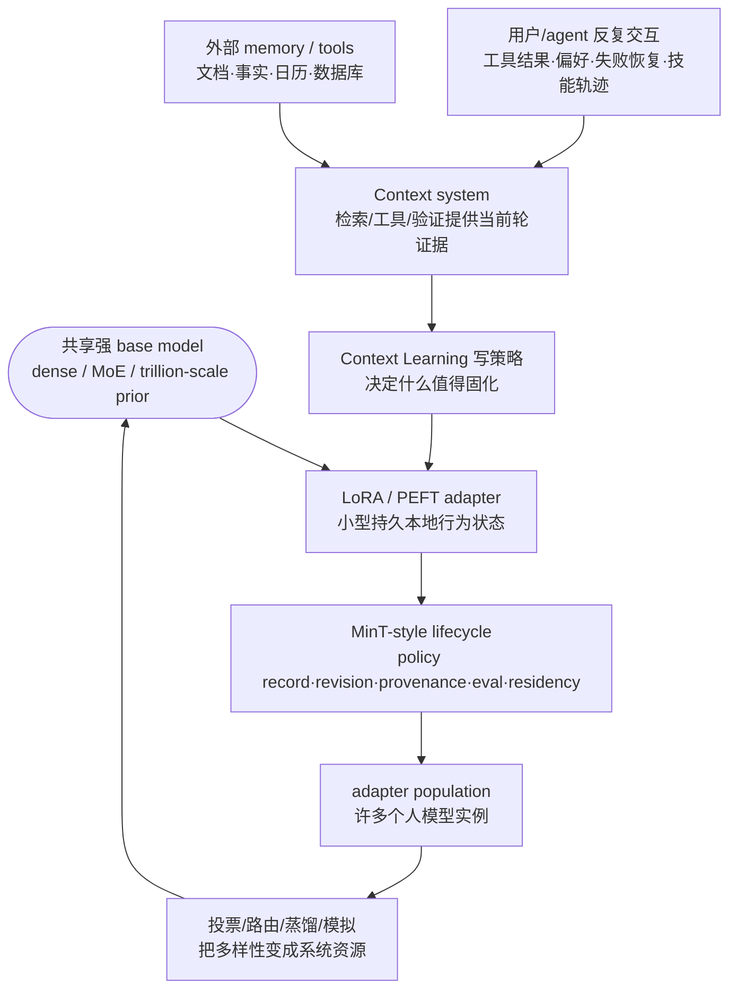

# Paper · 论文本身

## 一句话总结

这篇不是一篇“又省了多少显存”的 PEFT 论文，而是一份很有野心的系统纲领：把 **PEFT(Parameter-Efficient Fine-Tuning，冻结大模型主体、只训练很小的适配器)** 尤其是 **LoRA(低秩适配器，用两个小矩阵给原权重加一个低秩补丁)** 重解释为“长在共享强基座上的持久个人状态”——少数 trillion-scale base model 提供通用能力，百万级轻量 adapter 承载某个用户/agent 的偏好、技能、工具习惯和记忆式更新。作者把这条路拆成三根互相依赖的轴：**Scale Up** 让共享先验足够强，**Scale Down** 让局部状态足够小且稳定，**Scale Out** 让大量持久 adapter 可以共存、服务、评测、回滚和聚合。[^arxiv]

> [!warn] 先定性
> 它的价值在“架构蓝图 + 工程判断 + 一组自有实验证据”，不是一个外部可直接复现的单一 benchmark paper。代码仓库未披露；Kimi K2 / GLM5 / MinT 等关键证据来自作者体系内实验。能学的是模式，不能把每个 headline 数字当成已独立验证的通用定律。

## 问题(Problem)

- 现在 PEFT 常被当成“比 full fine-tuning 便宜”的工具：少训参数、少存 checkpoint、少占显存。但如果未来每个人、每个 agent、每条长期工作流都要有自己的“持续学习状态”，光说省钱不够。真正的问题是：**一个共享大模型能不能支撑很多个持久、可训练、可治理的个人模型实例**。[^intro]
- 只靠 prompt / long context / RAG(检索增强生成，把外部资料塞进上下文)也不够。它们能提供当前轮信息，但很难把反复交互沉淀成稳定行为：下次还知道你偏好什么、常用什么工具、在哪些流程里该保守、哪些技能已经学会。
- 但让每个用户拥有一个 full checkpoint 也不现实。论文反复强调：标题里的“million personal models of trillion parameters”**不是每人训练一份 trillion 参数模型**，而是少数强 base model + 百万级小 adapter。[^conclusion]

> [!key] 立场
> PEFT 在这里是“局部可写状态”的载体，不是完整记忆系统。原始事实、文档、日历、数据库仍应留在外部 memory / tools；adapter 更适合存“反复经验造成的行为后果”：偏好、技能、工具习惯、策略和部分记忆式更新。

## 关键术语(Key terms)

| 术语 | 大白话解释 |
| --- | --- |
| **PEFT** | Parameter-Efficient Fine-Tuning。大模型主体冻结，只训练少量新增参数。好处是每个任务/用户只需要存一小块更新，而不是复制整模型。 |
| **LoRA** | Low-Rank Adaptation。把权重更新写成两个小矩阵相乘 `ΔW = (α/r)BA`，参数量远小于原矩阵。直觉上是“只允许模型沿少数方向改动”。 |
| **adapter / local adaptive state** | 每个用户或任务独有的小参数块。论文把它看成“本地适应状态”：它不是知识库，而是能改变模型行为的持久补丁。 |
| **Scale Up** | 共享 base model 越强，小 adapter 越有杠杆。因为 RL 只能强化当前 policy 有概率采样到的行为，弱 base 根本采不到高质量轨迹。 |
| **Scale Down** | 让 adapter 更小、更稳、更少调参。不是盲目降 rank，而是找到“低秩仍能稳定学习”的操作区间。 |
| **Scale Out** | 让很多 adapter 共存。重点不是同时把百万 adapter 放进 GPU，而是能命名、加载、缓存、评测、回滚、投票和治理这些 adapter。 |
| **MinT** | 作者引用的 managed infrastructure 例子：把 adapter 当成 policy record / revision 管，负责身份、版本、provenance、训练、评测、服务驻留。[^mint] |
| **LoRA-as-memory** | 把 adapter 当成有容量上限的参数化记忆。它适合存行为状态，不适合把所有事实都塞进去。 |
| **Context Learning** | 一种“写策略”：当前轮用上下文/工具/检索得到更好反馈，再把重复有用的改进蒸馏进 adapter，让未来 query-only 行为变好。[^context] |

## 核心方法(Core method)

论文的主线可以压成一句话：**强共享先验 + 小而稳定的本地状态 + 可治理的 adapter population**。

1. **Scale Up：把强 base 带进训练循环。** 作者认为 RL 是 prior-limited：RL 不是凭空造能力，而是在当前 policy 能采样到的轨迹里挑好行为强化。更强 base model 让有用但不稳定的 reasoning/tool-use 轨迹更容易出现；LoRA 则让这种强 base 可以在固定预算下被反复适配。[^scaleup]
2. **Scale Down：把 adapter 压到可靠操作区间。** Qwen3-8B PPO sweep 显示 rank 16/32 是当前实用默认；rank 1-4 不是完全没能力，而是 best seed 能接近中秩、mean 和 seed reliability 不稳。作者因此转向 RL-native initialization、rank/alpha/lr 联动规则和 stateful adapter。[^rank]
3. **Scale Out：把 adapter 数量变成系统变量。** 个人模型先要学会“什么该进 adapter、什么留外部 memory”；然后可以作为用户模拟器；再进一步，多样 adapter 可以通过 majority vote / routing / distillation 变成集体性能资源。[^scaleout]
4. **MinT：给三轴补系统层。** 如果 adapter 不能命名、版本化、移动、缓存、预热、回滚，Scale Up/Down/Out 都会卡在工程边界。MinT 把 base deployment、policy record、policy session、adapter revision、serving residency 分开管理。[^mint]

## 架构 / 流程(Architecture / pipeline)

## 创新点(Innovation points)

| 创新 | 新在什么地方 | 为什么重要 |
| --- | --- | --- |
| PEFT 从“省钱微调”变成“个人状态载体” | adapter 被定义为持久 local state，而不是一次性 task patch | 对长期 agent / personal AI 更关键：状态要可延续、可回滚、可服务 |
| 三轴框架 Scale Up / Down / Out | 三者是依赖链，不是 taxonomy：强先验 → 稳小更新 → 大量实例 | 解释为什么只堆 base、只降 rank、只存很多 adapter 都不够 |
| RL-native low-rank 视角 | 低 rank 问题不只是容量，还包括 seed reliability、KL、初始化方向、rank/alpha/lr 联动 | 对真实 RL adapter 训练比“rank 越大越好”更有操作价值 |
| LoRA-as-memory 容量律 | 用 DishNameBenchmark 测“memory tokens / trainable parameter”上限 | 防止把 adapter 当无限记忆库；迫使系统做 memory layering |
| adapter population 作为计算资源 | 多个 LoRA 变体 majority vote 比单模型重复采样继续涨 | 把“模型数量”变成可测 scale-out 变量，而不是部署负担 |
| MinT 生命周期层 | policy record / revision / residency 分离 | 没有身份、版本和驻留控制，百万 adapter 只是硬盘上的文件名 |

## 实验 / 证据(Experiments / evidence)

**1. Scale Up：大先验 + 小 LoRA 在固定预算下更有杠杆。** 论文的 motivating table 比较了 full RL 小模型和 LoRA 大模型，注意作者也承认这里同时变化了 model size 和 training method，不能隔离因果。[^prior]

| Model and adaptation | Trainable parameters | AIME 2025 normalized gain | GPQA Diamond normalized gain |
| --- | ---: | ---: | ---: |
| DS-Distill-Qwen-1.5B, full RL | 1.5B | 8.33% | 25.00% |
| DS-Distill-Qwen-7B, LoRA r=64 | 0.16B | 11.31% | 27.23% |
| DS-Distill-Qwen-32B, LoRA r=8 | 0.07B | 20.61% | 33.02% |

**2. trillion-scale LoRA RL 可运行，但证据边界要收窄。** Kimi K2 case 在 **1.04T total parameters / 32.6B activated parameters** 的 MoE 上做 LoRA RL，使用 GRPO-style on-policy loop、dense + expert 层 LoRA、tensor/pipeline/expert/sequence parallelism。作者称 compute/communication footprint 约为 conventional full-parameter RL 的 **10%**，训练曲线平滑、held-out eval 有 task-specific 改进且保留 general capability。这里没有公开仓库与逐点表值，属于作者自报系统实验；曲线数值以原文图为准。[^kimi]

**3. 大 MoE 的失败模式不是“小 bug”，而是 policy 语义断裂。** 训练-推理不一致(TIM)在 MoE 上会改变 expert routing，导致训练时优化的 computation path 和 rollout 采样的 path 不同。Router Replay R3 通过记录 rollout routing 并在训练中 replay 来降低 mismatch。原文给的一个明确数字是：R3 run 在 step 46 的 PPO KL divergence 为 **0.000026**，同时图中显示 probability mismatch、critic score、validation accuracy 都优于 original / rollout-corrected baseline；其余曲线逐点值以原文图为准。[^r3]

**4. Scale Down：rank sweep 把 LoRA 分成三个操作区间。** Qwen3-8B PPO sweep 覆盖 **216 runs = 9 ranks × 4 batch sizes × 6 seeds**，每个配置固定 **500-step PPO**，用 mixed mathematics corpus + verifiable rewards。结论不是单调“rank 越大越好”：

- **rank 16/32**：当前实用默认，mean gain、downside risk、token efficiency 平衡最好。
- **rank 1-4**：best-seed 可以接近 rank 16/32，但 across-seed mean 下降、seed spread 变大；作者解读为“稳定性问题大于硬容量问题”。
- **rank 64/128/256**：footprint、optimizer state、checkpoint size 增大，但 best-run frontier 没明显抬高，是 cost-warning 区间。[^rank]

**5. OLoRA-tail：低秩 RL 初始化要“有几何，但别太猛”。** 标准 SVD-based 初始化从 SFT 搬到 RL 会出问题。作者提出 OLoRA-tail：用 pretrained weight 的 minor singular vectors 初始化 `B0 = U_-r, A0 = V_-r^T`，但去掉 MiLoRA 的 singular-value scaling。对比中，OLoRA 在 DeepSeek-R1-Distill-Qwen-1.5B + DAPO 上约 step 100 collapse，reward 掉到 **-1.0**、KL 爆到 **~8**；OLoRA-tail 在 **500 steps** 内稳定。随后同样在 DAPO-Math-17k、constant LR **1×10^-5**、effective batch size **32**、LoRA/OLoRA-tail 都为 **r=16, α=32** 的设置下，OLoRA-tail 六个数学推理 benchmark 平均 **58.3%**，LoRA **56.3%**。[^olora]

**6. rank / alpha / learning rate 不能分开记。** LoRA 早期有效扰动量近似和 `η * α_r^2 / r` 成正比。作者在 AG News + DistilBERT 上扫 rank **2-256**，比较 constant `α=32`、fixed `α/r=1`、sqrt rule `α/√r=8`；又在 Qwen3-4B MATH 上做更难的 transfer。结论：fixed `α/r` 会随 rank 增大把好 learning-rate 区域往下推；constant α 在简单任务上较平；`α ∝ √r` 在 harder reasoning setting 更稳。[^triquetra]

**7. δ-Mem：stateful adapter 比“静态补丁”更像个人记忆接口。** 在 Qwen3-4B-Instruct 上，最佳 δ-Mem variant 把平均分从 base **46.79** 提到 **51.66**；MemoryAgentBench Avg 从 **29.54** 到 **38.85**；HotpotQA EM/F1 从 **42.35/56.00** 到 **49.41/63.66**。TSW/SSW 只引入 **4.87M trainable parameters(约 0.12%)**，MSW 引入 **19.47M(约 0.48%)**。注意这是作者文中表格结果，不是外部复现。[^deltamem]

| Method | Avg. | HotpotQA EM/F1 | MemoryAgentBench Avg. | LoCoMo Avg. |
| --- | ---: | ---: | ---: | ---: |
| Qwen3-4B-Instruct | 46.79 | 42.35 / 56.00 | 29.54 | 40.79 |
| Context2LoRA | 44.90 | 37.85 / 50.88 | 32.53 | 48.11 |
| δ-Mem SSW | 51.44 | 49.22 / 63.43 | 37.84 | 47.05 |
| δ-Mem TSW | **51.66** | **49.41 / 63.66** | 36.48 | 46.53 |
| δ-Mem MSW | 50.74 | 46.86 / 60.47 | **38.85** | **49.12** |

**8. LoRA-as-memory 有容量上限，不是无限仓库。** DishNameBenchmark 共 **263 runs**。容量效率低于约 **10^-3 memory tokens / trainable parameter** 时 accuracy 接近 1；在 **10^-3 到 10^-2** 之间进入 transition；超过约 **10^-2** 后 collapse toward zero。模块选择上，原文结论是 **MLP > Attention ≈ All >> Unembed**，即把 memory 写进 MLP LoRA 最 parameter-efficient。[^memorylaw]

**9. LoRA 可以存“技能式行为状态”。** Qwen3-235B shared base + **rank-32 LoRA**，用 Skill-0/MinT ALFWorld recipe 训练后，ALFWorld validation average 从 **0.646** 提到 **0.845**。作者也明确说：这不是证明 LoRA 应该存任意事实，而是支持它可以存 reusable skill-like behavioral state。[^alfworld]

**10. per-user LoRA 改变社交模拟结构。** OASIS 实验取 c8 game-development community，`N ∈ {128,256,512}`；LoRA 条件下每个用户一个 **rank-4 LoRA**，用 **80 historical tweets** 训练；control 是共享 Qwen3-4B-Instruct base。prompt-level cross-side exposure 始终约 **0.16-0.18**，所以 feed 暴露差异不是主解释。[^oasis]

| 指标 | N=128 | N=256 | N=512 | 128→512 |
| --- | ---: | ---: | ---: | ---: |
| Final polarization distance | +0.388 | +0.335 | +0.319 | -- |
| Effective interaction communities | 9.21 | 11.77 | 14.85 | +61% |
| Co-engagement modularity | 0.502 | 0.561 | 0.716 | +43% |
| Within-community side-homophily | 0.670 | 0.644 | 0.583 | -13% |

与 shared-base 比，LoRA 条件下 effective communities 为 **1.48× / 2.19× / 1.47×**，supportive stance std 为 **2.28× / 2.18× / 2.45×**，skeptical stance std 为 **2.01× / 1.32× / 1.57×**，comments 增加 **+70 / +247 / +493**，original posts 增加 **+139 / +153 / +306**。作者也限制了解读：一个 community、一个 recommender、每格一个 seed。[^oasis]

**11. adapter diversity 可以被 majority vote 聚合。** 同一 Qwen3-30B base、同一 RL recipe、Math17k training task、AIME24 eval；训练许多只因 data permutation / masking 不同的 LoRA 变体。对 **200 collaboration evaluation sources** 做 majority vote，每个 k 随机子集采样 **30 random samples**。Collaboration accuracy 从 **0.3644(k=1)** 到 **0.4267(k=10)**、**0.4633(k=100)**、最佳 **0.4867(k=198)**；final baseline **0.3727**，最大 gain 约 **+0.1140**。Repetition(同一模型重复采样)最佳 **0.4378(k=24)**；大 k 时 Collaboration advantage 约 **+0.0533**。拟合式为 `accuracy ≈ 0.386 + 0.0172 ln(k)`，`R² ≈ 0.888`。[^vote]

**12. MinT 的系统数字说明“百万 adapter”是 addressability，不是 GPU 同时驻留。**[^mint]

| 证据 | 数字 | 该怎么读 |
| --- | ---: | --- |
| adapter-only handoff(Qwen3-4B) | rank-32 LoRA **252 MiB** vs merged full **8.061 GB** | 移动 adapter，而不是整模型 |
| adapter-only handoff(Qwen3-30B) | rank-16 LoRA **1.692 GB** vs full **61.084 GB** | 大模型上差距更关键 |
| addressable catalog | built/audited **10^6-entry** packed adapter catalog | 目录可寻址，不代表同时上 GPU |
| CPU cache | **369** loaded adapters at 512 hotset；**550** at 2048 weak-locality pressure | locality 用 CPU cache 吸收 |
| GPU batch slots | tested same-batch window **64 distinct adapters** | active diversity 最小窗口 |
| cold loading | **16** cache misses form **1.375-23.267 s** load staircase | 冷启动必须被调度 |
| packed MoE LoRA | **37,248 → 672** tensor objects；live loading **8.5-8.7×** faster | 不是字节数，而是 tensor fanout 卡冷加载 |
| two-phase readiness | old warm TTFT p95 **9.63 s**、stalls>20s **0**；ready request load p95 **0.00 s**；prewarm **409.04 s** | 把冷启动转成可控预热 |

## 限制与风险(Limitations and risks)

- **代码仓库未披露**：HF paper page 没有 linked model / dataset / space，arXiv 也未给 official GitHub；我只核了 arXiv source/PDF/HF metadata，没有可 clone 的论文代码仓库。[^hf]
- **这是一篇纲领/position+synthesis paper**：很多结果是不同自有项目的拼接证据，不是一个单一、可端到端复现实验。
- **关键证据闭源或自报**：Kimi K2、GLM5、MinT、OASIS/ALFWorld/majority vote 细节都缺独立复现；“10% compute”“stable curves”等要按作者报告读。
- **多个变量未隔离**：prior comparison 同时改变模型大小和训练方式；Scale Out majority vote 的 diversity 来自 LoRA 训练轨迹，但是否泛化到别的任务/基座未知。
- **图多表少**：rank sweep、TIM、R3、memory law 等许多关键证据以曲线呈现，正文没有逐点表；逐点数值以原文图为准。
- **personal state 有治理风险**：一旦 adapter 存的是工具习惯/策略/权限边界，错误学习或 prompt injection 被固化会比一次性上下文错误更难清理。论文更多讲生命周期，安全治理还远未闭环。

## 先读什么(What to read first)

1. **Introduction + Conclusion**：先把“不是每人一个 trillion checkpoint，而是共享 base + 轻量 adapter population”读清楚。
2. **Table 1 / three scaling axes**：理解 Scale Up / Down / Out 为什么是依赖链。
3. **Scale Up 的 prior table + Kimi K2 / R3 段落**：看强先验为什么有杠杆，以及大 MoE PEFT 怎么失败。
4. **Scale Down 的 rank sweep / OLoRA-tail / Triquetra**：这部分最有工程含量，能直接迁移到 LoRA RL 调参。
5. **Scale Out 的 memory law / OASIS / majority vote**：看 adapter 从“一个用户的状态”变成“群体计算资源”。
6. **Infrastructure / MinT 表格**：如果你做生产系统，这部分比 headline 更重要。

[^arxiv]: 论文 *On the Scaling of PEFT: Towards Million Personal Models of Trillion Parameters*, arXiv:2606.02437v2, submitted 2026-06-01, revised 2026-06-02, Mind Lab. 本文已读取 arXiv TeX source、PDF 和 HF metadata；`hf papers read 2606.02437` 返回 not found，但 `hf papers info` 可用。https://arxiv.org/abs/2606.02437
[^hf]: Hugging Face paper page, published 2026-06-01, #1 Paper of the day, upvotes 222, linked_models 0, linked_datasets 0, linked_spaces 0；community comment 给了非仓库 PDF 链接。https://huggingface.co/papers/2606.02437
[^intro]: arXiv source `sections/01-introduction.tex`：论文将 PEFT/LoRA 定义为 persistent personal model instance 的 local adaptive state，并说明 prompt/context/RAG/user profiles 不足以保持长期连续性。
[^conclusion]: arXiv source `sections/07-conclusion.tex`：作者明确说标题不应读作每个用户拥有并训练单独 trillion-parameter checkpoint，而是少数强 base + millions lightweight adapters。
[^scaleup]: arXiv source `sections/03-scale-up.tex`，Why RL is Prior-Limited / LoRA as Budgeted Access to Strong Priors。
[^prior]: arXiv source `tables/scale_up/prior_comparison.tex`；正文也注明该比较同时变化 model size 和 training method，不能 cleanly isolate prior strength。
[^kimi]: arXiv source `sections/03-scale-up.tex`，Operationalizing Trillion-Scale LoRA RL；明确数字为 1.04T total parameters、32.6B activated parameters、约 10% full-parameter RL footprint。
[^r3]: arXiv source `sections/03-scale-up.tex`，Scale-Induced Failure Modes；`train_stable_ppo_kl` caption 给出 R3 step 46 KL = 0.000026。
[^rank]: arXiv source `sections/04-scale-down.tex`，Rank Reduction Under Minimal Parameters；216 runs、9 ranks、4 batch sizes、6 seeds、500-step PPO。
[^olora]: arXiv source `sections/04-scale-down.tex`，RL-Native Initialization for Stability；OLoRA-tail formula、collapse 数字、DAPO-Math-17k 设置与 58.3% vs 56.3%。
[^triquetra]: arXiv source `sections/04-scale-down.tex`，Reusable Hyperparameters for Lower Training Effort；早期扰动 proxy `η α_r^2 / r`，AG News / Qwen3-4B MATH transfer。
[^deltamem]: arXiv source `tables/scale_down/delta-mem_baseline.tex` 与 `sections/04-scale-down.tex`，Beyond LoRA / δ-Mem。
[^memorylaw]: arXiv source `sections/05-scale-out.tex`，LoRA as memory: capacity scaling law；DishNameBenchmark 263 runs，capacity efficiency `10^-3` 到 `10^-2`。
[^alfworld]: arXiv source `sections/05-scale-out.tex`，LoRA skill memory on ALFWorld；Qwen3-235B rank-32 LoRA，0.646 → 0.845。
[^context]: arXiv source `sections/05-scale-out.tex`，Context Learning as write policy；Context Distillation pseudo-code in listing。
[^oasis]: arXiv source `sections/05-scale-out.tex`，User Simulators and Agent Environments；OASIS c8 community, rank-4 adapters, 80 historical tweets。
[^vote]: arXiv source `sections/05-scale-out.tex`，Diversity as a Source of Collective Intelligence；Qwen3-30B, Math17k, AIME24, majority vote, log fit。
[^mint]: arXiv source `sections/06-infrastructure.tex` and `tables/infrastructure/*.tex`；MinT policy identity, handoff, serving bounds, readiness, packed loader。
