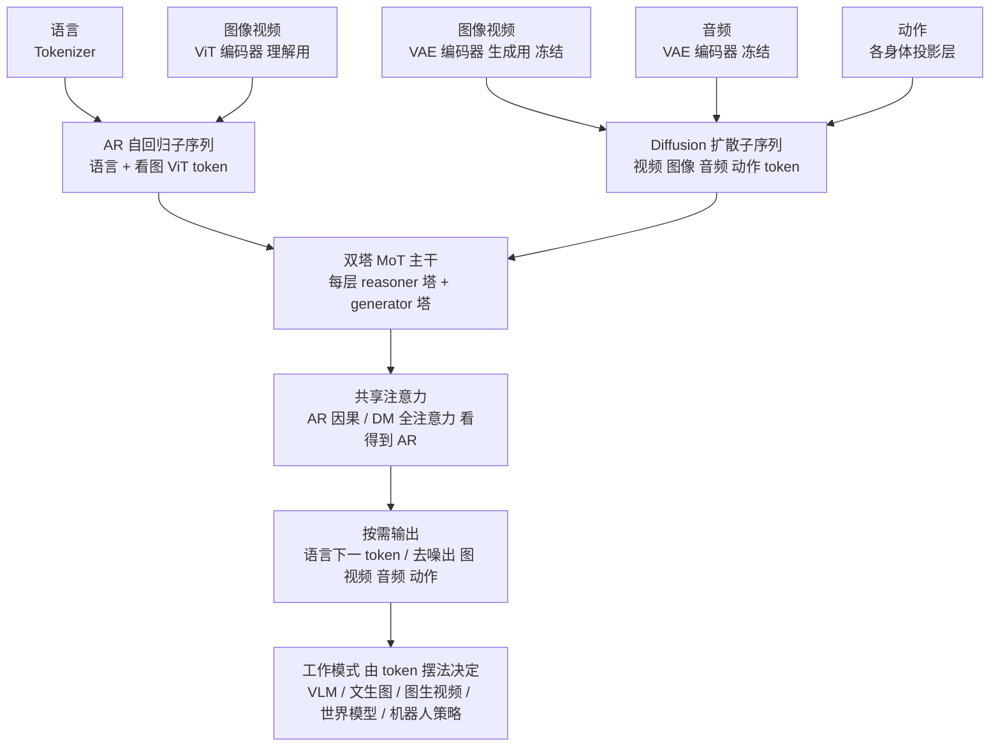

# Paper · 论文本身

## 一句话总结

机器人、自动驾驶这类"在真实物理世界里干活"的 AI(论文叫 **Physical AI**),过去要把一堆专用模型拼起来用:一个看懂场景的、一个生成视频预测未来的、一个输出动作的。这篇把语言、图像、视频、音频、**动作(action)**五种模态塞进**同一个网络**——既能"理解"(像 VLM 一样回答问题)又能"生成"(出图、出视频、出声音、出机器人动作),用一套**双塔混合 Transformer(Mixture-of-Transformers)+ 前面自回归后面扩散**的结构把过去分家的"感知 / 模拟 / 执行"统一进一个底座;并把代码、权重、合成数据、评测基准**全部按开源许可放出**。[^arxiv][^hf]

## 问题(Problem)

- 让一个机器人"晚饭后收拾餐桌",当前范式得拼一条断裂的流水线:用 **VLM(视觉语言模型)** 找到餐具并出计划,用 **VLA / WAM(视觉-语言-动作 / 世界-动作模型)** 生成动作序列,再用一个**前向动力学模型 / 世界模型**模拟和评估未来会发生什么。模型各管一段,接口不通、算力浪费。[^arxiv]
- 作者的判断是:这种"理解归理解、生成归生成"的分家**本质上是受限的**——理解本来就需要对"世界接下来怎么演化、动作会带来什么后果"做推理;而生成又依赖一个对世界和行为的紧凑、结构化表示。两者其实是同一枚硬币的两面。[^arxiv]
- 所以问题落到一句话:**能不能用一个统一模型,原生覆盖 Physical AI agent 需要的全部能力**(看懂、模拟未来、输出动作),而不是缝合一堆专用模型?

> [!key] 立场
> 这篇是一份 **NVIDIA 的大规模技术报告(technical report)**,不是一个精巧的小算法。它的价值在于**"统一"这件事被真做出来并刷到了 SOTA**:一个底座同时是 VLM、文生图器、视频生成器、世界模拟器、机器人策略——而且不靠改架构,只靠换输入输出配置切换"工作模式"。对应用者而言,看点是**广度 + 把"实时全模态世界模型"这类基建开源**,不是某个理论突破。

## 关键术语(Key terms)

| 术语 | 大白话解释 |
| --- | --- |
| **Physical AI(物理 AI)** | 要在真实物理世界里感知、推理、动手的 AI——机器人、自动驾驶车、仓储装置这些"有身体"的 agent。区别于只在屏幕里聊天的 AI。[^arxiv] |
| **omnimodal world model(全模态世界模型)** | 一个能同时吃进 / 吐出语言、图像、视频、音频、动作五种模态,并能"想象世界接下来怎么变"的模型。"世界模型"= 它脑子里装着一套对物理世界如何演化的内部模拟器。[^arxiv] |
| **action token(动作 token)** | 把"机械臂关节怎么转、车怎么打方向、手指怎么抓"这些异构控制信号,统一编码成模型能读写的一种 token。它是这篇把"物理控制"接进语言/视频推理的关键桥。[^action] |
| **Mixture-of-Transformers(MoT,混合 Transformer)** | 每一层 Transformer 里放**两套独立参数(双塔)**:一套管"推理"(reasoner),一套管"生成"(generator);两塔参数不共享,但在每层通过一次**共享注意力**互相看。好处:理解和生成各用各的"肌肉",又不彻底分家。[^mot] |
| **AR + diffusion(自回归 + 扩散)** | 序列前半段(语言、看图的 token)用**自回归**逐个往外蹦字(像 GPT);后半段(要生成的图/视频/音频/动作)用**扩散**反复"去噪"出来(像画图模型)。一个序列里前后两种生成方式并存。[^token] |
| **forward / inverse dynamics(前向 / 逆向动力学)** | 前向 = 给当前画面 + 动作,预测未来画面("做这个动作会发生什么");逆向 = 给一段画面变化,反推"是什么动作造成的"。policy(策略)= 二者一起,既出动作又出它预期的画面。[^action] |

## 核心方法(Core method)

打个比方:Cosmos 3 像一台**多功能照相暗房 + 木工坊合体**的工作台。同一张工作台,你换不同的"工件摆法",它就变成不同的机器——这套"摆法"就是它的统一 token 格式。

1. **模态各有专用编码器(encoder),先翻译成同一种"内部语言"**。看懂图用一个 **ViT** 编码器;要生成图/视频用 **VAE** 编码器(借自 Wan2.2,生成时冻结不训);音频用音频 VAE(48kHz、每秒 25 个 token);动作则按"自我位姿 + 末端执行器位姿 + 抓取状态"编成紧凑向量,不同身体(单臂/双臂/人形/车/相机)用各自的投影层、共享同一个主干。[^action]
2. **统一 token 摆法 = 前面自回归段 + 后面扩散段**。语言和"看图"的 token 放前面走自回归;要生成的图/视频/音频/动作 token 放后面走扩散去噪。**只要换这个序列怎么拼,就切换工作模式**:只放语言=当 VLM;后面放噪声图=文生图;放一帧干净图+噪声视频=图生视频;放动作+视频=策略/世界模型。[^token]
3. **双塔 MoT 主干处理整条序列**。每层两套参数:reasoner 塔处理前段、generator 塔处理后段,两塔都从一个预训练好的 VLM 初始化(继承语言和视觉理解能力)。前段自回归 token 之间用因果注意力(只能往前看);后段扩散 token 用双向全注意力,并能回头看前段的文字条件——但**前段永远不会被后段更新**,保住因果性。[^mot]
4. **统一时间轴的位置编码(absolute temporal modulation)**。视频、音频、动作的采样率不一样(24FPS 视频 vs 60FPS 视频 vs 不同动作频率),硬按 token 序号编位置会错位。它把位置坐标按**真实物理时间**而非 token 数量来分配,让"同样 1 秒"在不同模态里占一样的位置范围。[^token]

> [!key] 补丁①:为什么"统一"能成立,而不是又一个缝合
> 关键是**生成模式只靠"换 token 摆法"实现,不改架构**(原文反复强调 *without architectural modifications*)。文生图、图生视频、视频转换、前向/逆向动力学、策略——全是同一序列格式的不同填法(原文给了 ST2I / ST2V / SV2V / STransfer 等公式)。所以一个底座 post-train 一下就能变专用模型,这是它"统一"主张的工程支点。[^token]

> [!warn] 补丁②:训练分"reasoner 数据"和"generator 数据"两条线,别当成一锅炖
> 理解能力(reasoner)靠**配对的视觉-语言数据**(约 24.2M 样本:22.0M 预训练 + 2.2M 微调)训;生成能力(generator)靠**大规模图/视频/音频/动作语料**用重建目标训,且**预训练时 reasoner 塔冻结、只更新生成参数**,以保住语言理解不退化。两条线共享主干但数据与目标不同——这是复现时最容易忽略的点。[^data][^gentrain]

## 架构 / 流程(Architecture / pipeline)

## 创新点(Innovation points)

| 创新 | 新在哪 | 为什么重要 |
| --- | --- | --- |
| 单底座统一五模态 + 理解与生成 | 一个网络同时是 VLM / 文生图 / 视频生成 / 世界模拟 / 机器人策略,切模式只换 token 摆法不改架构 | 省掉缝合多专用模型的工程税;一个底座 post-train 即可专用化 |
| 把 action 当一等模态 | 异构身体(车/相机/单臂/双臂/人形/人手)统一编成动作 token,共享主干、分身体投影 | 让"语言推理 + 视频预测 + 物理控制"在同一序列里打通 |
| 双塔 MoT + AR/扩散混排 | 推理塔与生成塔参数独立,从 VLM 初始化,层内共享注意力;前段自回归后段扩散 | 理解不退化 + 高保真生成兼得,而非二选一 |
| 跨模态统一物理时间轴 | 按真实时间而非 token 序号分配位置坐标,对齐不同 FPS / 采样率 | 视频+音频+动作可在同一时间轴上同步生成 |
| 全栈开源 | 代码 + 权重(Nano/Super)+ 合成数据集 + 评测基准 一并放出(OpenMDW-1.1) | 应用者可直接拿来 post-train,不必从零造世界模型 |

## 实验 / 证据(Experiments / evidence)

**规模与算力(自报)**:三档变体——**Edge 4B**(基于 2B dense,本文暂不放,后续发)、**Nano 16B**(基于 dense 8B,采 Qwen3-VL-8B 架构)、**Super 64B**(基于 dense 32B,采 Qwen3-VL-32B 架构)。生成器预训练:Nano 训了 **31.05T token / 1024 张 GB200**,Super 训了 **17.86T token / 2048 张 GB200**。[^variants][^gentrain]

**理解(Reasoner,Table 10,48 个基准聚合成四类,分数越高越好):**[^t10]

| 类别 | Cosmos3-Super | 最强对照 |
| --- | ---: | ---: |
| General(综合) | 73.7 | Gemini 3.1 Pro **77.5**(闭源,领先) |
| Robotics(机器人) | 57.8 | Gemini 3.1 Pro 58.2(仅小幅领先) |
| Smart Infra.(智慧基建) | **62.6** | Gemini 3.1 Pro 58.6 |
| Driving(驾驶) | **79.3** | Gemini 3.1 Pro 47.2 |

⇒ 综合通识仍**落后闭源 Gemini 3.1 Pro**;但在机器人/智慧基建/驾驶这些**物理 AI 垂直域**反超开源与闭源对照(机器人仅对 Gemini 有微小差距)。[^t10]

**生成(Generator)——几条头部结果:**
- **文生图(Table 11)**:专用变体 **Cosmos3-Super-Text2Image** 在 UniGenBench 综合 **91.36**(全 1170 prompt),高于 Gemini 3 Pro Image 的 90.69;并在 **Artificial Analysis 文生图榜被评为开源权重第 1(全部含闭源第 4)**(榜单日期 2026-05-28)。[^t11]
- **视频生成(Table 12)**:**Cosmos3-Super** 在 PAIBench-G 文生视频 Overall **80.0**、图生视频 **82.8**,均超闭源 Veo-3.1(79.1 / 82.6),为开源第一;并被评为 **Artificial Analysis 图生视频榜开源权重第 1**。[^t12][^i2v]
- **物理一致性(Physics-IQ,Table 13)**:Cosmos3-Super 图生视频直出 43.8、加重排到 **48.9**(超闭源 Sora2 的 46.4);视频续写直出 59.7、加重排 **63.4**,均为 SOTA。[^t13]
- **机器人策略(RoboLab-120,Table 19)**:**Cosmos3-Nano-Policy-DROID** Overall(specific 提示)**39.7%**,显著高于 PT-init 基线 30.2% 与其它对照,并自报在仿真 RoboLab 与**真实世界 RoboArena 双双取得 SOTA**。[^t19][^policy]
- **音频-视频(Table 15)**:Cosmos3 在"声音是否对得上画面事件"的语义对齐分(SAV/SA/AVAlign)拿最佳,但**整体音视频质量 AVQ(Super 7.31)仍落后闭源 Seedance-1.5-Pro 7.64**,差在底层音频保真度(PQ)。[^t15]

> [!key] 一句话读懂强弱
> **垂直物理域(驾驶/智慧基建/机器人策略/物理一致性)它领先**;**通识理解和底层音频保真**还落后最强闭源。这正符合"统一世界模型适合 Physical AI、但单点能力未必都打过专精选手"的预期。

> [!warn] 三处别被带偏
> 1. **大量评测用 LLM/VLM 当裁判**(Gemini 3.1 Pro、Qwen2.5-VL-72B、Claude-Opus 改写 prompt 等),且**自家还往基准里加了 Physical-AI 子集**(如 UniGenBench-Phys 570 条)——主场优势与裁判偏置都要打折看;论文也承认公开 PAIBench-G 图生视频榜的结果"不可复现"才改用自家裁判。[^t11][^t12]
> 2. **"best by Artificial Analysis / RoboArena"是"撰写报告时(at the time)"的快照**,众包榜会变,不是恒定第一;且文生图上榜还配了一个 **agentic 改写 harness**,不是裸模型。[^arxiv][^t11]
> 3. **巨型 + 重算力**:Super 64B、训练吃 2048 张 GB200;策略推理也要 2 张 RTX Pro 6000。"实时全模态"的门槛对小团队很高。[^variants][^policy]

## 限制与风险(Limitations and risks)

- **没有独立的"局限"小节**:这是一份技术报告,对自身短板的系统性自陈较弱;弱点要从对照表里反读(通识落后 Gemini 3.1 Pro、音频保真落后 Seedance/Veo)。[^t10][^t15]
- **评测自定/裁判依赖**:多处用自家新基准 + LLM 裁判,可比性需谨慎;真实世界机器人结果(RoboArena)样本与可复现细节,**官方未在正文充分披露**,属 `[需人工确认]`。[^t12][^policy]
- **成本与门槛极高**:训练算力 = 千卡级 GB200;模型最大 64B。绝大多数应用方只能"用权重 / post-train",难以复现训练。[^variants]
- **物理真实性仍是开放问题**:即便 Physics-IQ 拿了 SOTA,绝对分(43.8~63.4 / 100)说明"生成视频是否真守物理"远未解决;人评显示自动指标会系统性漏掉长尾物理失败。[^t13]
- **动作覆盖是"试点"性质**:策略只在 **DROID** 单平台(Franka 单臂)上做了 pilot,跨更多真实机器人本体的稳健性待验。[^policy]

## 先读什么(What to read first)

1. **Abstract + §1 Introduction(收拾餐桌的例子)** —— 为什么要把多模型统一成一个。[^arxiv]
2. **§2.2 Token Arrangement + Fig. 5(MoT 架构图)** —— 吃透"换 token 摆法就换模式"和双塔注意力。[^token][^mot]
3. **Table 1(结果总览)+ Table 10/11/12** —— 一眼看清哪些域领先、哪些落后。[^t10][^t11][^t12]
4. **§2.1.3 + Fig. 3(统一动作表示)** —— 想做机器人/具身的人最该看:异构本体怎么统一成动作 token。[^action]
5. **§4.2.5 + Table 19(机器人策略 post-train)** —— "通用底座 → 专用策略"的最短落地路径。[^policy][^t19]

[^arxiv]: 论文 *Cosmos 3: Omnimodal World Models for Physical AI*,arXiv:2606.02800(v1,2026-06-01,cs.CV),NVIDIA(技术报告,作者约 290+ 人)。https://arxiv.org/abs/2606.02800
[^hf]: HuggingFace 论文页(约 87 upvotes)与模型集合;权重已发布:nvidia/Cosmos3-Nano(16B)、nvidia/Cosmos3-Super(65B)及 Text2Image/Image2Video/Policy-DROID 变体,另含多个合成数据集与 Cosmos-HumanEval-v1 基准;许可 OpenMDW-1.1(Linux Foundation)。https://huggingface.co/papers/2606.02800 / https://huggingface.co/collections/nvidia/cosmos3 (集合内容已核实可见,具体每仓下载/许可需点进单仓确认 = 部分 [需人工确认])
[^action]: 同上,§2.1.3 Action + Fig. 3(统一动作表示:ego/effector 位姿 9D 用 3D 平移 + 6D 旋转伪动作,grasp 直接编码当前状态;分身体输入输出投影、共享 MoT 主干;前向/逆向/策略三种动作模式见 §2.2.2 Fig. 4)。
[^mot]: 同上,§2.3 Mixture-of-Transformers + Fig. 5(双塔层结构:每层 reasoner/generator 两套独立参数,均从预训练 VLM 初始化;AR 因果自注意力,DM 全注意力且可读 AR,但 AR 不被 DM 更新)。
[^token]: 同上,§2.2 Token Arrangement and Generation Mode + §2.4 Multimodal Position Embedding(AR 段在前 / 扩散段在后;各模式 token 公式 ST2I/ST2V/SV2V/STransfer;3D MRoPE + absolute temporal modulation,base 24 FPS)。
[^data]: 同上,§3.1 Reasoner Data + Table 3(reasoner 数据约 24.2M:22.0M 预训练 + 2.2M SFT;Image-text 18.8M / Video-text 约 1.0M+1.08M / Text-only 2.17M)。
[^gentrain]: 同上,§4.2 Generator Training(预训练只更新生成参数、reasoner 塔冻结;Tokens trained:Nano 31.05T / 1024 GB200,Super 17.86T / 2048 GB200;mid-training 图 15.6M / 视频 74.7M 样本)。
[^variants]: 同上,§2.5 Model Variants + Table 2(Edge 4B 基于 dense 2B、28 层;Nano 16B 基于 dense 8B、36 层、Qwen3-VL-8B 架构;Super 64B 基于 dense 32B、64 层、Qwen3-VL-32B 架构;Nano/Super 本文发布,Edge 后续发)。
[^t10]: 同上,Table 10(Reasoner benchmark,48 基准聚合四类均值:General Super 73.7 vs Gemini 3.1 Pro 77.5;Robotics 57.8 vs 58.2;Smart Infra. 62.6;Driving 79.3)。
[^t11]: 同上,Table 11 + §6.2.1(Text-to-Image:Cosmos3-Super-Text2Image UniGenBench All 91.36,Gemini 3 Pro Image 90.69;Artificial Analysis 文生图榜开源权重第 1 / 全部第 4,日期 2026-05-28,配 agentic harness)。
[^t12]: 同上,Table 12 + §6.2.2(PAIBench-G:Super T2V Overall 80.0 / I2V 82.8,Veo-3.1 79.1 / 82.6;脚注承认公开 I2V 榜结果不可复现,改用 Qwen2.5-VL-72B 裁判)。
[^i2v]: 同上,§4.2.4(Cosmos3-Super-Image2Video 被评为 Artificial Analysis 图生视频榜开源权重第 1)。
[^t13]: 同上,Table 13 + §6.2.2 Physics-IQ(Super I2V 直出 43.8 / +WMReward BoN 48.9,超 Sora2 46.4;V2V 直出 59.7 / +WMReward 63.4,均 SOTA)。
[^t15]: 同上,Table 15(Cosmos-SoundBench:Super AVQ 7.31 / Nano 7.34,落后闭源 Seedance-1.5-Pro 7.64、Veo-3.1 7.45;但 Cosmos3 在 SAV/SA/AVAlign 语义对齐拿最佳)。
[^t19]: 同上,Table 19(RoboLab-120:Cosmos3-Nano-Policy-DROID Overall specific 39.7% vs PT-init 30.2%)。
[^policy]: 同上,§4.2.5 + §6.2.5(DROID 平台 Franka 7-DoF 单臂,76k 轨迹/350 小时/86 任务/564 场景;预测 32 个未来关节位置 @15Hz,策略服务部署于 2 张 NVIDIA RTX Pro 6000;自报在 RoboLab 与真实世界 RoboArena 双双 SOTA)。
