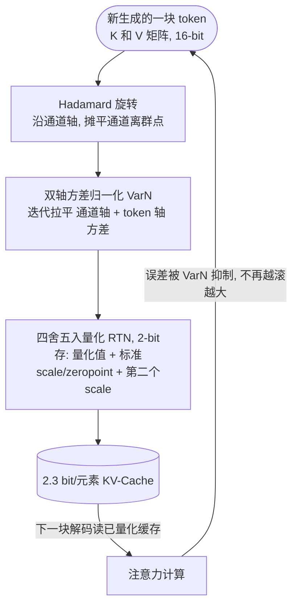

# Paper · 论文本身

## 一句话总结

让推理大模型「想得越久越聪明」(test-time scaling)的代价是 **KV-Cache(键值缓存)越滚越大、吃满显存**;把它压到 2-bit 是省显存的办法,但作者发现:在**一边生成一边压**的真实解码场景里,**量化误差会一步步累积、越滚越歪**,而罪魁不是「方向错了」而是**「每个 token 的幅度(scale)被压坏了」**。KVarN 用**两招组合**——先做 Hadamard(阿达玛)旋转把通道方向的离群点摊平,再做**双轴方差归一化**把 token 的幅度按住——在 2.3 bit/元素下把 MATH500、AIME24、HumanEval 等**生成式 benchmark**做到了同档量化方法里的新 SOTA,而在线开销只有 **0.18%**。[^arxiv]

## 问题(Problem)

- 想让模型推理更强,主流做法是 **test-time scaling**:让它生成更长的思维链、想更多步。可这会让 **KV-Cache** 随着 token 数线性膨胀——长解码时显存成了硬瓶颈。[^arxiv]
- 一个直接的省法是 **KV-Cache 量化**:把本来 16-bit 的 K、V 矩阵压到 2~4 bit。已有方法(KIVI、TurboQuant 等)在 benchmark 上看着不错。
- **但这些方法几乎都是在「prefill(预填充)」场景下评测的**——也就是把一段**固定的长上下文**一次性并行压完。真实的「边生成边压」(autoregressive decoding,自回归解码)不是这样:**新 token 是一个个产出来的,刚产出就得压回缓存**。
- 作者点出关键裂缝:在这种逐步压缩的场景里,**量化误差会跨时间步累积**。第 l 层用「被压过、已经有点歪」的缓存算注意力,它产出的 K、V 本身就带误差,再压一次又叠一层误差,传到下一层、下一个 token……**越长的序列,误差滚得越大**。而前人在 prefill 设定下根本看不到这个累积效应。[^accum]

> [!key] 立场
> 这篇的价值**不在「又一个量化技巧」,而在「换了一把尺子」**:它指出整个 KV-Cache 量化领域的评测设定(prefill 静态压缩)对不上 test-time scaling 的真实负载(逐步累积压缩),并提出一个**便宜的「伪解码(pseudo-decode)」评测协议**把累积误差量出来。方法本身(Hadamard + 双轴方差归一化)是把两个已有零件拼起来,**但拼对了地方**——它论证了「MSE 最优 ≠ 端到端最优」,因为**少数离群误差对最终质量的破坏远超它们在 MSE 里的占比**。看它学**「评测设定要对齐真实负载」+「抓离群点比抓平均更值钱」**这两条工程判断。

## 关键术语(Key terms)

| 术语 | 大白话解释 |
| --- | --- |
| **KV-Cache(键值缓存)** | Transformer 解码时把已生成 token 的 Key/Value 矩阵存起来复用,免得每步重算。它随序列长度线性增长,长推理时是显存大头。[^arxiv] |
| **test-time scaling(测试时扩展)** | 不改模型权重,靠「让它在推理时多想几步/生成更长 CoT」换更强表现。代价就是解码越来越长、KV-Cache 越来越大。[^arxiv] |
| **量化(quantization)** | 把高精度(16-bit)数值用更少比特(如 2-bit)表示来省内存。会引入误差,核心是「怎么压得误差最小、对结果伤害最小」。 |
| **Hadamard 旋转(incoherence processing,非相干化)** | 用一个固定的正交变换把矩阵「转个方向」,让原本几个通道上的极端离群值被摊薄成接近高斯的分布,更好压。O(N log N) 很快,可在线做。[^hadamard] |
| **双轴方差归一化(dual-scaling VarN)** | 沿 K/V 矩阵的**两个轴**(通道 + token)各放一组缩放因子,迭代地把行、列方差都拉平。前人量化只缩一个轴。[^varn] |
| **per-token scale 错误(token 幅度误差)** | 量化时某些 token 的整体大小(norm)被压歪了。作者证明:**最大的那批量化误差,绝大多数是这种「幅度被压坏」造成的,而非方向偏了**。[^decomp] |
| **pseudo-decode(伪解码评测)** | 一种省算力的近似:把长序列切成块,每过一块就量化一次缓存,后续 token 都读「已量化」的缓存——以此模拟真实解码里的误差累积。[^accum] |

## 核心方法(Core method)

打个比方。把 KV-Cache 量化想成**用低分辨率拍一排人的合影再传给后面的人接力描摹**:

- **方向 vs 幅度**:每个 token 是一个向量,既有「指向」(方向)也有「个头」(幅度/norm)。作者先做一道数学拆分,把量化误差**干净地拆成「幅度误差 E_M」和「方向误差 E_D」两块**,然后发现:**那些最离谱的大误差,几乎全是「个头被压歪了」(幅度错),不是「指错方向」**。所以要救,得先救幅度。[^decomp]
- **第一招 Hadamard 旋转**:先把每个 token 在**通道方向**转一下,把少数几个通道上的极端离群值摊平——这解决的是「通道空间的离群点」,但**管不住 token 自己的整体幅度**。[^hadamard]
- **第二招 双轴方差归一化(VarN)**:每攒够一块(比如 128 个 token),就沿**通道轴和 token 轴各放一组缩放因子**,迭代地把两个方向的方差都拉到接近均匀,再做最普通的「四舍五入量化(RTN)」。这一步直接把「个头被压歪」的 token 幅度按回去。[^varn]
- **两招为什么要合起来**:作者实测它们**互补**——Hadamard 擅长把分布主体压向对角线(理想情况),但在「特别大 / 特别小的 token」这两个极端反而很差;方差归一化恰恰最擅长治这两个极端。合起来(KVarN)才把 token 幅度牢牢锁住,从而**抑制了误差跨时间步的累积**。[^appendixB]

> [!key] 补丁①:为什么「方差归一化」在这里有用,和它在权重量化里有用是**两个不同的原因**(别张冠李戴)
> 同一招(源自 SINQ 的双轴方差归一化)在**权重量化**里有用,是因为它「从权重结构里近似出了校准数据」,**还会让重建误差反而变大**(靠和典型输入的巧合对齐取胜)。但在 **KV-Cache** 这里**没有校准数据可近似**——作者明说它有用是因为它**直接降低了矩阵重建误差**(专治幅度被压歪的离群 token)。把 KV-Cache 这招的功劳归给「近似校准数据」是错的。[^varn]

> [!key] 补丁②:KVarN 是**免校准(calibration-free)**的
> 它不需要拿一批样本数据离线跑一遍来定参数——所有缩放都是在线从当前这块 K/V 自己算出来的。这对部署很重要:换模型、换领域不用重新校准。[^arxiv]

## 架构 / 流程(Architecture / pipeline)

## 创新点(Innovation points)

| 创新 | 新在哪 | 为什么重要 |
| --- | --- | --- |
| 指出「评测设定 ≠ 真实负载」 | 前人都在 prefill 静态场景评测;真实 test-time scaling 是逐步累积压缩 | 重新定义了问题:很多方法的「好成绩」在累积场景里会缩水 |
| 误差拆分:幅度 vs 方向 | 用一道几何拆分把量化误差解耦,实证「最大误差几乎全来自 token 幅度」 | 把优化目标从「降总 MSE」改成「先救离群幅度」,更对症 |
| Hadamard + 双轴方差归一化的组合 | 两招互补:一个治通道离群,一个治 token 幅度极端值 | 单用任一招都不够;组合后才锁住幅度、压住累积 |
| pseudo-decode 评测协议 | 切块 + 每块后量化 + 后续读量化缓存,省算力地量出累积误差 | 给整个领域一把对齐真实负载的便宜尺子 |
| 「离群误差不成比例地重要」 | top 5% 误差只占少数 MSE,却主导端到端 KL 散度 | 论证「MSE 最优 ≠ 端到端最优」,指导后续方法设计 |

## 实验 / 证据(Experiments / evidence)

> **自报 vs 实测(整节适用)**:下列所有 benchmark 数值、消融、以及 0.18% 在线开销,均取自论文自己的表格/实验,属**论文自报**(作者在自己工作里报告的结果);本文未做独立第三方复现实测,下文不再逐格重标。star/HF upvotes 等社区数字为**抓取当时的自报快照**,会变。

**模型**:Qwen3-4B、Llama-3.1-8B、Phi-4-14B(及 Phi-4-reasoning-plus),覆盖不同规模与家族;**全部量化跑用 2-bit、平均 2.3 bit/元素**(含 scale/zeropoint 辅助存储)。推理类 benchmark 报 Avg@3(三次平均)。[^details]

**核心结果(Table 1,AIME24 / MATH500 准确率,数值经 hf read 逐格抽取):**[^t1]

| 模型 / 方法 | bits/elem | AIME24 Acc. | MATH500 Acc. |
| --- | ---: | ---: | ---: |
| Qwen3-4B FP16(无损上限) | 16.0 | 61.1 | 82.6 |
| Qwen3-4B · KIVI | 2.3 | 55.5 | 77.8 |
| Qwen3-4B · QuaRot | 2.3 | 56.7 | 78.9 |
| **Qwen3-4B · KVarN(本文)** | **2.3** | **60.0** | **79.2** |
| Phi-4-14B FP16(无损上限) | 16.0 | 62.2 | 84.9 |
| Phi-4-14B · KIVI | 2.3 | 57.8 | 74.4 |
| **Phi-4-14B · KVarN(本文)** | **2.3** | **61.7** | **84.8** |

- **MATH500 在 Phi-4-14B 上几乎无损**:84.9(FP16)→ 84.8(KVarN 2.3 bit),而 KIVI 掉到 74.4。[^t1]
- **HumanEval(Table 2)**:Qwen3-4B FP16 88.8 → KVarN 88.4(KIVI 86.4);Phi-4-14B FP16 88.9 → KVarN 88.2,而 KIVI 跌到 74.6。[^t2]
- **IFEval(Table 3,指令遵循)**:三个模型上 KVarN 的 strict/loose 都最接近 FP16(如 Qwen3-4B 81.0/84.3 → KVarN 80.4/83.4)。[^t3]
- **Line-Retrieval(Table 4,长上下文检索,按行数 100→600)**:KVarN 在三模型上整体最好,长上下文掉得最少(如 Llama-3.1-8B 600 行:FP16 92% / KIVI 83% / KVarN 89%)。[^t4]

**一个反直觉但关键的发现**:把**最大的那 5% 误差**换回高精度,带来的端到端 KL 散度改善,**比修好其余 95% 还多**——即便那 95% 在 MSE 里占了大头。⇒ **盯离群点,别盯平均。**[^outlier]

**在线开销(走了一趟数字,不只看自报口号)**:在 Qwen3-4B 上,vLLM 生成 128 个 token 耗时 **1050 ms**,而每层做 8 次迭代方差归一化总共 **1.9 ms**——即相对量化基线(如 KIVI)**多 0.18% 的实测开销**;模型越大相对开销越小。双 scale 反量化比单 scale 慢约 **1%**。[^speed]

> [!warn] 三处别被带偏
> 1. **这是「免训练量化」,不是把模型变强**。它的天花板是 FP16(无损全精度);KVarN 的本事是「在 2.3 bit 下尽量贴近 FP16」,**不会超过 FP16**。某些格子里 KVarN 略高于 FP16(如 Phi-4 AIME24 61.7 vs 62.2 是低于,但个别格高于),属于采样/三次平均的方差,别当「压缩还更准」来理解。
> 2. **bit 数要算辅助存储**。KVarN 报的 2.3(或 2.25)bit/元素已含两个 FP8 scale + FP16 zeropoint;对照里 KVQuant 因留 1% 通道 FP16 实为 ~2.4 bit,TurboQuant 是 3/3 bit(~4.5–4.8)。**比较时要看同 bit 档**,否则不公平。[^details]
> 3. **没有真·端到端服务级延迟实验**。作者自己在限制里承认:**目前公开服务框架(vLLM)还不支持 2-bit KV-Cache**,所以端到端部署收益是推算的,不是在生产框架上量到的。[^limits]

## 限制与风险(Limitations and risks)

- **不适用于无 KV-Cache 的架构**:状态空间模型(SSM,如 Mamba)没有 KV-Cache,这套方法用不上。[^limits]
- **对 MLA(多头潜在注意力)效果未知**:DeepSeek 等用的 MLA 是训练时压缩 KV-Cache,作者明说「不清楚这类注意力机制如何影响量化质量」。[^limits]
- **缺生产框架端到端延迟**:2-bit KV-Cache 暂无公开服务框架支持,实际加速/省显存收益尚未在生产栈上验证(见上 warn③)。[^limits]
- **方法是组合而非全新**:Hadamard 来自 QuaRot,双轴方差归一化来自 SINQ;贡献在「诊断 + 组合 + 评测协议」,不是发明全新算子——这是优点也是边界。

## 先读什么(What to read first)

1. **Abstract + §1 Introduction** —— 为什么 prefill 评测对不上 test-time scaling 的真实负载。[^arxiv]
2. **§2.4 Key Ideas + Fig.3** —— 「离群误差不成比例地重要」这一中心论点(top 5% 主导端到端 KL)。[^outlier]
3. **§3.1 误差拆分(Eq.3)+ Fig.1** —— 幅度误差 E_M vs 方向误差 E_D,实证大误差几乎全是幅度。[^decomp]
4. **§3.3 KVarN 方法 + Fig.2** —— Hadamard 旋转 + 双轴方差归一化的组合。[^varn]
5. **§3.2 + Fig.4(pseudo-decode)** —— 累积误差怎么定义、怎么便宜地量出来。[^accum]
6. **Table 1–4** —— 端到端 benchmark 对照。[^t1]
7. **Appendix H Alg.1(选读)** —— 方差归一化的迭代实现(改自 SINQ 的 log 域 dual-scale balancing)。[^varn]

## 技术细节(选读)

> **三区缓存布局(实现关键,原文 Appendix D 给了)**
> 大白话:不是整段都压 2-bit,而是**头尾留高精度、中间压**。精确机制:量化用固定三区布局——开头 S 个 **sink token 留 FP16**(保住注意力 sink 行为)、中间是按每 G 个 token 一组的 2-bit 量化体、结尾 R 个最新 token 留 FP16(还没攒够一组)。默认 G=128、S=128、R=128(IFEval 用 S=32)。KVarN 的辅助参数(zeropoint、scale)存 8-bit。[^details]

> **双轴缩放的反量化代价(防过度承诺)**
> 大白话:多存一个 scale,反量化时多算一点。精确机制:相比单 scale 的 RTN,双 scale 反量化已知约慢 1%;但多数前人方法(码本查表、混合精度)反量化开销更大,所以 KVarN 这点代价相对划算。原文未给在不同 GPU/不同 batch 下的完整反量化吞吐曲线,只给了「约 1%」这一结论。[^speed]

> **为什么 token 轴不做 Hadamard(只做方差归一化)**
> 大白话:token 轴上转 Hadamard 太贵。精确机制:解压时每个 token 位置都得在线把旋转撤回来,约 128² 次操作 / 128 token / 通道,代价过高;所以 token 轴改用「只多一组缩放因子」的方差归一化(每 token 每通道仅多 1 FLOP)。[^varn]

## 后续演化 · 这方法后来怎样了

KVarN 处在一条很拥挤的赛道(KV-Cache 量化/压缩)上,下列为**论文自身引用、可解析的同期与先行工作**(arXiv ID 可验证)。这是「它周围的脉络」,非「后来谁优化了它」——本文太新,尚无明确后继。

- **TurboQuant**(ICLR 2026)— 把 KV-Cache 压缩看成近最优向量量化:随机旋转 + 1-bit JL 残差修正。本文最强的高 bit 对照之一 _[置信度:高]_。[^arxiv]
- **SINQ**(arXiv:2509.22944)— 双轴方差归一化(Sinkhorn 归一化量化)的**直接来源**,本文把它从权重量化迁到了 KV-Cache _[置信度:高]_。[^varn]
- **Kitty**(arXiv:2511.18643)— 2-bit + 通道重要性动态升精度,本文的混合精度对照 _[置信度:高]_。
- **KVZip / SnapKV / PyramidKV** — 走「驱逐 / 合并 token」而非量化的正交路线,本文在附录与之对照(量化可与之叠加)_[置信度:高]_。

[^arxiv]: 论文 *KVarN: Variance-Normalized KV-Cache Quantization Mitigates Error Accumulation in Reasoning Tasks*,arXiv:2606.03458(2026-06-02,HUAWEI Computing Systems Lab,6 作者,HF upvotes 54)。https://arxiv.org/abs/2606.03458 · 代码 https://github.com/huawei-csl/KVarN(vLLM 实现,342★)
[^accum]: 同上,§3.2「KV-Cache 量化误差累积评测」+ Fig.4(pseudo-decode:切块,每块后量化,后续 token 读已量化缓存,模拟解码累积)。
[^decomp]: 同上,§3.1「区分幅度误差与方向误差」Eq.2–3(E_T = E_M + E_D),Fig.1(a)(top k% 大误差中幅度误差占比;K 矩阵的大误差绝大多数来自 token 幅度)。
[^hadamard]: 同上,§2.2 + Appendix A,沿用 QuaRot 的 Hadamard 排布(两个吸收进权重 + 两个 RoPE 后在线,在线变换 O(N log N))。
[^varn]: 同上,§3.3 + Appendix H Alg.1(双轴方差归一化,改自 SINQ [muller2025sinq, arXiv:2509.22944] 的 log 域交替 dual-scale balancing;在 KV-Cache 里有用是因直接降重建误差,与权重量化「近似校准数据」的原因不同;token 轴不做 Hadamard 因在线撤旋转太贵)。
[^appendixB]: 同上,Appendix B Fig.8(K 幅度联合分布:Hadamard 与方差归一化互补——前者压主体、后者治极端值;KVarN 把幅度锁在对角线)。
[^t1]: 同上,Table 1(AIME24 / MATH500,Accuracy %,Avg@3;Qwen3-4B FP16 61.1/82.6,KIVI 55.5/77.8,QuaRot 56.7/78.9,KVarN 60.0/79.2;Phi-4-14B FP16 62.2/84.9,KIVI 57.8/74.4,KVarN 61.7/84.8)。
[^t2]: 同上,Table 2(HumanEval,Accuracy %,Avg@3;Qwen3-4B FP16 88.8 / KIVI 86.4 / KVarN 88.4;Phi-4-14B FP16 88.9 / KIVI 74.6 / KVarN 88.2)。
[^t3]: 同上,Table 3(IFEval,Prompt-Level Strict/Loose %;Qwen3-4B FP16 81.0/84.3,KVarN 80.4/83.4)。
[^t4]: 同上,Table 4(Line-Retrieval,按行数 100–600 准确率 %;Llama-3.1-8B 600 行 FP16 92% / KIVI 83% / KVarN 89%)。
[^outlier]: 同上,§2.4 Fig.3 + Appendix C Fig.9(把 top 5% 最大误差换回高精度,端到端 KL 改善多于修其余 95%;top 5% 占少数 MSE 却主导 KL)。
[^speed]: 同上,§4.2 + Fig.6 + Appendix I(Qwen3-4B:vLLM 生成 128 token 1050 ms,方差归一化 1.9 ms ⇒ 0.18% 实测开销;双 scale 反量化约慢 1%;GPU 500 TFLOP fp16 / 1.8 TB/s)。
[^details]: 同上,Appendix D(模型/量化/解码细节;三区布局 S=128 sink + 2-bit 体 G=128 + R=128 trailing,IFEval S=32;辅助参数 8-bit;有效 bit/元素含 scale+zeropoint:KVarN 2.25,KVQuant ~2.4,TurboQuant 3/3)。
[^limits]: 同上,Appendix E Limitations(不适用 SSM;MLA 影响未知;2-bit KV-Cache 暂无公开服务框架支持→端到端部署收益未在生产栈验证)。
