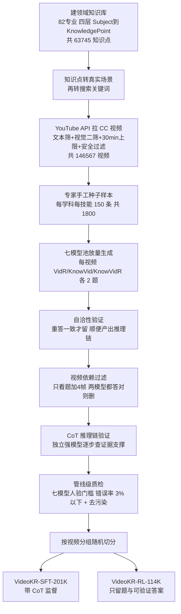

# Paper · 论文本身

## 一句话总结

当下的视频模型大多只会"看个动作、认个场景",一遇到要**调用专业知识 + 多步推理**的视频(比如看一段化学实验视频去估产物、看一段临床视频去推诊断)就抓瞎——这篇没去改模型架构、也没去做花哨的强化学习奖励,而是**把矛头对准训练数据本身**:用一条"人在环里"(human-in-the-loop)的**技能导向**数据生产流水线,从零新采 14.5 万条 CC 授权的专业领域视频,合成出 31.5 万条带推理链(CoT)的问答样本 VideoKR;同时发现现有评测基准很多题"只看一帧就能蒙对",于是另造了一个**逼模型真看完整段视频**的评测集 VideoKR-Eval。结论:在最普通的 SFT→GRPO 训练管线下,光换上这套数据,小模型就能在知识密集型视频推理上超过此前的后训练方法。[^arxiv]

## 问题(Problem)

- 现在主流的视频训练语料,几乎都是为**感知类目标**(动作识别、事件定位、短时序理解)攒的,内容偏日常生活,**专业领域覆盖极少**。模型学完只会"看表面",一碰到需要多跳推理、科学解释、看不见的原理(比如电流、化学反应机理)就不可靠。[^arxiv]
- 更要命的是**评测也漏**:作者手动审了现有的知识密集型视频基准,发现一大批题目压根不用连续看视频——只给模型一道题 + 一帧随机抽的画面,前沿模型也能答对(MMVU、VideoMMMU 上"单帧可解率"都 >35%)。这意味着过去"视频推理涨点"的成绩里,有相当部分是**文字捷径 / 单帧捷径**蒙出来的,不是真看懂了视频。[^single]
- 所以作者的立场是:推动视频推理进步的**主瓶颈不在算法,而在数据设计**。与其卷强化学习奖励工程,不如先把"喂什么"这件事做对。[^arxiv]

> [!key] 立场
> 这是一篇典型的 **data-centric(以数据为中心)** 工作:贡献不是新模型、新损失,而是一套**可复用的数据生产 + 去捷径评测**方法论。它的说服力来自一个克制的实验设计——**故意只用最标准的 SFT→GRPO 管线**,把变量锁死在数据上,这样涨点才能干净地归因到数据本身,而不是被算法技巧污染。

## 关键术语(Key terms)

| 术语 | 大白话解释 |
| --- | --- |
| **知识密集型视频推理(knowledge-intensive video reasoning)** | 不是"画面里发生了啥"这种看得见就能答的题,而是要**先看懂画面、再调专业知识、再多步推**才能答的题。比如看实验视频估产物量、看临床视频推诊断。[^arxiv] |
| **三大核心技能** | 作者把这类能力拆成三块:**VidR**(Basic Video Reasoning,纯看画面就能推的基础推理)/ **KnowVid**(Knowledge-enhanced Video Perception,用专业知识"增强"感知,比如认出实验台上的滴定管并知道它的作用)/ **KnowVidR**(Knowledge-Intensive Video Reasoning,把视觉+知识揉在一起做多跳推理)。数据按这三档分层生成。[^skill] |
| **CoT 推理链(Chain-of-Thought rationale)** | 给每个问答样本配一段"为什么这么答"的分步推理文字,当训练监督信号。让模型学会"怎么推"而不只是"答什么"。[^arxiv] |
| **single-frame answerability(单帧可解率)** | 一道视频题,只给模型题干 + 随机一帧画面,它就能稳定答对的比例。这个比例越高,说明这道题越"假"——根本不需要看视频。作者用它来量化旧基准的水分。[^single] |
| **SFT→GRPO 管线** | 后训练两段式:先用带 CoT 的样本做监督微调(SFT),再用可验证答案做强化学习(GRPO,一种 GRPO=Group Relative Policy Optimization 的 RLVR 方法,靠"答案对不对"给奖励)。作者刻意用最标准的版本,不加花活。[^train] |
| **RLVR** | Reinforcement Learning with Verifiable Rewards,用"答案能机器判对错"(选择题 Exact Match、开放题 ROUGE)来当奖励的强化学习,避免依赖难训的奖励模型。[^train] |

## 核心方法(Core method)

这篇的"方法"其实是**一条数据工厂流水线**——把"乱七八糟的网络视频"炼成"带推理链、逼真看视频才能答、且不含评测泄漏"的训练数据。打个比方:它像一所大学**先定教学大纲、再按大纲找素材、再出题配标准答案、再层层质检**。四步:

1. **建领域知识库(Domain Knowledge Bank)**:先人工对照全球顶校本科培养方案,定下 82 个专业、四大学科(自然科学/医疗/人文社科/工程);再按 `Subject→Course→Lecture→Knowledge Point` 四层往下展开,由专家给每个专业列 4–8 门核心课、编教学大纲,最后让 LLM 抽出每节课的知识点(术语+段落定义)。共得 **63,745 个知识点**。这步决定了"要教什么"。[^bank]
2. **知识驱动的视频采集**:直接拿知识点当搜索词(如"牛顿第二定律")只会搜到讲课录像,太干。于是先让 LLM 把知识点**翻译成真实生活场景**(如"火箭升空"——它本身就体现牛顿第二定律),再转成搜索关键词,用 YouTube API 拉 CC 授权视频;再用文本元数据筛相关性、超 30 分钟剔除、下载后用多模态模型做二次视觉相关性确认、抽 4 帧过 Azure 内容安全 API 去有害内容。共采 **146,567 条 CC 视频**。[^collect]
3. **技能导向的样本生成**:对每条视频,按 VidR/KnowVid/KnowVidR **三技能各出 2 题**(共 6 题,6 轮独立生成)。先由专家**手工造种子样本**(每学科每技能 150 条,共 1,800 条,二审改了 74 条),再让前沿多模态模型**模仿种子**放量;生成时喂给模型:0.2fps 抽帧+时间戳、同学科同技能的 3 个人工范例、相关知识点。[^skill]
4. **生成验证与质检(本流水线的真护栏)**:三道过滤——① **自洽性验证**:把生成的题重新喂回模型答一遍,答案一致才留,且把这次的推理当最终推理链;② **视频依赖过滤**:让两个模型只看题+4 帧去答,**两个都答对就删掉**(因为这题不靠看视频也能解,是捷径题);③ **CoT 推理链验证**:用一个独立的强模型当审稿,逐步检查推理是否被画面证据/标准知识支撑,关键步无依据的丢弃。[^filter]

> [!key] 补丁①:为什么用"七模型池 + 人验门槛",而不是一个模型包圆(这是该流水线最值得抄的设计)
> 以往语料常**全程靠单个模型**生成,会把那个模型的系统性偏见烙进数据。本文改成**七个前沿模型组成池子**(GPT-5.2、GPT-5-mini、Claude-4.5-Sonnet、Gemini-3-Flash、DeepSeek-V3.2、Qwen3-VL-235B-A22B、GLM-4.6V),并按步骤"难度分层":轻活(元数据筛相关)多模型都能干,重活(出题、验证)只有部分模型够格。资格怎么定?**每个模型 × 每个步骤,抽 100 条真实输入让领域专家评错**,错误率 ≤3% 才准入;放量时从合格池里随机选一个干。[^select]

> [!warn] 补丁②:"open-source" 是承诺,不是已落地的链接
> 论文正文与摘要都说"we open-source VideoKR",但**全文没有给出 GitHub / HuggingFace 数据集的具体地址**,HF 论文页也未挂出仓库/数据集链接。所以"数据是否真的、何时公开、以何形式(明文?加密?)发布"目前=**数据不足**,不能当成"已可下载"。复现该工作前必须先确认这一点。

## 架构 / 流程(Architecture / pipeline)

## 创新点(Innovation points)

| 创新 | 新在哪 | 为什么重要 |
| --- | --- | --- |
| 技能分层的合成框架 | 把"知识+推理密集视频理解"拆成 VidR/KnowVid/KnowVidR 三技能,数据按技能定向生成 | 消融显示三技能叠加才出最好效果,提供了"该按什么维度配数据"的可操作配方 |
| 知识驱动采集(知识点→场景→关键词) | 不直接搜术语(只会搜到讲课视频),而是先转成真实场景再搜 | 拿到的是"隐含知识的真实视频"而非"讲解视频",更贴近现实推理 |
| 七模型池 + 人验准入门槛 | 用模型池替代单模型,且每步用专家抽检定资格(错误率≤3%) | 直击"单模型烙偏见"的老问题,把质控做成可量化的准入协议 |
| 去捷径的评测集 VideoKR-Eval | 用"多模型单帧探测"剔掉只看一帧就能答的题 + 专家重标 | 揭穿旧基准的水分,让"视频推理涨点"更可信 |
| 全 CC 授权 + 全新采集 | 14.5 万条视频全部新采、全 CC 许可、平均时长 344 秒 | 解决以往语料版权暧昧、视频偏短偏旧的痛点,可合法再分发 |

## 实验 / 证据(Experiments / evidence)

**数据集规模**:VideoKR 共 **315,537** 条样本,按视频分组随机切成 **VideoKR-SFT-201K**(201,156 条,带 CoT,推理链平均 196.9 词)与 **VideoKR-RL-114K**(114,381 条,只留题+可验证答案);视频平均时长约 **344 秒**(远长于此前语料的几十秒)。[^stats] 评测集 **VideoKR-Eval = 2,000 条**(从 VideoMMMU/MMVU/SciVideoBench 中筛出 1,254 条真需看视频的原题 + 746 条专家重标题)。[^evalbench]

**主结果(Table 3,知识密集型四基准平均):标准 SFT→GRPO 管线下,只换 VideoKR 数据就显著涨点**[^t3]

| 底座(128 帧) | 原始 知识密集均分 | +VideoKR(SFT+RL) | 提升 |
| --- | ---: | ---: | ---: |
| Qwen2.5-VL-7B-Instruct | 41.9 | 46.6 | +4.7 |
| Qwen3-VL-8B-Instruct | 48.5 | 51.5 | +3.0 |

后训练后的 Qwen3-VL-8B 知识密集均分 **51.5**,**超过同 7/8B 量级最强对手 Qwen3-VL-8B-Thinking 的 50.0**;单项里 MMVU、VideoKR-Eval 涨幅最大(Qwen2.5-VL-7B 上分别 +4.8 / +8.5)。代价是**通用视频推理几乎不涨甚至微跌**(Qwen3-VL-8B 上 65.9→65.4,-0.5),说明这套数据是"专攻知识密集、对通用能力略有取舍"。[^t3]

**旧基准有多水(Table 2,单帧可解率)**:GPT-5.2 在 MMVU 上单帧就能答对 **49.7%**、VideoMMMU **38.3%**;而本文的 VideoKR-Eval 把这个数字压到 **10.7%**——证明它确实更逼模型看完整段视频。[^single]

**三个值得记住的发现:**
- **数据难度才是关键,不是算法**:把各家语料抽 3,000 题让基座零样本去答,旧语料模型都能拿 49–57%(说明对前沿基座已"刷饱"、学习信号弱);VideoKR 上只有 **42.3%**——更难,才更有可学的空间。[^t5]
- **CoT 监督确实有用**:80K 样本对照,带 CoT 比直接出答案在知识密集均分上 39.4→42.4(**+3.0**);但注意**通用推理反而被 CoT 拖低**(61.4→58.3)。[^t4]
- **横向比同行语料,VideoKR 是唯一不掉分的**:同样 SFT 80K,Video-R1 把知识密集均分拉到 36.2、VideoRFT 38.4(都低于基座 41.9),只有 VideoKR 升到 42.4——侧面印证旧语料"太简单/太偏感知"。[^t4]

**成本(诚实披露)**:整个 VideoKR + VideoKR-Eval 的数据构建,**模型推理花费约 7.04 万美元**;雇了 **34 位研究生级领域专家**,时薪约 **13 美元**。训练在最多 **8 卡 A800(80GB)** 上做,SFT/GRPO 各 1 个 epoch。[^cost]

> [!warn] 三处别被带偏
> 1. **"超过 SOTA" 仅限同量级 + 知识密集赛道**:51.5 是 7/8B 小模型里的第一;但闭源大模型仍遥遥领先(GPT-5.4 知识密集均分 **71.3**)。这是"小模型靠好数据追近",不是"干翻大模型"。[^t3]
> 2. **通用能力是被牺牲的一方**:几乎所有 VideoKR 变体在通用视频推理上都微跌(SFT-only 甚至 -3.6)。上线要看你要的是专才还是通才。[^t3]
> 3. **质量门不是零噪声**:终稿抽 800 条人工复核,仍有 52 题疑似"不看视频也能解"、32 条推理链有错(其中 17 条改变了最终答案)。作者称"与人工种子的错误水平相当、可接受"——但这意味着数据里**确有残留噪声**,不是干净到底。[^qc]

## 限制与风险(Limitations and risks)

- **发布状态不明**:正文承诺开源,但**没给数据集/代码链接**,公开形式与时间=数据不足(见补丁②)。这是想复现/使用时第一要确认的。
- **残留噪声**:抽检仍有约 6.5% 题疑似单帧可解、约 4% 推理链有错(2% 错到改答案)。作者判为可接受,但下游训练会吸收这部分噪声。[^qc]
- **以通用能力换专精**:数据高度偏知识密集,通用视频推理普遍微跌;不是免费午餐。[^t3]
- **生成器即评判器的隐忧**:很多步(自洽验证、CoT 验证)仍由模型自己或同类模型把关,虽有专家抽检 + 七模型池缓解,但**根上仍是"模型造、模型验"**,系统性盲区难完全排除。[^filter]
- **长视频被排除**:>30 分钟视频直接剔除,长上下文视频理解不在本文范围;想做长视频的不能直接套。[^collect]
- **成本不低**:7 万美元推理 + 34 名专家,**重人工、难低成本复刻**;真正可规模化的是"流水线设计",不是"再跑一遍的钱"。[^cost]

## 先读什么(What to read first)

1. **Abstract + §1 Introduction** —— 为什么"数据设计"才是视频推理的主瓶颈。[^arxiv]
2. **§3 数据构建(尤其 3.3 技能生成 + 3.4 质控)+ Figure 2 流程图** —— 这是全文精华:四步流水线 + 七模型人验门槛。[^skill]
3. **§4 + Table 2** —— 旧基准"单帧可解"的水分,以及 VideoKR-Eval 怎么去捷径。[^single]
4. **Table 3** —— 主结果:只换数据带来的知识密集涨点 + 对通用能力的取舍。[^t3]
5. **§6.4–6.5 + Table 4/5** —— 消融:CoT 有用、三技能叠加最好、旧语料"刷饱"无信号。[^t4]
6. **Appendix A.4 + Table 8** —— 想抄流水线的人必看:每个步骤到底哪些模型够格、门槛怎么定。[^select]

## 后续演化 · 这方法后来怎样了

本文 2026-06-03 投稿(标注 ICML),截至深读时尚无可核实的后续引用/扩展工作。其**可迁移内核**(知识库→场景化采集→技能分层合成→去捷径评测→七模型人验门槛)更值得当作"数据流水线设计模式"沿用,而非追踪单篇衍生。_[置信度:中,基于深读时检索]_

[^arxiv]: 论文 *VideoKR: Towards Knowledge- and Reasoning-Intensive Video Understanding*,arXiv:2606.05259(v1,2026-06-03,标注 ICML)。作者 Lin Fu、Zheyuan Yang、Yang Wang、Tingyu Song、Arman Cohan、Yilun Zhao(机构论文页未明示=数据不足)。https://arxiv.org/abs/2606.05259 — Abstract / §1 Introduction。
[^skill]: 同上,§3.3 Skill-Oriented Example Generation(三技能 VidR/KnowVid/KnowVidR 定义;每视频每技能 2 题共 6 题;专家种子 150×学科×技能=1,800,二审改 74;0.2fps 抽帧+3 范例+知识点喂入)。
[^bank]: 同上,§3.1 Domain Knowledge Bank Construction(82 专业、四大学科、四层 Subject→Course→Lecture→Knowledge Point;每专业 4–8 课;共 63,745 知识点)+ Appendix A.1 Table 6。
[^collect]: 同上,§3.2 Knowledge-Driven Video Collection(知识点→1–3 场景→搜索关键词;YouTube Data API top-10;限 CC、剔 >30min、视觉二筛、Azure 内容安全抽 4 帧;共 146,567 CC 视频)。
[^filter]: 同上,§3.3 Example Validation and Filtering(自洽性验证 / 视频依赖过滤:两模型只看题+4 帧都答对则删 / CoT 推理链由独立强 MLLM 逐步查证据)。
[^select]: 同上,§3.4 + Appendix A.4 Table 8(七模型池 GPT-5.2/GPT-5-mini/Claude-4.5-Sonnet/Gemini-3-Flash/DeepSeek-V3.2/Qwen3-VL-235B-A22B/GLM-4.6V;每步抽 100 条专家评错,错误率≤3% 准入;难度分层,放量时合格池随机选)。
[^stats]: 同上,§3.5 + Figure 2(共 315,537 样本;SFT-201K=201,156 条,CoT 平均 196.9 词;RL-114K=114,381 条;视频平均时长 339.0/351.6 秒)。
[^single]: 同上,§4.1 Table 2(单帧可解率:GPT-5.2 在 MMVU 49.7 / VideoMMMU 38.3 / SciVideoBench 23.0;VideoKR-Eval 仅 10.7;三独立 trial 全对才判单帧可解)。
[^evalbench]: 同上,§4.2 + Appendix B.1 Table 9(VideoKR-Eval=2,000 条 = 1,254 多模型单帧探测保留原题 + 746 专家重标;源自 VideoMMMU/MMVU/SciVideoBench)。
[^train]: 同上,§5.1 + Appendix C.1(标准 SFT→GRPO;GRPO 奖励 R=0.1·R_f+0.9·R_a,开放题 ROUGE、选择题 EM;rollout G=8、temp 1.0、β=0.01;SFT lr 1e-5、RL lr 5e-6;LLaMA-Factory + verl)。
[^t3]: 同上,Table 3(通用 vs 知识密集七基准;Qwen2.5-VL-7B 知识密集 41.9→46.6 +4.7、Qwen3-VL-8B 48.5→51.5 +3.0;Qwen3-VL-8B-Thinking 50.0;闭源 GPT-5.4=71.3;通用普遍微跌)。
[^t4]: 同上,§6.4–6.5 + Table 4/11(CoT 39.4→42.4 +3.0;三技能叠加 41.4/41.3/42.4;VideoKR-SFT 是唯一超基座 41.9 的 SFT 语料,Video-R1=36.2/VideoRFT=38.4)。
[^t5]: 同上,§6.5 Table 5(3,000 题零样本:Qwen3-VL-8B 在旧语料 49.1–57.1,在 VideoKR 仅 42.3——旧语料已刷饱)。
[^qc]: 同上,§3.4 Manual Quality Assessment(抽 800 条:52 题疑似非视觉可解;32 条推理链有错,17 条改变最终答案、15 条答对但论证不实)。
[^cost]: 同上,Impact Statement + Appendix C.1(数据构建模型推理约 70.4K 美元;34 位研究生级专家、时薪约 13 美元;最多 8×A800-80GB,SFT/RL 各 1 epoch)。
