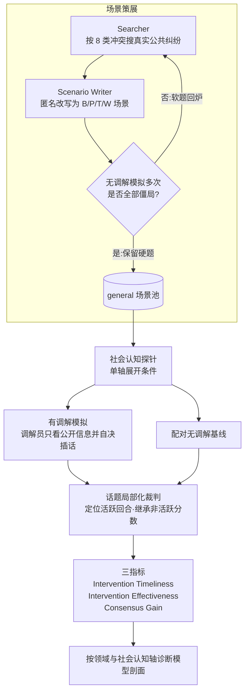

# Paper · 论文本身

## 一句话总结

SoCRATES 给“LLM 当调解员”这类没有标准答案、质量长在多轮互动里的任务，造了一台更可信的自动评测机：先用 agent 流水线从真实公共纠纷改编硬场景，再把社会认知难度拆成几根独立旋钮逐根拧，最后用“话题局部化”裁判只在话题真的被推动时打分。口号式概括：**调解评测的瓶颈不只是模型强不强，而是裁判会不会被无关回合带偏**。[^paper]

## 问题(Problem)

- 社会冲突调解是很自然的 LLM 应用方向，但它不像数学题有唯一答案。调解质量体现在实时轨迹里：什么时候插话、插话后双方有没有松动、不同议题有没有逐步靠近。
- 现有测床有三处硬伤：场景多靠专家手写、领域窄；复杂度常只变“策略姿态”一根轴，情绪、文化、历史长度、多方参与混在一起；评分器常让 LLM 每轮都给每个话题打分，连当前没被讨论的话题也要评，噪声会沿轨迹累积。[^intro]
- 所以作者要解决的不是“让一个调解员模型更会说话”，而是“先把调解员考试设计得可信”：题目要硬、变量要可归因、裁判要和人类校准。

> [!key] 立场
> 这篇最值得学的是**评测工程学**。它把开放式多轮任务拆成四个可迁移动作：硬题门、反事实基线、单轴扰动、局部化裁判。对应用型 agent 来说，这比“哪个模型榜首”更重要，因为你以后评客服、陪伴、销售、导师、代码审查 agent，都会遇到同一个问题：最终结果没有标准答案，必须先把“什么时候该评、拿什么对照评、裁判自己靠不靠谱”讲清楚。

## 关键术语(Key terms)

| 术语 | 大白话解释 |
| --- | --- |
| **proactive mediation(主动调解)** | 调解员不是读完整段对话后给建议，而是实时旁听，自己决定“现在要不要插话”和“要说什么”。SoCRATES 评的正是这个 when/how 决策。[^related] |
| **场景四元组 `s=(B,P,T,W)`** | 一场冲突被写成背景 `B`、当事人集合 `P`、争议话题集合 `T`、偏好权重 `W`。每个话题有离散选项，所以“立场有没有移动”能被观察，而不只是自由文本感觉。[^task] |
| **agentic scenario curation(agentic 场景策展)** | 用 Searcher 上网找真实公共纠纷，再让 Scenario Writer 改写成匿名的结构化冲突，最后用无调解模拟筛掉自己就能谈成的软题。[^curation] |
| **simulation-based filtering(模拟筛硬题)** | 一个候选场景先跑多次无调解对话；只有每次都僵局，才进入题库。大白话：题目必须“没有调解员就失败”，调解员的功劳才算得清。[^curation] |
| **socio-cognitive axes(社会认知轴)** | 把调解难度拆成策略姿态、当事人数量、历史长度、情绪反应、文化身份几根旋钮。一次只拧一根，才能知道模型到底弱在哪。[^axes] |
| **topic-localized evaluation(话题局部化评估)** | 裁判通读对话后，先找“某个话题真的被讨论或立场移动”的回合，只在这些回合打分；其他回合继承上次分数。它避免裁判被无关内容拖走。[^judge] |
| **consensus gain(共识增益)** | 有调解终局分相对无调解终局分多弥合了多少剩余缺口。负值表示调解反而让结局更差。[^metrics] |

## 核心方法(Core method)

可以把 SoCRATES 想成一个给 LLM 调解员的模拟法庭考试。

第一步是**出题**。Searcher 像研究助理一样找真实公共纠纷，Scenario Writer 把它匿名改编成可扮演的结构化场景：谁是谁、争什么、每方在每个议题上的立场和权重是什么。然后系统先让当事人自己谈；如果不靠调解也能谈成，这题就回炉。

第二步是**加压**。作者不把所有难度堆在一起，而是复制同一个场景，每次只改变一根社会认知轴：比如把两方变三方、把背景拉长、让双方更情绪化、换文化身份。这样模型掉分时，不会只得到“总分低”这个模糊结论，而能看到它是多方追踪弱、长上下文弱，还是情绪调节弱。

第三步是**考试**。当事人 agent 有自己的私有目标、底线、偏好和人设；调解员只能看公开背景、话题和对话，不能偷看底牌。它必须从发言中推断隐藏状态，并决定何时介入。

第四步是**阅卷**。裁判不是每轮全量打分，而是按话题定位有效回合，构造每个话题的共识轨迹，再派生及时性、有效性、共识增益三类指标。核心思路是：先把“该评哪里”缩小，再让 LLM judge 打分。

## 架构 / 流程(Architecture / pipeline)

## 创新点(Innovation points)

| 创新 | 新在哪 | 为什么重要 |
| --- | --- | --- |
| agentic 场景策展 | 从真实纠纷种子自动改编场景，而不是只靠专家手写 | 覆盖面更宽，也更容易持续扩展题库 |
| 模拟筛硬题 | 只有无调解也谈不成的场景才保留 | 排掉送分题，避免把自然和解误记成调解员能力 |
| 单轴社会认知扰动 | 策略、方数、历史、情绪、文化分开拧 | 让“模型弱在哪”可诊断，而不是只给一个总分 |
| 话题局部化裁判 | 先定位活跃话题回合，再评分并继承非活跃回合 | 降低 LLM judge 被无关内容干扰的概率 |
| 反事实配对计分 | 每个有调解 run 都配一个无调解 baseline | 分数表达“比没有你多带来多少进展”，更像真实介入价值 |
| 裁判校准与稳定性检查 | 先对齐专家，再换 evaluator backbone、换 simulator backbone、做多次重跑 | 把“榜单可信不可信”变成被测对象，而不是默认成立 |

## 实验 / 证据(Experiments / evidence)

以下数字均为**论文自报**；代码仓库与数据集截至本轮核查仍显示 Coming soon，未做第三方复现实测。[^project]

**评测规模**：SoCRATES 从 8 个领域各保留 5 个 hard general scenarios，共 40 个场景；每个场景展开为 15 个条件；每个 mediator 跑 600 个 scenario-condition pairs，8 个 mediator 合计 4,800 runs，并且每个 run 都配无调解基线。[^bench]

**裁判与人类对齐(Table 2)**：topic-localized evaluator 与两位专家在 1,844 个 snippets、144 条 mediator trajectories 上对齐，trajectory-level Pearson `r=0.823`、outcome-level `r=0.801`；ProMediate per-turn judge 是 `0.372/0.432`，non-expert baseline 是 `0.331/0.527`。也就是说，主要收益不是“换更强模型”，而是“不要让裁判评无关话题”。[^validation]

| Evaluator | Trajectory r | Outcome r |
| --- | ---: | ---: |
| Non-expert | 0.331 | 0.527 |
| ProMediate per-turn | 0.372 | 0.432 |
| SoCRATES topic-localized | 0.823 | 0.801 |

**persona fidelity(Table 1)**：为了确认当事人模拟器能按情绪反应度标量变化，作者做 A/B 人评。DeepSeek-V3.2 得分最高 `87.2%`；七个 simulator 的标注者一致性 `Krippendorff's α=0.75`。这也是作者选 DeepSeek-V3.2 当 party agent 的依据。[^validation]

**八个 mediator 的核心榜单(Table 3)**：按平均 consensus gain 排序，GPT-5.4-mini 最高 `34.4`，Gemini-3.1-Flash-Lite `33.0`，DeepSeek-V3.2 `31.9`，Qwen3-235B `30.7`；底部是 Gemma-4-26B `21.0`、Nemotron-3-120B `20.4`、Solar-Pro-3 `19.9`、Qwen3-30B `15.7`。全体平均 consensus gain `25.9`。[^table3]

| Mediator | Type | Timeliness | Effectiveness | Consensus Gain |
| --- | --- | ---: | ---: | ---: |
| GPT-5.4-mini | Closed | 79.9 | 24.6 | 34.4 |
| Gemini-3.1-Flash-Lite | Closed | 80.9 | 24.6 | 33.0 |
| DeepSeek-V3.2 | Open | 75.8 | 23.1 | 31.9 |
| Qwen3-235B | Open | 76.4 | 24.6 | 30.7 |
| Gemma-4-26B | Open | 79.0 | 18.1 | 21.0 |
| Nemotron-3-120B | Open | 72.0 | 19.2 | 20.4 |
| Solar-Pro-3 | Open | 84.6 | 16.7 | 19.9 |
| Qwen3-30B | Open | 84.6 | 19.7 | 15.7 |

**领域差异(Table 3)**：全体平均 consensus gain 从 Transactional `41.3` 降到 Intra-organizational `16.6`；Legal 也只有 `19.0`。这支持作者的批评：如果测床只覆盖交易/议价类任务，会高估 LLM mediation 能力。[^table3]

**快插话不等于会调解(Appendix H.1)**：Solar-Pro-3 与 Qwen3-30B 的 timeliness 同为 `84.6`、全榜最高，但 consensus gain 垫底；它们的 intervention frequency 分别是 `32.3%` 和 `31.1%`，明显高于 GPT-5.4-mini/Gemini-3.1-FL 的 `22.6%`。作者的解释是：过早、过频地说话能刷高及时性，却不一定改善共识。[^h1]

**社会认知轴剖面(§5.2)**：所有 mediator 至少在一个轴上收缩；战略姿态是最强压力测试，Competing 下 consensus gain drop 为 `18.9-64.1`，Accommodating 下为 `13.8-66.8`。双方都 reactive 时全员下降；文化轴下降较小但系统性存在，离 U.S. norm 越远越弱。[^axesresult]

**稳定性检查(Appendix H.2)**：换 evaluator backbone 后，intervention effectiveness 的 Spearman `ρ=0.862`、consensus gain `ρ=0.786`，timeliness 只有 `ρ=0.406`，说明“何时”类指标对裁判选轮更敏感；general condition 三次重跑的 consensus gain ranking `Kendall's W=0.929`，8 个 mediator 中 6 个半极差在 `±3` 内。[^stability]

> [!warn] 别被带偏
> 1. **“frontier mediator”要打折读**：被测闭源调解员是 GPT-5.4-mini 与 Gemini-3.1-Flash-Lite，不是完整 GPT-5.4 或 Gemini-3.1-Pro；完整 GPT-5.4 主要用于 scenario writing，Gemini-3.1-Pro 出现在 fidelity simulator 池里。[^models]
> 2. **DeepSeek-V3.2 一身三职**：它既是 party simulator，又是默认 evaluator backbone，也是被测 mediator 之一。换 evaluator backbone 的复测缓解了这个疑虑，但不能完全消除。
> 3. **这是 LLM role-play 仿真，不是真人田野实验**：真实纠纷只是 scenario seed，进入 benchmark 后已经被匿名化、结构化、离散化。
> 4. **timeliness 指标不稳**：换 evaluator backbone 后该指标相关性只有 `0.406`，横向比较时要比 consensus gain 更谨慎。
> 5. **项目页显示 Code 与 SoCRATES 数据均 Coming soon**：本轮没有源码可读，也没有可下载 benchmark 可复现。

## 限制与风险(Limitations and risks)

- 原文自认：全部对话都用英语，即使文化身份设为 KR/CN/US；这能隔离文化变量与语言变量，但不测试多语种调解。[^limits]
- 原文自认：主 outcome 是 consensus。调解质量还包括 party satisfaction、procedural fairness、trust restoration、emotional repair，但这些主观维度更难稳定校准，本文未纳入。[^limits]
- 五个轴的验证强度不均：情绪反应度做了人评保真；多方与长历史主要是结构性扰动；策略与文化更多依赖前人验证与 prompt 设计。
- 每个领域只有 5 个 general scenarios，领域级结论要看作诊断信号，不是大样本社会科学结论。
- 成本未系统披露；4,800 个多轮 mediation runs 加上无调解基线和 evaluator passes，生产化会有明显计算成本。

## 先读什么(What to read first)

1. **Figure 1 + Introduction**：先把三件事记住：场景覆盖、单轴扰动、话题局部化裁判。
2. **§3.4 Benchmark Metrics / Automatic Evaluation**：全文最可迁移的机制，三条公式和局部化裁判都在这里。
3. **§4 + Table 2**：判断你该不该信这个 evaluator；`0.823` vs `0.372` 是全文最硬的数字。
4. **§3.2 + Appendix C**：看它怎么从真实纠纷 seed 改写成结构化场景，并用无调解模拟筛硬题。
5. **§5.2 + Figure 2-4**：看它为什么说 mediator competence 是剖面，不是单一能力前沿。
6. **Appendix H**：看换 evaluator、换 simulator、三次重跑之后榜单还稳不稳。
7. **项目页**：只用于核公开发布状态；截至本轮，Code/GitHub 与 SoCRATES/HF 均标 Coming soon。[^project]

## 技术细节(选读)

**三指标公式**

大白话：timeliness 看“出事后多快出手”，effectiveness 看“每次出手后几轮内有没有推进”，consensus gain 看“终局比无调解多弥合了多少缺口”。

精确机制：每个话题的 1-5 agreement score 先映射到 `[0,1]`，再跨话题平均成 cumulative Consensus Score `S_{\leq t}`。drop event 定义为 `S^{med}_{\leq t}` 相比前一回合下降至少 `τ=0.1`；timeliness 在接下来 `W=10` 回合里找首次介入并归一到 0-100。effectiveness 看介入后 5 回合的 normalized lift：`(S^{med}_{\leq i+5}-S^{med}_{\leq i-1})/(1-S^{med}_{\leq i-1})*100`。consensus gain 是 `(S^{med}-S^{unmed})/(1-S^{unmed})*100`；若无调解已经满分，则报 raw change。[^metrics]

**话题局部化 evaluator**

大白话：裁判不是“每轮所有议题都评”，而是先给每个议题画高亮：这一轮到底有没有谈到它、立场有没有动；只在高亮处更新分数。

精确机制：judge 通读完整对话一次；对每个 topic `T_j`，定位它 active 的 turns，记录 agreement score 与每方 stance；inactive turns carry forward previous score。默认 evaluator backbone 是 DeepSeek-V3.2；Appendix E 给了 topic-localized evaluation prompt。[^judge]

**信息不对称设计**

大白话：当事人知道自己的底牌，调解员只能听公开发言。

精确机制：party private input 包括 objective、fallback/BATNA、per-topic starting stance、persona `π_i` 与 preference weights `W`；mediator 只看到 background `B`、topics `T` 与 dialogue so far，不能看到 persona、stance、preferences。于是调解员的核心能力是从公开对话推断隐藏状态。[^task]

**防张冠李戴**

1. proactive mediation 这个“实时决定 when/how 插话”的范式不是 SoCRATES 首创；本文明确把 ProMediate 列为前作，SoCRATES 的主要推进是场景规模化、单轴 probing、topic-localized evaluator。[^related]
2. 文化轴不是多语种评测。文化身份通过 Hofstede 六维 0-100 profile 写入 persona；对话仍全程英语。[^axes]
3. “GPT-5.4-mini/Gemini-3.1-Flash-Lite 被测”与“GPT-5.4/Gemini-3.1-Pro 出现在流水线或保真验证”是不同角色，不能混写。[^models]

## 后续演化 · 这方法后来怎样了

- 截至 2026-06-10，本论文刚于 2026-06-04 提交，未找到可核实的前向引用或复现仓库。_[置信度:高；基于 arXiv/HF/项目页与网页检索，数据仍可能随项目发布变化]_
- 后向脉络比较清楚：Tessler et al. 2024 代表人类参与的共识调解方向，ProMediate 2025 提出 proactive mediator 互动级评测，SoCRATES 则把场景覆盖、单轴诊断和裁判降噪做成统一测床。_[置信度:高；基于原文 Related Work 与引用链]_
- 作者自己给出的后续方向是 multilingual mediation，以及把 outcome 从 consensus 扩展到 satisfaction、fairness、trust restoration、emotional repair。_[置信度:高；基于原文 Limitations]_

[^paper]: Taewon Yun, Hyeonseong Park, Jeonghwan Choi, Hayoon Park, Yeeun Choi, Hwanjun Song, *SoCRATES: Towards Reliable Automated Evaluation of Proactive LLM Mediation across Domains and Socio-cognitive Variations*, arXiv:2606.05563v1, submitted 2026-06-04. https://arxiv.org/abs/2606.05563
[^intro]: 同上，§1 Introduction。
[^related]: 同上，§2 Related Work，尤其是 ProMediate 与 proactive mediation 的关系。
[^task]: 同上，§3.1 Task Formulation。
[^curation]: 同上，§3.2 Agentic Scenario Curation；Searcher=o4-mini-deep-research，Scenario Writer=GPT-5.4，party simulator=DeepSeek-V3.2。
[^axes]: 同上，§3.3 Socio-Cognitive Probing 与 Appendix D。
[^metrics]: 同上，§3.4.1 Benchmark Metrics。
[^judge]: 同上，§3.4.2 Automatic Evaluation 与 Appendix E。
[^validation]: 同上，§4 Validation of SoCRATES，Table 1-2；Appendix F，Table 6。
[^bench]: 同上，§5 Benchmarking LLM Mediators。
[^table3]: 同上，Table 3；项目页 leaderboard 数字与论文表格一致，逐格值以论文表为准。
[^h1]: 同上，Appendix H.1，Table 7。
[^axesresult]: 同上，§5.2，Figure 2-4。
[^stability]: 同上，Appendix H.2，Table 8-9。
[^models]: 同上，Appendix B，Table 4。
[^limits]: 同上，Limitations 与 Ethical Considerations。
[^project]: 项目页 https://disl-lab.github.io/SoCRATES/ 与 HF paper page https://huggingface.co/papers/2606.05563；HF 页面显示 Upvote 47，项目页 Code(GitHub)/SoCRATES(HF) 按钮均标 Coming soon。
