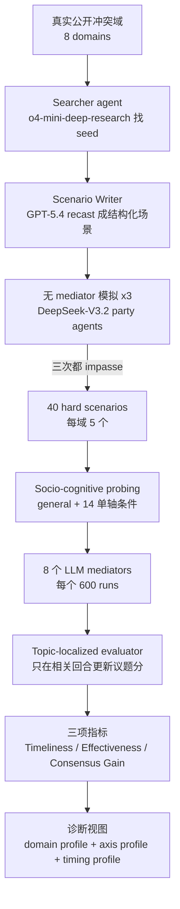

# Paper · 论文本身

## 一句话总结

SoCRATES 不是在教模型“怎么当调解员”，而是在造一把更靠谱的尺：先用 agentic deep research 从真实公开冲突里做出 40 个难调解场景，再把每个场景沿 5 根社会认知轴拆成 15 种条件，最后只在“某个议题真的被推进的回合”给这个议题打分，避免把无关回合的噪声算进调解效果。[^arxiv]

## 问题(Problem)

LLM mediator（LLM 调解员）评测很难，因为调解不是一道有标准答案的题。真实冲突里，双方会变情绪、换策略、绕开某个议题、突然在另一个议题上让步；一个 mediator 的价值也不只是最后有没有达成协议，而是它有没有在合适的时机、用合适的话，把某个僵住的议题往前推。

旧评测有三个坑。第一，场景少，常靠专家手写或固定语料，覆盖不了 healthcare、legal、public-policy、international 这类差异很大的冲突。第二，变化轴窄，很多工作主要改战略姿态，没把三方冲突、长历史、情绪反应、文化身份分开测。第三，评分粗，常见 per-turn judge 会在每一回合给每个议题都打分，哪怕这一回合根本没谈那个议题，导致 off-topic noise（无关话题噪声）一路累积。[^intro]

> [!key] 立场
> 这篇的价值不在“LLM 能不能调解人类冲突”这个大结论，而在它把开放式多轮社会交互评测拆成了一条可复用的工程流水线：真实种子场景、无 mediator 反事实基线、hard-task gate、单轴扰动、topic-localized judge、三指标读数。对 agent eval 来说，这比单个 leaderboard 更值得学，因为它回答的是“怎么避免评测尺本身在开放任务里乱晃”。

## 关键术语(Key terms)

| 术语 | 大白话解释 |
| --- | --- |
| **Proactive LLM mediation（主动式 LLM 调解）** | mediator 不是等冲突结束后写总结，而是在双方每轮发言之间决定“现在要不要插话、要说什么”。这把任务从单次建议变成了实时轨迹控制。[^task] |
| **Consensus Score（共识分）** | 对每个争议议题打 1-5 分，再映射到 0-1，表示截至某一回合双方在这个议题上靠近了多少。它是后面三项指标的底座。[^metrics] |
| **Consensus Gain（共识增益）** | 把有 mediator 的终局分数和无 mediator 的终局分数对比，看 mediator 关闭了多少“剩余共识缺口”。100 代表把缺口全关上，负数代表比不调解更糟。[^metrics] |
| **Topic-localized evaluator（议题局部化评估器）** | 像只在“谈房价”的回合评房价，不在“谈交房时间”的回合顺手改房价分。它先找出某个议题真正被讨论或立场变化的回合，只在这些回合更新分数，其余回合沿用上次分数。[^eval] |
| **Socio-cognitive axes（社会认知轴）** | 五种压力测试：战略姿态、参与方数量、历史长度、情绪反应、文化身份。大白话说，就是分别测 mediator 会不会读策略、记多人状态、吃长上下文、稳住情绪、适配文化。[^probing] |
| **Hard-task gate（难题筛选门）** | 每个候选场景先无 mediator 跑 3 次，只有 3 次都陷入 impasse（僵局）才留下。这样 mediator 的增益不是在容易自动和解的场景上刷出来。[^curation] |

## 核心方法(Core method)

可以把 SoCRATES 想成一套“调解员考试工厂”。

第一步，先找题。Searcher agent 用 o4-mini-deep-research 在 8 个冲突域里找公开真实纠纷，Scenario Writer 用 GPT-5.4 把报告式材料改写成可模拟的结构化场景：背景、参与方、争议议题、每方偏好权重。为了不把真实个人和组织带进仿真，场景会替换成虚构名称和数字，但保留真实冲突的结构关系。[^scenario]

第二步，先确定这题确实难。DeepSeek-V3.2 扮演 disputing parties（争议双方）做无调解模拟，每个候选跑 3 次。只有 3 次都不能自然达成共识，才进入正式 benchmark。最终留下 40 个 hard scenarios，每个域 5 个。[^curation]

第三步，把每道题拆成 15 个条件。除了 general baseline，作者分别改 5 根轴：3 种战略姿态、1 个三方版本、1 个 5x 历史版本、3 种情绪配对、6 种文化身份配对。关键点是“不叠加”，每次只改一根轴，避免最后发现模型坏了却不知道是情绪、文化还是多人状态导致的。[^conditions]

第四步，让 8 个 mediator 模型上场。每个模型在每个 scenario-condition pair 上跑一次，40 x 15 = 600 runs per mediator，总计 4,800 mediated runs，并配对无 mediator baseline。每个 party turn 前，mediator 先做 when-to-intervene 决策；若决定插话，再生成一条 utterance 插入对话。[^bench]

第五步，评估不再“每回合全议题打分”。Topic-localized evaluator 对每个议题读完整对话，只找这个议题被实质讨论或立场变化的回合，打 1-5 分并记录双方 stance；不相关回合沿用上次分数。最后从共识轨迹派生三项指标：Timeliness、Effectiveness、Consensus Gain。[^eval]

## 架构 / 流程

## 创新点(Innovation points)

| 创新 | 新在哪 | 为什么重要 |
| --- | --- | --- |
| Agentic scenario curation | 用 deep-research seed + scenario writer 自动扩展真实冲突域，而不是只靠少量专家手写 | 让 benchmark 覆盖 8 个域，避免只在 bargaining/legal 这种窄域上高估能力 |
| Hard-task gate | 无 mediator 跑 3 次都僵局才留下 | 给 Consensus Gain 提供反事实基线，减少“本来就会和解”的假增益 |
| 5 根社会认知轴独立扰动 | 战略、三方、长历史、情绪、文化分别改，不混在一起 | 读出来的是能力 profile，不只是一个平均分 |
| Topic-localized evaluator | 每个议题只在相关回合更新，off-topic 回合 carry forward | 直接修 per-turn judge 把无关内容算进分数的问题 |
| 三指标拆分 | Timeliness 看何时插话，Effectiveness 看插话后 5 回合提升，Consensus Gain 看终局缺口关闭 | 能区分“说得早”和“说得有用”，这在结果里很关键 |

## 实验 / 证据(Experiments / evidence)

**规模与设置，论文自报。** SoCRATES 最终包含 40 个 hard scenarios，8 个 domains，每个 domain 5 个；每个 scenario 扩成 15 conditions，所以每个 mediator 跑 600 次，8 个 mediator 总计 4,800 mediated runs，每个都有 no-mediator baseline。被测 mediator 为 2 个 proprietary models，GPT-5.4-mini、Gemini-3.1-Flash-Lite，以及 6 个 open-source/open-weight 或 API 可访问模型，Gemma-4-26B-A4B-it、Qwen3-30B-Instruct、Solar-Pro-3、Nemotron3-120B-A12B、DeepSeek-V3.2、Qwen3-235B-Instruct。模型名与 checkpoint 为论文自报，本文不把这些名称当作独立实测或官方最新声明。[^bench][^models]

**Evaluator validation，论文自报。** Topic-localized evaluator 与专家的一致性显著高于 baseline。两位 graduate annotators 标注 1,844 snippets，来自 144 mediator trajectories，inter-annotator agreement 为 Krippendorff's alpha = 0.86。主 evaluator 使用 DeepSeek-V3.2，Pearson r 如下：[^validation]

| Evaluator | Trajectory-level r | Outcome-level r |
| --- | ---: | ---: |
| Non-expert | 0.331 | 0.527 |
| ProMediate per-turn | 0.372 | 0.432 |
| SoCRATES topic-localized | **0.823** | **0.801** |

作者还用 Qwen3-235B-A22B-Instruct 替换 evaluator backbone 做验证，SoCRATES 仍有 0.785 trajectory-level r、0.721 outcome-level r，高于 ProMediate 的 0.423、0.394。[^validation2]

**Persona simulator validation，论文自报。** 作者只重点验证 persona fidelity，尤其是 emotional reactiveness。7 个 simulator backbone 每个抽 160 个 A/B pairs，总计 1,120 comparisons，每个由 3 位 MTurk annotators 标注，Krippendorff's alpha = 0.75。DeepSeek-V3.2 persona fidelity accuracy 最高，为 87.2%，所以被选作 party simulator。[^sim]

**Leaderboard，论文自报。** Project page 当前也展示同一组 leaderboard，但代码与数据仍标 Coming soon。核心指标如下：[^project]

| Mediator | Type | Timeliness | Effectiveness | Consensus Gain |
| --- | --- | ---: | ---: | ---: |
| GPT-5.4-mini | Closed | 79.9 | 24.6 | **34.4** |
| Gemini-3.1-Flash-Lite | Closed | 80.9 | 24.6 | 33.0 |
| DeepSeek-V3.2 | Open | 75.8 | 23.1 | 31.9 |
| Qwen3-235B | Open | 76.4 | **24.6** | 30.7 |
| Gemma-4-26B | Open | 79.0 | 18.1 | 21.0 |
| Nemotron-3-120B | Open | 72.0 | 19.2 | 20.4 |
| Solar-Pro-3 | Open | **84.6** | 16.7 | 19.9 |
| Qwen3-30B | Open | **84.6** | 19.7 | 15.7 |
| All-mediator avg. | - | 79.2 | 21.3 | 25.9 |

这里最重要的不是 GPT-5.4-mini 第一，而是第一也只有 34.4 Consensus Gain，大约只关掉无 mediator 留下缺口的三分之一。Solar-Pro-3 和 Qwen3-30B 的 Timeliness 最高，但 Consensus Gain 倒数，说明频繁早插话会抬高“及时性”，不等于真正推动共识。附录进一步报告 Intervention Frequency：Solar-Pro-3 为 32.3%，Qwen3-30B 为 31.1%，约为 top mediators 的两倍；它们 First Intervention 也更早，分别为 26.9% 和 25.3%。[^intervention]

**Domain effect，论文自报。** All-mediator average 的 Consensus Gain 从 Transactional 的 41.3 降到 Intra-organizational 的 16.6；作者指出，如果 benchmark 只集中在 transactional bargaining，就会高估 mediator 能力。单模型也有明显域差：GPT-5.4-mini 在 Transactional 为 55.6，在 Healthcare 只有 23.6；Qwen3-30B 在 Transactional 为 -7.9，在 Healthcare 为 48.6。[^domain]

**Socio-cognitive axes，论文自报。** 所有 mediator 至少在一根轴上收缩。战略姿态是最强 stress test：Competing 造成 18.9-64.1 的 Consensus Gain drop，Accommodating 造成 13.8-66.8 的 drop；emotion 中双 reactive 会让所有 mediator 下滑；culture 的影响最小但更系统，越偏离 U.S.-anchored values 越下降。[^axes]

**Robustness，论文自报。** 换 evaluator backbone 后，平均指标变化分别为 Timeliness -2.0、Effectiveness +3.9、Consensus Gain +0.6；Spearman rho 对 Effectiveness 为 0.862，对 Consensus Gain 为 0.786，但 Timeliness 只有 0.406，说明“相关回合选择”会影响及时性读数。重复 3 次 general-condition mediator runs 后，Consensus Gain ranking 的 Kendall's W = 0.929，8 个 mediator 中 6 个 half-range 在 ±3 points 内。[^stability]

> [!warn] 别被带偏
> 1. 这不是“LLM 可以真实调解人类纠纷”的证据。它是全 LLM 仿真 benchmark，真实人类、真实法律后果、现实权力关系都没有进入闭环。
> 2. Topic-localized evaluator 更稳，但仍是 LLM-as-judge。作者做了 expert correlation 与 backbone robustness，不等于它在所有冲突类型上就是 ground truth。
> 3. 文化轴不是多语调解。论文明确所有对话都用英语，文化身份通过 Hofstede profile 注入，这是为了隔离语言变量，也限制了外推。
> 4. Project page 当前 GitHub Code 与 HF SoCRATES 数据都标 Coming soon，本文不能把它写成已开源可复现。

## 限制与风险(Limitations and risks)

- **仿真不等于真人调解**：disputants、mediator、evaluator 都是 LLM 参与的系统；真实人的策略、信任、创伤、法律风险未被验证。
- **评价目标偏窄**：论文把 consensus 作为主结果，但调解质量还包括 party satisfaction、procedural fairness、trust restoration、emotional repair，作者明确把这些留作未来工作。[^limits]
- **文化轴有语言限制**：所有对话为英语，不能测试 multilingual mediation、翻译歧义、语言礼貌规范。
- **标注专家性有限**：consensus validation 的两位 graduate annotators 不是 professional negotiators，只是由有政治科学、国际关系、谈判外交训练的 researcher 监督 rubric。[^annotation]
- **单 simulator / evaluator 依赖仍存在**：主实验同时大量使用 DeepSeek-V3.2 做 party simulator 与 evaluator，虽然附录有替换 Qwen3-235B 的鲁棒性检查，但不是全量重跑所有模型组合。
- **代码与数据未发布**：截至 2026-06-10，项目页 GitHub Code 和 HF SoCRATES 均为 Coming soon，不能独立复现实验表。

## 先读什么(What to read first)

1. **Abstract + Introduction**：看清三条 gap，coverage、variation、scoring noise。[^intro]
2. **Section 3, Framework**：重点读 task formulation、hard scenario curation、15 conditions 和三项指标公式。[^method]
3. **Section 4, Validation**：不要先看 leaderboard，先确认 evaluator 有没有资格当尺。[^validation]
4. **Table 3 / Project leaderboard**：看 Timeliness、Effectiveness、Consensus Gain 的错位，尤其 Solar-Pro-3、Qwen3-30B。[^domain]
5. **Appendix H**：读 Intervention Frequency、evaluator backbone、simulator backbone、multi-run robustness，判断 benchmark 稳不稳。[^stability]

## 技术细节(选读)

### 1. Consensus Gain 怎么算

**大白话。** 如果无 mediator 时双方最后只达到 0.4 共识，那剩余缺口是 0.6；有 mediator 后到 0.7，就补了 0.3，等于关闭了一半缺口，Consensus Gain 是 50。它不是直接报“最终分数”，而是问 mediator 相对反事实基线做了多少贡献。

**精确机制。** 对每个 topic 的 1-5 agreement rating 先 remap 到 [0,1]，再跨 topic 平均为 Consensus Score。终局 Consensus Gain = `(S_med - S_unmed) / (1 - S_unmed) * 100`；若 `S_unmed = 1`，报告 raw change `S_med - S_unmed`。[^metrics]

### 2. Timeliness 和 Effectiveness 为什么要分开

**大白话。** 一个 mediator 可以很勤快，冲突一有风吹草动就插话，但每次说的都是空话；也可以少说，但一说就把关键议题往前推。SoCRATES 把“说得早”和“说得有用”分开，避免把刷存在感误当调解能力。

**精确机制。** Timeliness 找 `S_med` 相对前一回合下降至少 `tau = 0.1` 的 drop event，奖励 mediator 在接下来 `W = 10` turns 内越早介入。Effectiveness 对每次 intervention，看它之后 5 turns 的 consensus lift，并用剩余 headroom `1 - S_{i-1}` 归一化；负值代表干预后共识下降。[^metrics]

### 3. Topic-localized evaluator 的防噪声设计

**大白话。** 多议题谈判像一场会议，某 5 分钟只在谈“赔偿金额”，这时不该顺手更新“公开道歉”的分数。SoCRATES 的 judge 对每个议题单独找相关回合，只在相关回合重打分，其余时间保持上一次状态。

**精确机制。** Evaluator prompt 要求模型读取完整 conversation，对指定 topic 返回 `relevant_turns` 和每个相关 turn 的 `agreement_score`、`party_stances`；topic 未被触及时 score carry forward。主实验 evaluator backbone 是 DeepSeek-V3.2，temperature=0。[^evalprompt]

### 4. 防张冠李戴

SoCRATES 不训练 mediator，不做 RLHF/RLAIF，也不是提出新的 mediation policy。它的贡献是 benchmark/evaluation framework。把表里的 GPT-5.4-mini、Gemini-3.1-Flash-Lite 等名称写成“作者训练的模型”是错的；它们只是被测 mediator 或 pipeline/evaluator/party simulator 的 backbone，且名称与 checkpoint 来自论文自报。[^models]

## 后续演化 · 这方法后来怎样了

截至 2026-06-10，我检索到的是 arXiv、HF paper page、项目页、若干摘要型 digest/讨论与视频，没有找到可核验的正式后续论文或代码仓库在 SoCRATES 基础上扩展/替换/复现。_[置信度:高]_[^forward]

短期最值得盯的不是引用，而是项目页的两个 Coming soon：GitHub Code 和 HF SoCRATES 数据。一旦发布，才能把本文从“论文自报 benchmark”推进到可复现实测。_[置信度:高]_[^project]

[^arxiv]: arXiv:2606.05563, *SoCRATES: Towards Reliable Automated Evaluation of Proactive LLM Mediation across Domains and Socio-cognitive Variations*, submitted 2026-06-04. https://arxiv.org/abs/2606.05563
[^intro]: 同上，Introduction，三项 challenge：scenario coverage、multiple independent axes、trajectory-aware/noise-resilient evaluation。
[^task]: 同上，Section 3.1 Task Formulation，mediator observes shared input but not private persona/stance/preferences, decides when and how to intervene.
[^curation]: 同上，Section 3.2 Agentic Scenario Curation，Searcher、Scenario Writer、simulation-based filtering，3 次 unmediated impasse 才保留，最终 40 scenarios。
[^scenario]: 同上，Appendix C Agentic Scenario Construction Details，seed search、scenario recast、preference weighting、party agent prompt。
[^probing]: 同上，Section 3.3 Socio-Cognitive Probing；Appendix D 列出 15 conditions。
[^conditions]: 同上，Appendix D, Table “The 15 conditions per scenario”：General 1、Strategic 3、Party 1、History 1、Emotion 3、Culture 6。
[^metrics]: 同上，Section 3.4.1 Benchmark Metrics，Intervention Timeliness、Intervention Effectiveness、Consensus Gain 公式。
[^eval]: 同上，Section 3.4.2 Automatic Evaluation，topic-localized evaluator with DeepSeek-V3.2 backbone。
[^evalprompt]: 同上，Appendix E Topic-Localized Evaluation Prompts，judge temperature=0，返回 relevant_turns、agreement_score、party_stances。
[^validation]: 同上，Section 4 Validation，Table “Evaluator alignment with experts”：Non-expert 0.331/0.527，ProMediate 0.372/0.432，SoCRATES 0.823/0.801；1,844 snippets、144 trajectories、alpha=0.86。
[^validation2]: 同上，Appendix F.2 Backbone Robustness，Qwen3-235B-A22B-Instruct evaluator backbone：ProMediate 0.423/0.394，SoCRATES 0.785/0.721。
[^sim]: 同上，Section 4 Simulation Fidelity 与 Appendix F.1，7 backbones、160 A/B pairs per simulator、1,120 comparisons、alpha=0.75、DeepSeek-V3.2 87.2。
[^bench]: 同上，Section 5 Benchmarking LLM Mediators，8 mediators，40 x 15 = 600 runs per mediator，4,800 total。
[^models]: 同上，Appendix B Model Specifications，列出 open-source/proprietary checkpoints 与 API/HF 来源；这些为论文自报。
[^domain]: 同上，Table 3 / Section 5.1，domain-wise Timeliness、Effectiveness、Consensus Gain。
[^axes]: 同上，Section 5.2，Figure 2-4，strategy/emotion/culture shifts 与 timing adaptation。
[^intervention]: 同上，Appendix H.1 Intervention Analysis，Intervention Frequency 与 First Intervention 表。
[^stability]: 同上，Appendix H.2 Benchmark Stability Analysis，evaluator backbone robustness、simulator backbone robustness、multi-run robustness。
[^limits]: 同上，Limitations，English-only cultural setting 与 consensus-only outcome。
[^annotation]: 同上，Appendix F.2 Consensus Alignment Annotations，graduate annotators、non-expert baseline、supervised protocol。
[^project]: Project page, checked 2026-06-10：GitHub Code 与 HF SoCRATES 均标 “Coming soon!”；leaderboard 展示 8 mediator 的三项指标。https://disl-lab.github.io/SoCRATES/
[^forward]: 2026-06-10 web search for `"SoCRATES" "Proactive LLM Mediation"`、`"2606.05563" "SoCRATES"`、`"SoCRATES" "topic-localized evaluator" mediation`，未发现正式后续论文或可 clone 代码仓库。
