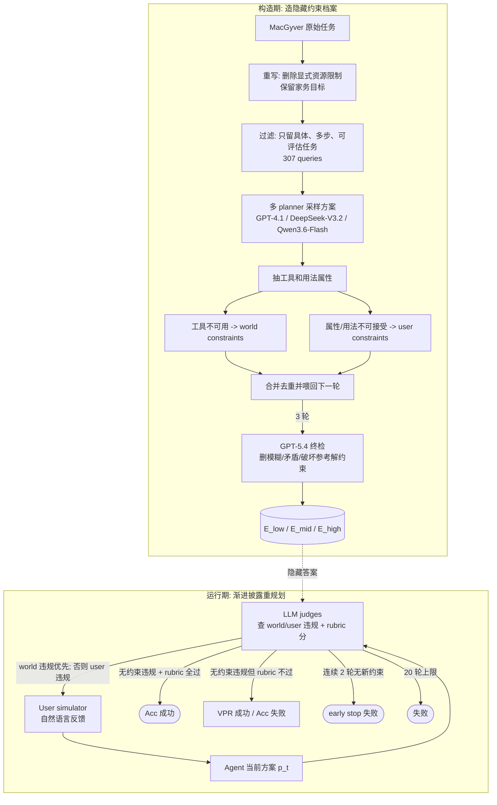

# Paper · 论文本身

## 一句话总结

AdaPlanBench 把一个很真实、也很烦的 agent 场景做成了基准：**用户和世界的约束不会开局全告诉你，只有你的方案撞墙了才暴露**。它用 307 个家务任务，给每题藏一组世界约束(world constraints，家里没有什么/什么不能用)和用户约束(user constraints，用户讨厌什么用法/属性)，让模型多轮改计划；最强的 GPT-5 在中档约束下也只有 67.75% accuracy。[^arxiv]

## 问题(Problem)

现实里的规划很少像考试题那样把条件一次写完。你让 agent “把皱衬衫弄平”，真实世界可能没有熨斗；用户也可能不想用会产生高温的工具。agent 往往是先提一个方案，然后才从用户反馈里知道“这个不行”。[^method]

旧基准常常只测一边：有的测用户偏好，有的测工具/环境限制；有的把约束直接写在题面，有的动作空间很小，不能看出开放式重规划能力。AdaPlanBench 要测的是更难的一件事：**在开放解空间里，约束逐步暴露，agent 能不能一边记住旧反馈，一边想出新的可行方案**。[^related]

> [!key] 立场
> 这篇不是在发明一个新 planner，而是在给 agent eval 补一个很缺的测量仪表：把“会不会适应”从一句空话拆成 dual constraints、progressive disclosure、VPR/Acc 背离、重复违规、试探强度这些可量化信号。对做产品的人，最值得学的不是 “GPT-5 多少分”，而是它证明了两件事：**合规不等于办成事**，以及**把约束贴回上下文只解决一小半问题**。

## 关键术语(Key terms)

| 术语 | 大白话解释 |
| --- | --- |
| **adaptive planning(自适应规划)** | 像做饭时发现没有盐，就不能只是重复原菜谱，而要改用酱油/香料重新组织步骤。这里指模型收到反馈后持续改计划。[^arxiv] |
| **world constraints(世界约束)** | 环境的硬限制：某个工具不存在、坏了、不能用。例如 “there is no iron at home”。它限制的是“世界允许你做什么”。[^method] |
| **user constraints(用户约束)** | 用户偏好或禁忌：不想用高温、噪音、锋利、湿法等工具/用法。它限制的是“用户愿不愿意接受这种做法”。[^method] |
| **progressive disclosure(渐进披露)** | 约束先藏起来；模型方案违反哪条，用户模拟器才告诉它哪条。不是读题理解考试，而是边撞边学。[^runtime] |
| **constraint profile(约束档案)** | 每道题背后的隐藏约束包，写作 \(\mathcal{E}=(\mathcal{B}_w,\mathcal{B}_u)\)。论文用 low/mid/high 三档控制约束密度。[^stats] |
| **VPR(Valid Plan Rate)** | 最后有没有停在“满足全部世界/用户约束”的方案上。它只看约束是否满足，不保证方案真的有效。[^metrics] |
| **Acc.(accuracy)** | 更严格：最后方案既满足全部约束，又要过 rubric 质量门。AdaPlanBench 里 Acc. 明显低于 VPR。[^metrics] |
| **AWRV / AURV** | 平均每题重复违反已披露世界/用户约束的次数。它测的是“我都提醒过你了，你还踩不踩”。[^metrics] |
| **ATWC / ATUC** | 每轮平均触发的新世界/用户约束数。可以看作模型探索隐藏约束空间的强度，但高不一定在产品里就是好事。[^metrics] |

## 核心方法(Core method)

可以把 AdaPlanBench 想成一个“带隐藏规则的家务教练”。它先给你目标，不告诉你家里缺什么、用户讨厌什么；你每交一个方案，教练拿隐藏规则检查，撞到哪条就只告诉你哪条，然后让你重写。

**构造期**先从 MacGyver 数据集中筛出 307 个具体家务任务，删除原题里的显式资源限制，让动作空间重新打开。然后用多 planner 迭代挖约束：GPT-4.1、DeepSeek-V3.2、Qwen3.6-Flash 采样候选方案；从方案里抽工具，把工具不可用变成世界约束；再从工具/用法抽属性，把“高温、噪音、锋利、脏乱”等变成用户约束；每轮合并去重，下一轮再让 planner 在已发现约束下想新方案。三轮分别形成 low/mid/high 三档。最后 GPT-5.4 过滤掉模糊、矛盾或让参考解无解的约束。[^construction]

**运行期**每轮做三件事：agent 提 plan，LLM judges 查它是否违反世界约束、用户约束和 rubric 质量门，user simulator 把被选中的违规约束改写成自然语言反馈。关键细节是：如果世界约束和用户约束同时被违反，系统**优先披露世界约束**；只有没有世界约束违规时才披露用户约束。[^runtime]

成功不是“别再违规”这么简单。一个轨迹只有在最终方案同时满足全部 world/user constraints，并且 rubric 平均分每个维度都达到 \(\gamma=4\) 时，才算 accuracy 成功；如果只是约束满足但物理上荒唐、步骤无效，就只会贡献 VPR，不贡献 Acc.。[^metrics]

## 架构 / 流程

## 创新点(Innovation points)

| 创新 | 新在哪 | 为什么重要 |
| --- | --- | --- |
| 双约束同测 | 同时藏世界硬限制和用户偏好限制，而不是只测一边 | 真实 agent 既要知道“家里有什么”，也要知道“用户接受什么” |
| 约束渐进披露 | 约束不写进题面，只有方案违规才披露 | 测的是反馈后重规划，不是一次性读题能力 |
| 自动可扩展约束构造 | 多 planner 采样 -> 抽工具/属性 -> 合并 -> 终检，三轮形成 low/mid/high | 让约束密度可控，后续能换领域复用 |
| Acc 与 VPR 分离 | 守住约束不代表方案有效 | 防止“很听话但没用”的 agent 在评测里假高分 |
| 试探强度指标 | ATWC/ATUC 量化每轮触发多少隐藏约束 | 让“主动探索”从主观观感变成可诊断信号 |
| 早停机制 | 连续 2 轮没有新约束被触发就判原地打转 | 防止 agent 一直烧轮次、重复踩已披露限制 |

## 实验 / 证据(Experiments / evidence)

**数据规模与约束密度(论文自报 + 仓库实读)**：AdaPlanBench 发布 307 个 household planning queries；仓库数据每条有 6 个 profile，论文主实验使用前 3 档 low/mid/high，README 说明 profile 4–6 额外作为 stress testing 发布。论文 Table 2 的平均约束数是：low 世界 9.76 / 用户 10.91；mid 世界 19.61 / 用户 21.78；high 世界 37.73 / 用户 41.79。[^stats][^repo]

**主结果：中档约束 \(\mathcal{E}_{mid}\)(论文自报，Table 3)**[^main]

| Model | Acc. % | VPR % | Avg Turns | AWRV | AURV | ATWC | ATUC |
| --- | ---: | ---: | ---: | ---: | ---: | ---: | ---: |
| Qwen3-8B | 14.38 | 82.35 | 4.493 | 0.242 | 0.614 | 0.608 | 1.888 |
| Qwen3-14B | 17.26 | 73.62 | 4.785 | 0.296 | 0.821 | 0.668 | 2.042 |
| Qwen3-32B | 17.92 | 80.13 | 5.010 | 0.150 | 0.645 | 0.609 | 2.082 |
| Llama-3.3-70B-Instruct | 29.32 | 83.71 | 4.619 | 0.114 | 0.537 | 0.668 | 1.830 |
| DeepSeek-v4-Flash | 35.53 | 76.97 | 6.385 | 0.464 | 0.895 | 0.977 | 2.657 |
| Gemini-3-Flash | 43.32 | 90.23 | 5.824 | 0.065 | 0.391 | 0.756 | 2.442 |
| Gemini-3.1-Pro | 34.53 | 91.21 | 5.651 | 0.124 | 0.251 | 0.769 | 2.236 |
| GPT-5 | 67.75 | 89.58 | 6.212 | 0.199 | 0.195 | 1.191 | 3.269 |
| GPT-5-Mini | 61.89 | 85.34 | 5.886 | 0.322 | 0.322 | 1.318 | 3.391 |
| GPT-5-Nano | 42.35 | 67.75 | 5.541 | 0.971 | 0.355 | 1.089 | 2.468 |

**几个更该记住的诊断结论：**

- **VPR 高不等于任务成功**：Gemini-3.1-Pro 和 Gemini-3-Flash 的 VPR 都超过 90%，但 Acc. 都低于 45%。它们相对少重复违规，却经常给不够有效或物理上不靠谱的最终方案。[^main]
- **重复踩用户约束更多**：10 个模型平均每题重复违反已披露世界约束 0.295 次，重复违反已披露用户约束 0.503 次；平均 17.91% 的题因为连续两轮没有触发新约束而 early stop。[^main]
- **试探强度与准确率强相关**：accuracy 与 ATWC 的相关系数是 0.898，与 ATUC 是 0.919。论文解释为：更强模型能提出更多样的修订方案，从而更快暴露隐藏约束。[^main]
- **约束越多越崩**：从 low 到 mid 到 high，accuracy 和 VPR 都下降；轮次越深，rubric 分数整体也下降。论文没有在主文逐格给出所有 low/high 数值，读图细数以原文 Figure 2 为准。[^analysis]
- **最弱的是 effectiveness 和 physical**：\(\mathcal{E}_{mid}\) 下四个主 rubric 平均分为 feasibility 4.691、physical 4.080、effectiveness 3.715、safety 4.564。也就是说模型最容易输在“物理上真能不能这样做”和“做完到底有没有用”。[^rubric]
- **“贴回约束”只救合规，不救效果**：把所有已披露约束每轮显式放回输入，3/4 个被测模型 Acc. 提升小于 3%，但 VPR 通常提升 5%–15%。论文判断：瓶颈不是简单遗忘，而是带着约束重新设计有效方案。[^memory]
- **rubric 反馈会修新坏旧**：给失败方案追加 rubric 反馈并允许 1–6 轮修订，Acc. 只提升约 10%，但 VPR 对两个开源模型约降 40%，对两个闭源模型约降 20%。论文把它解释成 recency-biased adaptation：模型优先修刚收到的新问题，破坏已满足的旧约束。[^refine]
- **人工校准(论文自报)**：构造期 checker 在 30 个采样实例上与 3 位标注者多数票对照，平均过滤 42.18% 约束，false negative 2.31%、false positive 3.72%；运行期 judge 在 30 条轨迹、166 个 turn-level instances 上与人类多数票 89.76% exact match，161/166 次与人类差不超过 1 个约束。另一个人类标注 study 招募 8 位 PhD-level annotators、240 条轨迹，反馈合理性均分 4.45、约束清晰度 4.66；8 个 rubric 里除 Physical plausibility 和 Effectiveness 外，6 个维度至少 60% exact agreement，超过 80% 的 rubric 分差不超过 1 分。[^judge][^human]
- **统计区间(论文自报)**：Table 7 给 307 样本上的 95% Wald CI，例如 GPT-5 为 67.75 ± 5.23，GPT-5-Mini 为 61.89 ± 5.43，Gemini-3-Flash 为 43.32 ± 5.54。[^ci]

**仓库实读**：GitHub 仓库当前包含 `domain_metadata/housing/final/query_housing_macgyver_resample.json`、运行器 `env/run.py`、评测聚合 `env/eval_main_table.py`、judger、tracker、constraint construction utilities；README 自称 MIT license，但仓库页面未在我们本轮源码快照里看到独立 `LICENSE` 文件，许可状态以仓库后续为准。默认 `run_config.yaml` 中 `max_turns: 20`、`early_stop: true`、`early_stop_mode: no_new_violation`、`no_new_violation_round_limit: 2`，与论文设置一致。[^repo]

> [!warn] 别被带偏
> 1. **裁判和赢家同家族**：世界/用户 constraint judge 用 GPT-5.4，最强结果来自 GPT-5 系；论文做了人工校准，但没有展示“换模型家族当裁判”的交叉验证，家族偏置仍是风险。
> 2. **ATWC/ATUC 高不是产品目标**：在这个协议里，触发隐藏约束靠提出违规方案；评测上这表示探索，产品上可能就是反复让用户纠错。
> 3. **它测的是文本规划，不是机器人执行**：论文明确把视觉、导航、低层控制抽掉，只隔离 planning under incomplete information。物理合理性仍由文本 judge 评估，不是真实执行验证。[^scope]

## 限制与风险(Limitations and risks)

- **领域窄**：只覆盖 household tasks；旅行、办公、机器人、软件运维里的约束分布可能不同。[^limit]
- **评测链路依赖 LLM judges**：虽然有 3 judge 平均、人类抽验、阈值 ablation，但主结果仍是 LLM-as-judge 体系。[^judge]
- **用户偏好被简化为属性禁忌**：例如“不喜欢高温/噪音/脏乱”，这利于评测，但真实偏好往往可协商、上下文依赖更强。[^attribute]
- **没有 human baseline**：论文说 current LLM agents 很难，但没有给人类在同协议下的成功率；“67.75% 到底离人多远”数据不足。
- **成本账未披露**：一次评测要多轮 agent 调用 + world/user judge + rubric judges + user simulator；API 成本和延迟以原文未披露为准。

## 先读什么(What to read first)

1. **Abstract + Figure 1**：先抓住“隐藏双约束 + 违规才披露”的主设定。
2. **§3 Benchmark Construction**：看约束怎么从多 planner 方案里自动挖出来。
3. **§3.2 Interaction Protocol**：看世界优先披露、early stop、rubric pass 的规则。
4. **Table 3 + §4 Results**：主数字和 VPR/Acc 背离。
5. **§5 Analysis**：约束负担、memory intervention、rubric refinement、用户约束难度。
6. **Appendix C/F**：模型选择、人工校准、阈值和 CI；判断可信度必须读。
7. **GitHub `env/run_utils/runner.py` / `tracker.py` / `eval_main_table.py`**：看协议在代码里怎么落地。

## 技术细节(选读)

### 约束构造不是“人工随便写一堆禁忌”

**大白话**：作者不是坐下来手写“家里没有 A、用户讨厌 B”。他们让多个模型先想很多解法，然后把这些解法依赖的工具和属性反过来变成约束。像先让不同人想“怎么去皱”，有人说熨斗，有人说蒸汽，有人说重物压平；系统就能生成“没有熨斗”“不喜欢高温”“不想用重物压衣服”等约束。

**精确机制**：Appendix A 把构造形式化为 \(R=3\) 轮。每轮 planner \(j\) 生成多个 candidate plans；world 侧从 plan 直接抽 unavailable/unusable tools；user 侧先抽 tools，再结合 query、plan、reference solution 推断偏好约束；之后 planner-level merge，再 round-level aggregation + checker validation。low/mid/high 分别对应第 1/2/3 轮输出。[^construction]

### 运行时“披露什么”与“评估什么”不是同一件事

**大白话**：用户每轮只告诉 agent 一类问题，但裁判心里拿着完整答案。比如方案同时用了不存在的熨斗、也违反“不要高温”，反馈可能只说“没有熨斗”；但评估时两条都会被记录。

**精确机制**：Appendix C.2 定义 \(\widehat{V}_t\)：若 \(V_t^w\neq \emptyset\)，披露世界约束；否则若 \(V_t^u\neq \emptyset\)，披露用户约束；否则披露空集。底层每轮仍用完整 \(\mathcal{E}\) 检查 \(V_t^w,V_t^u\)，重复违规只按已经披露的历史计算。[^runtime]

### Acc. 和 VPR 的差别是这篇最重要的评测设计

**大白话**：一个 agent 可以“没有再踩禁忌”，但给了一个没用的办法。比如不再用熨斗，却建议把衬衫压在床垫下一小时；这可能满足“没有熨斗/不要高温”，但 effectiveness 很差。

**精确机制**：VPR 只要求 terminal plan 的 \(V^w=V^u=\emptyset\)。Accuracy 还要求 \(\mathrm{RubPass}=1\)，即所有 rubric 维度的 3 judge 平均分都不低于 \(\gamma=4\)。这也是 Gemini 系 VPR 高但 Acc. 低的原因。[^metrics]

### 防张冠李戴：AdaPlanBench 不是 RL、也不是主动澄清 benchmark

**大白话**：别把它讲成“模型学会问问题”或“训练出新策略”。它只是一个评测环境：模型只能通过提交方案、收到违规反馈来暴露约束。

**精确机制**：论文没有提出 RL/SFT/GRPO 训练方法，也没有让 agent 主动问澄清问题作为主要动作；所谓 proactive exploration 是在该协议下通过提出计划触发隐藏约束。把 TO-GATE/STaR-GATE 那类 preference elicitation 训练方法归到 AdaPlanBench 上是错的。[^related]

## 后续演化 · 这方法后来怎样了

截至本轮核验日期 2026-06-10，AdaPlanBench 是 2026-06-04 刚提交的预印本，未见可确认的“后续继承/改进 AdaPlanBench”的论文。下面列的是独立核到的前序或同期邻近赛道，不能反说成 AdaPlanBench 的后续引用。

- **ADAPT: Benchmarking Commonsense Planning under Unspecified Affordance Constraints**(arXiv:2604.14902) —— 前序邻近：测 embodied agents 在未显式说明的动态 affordance constraints 下是否能适应，偏世界/物体可用性，不是 AdaPlanBench 的双约束文本家务协议。_[置信度:高]_[^adapt]
- **SEQUOR: A Multi-Turn Benchmark for Realistic Constraint Following**(arXiv:2605.06353) —— 前序邻近：长多轮对话中的约束跟随，关注 conversation constraint accumulation；和 AdaPlanBench 共享“约束累积导致退化”的问题意识，但不测开放式家务重规划。_[置信度:高]_[^sequor]
- **Agent Planning Benchmark (APB): A Diagnostic Framework for Planning Capabilities in LLM Agents**(arXiv:2606.04874) —— 同期邻近：规划能力诊断基准，覆盖 holistic planning、feedback-conditioned step-wise planning、broken tools、unsolvable tasks 等；比 AdaPlanBench 更宽，AdaPlanBench 更聚焦渐进披露双约束。_[置信度:高]_[^apb]

[^arxiv]: arXiv:2606.05622, *AdaPlanBench: Evaluating Adaptive Planning in Large Language Model Agents under World and User Constraints*, submitted 2026-06-04. https://arxiv.org/abs/2606.05622；本轮同时下载核对 PDF(56 pages)与 arXiv TeX source。
[^related]: 论文 Related Work 与 Appendix Discussion：对比 PlanBench、NATURAL-PLAN、FlowBench、AppWorld、UserBench、PrefEval、TravelPlanner、tau-bench 等，强调现有基准少有 progressive disclosure + dual constraints + open-ended iterative replanning 同时具备。
[^method]: 论文 §3.1 Data Construction：每个实例映射为 \((q,\mathcal{E})\)，\(\mathcal{E}=(\mathcal{B}_w,\mathcal{B}_u)\)。
[^construction]: 论文 §3.1 与 Appendix A.1/A.2：query rewriting/filtering、multi-planner iterative sampling、constraint extraction/merge/check；planner samplers 为 GPT-4.1、DeepSeek-V3.2、Qwen3.6-Flash，checker 为 GPT-5.4。
[^stats]: 论文 Table 2：三档平均约束数，low 9.76/10.91，mid 19.61/21.78，high 37.73/41.79。
[^runtime]: 论文 §3.2 与 Appendix C.2：runtime interaction、termination、single-type revelation rule、world-first feedback policy。
[^metrics]: 论文 §4 Metrics 与 Appendix C.3：Acc、VPR、Avg Turns、AWRV/AURV、ATWC/ATUC 的公式；rubric pass threshold \(\gamma=4\)。
[^main]: 论文 Table 3 与 §4 Results：\(\mathcal{E}_{mid}\) 下 10 个模型主结果、相关系数、平均重复违规与 early stop 比例。
[^analysis]: 论文 §5 Analysis，Figure 2/3：约束负担与交互轮次增加时性能下降。图中逐格读数不在正文表格列出，细值以原文图为准。
[^rubric]: 论文 Table 4 与 Appendix Table 5：\(\mathcal{E}_{mid}\) 下 rubric 分数。
[^memory]: 论文 §5 “Instant constraint tracking module” 与 Appendix C.5：每轮显式追加已披露约束的干预实验。
[^refine]: 论文 §5 “Rubric-based feedback” 与 Appendix C.6：rubric refinement 只在约束已满足但 rubric 失败时追加反馈。
[^judge]: 论文 Appendix C.1 Model Choice：M_chk 与 runtime judges 的人工验证；30 sampled evaluation instances、30 trajectories、166 turn-level instances。
[^human]: 论文 Appendix F Human Annotation：8 PhD-level annotators、240 annotated trajectories、Q1/Q2 与 Q3-Q10 对齐分析。
[^ci]: 论文 Appendix Table 7：307 samples 上 accuracy 的 95% Wald confidence intervals。
[^scope]: 论文 Appendix D.4 “Significance of AdaPlanBench”：说明抽掉 perception/navigation/low-level control，以隔离 adaptive planning。
[^limit]: 论文 §6 Limitations：家庭任务域、LLM judge、开放解空间 canonicalization、纯文本抽象等限制。
[^attribute]: 论文 Appendix D.3：world constraints 以 tool/object availability 表达，user constraints 以 tool/action attribute preference 表达。
[^repo]: 官方仓库 `JiayuJeff/AdaPlanBench`，本轮 clone 到本地读取 commit `ec191d9`，包含 README、`env/run.py`、`run_utils`、`domain_metadata/housing/final/query_housing_macgyver_resample.json`。https://github.com/JiayuJeff/AdaPlanBench；HF dataset 页面说明 307 household planning queries。https://huggingface.co/datasets/JiayuJeff/AdaPlanBench
[^adapt]: arXiv:2604.14902, *ADAPT: Benchmarking Commonsense Planning under Unspecified Affordance Constraints*. https://arxiv.org/abs/2604.14902
[^sequor]: arXiv:2605.06353, *SEQUOR: A Multi-Turn Benchmark for Realistic Constraint Following*. https://arxiv.org/abs/2605.06353
[^apb]: arXiv:2606.04874, *Agent Planning Benchmark: A Diagnostic Framework for Planning Capabilities in LLM Agents*. https://arxiv.org/abs/2606.04874
