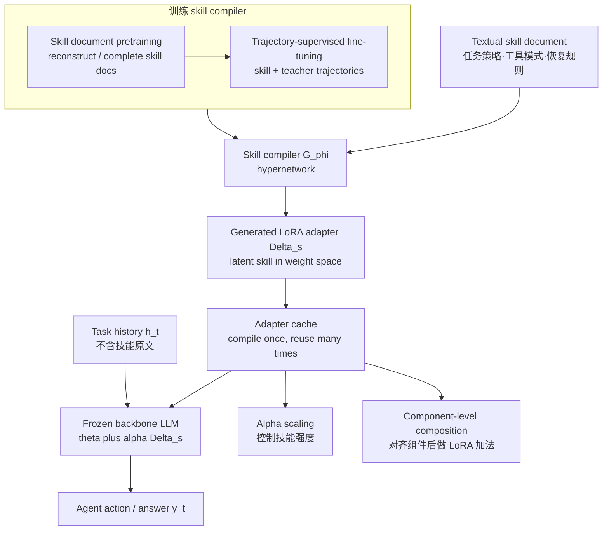

# Paper · 论文本身

## 一句话总结

LatentSkill 想解决的是一个很工程的问题：agent 的“技能文档”如果每一步都塞进 prompt，会占上下文、涨 prefill token、还把技能明文暴露出来；它的做法是训练一个 **skill compiler(技能编译器)**，把文本技能一次性编成可插拔的 **LoRA adapter(低秩权重补丁)**，执行时只挂权重，不再把技能原文反复喂给模型。[^arxiv]

## 问题(Problem)

很多 agent 系统把“技能”写成自然语言：比如“遇到找物品任务时，先系统搜索容器，再执行拿取动作；失败后如何恢复”。这很直观，也方便人改，但有三个麻烦：

- **每一步都重复带技能文本**：长任务里 agent 要多轮决策，同一份技能说明会反复进入上下文。
- **技能和环境文本挤在同一个 instruction channel**：外部观察、网页、工具结果和技能文本混在 prompt 里，提示注入或恶意覆盖更容易干扰它。
- **直接微调又太死**：把技能永久写进 backbone 参数可以省 prompt，但技能就不容易单独更新、卸载、替换、缩放或组合。[^intro]

所以这篇的核心问题不是“怎么再写一份更好的 skill prompt”，而是：**能不能让技能像插件一样存在于权重空间，同时保留 prompt skill 的可替换性？**

> [!key] 立场
> 这篇值得看，不是因为它证明“LoRA 一定比 prompt 好”，而是因为它把 agent skill 的承载介质从 **context space(上下文空间)** 推到 **weight space(权重空间)**，并且保留了三个工程师真正在意的接口：可缓存、可缩放、可组合。它给 AI-Brief / 自进化 agent 最有价值的启发是：长期复用的知识不一定永远以文本记忆形式检索进来，有些可以被编译成参数补丁；但它还只是两类 benchmark 上的初步证明，仓库也尚未开放训练/推理源码，不能当成可直接落地的成熟系统。

## 关键术语(Key terms)

| 术语 | 大白话解释 |
| --- | --- |
| **textual skill(文本技能)** | 像 SOP 一样写在文档里的可复用 procedure：任务策略、工具使用模式、失败恢复规则。传统做法是在 agent 每步决策时把它贴进 prompt。[^intro] |
| **latent skill(潜技能 / 权重技能)** | 同一份技能不再以可读文本出现，而是被 skill compiler 编成 LoRA 权重补丁；执行时模型看不到技能文档，只感受到这块权重对行为的偏置。[^method] |
| **LoRA adapter(低秩适配器)** | 可以理解成“不重写整本说明书，只在关键页贴几条小补丁”。它给 frozen backbone 的某些矩阵加低秩更新，本文把每个技能编成一组这样的更新。[^method] |
| **hypernetwork(超网络)** | 一个“会生成另一个网络权重”的网络。这里的 skill compiler 读技能文本，然后吐出对应 LoRA 权重；它不是每个技能单独训练一次 LoRA，而是一次前向生成。[^related] |
| **injection coefficient α(注入系数)** | 控制 LoRA 补丁影响力的旋钮。α 太小技能没激活，α 太大又会压坏 backbone 原能力，所以论文专门扫了 α 曲线。[^scale] |
| **parameter-space arithmetic(参数空间算术)** | 不是把两段技能文本拼起来，而是在 LoRA 权重上做加法/组合。论文发现只有先把技能拆成对齐组件，再组合组件 LoRA，才比较稳定。[^compose] |

## 核心方法(Core method)

可以把 LatentSkill 想成“把技能文档从便利贴变成可插拔刀头”：

1. **训练一个 skill compiler**：它读入技能文档 `s`，输出一组 LoRA 更新 `Δs = Gφ(s)`。backbone LLM 的参数 `θ` 冻住不动，执行时变成 `θ ⊕ αΔs`。[^method]
2. **先做技能文档预训练**：给 compiler 看大量 GitHub 技能文档，让它学会把 procedure text 压进 adapter。预训练任务有两类：重建完整技能文档、从截断前缀补全文档。[^pretrain]
3. **再做轨迹监督微调**：给 compiler 看“技能文档 + teacher agent trajectory”。同一个 skill LoRA 挂完整条轨迹，让它学到跨多步稳定生效的行为偏置，而不是只记某一步答案。[^sft]
4. **推理时缓存与挂载**：技能库里的每个技能可以预先编译成 adapter cache。任务来了，selector 选相关技能，挂上对应 LoRA，用 α 控制强度。技能原文不再进入 prompt。[^method]
5. **组合时先拆组件再相加**：如果两个技能有共享部分，直接把完整 LoRA 相加会重复放大共享行为；本文更推荐把技能拆成 general / task-specific / mistakes 等语义组件，分别编译后再组合。[^compose]

这和“压缩 prompt”有关键区别：压缩 prompt 仍然是在输入侧塞一个短表示；LatentSkill 是把可复用过程知识变成参数侧的可挂载补丁。

## 架构 / 流程

## 创新点(Innovation points)

| 创新 | 新在哪 | 为什么重要 |
| --- | --- | --- |
| 技能从 context 搬到 LoRA weight | 不是每步检索/拼接 skill text，而是由 hypernetwork 生成 adapter | 同时减少重复 token、降低明文暴露、保留模块化加载 |
| 两阶段 compiler 训练 | 文档级预训练负责“懂技能文本”，轨迹 SFT 负责“把技能变成稳定行为” | 避免只做文本重建，强化 agent 多步决策里的行为一致性 |
| α 连续控制 | 技能影响不是有/无二值开关，而是可扫强度曲线 | 工程上可以按任务难度调节，不必每个技能都满强度挂载 |
| 组件级 skill arithmetic | 明确指出完整 LoRA 直接相加会干扰，文本拼接也会 OOD | 给“多技能组合”提出了更细粒度的安全组合原则 |
| 权重空间结构分析 | 用 MDS、相似度、低秩分析说明生成 LoRA 不是纯黑箱噪声 | 让“权重技能”有可解释空间，而不是只看最终分数 |

## 实验 / 证据(Experiments / evidence)

**实验设置(论文自报)**：所有实验使用 **Qwen3-8B** 作为 frozen backbone；skill compiler 是 Transformer-based hypernetwork。预训练数据约 **171K** 个去重 GitHub skill documents，约 **300M tokens**；预训练在 **8×H100** 上跑 **10 epochs**，batch size **64**，learning rate **5e-5**。SFT 使用 SkillRL 释放的 teacher trajectories：**237** 条完整 ALFWorld 轨迹和 **500** 条完整 Search-QA 轨迹；SFT 同样 **8×H100**、**10 epochs**，batch size **32**，learning rate **1e-5**。[^train]

**评测设置(论文自报)**：ALFWorld 在 seen split **140 episodes**、unseen split **134 episodes** 上评 success rate，每个 episode 最多 **50 steps**，按任务类别匹配技能，不做检索。Search-QA 每个数据集随机采样 **500** 例，Bamboogle 用全量 **125** 例；E5 retriever top-k=**3**，每个 query 最多 **4** 次检索，指标是 Exact Match。[^eval]

**主结果 1：ALFWorld。LatentSkill 对同一份 skill 内容的 in-context baseline 有明显优势(论文自报 Table 1)。**[^alf]

| Split | In-context Skill Avg | LatentSkill Avg | 提升 | Prefill token/step | Decode token/step |
| --- | ---: | ---: | ---: | ---: | ---: |
| Seen | 52.9 | 74.3 | +21.4 | 1.21k → 0.44k | 0.50k → 0.34k |
| Unseen | 56.0 | 69.4 | +13.4 | 1.23k → 0.44k | 0.61k → 0.51k |

ALFWorld 里最醒目的单项是 unseen Pick2：LatentSkill **70.6%**，第二名 AdaPlanner / In-context Skill 都是 **29.4% / 23.5%** 附近，论文正文称其超过 second-best **41.2 points**。但它也不是每格都赢：比如 seen Clean 是 In-context Skill **70.4%**，LatentSkill **63.0%**；unseen Clean 是 In-context Skill **74.2%**，LatentSkill **64.5%**。[^alf]

**主结果 2：Search-QA。平均 EM 最高，但不是所有数据集都赢(论文自报 Table 2)。**[^search]

| Method | Avg EM | Cost/step |
| --- | ---: | ---: |
| Vanilla | 28.1 | 0.24k |
| CoT | 24.5 | 0.09k |
| Few-shot | 31.7 | 0.94k |
| R1-Instruct | 30.1 | 0.24k |
| RAG | 34.4 | 0.89k |
| In-context Skill | 32.6 | 1.10k |
| LatentSkill | 35.6 | 0.31k |

LatentSkill 在 HotpotQA **39.6**、MuSiQue **9.8** 上是 best；但 NQ 仍低于 RAG(**36.2 vs 39.0**)，Bamboogle 低于 In-context Skill(**25.6 vs 38.4**)。所以正确说法是“平均更好、token overhead 更低”，不是“所有 QA 子集都压倒性胜出”。[^search]

**权重空间结构(论文自报)**：对 **5 个 ALFWorld skills + 3 个 Search skills** 的 LoRA weights 做 MDS，pretrain 阶段两个域分开，inter-cluster distance **0.0887**，within-domain similarity **0.982** 高于 cross-domain **0.910**；SFT 后 inter-cluster distance 降到 **0.0704**，减少 **20.6%**，作者解释为 SFT 引入共享 agent-level 行为模式但保留 skill-specific structure。OOD skill 文本来自 GitHub：Code **18**、Finance **13**、Writing **11**，三个域也形成分离 cluster，within-domain similarities 分别为 **0.783 / 0.9664 / 0.9681**。[^geometry]

**α 控制曲线(论文自报)**：ALFWorld seen 平均 success 从 `α=0` 的 **43.57%** 升到 `α=0.6` 的 **74.29%**，再在 `α=1.2` 掉到 **22.86%**；unseen 从 `α=0` 的 **47.01%** 升到 `α=0.5` 的 **70.90%**，`α=1.2` 掉到 **8.21%**。这说明 LoRA skill 不是越强越好，过强会破坏 backbone。[^scale]

**组合实验(论文自报 Table 3)**：在 **31 个 Look episodes** 上，Component Merging 达到 seen **11/13 = 84.6%**、unseen **14/18 = 77.8%**，高于 Look-Only 的 **61.5% / 72.2%**。Direct Merging 和 Text Merging 在 unseen 都只有 **61.1%**，并且会丢掉 Look-Only 原本成功的一些样本。作者的 case study 指向同一个机制：完整 LoRA 直接合并会重复放大共享组件；文本拼接会成为 hypernetwork 训练外的 OOD 输入。[^compose]

**扰动与 prompt-level attack(论文自报 Table 4)**：Base 下 ALFWorld 是 In-context **52.9** vs Latent **74.3**；四种 skill text 扰动下 Latent 平均仍保持 **67.9 / 74.3 / 69.3 / 71.4**。Hijack 攻击下 In-context ALFWorld 从 **52.9** 掉到 **8.57**，Latent 仍有 **38.6**；Search-QA Hijack 下 Latent 从 **35.6** 到 **34.0**。Extract 攻击下 In-context Search-QA **21.3**，Latent **29.3**。注意：这只能说明明文 skill 不在 prompt 里更难直接抽取，不等于 adapter 本身没有安全风险。[^security]

**低秩与模块消融(论文自报附录)**：生成的 `ΔW` stable rank 约从 pretrain **2.35-2.40** 到 SFT **2.17-2.23**，同形状随机 LoRA stable rank 是 **837.87**；top-2 singular directions 捕获约 **67%** 能量，top-5 约 **93%**。模块辨别度显示 `attn_o` 和 `mlp_down` 的 gap 最高；只保留全部层的 `attn_o + mlp_down`，seen 保留 full 配置 **93.3%** 性能(**59.3 vs 63.6**)，unseen 还略高 **63.4 vs 61.2**。[^lowrank]

**仓库实读(2026-06-10)**：`yuaofan0-oss/LatentSkill` 当前只有 `README.md`、`framework.png`、`table1.png`、`table2.png`，没有训练/推理源码、数据或 checkpoints；README 的 release 表也写着 Code/Data/Checkpoints 都是 “Coming soon”。README 顶部 Paper badge 链到 `2604.02029`，citation 和正文才是 `2606.06087`，应按 arXiv 页面和 BibTeX 的 `2606.06087` 为准。[^repo]

> [!warn] 别被带偏
> 1. **“权重空间”不是免费午餐**：训练 skill compiler 需要 171K 文档、300M tokens 和 8×H100 两阶段训练；适合高复用技能，不适合一次性指令。
> 2. **“不暴露明文”不等于安全**：技能内容不在 prompt 里，确实减少直接 Extract，但 adapter 仍可能携带敏感行为，也可能被恶意 skill document / adapter-loading interface 攻击。
> 3. **组合结论很窄**：composition 只在 Look + Pick 这一对互补 ALFWorld skills 上展示，且依赖人工语义组件对齐；不能推广成“任意 LoRA 技能可随便相加”。
> 4. **仓库还不能复现**：官方 GitHub 是 README + 图片状态，源码/数据/checkpoints 未开放。本文数字是论文自报，不是第三方复现实测。

## 限制与风险(Limitations and risks)

- **评测域窄**：原文只评 ALFWorld 和 Search-QA；web browsing、software engineering、多工具 side effects、多 agent collaboration 都未测。[^limit]
- **backbone / LoRA 配置固定**：所有实验使用 Qwen3-8B 和固定 LoRA configuration；换模型家族、模型规模、target modules、rank、hypernetwork 架构后是否稳定，原文未披露。[^limit]
- **训练与服务复杂度未完整计账**：论文报告 token overhead，但没有给 production latency、adapter cache 策略、显存/存储成本、compiler 生成时间的完整成本账。
- **技能选择很理想化**：ALFWorld 按类别直接匹配 skill，Search-QA 按数据集与问题子类型匹配；真实 agent 里 skill selector 本身会犯错。
- **安全只是表层验证**：Hijack/Extract 是有用起点，但不覆盖 adapter poisoning、反向工程、权限隔离、恶意 adapter 装载等问题。

## 先读什么(What to read first)

1. **Introduction + Figure 1/2**：先看它要在 prompt skill、微调 skill 中间找哪条路。[^intro]
2. **Method §3**：读懂 `Gφ(s) -> Δs`、pretraining、trajectory SFT、adapter cache、α 和 composition。[^method]
3. **Table 1 / Table 2**：确认它赢在哪里、没赢在哪里，尤其不要漏掉 Search-QA 子集差异。[^alf]
4. **§4.3-§4.5 + Appendix H**：这是论文最有意思的部分，说明权重技能的结构、强度旋钮和组合失败模式。[^compose]
5. **Limitations + GitHub README**：最后确认它目前不是可复现实装代码，而是论文自报 + official placeholder repo。[^repo]

## 技术细节(选读)

### Skill compiler 到底学什么

**大白话**：它不是给每个技能单独 fine-tune 一个 LoRA，而是训练一个“通用编译器”。以后来一份新技能文本，编译器一次前向就吐出对应 LoRA。

**精确机制**：预训练阶段，输入是 GitHub skill documents 的 markdown body，metadata(name/description) 被去掉；任务是 reconstruction 或 completion。SFT 阶段，每个样本是 `(skill document, teacher trajectory)`，同一个 adapter 挂完整条 trajectory，loss 对所有 decision steps 和 target tokens 求和。backbone 冻结，只更新 compiler 参数 `φ`。[^train]

### 为什么 α 会有倒 U 曲线

**大白话**：技能像药量，少了没效果，多了会中毒。α 控制 LoRA 补丁的强度，适中时补足策略，太大时压坏原模型。

**精确机制**：原文扫 `α ∈ {0, 0.1, 0.2, 0.3, 0.5, 0.6, 0.8, 1.0, 1.2}`。seen 平均峰值在 `α=0.6`，unseen 平均峰值在 `α=0.5`；`α=1.2` 在两个 split 都明显崩。原文还指出，统一使用 seen 最优 `α=0.6` 会让 unseen Heat / Pick2 / Clean 分别比各自最优低 **21.74 / 17.65 / 12.90 points**，因此未来需要 adaptive α selection。[^scale]

### 为什么完整 LoRA 不能直接相加

**大白话**：两个技能都有“通用注意事项”和“常见错误”部分，如果完整相加，就像把同一条安全规范喊两遍，反而压过真正 task-specific 的动作。

**精确机制**：Appendix H 的 Case 2 显示 Direct Merging 能识别 keychain，却不触发 pick-up；作者归因于 Look/Pick 共享 general 和 mistakes components，完整 LoRA 合并导致共享权重重复放大，扰乱 perception-to-action decision threshold。Text Merging 的失败不同：把两个技能文本拼成一个输入，超出 hypernetwork 训练分布，模型能执行单个动作但无法形成连贯序列。[^case]

### 防张冠李戴

LatentSkill **不是 RL 方法**：它使用 SkillRL 释放的 teacher trajectories 做 supervised fine-tuning，但本文没有训练 agent policy 的 RL loop。把它讲成“用 RL 学技能 LoRA”是错的。[^sft]

LatentSkill 也 **不是 SKILL0 式不可逆内化**：相关工作里提到 SKILL0 通过训练时逐步撤掉 skill context，把技能融合进 backbone；LatentSkill 的区别恰恰是技能以独立 LoRA module 存在，可以加载、卸载、替换、缩放。[^related]

## 后续演化 · 这方法后来怎样了

截至 2026-06-10，LatentSkill 是 2026-06-04 新提交论文，HF 页面显示 models / datasets / spaces citing this paper 均为 **0**；我没有找到可核实的“后续优化/替代 LatentSkill”的论文。因此这里不伪造前向引用，只标相邻赛道：[^hf]

- **Skill is Not One-Size-Fits-All: Model-Aware Skill Alignment for LLM Agents**(arXiv:2605.30723)：相邻但不同路线，仍在 prompt skill 侧做 model-aware rewriting，不把 skill 编成 LoRA。_[置信度:高]_。[^masa]
- **Scaling Self-Evolving Agents via Parametric Memory**(arXiv:2606.04536)：同周 parametric memory 路线，把经验吸收到 fast LoRA weights；更像在线记忆/自进化，不是离线 skill compiler。_[置信度:高]_。[^tmem]
- **LatentSkill 官方仓库**：当前仍是 Coming soon placeholder，后续是否释放代码/数据/checkpoints 需要再查。_[置信度:高]_。[^repo]

[^arxiv]: arXiv 摘要页：*LatentSkill: From In-Context Textual Skills to In-Weight Latent Skills for LLM Agents*, arXiv:2606.06087, submitted 2026-06-04。https://arxiv.org/abs/2606.06087
[^hf]: Hugging Face paper page, `2606.06087`, published Jun 4, submitted Jun 9, upvote 57 at read time; page also shows models/datasets/spaces citing this paper as 0。https://huggingface.co/papers/2606.06087
[^intro]: 原文 Introduction：textual skills 的 context overhead、plaintext exposure、parametric alternatives 的不可模块化，以及三点 contributions。
[^related]: 原文 §2 Related Work：LLM Agents and Skill Systems；Hypernetworks for LoRA Generation；对 SKILL0、Text-to-LoRA、SHINE、Doc-to-LoRA 的定位。
[^method]: 原文 §3 Method：latent skill definition、`Δs=Gφ(s)`、`p_{θ⊕αΔs}(yt|ht)`、adapter cache 与 parameter-space composition。
[^pretrain]: 原文 §3.2 Skill Document Pretraining：reconstruction / completion objectives。
[^sft]: 原文 §3.3 Trajectory-Supervised Fine-Tuning：teacher trajectories、同一 adapter 跨整条 trajectory、只更新 compiler。
[^train]: 原文 Appendix A Training Details：171K skill docs、300M tokens、8×H100、10 epochs；SFT 的 237 ALFWorld + 500 Search-QA trajectories。
[^eval]: 原文 Appendix C Evaluation Details：ALFWorld seen/unseen episodes、50-step cap；Search-QA sampling、E5 top-k=3、max 4 retrieval steps。
[^alf]: 原文 Table 1：ALFWorld success rate、steps、prefill/decode cost。
[^search]: 原文 Table 2：Search-QA exact match 与 cost。
[^geometry]: 原文 §4.3 与 Appendix G：MDS、domain clusters、OOD skill sources。
[^scale]: 原文 §4.4 与 Appendix G Table：injection coefficient α sweep。
[^compose]: 原文 §4.5 Table 3：Look/Pick composition；component merging vs direct/text merging。
[^security]: 原文 §5 Table 4 与 Appendix E：Paraphrase/Plaintext/Reorder/Noise、Hijack/Extract。
[^lowrank]: 原文 Appendix D/F：sub-module ablation、low-rank encoding analysis。
[^case]: 原文 Appendix H：composition case studies, ep4/ep6/ep36。
[^limit]: 原文 Limitations：只评 ALFWorld/Search-QA，固定 Qwen3-8B 与 LoRA 配置。
[^repo]: GitHub `yuaofan0-oss/LatentSkill`，commit `2fc748a`; 仓库实读只有 README 和图片，release 表写 Code/Data/Checkpoints 为 Coming soon。https://github.com/yuaofan0-oss/LatentSkill
[^masa]: arXiv:2605.30723, *Skill is Not One-Size-Fits-All: Model-Aware Skill Alignment for LLM Agents*。https://arxiv.org/abs/2605.30723
[^tmem]: arXiv:2606.04536, *Scaling Self-Evolving Agents via Parametric Memory*。https://arxiv.org/abs/2606.04536
