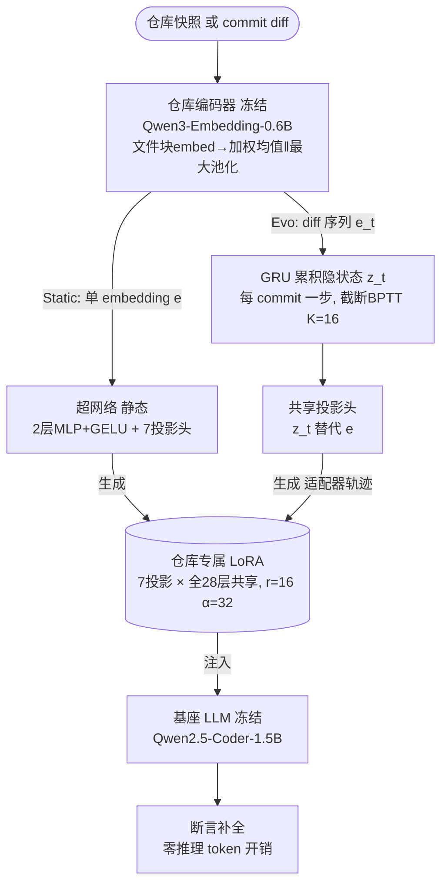

# Paper · 论文本身

## 一句话总结

代码大模型要写对一个仓库的代码,得知道这个仓库的 import、API、命名约定。现在两种主流做法都贵:① **把相关文件塞进上下文**(RAG / 依赖分析),每次查询都要付一遍长上下文的钱;② **给每个仓库单独微调一个 LoRA**,训练贵,而且**代码一改(每次 commit)适配器就过期、得重训**。Code2LoRA 换了个思路:训练一个**超网络(hypernetwork)**——给它一个仓库,它**一次前向就吐出这个仓库专属的 LoRA 适配器**,把仓库知识直接"写进参数",推理时**零额外 token 开销**。它有两个版本:**Static**(把一个仓库快照变成适配器,适合稳定代码库)和 **Evo**(用一个 GRU 把每次 commit 的 diff 累积进隐状态,**让适配器随代码演化一路更新**,适合活跃开发中的代码库)。在自建的 RepoPeftBench(604 个 Python 仓库)上,Static 在跨仓库上 63.8% 精确匹配、**不做任何按仓库训练就追平了"每仓库单训 LoRA"的上限**;Evo 在演化轨道上 60.3%,比单一共享 LoRA **高 5.2 个百分点**。[^arxiv]

## 问题(Problem)

- 真实代码库动辄上千文件,模型要补全断言、修 bug、在项目里导航,**必须知道这个仓库的上下文**(谁 import 谁、API 怎么用、约定是什么)。[^intro]
- **做法一:把知识塞进输入(RAG / 依赖分析)**。问题是仓库上下文可能巨大,撑爆上下文窗口、压垮检索,而且**每次查询都重付一遍 token**。[^intro]
- **做法二:把知识塞进参数(微调 / 每仓库 LoRA)**。训练本身就贵;更糟的是**对"会演化的代码库"很脆**——每次 commit 都可能让适配器失效、要求重训。[^intro]
- 已有的"超网络生成 LoRA"工作(Text2LoRA / Doc2LoRA)很有潜力——**一次前向就为冻结的大模型产出任务/文档专属权重**——但它们是为**短自然语言任务描述**或**单篇文档**设计的,**喂不下一个仓库那么长的上下文**,而且**假设输入是静态的,没有任何"跟踪代码演化"的机制**。[^related]

> [!key] 立场
> 这篇的价值**不在"又一个超网络",而在把超网络的输入模态推到了"一整个代码仓库",并第一个为"软件演化"造了 LoRA 的时间维度**。两个干净的设计判断值得学:① **沿两条正交轴拆问题——知识"怎么进参数(how)"和"何时刷新(when)"**,前者对应 Static、后者对应 Evo;② **对照实验做得诚实**:他们把最接近的基线 Text2LoRA **强化到和自己同样的输入(整仓库 embedding)和同样的目标模块(7 个投影)**,排除混淆变量后 Text2LoRA 仍然落后——**干净地把"LoRA 生成头"钉成瓶颈**,而不是靠输入优势取胜。看它学**"把'知识怎么进 / 何时刷新'拆成两条正交轴"** 和 **"强化基线以隔离真正的贡献来源"** 这两条工程方法论。

## 关键术语(Key terms)

| 术语 | 大白话解释 |
| --- | --- |
| **超网络(hypernetwork)** | 一个"专门生产别的网络权重"的网络:给它一个条件输入,它直接吐出目标网络的参数。这里目标是 LoRA 适配器。[^related] |
| **LoRA 适配器** | 冻住大模型、只加一小撮低秩可训练矩阵来"调味"。这里**不靠梯度训练得到,而是超网络一次前向"生成"出来**。 |
| **仓库级上下文(repo-level context)** | 一个项目里跨文件的知识:import 关系、API 签名、命名/代码约定。模型不知道这些就补不对代码。[^intro] |
| **零推理开销(zero inference-time token overhead)** | 知识已经"烧进"适配器参数,推理时**不用再往 prompt 里塞任何仓库文件**——这正是相对 RAG 的核心省法。[^arxiv] |
| **断言补全(assertion completion)** | 本文的评测任务:给模型一段测试代码到断言的切点,让它**预测断言里期望的值**(比较运算符右边 / 断言函数的最后一个参数)。同一仓库内所有实例共享同一份非测试源码当上下文,适合仓库级评测。[^task] |
| **Static vs Evo** | Static=把仓库**一个快照**映成适配器;Evo=用 **GRU** 把按时间顺序的 commit diff 累积进隐状态,产出一条"适配器轨迹"。[^method] |
| **CR / IR / OOD** | Cross-Repo(跨仓库,完全没见过的仓库)/ In-Repo(在训练过的仓库内留出测试)/ 时间外推 OOD(训练截止日之后才创建的仓库)。[^bench] |

## 核心方法(Core method)

打个比方:**与其每次进一个新项目都现读一遍全部文档(RAG),不如有个"老员工",看一眼这个项目就能给你配一副"懂这个项目的眼镜"(LoRA)。** Code2LoRA 训的就是这个"老员工"。

整个框架三件套,**只训中间的超网络**,仓库编码器和基座 LLM 都冻住:[^method]

- **① 仓库编码器(免训练)**:用冻结的 **Qwen3-Embedding-0.6B**,把仓库压成定长向量。先把每个文件切成 4096-token 块(512 重叠)、embed、块间均值池化得到文件向量(d=1024);再把所有文件向量按"内容独特性 + 文件大小 + 路径重要性"加权,**仓库 embedding = [加权均值 ; 最大池化] ∈ R²ᵈ**(既抓平均特征又抓最独特特征)。训练时预计算。[^encoder]
- **② 超网络(被训练的部分)**:一个共享的 2 层 MLP(GELU)+ 每种模块类型一个输出头,为 **7 种投影**(q,k,v,o,gate,up,down)各生成 LoRA 的 A、B 矩阵。秩 r=16、α=32,**同一对 (A,B) 在基座的全部 28 层共享**。Static 直接把仓库 embedding 投成 LoRA(~720M 可训练参数)。[^method]
- **③ 基座 LLM(冻结)**:**Qwen2.5-Coder-1.5B**,接收生成的适配器后做推理。整个超网络只用标准语言建模 loss(在断言补全对上的交叉熵)端到端训。[^method]
- **Evo 的关键加法——时间维度**:在投影头前插一个 **GRU**。每来一次 commit diff,编码器给出 diff embedding e_t,GRU 把它和上一隐状态合成 z_t,再用同一个头生成该时刻的适配器——于是得到一条**随仓库生命周期更新的"适配器轨迹"**。每次更新只需对存好的 diff embedding 跑**一步 GRU**(比重新编码整个仓库便宜得多)。训练用**截断式时间反向传播(每 K=16 步 detach)**,GRU + 初始投影器只多 ~25M 参数(共 ~745M)。[^method]

> [!key] 补丁:为什么 Static 能"零按仓库训练"就追平"每仓库单训 LoRA"
> 直觉上"给每个仓库专门训一个 LoRA"应该最准(它见过这个仓库的数据)。但 Static 在 in-repo 上 66.2% **反而追平/略超**每仓库单训的 64.0%——原因是超网络从**几百个仓库里学到了"怎么把仓库映成适配器"的跨仓库迁移能力**,这比"在单个仓库有限的数据预算上硬拟合一个适配器"更值钱。换句话说:**学"生成适配器的规律"> 学"某一个适配器"。** 这正是超网络范式的核心红利。[^static]

## 架构 / 流程(Architecture / pipeline)

## 创新点(Innovation points)

| 创新 | 新在哪 | 为什么重要 |
| --- | --- | --- |
| 超网络输入推到"整个仓库" | Text2LoRA/Doc2LoRA 只吃短任务描述/单文档,本文吃百万 token 级仓库 | 让"一次前向生成仓库适配器"成为可能,零推理 token 开销 |
| Evo:为软件演化加时间维 | GRU 把 commit diff 累积成"适配器轨迹",随代码一路更新 | 第一个针对"演化代码库"的超网络;静态快照会过期,它不会 |
| how / when 两条正交轴 | 把"知识怎么进参数"(Static)和"何时刷新"(Evo)拆开 | 清晰的设计框架,两个版本各管一类场景 |
| 全模块覆盖 | 7 种投影(q,k,v,o,gate,up,down)全覆盖,而非只 Q/V | 比前人更灵活,实测是性能关键之一 |
| RepoPeftBench + 强化基线 | 604 仓库、静态+演化双轨;把 Text2LoRA 强化到同输入同目标 | 干净隔离"LoRA 生成头"为瓶颈,对照诚实 |

## 实验 / 证据(Experiments / evidence)

> **自报 vs 实测(整节适用)**:下列所有 EM / EditSim / CodeBLEU 数值,均取自论文自己的实验表格,属**论文自报**;本站未独立复现。代码与 RepoPeftBench 作者称将随录用发布(评审期匿名仓)。HF upvotes 为抓取当时快照,会变。

**评测设定**:基座 Qwen2.5-Coder-1.5B(冻结,bfloat16);编码器 Qwen3-Embedding-0.6B(均 Apache 2.0)。**RepoPeftBench**:604 个 Python 仓库 = 512 个分布内(≥300 star,截止 2025-04-01 前)+ 92 个时间外推 OOD(截止日之后创建)。静态轨道 39,612 训 / 11,636 测,演化轨道 215,129 训 / 86,793 测。指标:EM(精确匹配)、EditSim、CodeBLEU。基座 3 epoch、AdamW、单张 H100 80GB。[^bench][^setup]

**静态轨道(Table 2,EM %)** [^static]

| 方法 | 跨仓库 CR | 仓内 IR |
| --- | ---: | ---: |
| Pretrained(裸基座) | 45.7 | 46.8 |
| RAG (k=3) | 39.7 | 42.1 |
| Dep.-Resolved Context | 48.2 | 49.5 |
| FFT(全参微调) | 51.4 | 55.9 |
| FFT + RAG(最强基线) | 53.9 | 56.8 |
| Single LoRA(共享一个) | 47.4 | 50.4 |
| Per-repo LoRA(每仓库单训,IR 上限) | — | 64.0 |
| 强化版 Text2LoRA | 45.8 | 46.7 |
| **Code2LoRA-Static** | **63.8** | **66.2** |

- CR 上 Code2LoRA-Static 63.8%,**比最强基线(FFT+RAG 53.9%)高 9.9 个百分点**;所有上下文注入法(RAG 39.7、Dep 48.2)都被甩开。[^static]
- IR 上 66.2%,**在零按仓库训练的前提下追平/略超"每仓库单训 LoRA"上限 64.0%**——见上方补丁。[^static]
- **关键对照**:强化版 Text2LoRA(已喂同样的整仓库 embedding、同样 7 投影)只有 45.8%——**唯一差别是 LoRA 生成头**,干净地证明瓶颈在头,而非输入或目标覆盖。[^static]

**演化轨道(Table 3,commit 衍生任务,EM %)** [^evo]

| 方法 | 跨仓库 CR | 仓内 IR |
| --- | ---: | ---: |
| Pretrained | 31.5 | 29.3 |
| RAG (k=3) | 23.6 | 23.0 |
| Single LoRA | 55.1 | 61.3 |
| Per-repo LoRA(IR 上限) | — | 64.2 |
| Code2LoRA-Static(同轨参照) | 55.7 | 60.6 |
| **Code2LoRA-Evo** | **60.3** | **64.5** |

- commit 衍生任务**明显更难**(裸基座 CR 从 45.7 掉到 31.5),RAG / 依赖注入都**塌到裸基座以下**。[^evo]
- **Code2LoRA-Evo 在两个划分都最强**(CR 60.3、IR 64.5):CR 比 Single LoRA **+5.2 个百分点**,IR **超过"每仓库单训"上限 64.2** 且无需按仓库训练。[^evo]
- 印证了核心论点:**静态快照适配器会随代码演化"变味",而 GRU 累积 diff 的 Evo 不会**——Code2LoRA-Static 在演化轨道掉到 55.7/60.6(远低于它在静态轨道的 63.8/66.2)。[^evo]

**时间外推 OOD(Table 4,EM %)** [^ood]

| 方法 | EM | EditSim | CodeBLEU |
| --- | ---: | ---: | ---: |
| Single LoRA | 72.3 | 0.836 | 0.817 |
| Code2LoRA-Static | 72.2 | 0.842 | 0.818 |
| **Code2LoRA-Evo** | **74.1** | **0.866** | **0.846** |

- 92 个"训练截止日后才创建"的新仓库上,Evo 仍最强(74.1% EM)。**但作者诚实标注一个坑**:OOD 仓库的断言目标系统性更短(中位 7 字符 vs CR/IR 的 12–13 字符),**会一致地抬高所有方法的精确匹配分**——所以 72%+ 别和前两表横比,只看**表内排序**;表内 Evo 领先次优约 **1.8 个百分点**(比演化轨道的 ~5pp 窄,但方向一致、EditSim/CodeBLEU 同向)。[^ood]

> [!warn] 四处别被带偏
> 1. **只在 1.5B 上验证**。超网络(~720–745M)本身的体量由基座投影维度决定;**演化轨道的结论"最直接成立于 1.5B 尺度"**,基座做大后"GRU 累积 diff 是否还必要/够用"是开问题(作者自陈)。[^limits]
> 2. **只测了 Python + 单基座 + 单任务**(断言补全)。架构号称语言/任务无关,但跨语言、跨基座、跨任务的证据尚缺。[^limits]
> 3. **EM 是表面指标**。精确匹配漏掉"功能等价"的正确;作者用 EditSim/CodeBLEU + 一个 pytest 执行探针缓解,但"逐条执行生成的断言"超出本次算力预算。[^limits]
> 4. **OOD 的高分有长度伪影**(见上),别被 74% 唬住,要看表内相对值。

## 限制与风险(Limitations and risks)

- **尺度与泛化范围窄**:Python only、单基座 Qwen2.5-Coder-1.5B、单任务断言补全;演化结论只在 1.5B 直接成立。[^limits]
- **超网络体量不小**:~720M(Static)/~745M(Evo)可训练参数,且随基座投影维度增长——大基座下的可行性未验证。[^limits]
- **指标偏表面 + OOD 长度伪影**:EM 漏功能等价;OOD 目标更短抬高分数,只能表内比较。[^ood][^limits]
- **代码 LLM 的通用风险**:可能生成不安全/不正确/疑似受版权代码;仓库条件化会放大"把私有仓库内容原样吐出"的归属风险,作者明确**不主张未经标准缓解(许可过滤、人工审查、长 verbatim 拒绝)即可生产部署**。[^risk]

## 先读什么(What to read first)

1. **Abstract + §1 Introduction** —— how/when 两条轴、零推理开销、两个版本的定位。[^arxiv]
2. **§3 Method + Figure 1** —— 三件套(编码器/超网络/基座)、Static vs Evo 的结构差异。[^method]
3. **§3.1 Repository Encoder** —— 仓库怎么压成 [加权均值‖最大池化] 的定长向量。[^encoder]
4. **§3.3 Code2LoRA-Evo** —— GRU 怎么把 commit diff 累积成"适配器轨迹"。[^method]
5. **§4 RepoPeftBench + Table 1** —— 双轨基准怎么构造、CR/IR/OOD 怎么分。[^bench]
6. **§6 Results(Table 2/3/4)** —— 三套结果 + 强化版 Text2LoRA 的隔离对照。[^static]

## 技术细节(选读)

> **数据集划分(实现关键,原文 Table 1)**
> 大白话:同样的仓库,两套出题方式。精确机制:512 分布内仓库切成 CR(留 103 个完全不训:51 验/52 测)和 IR(409 个训,仓内按 8:1:1 留测)。演化轨道按 commit 时序重放,每当某 commit 增改了一个断言就出一题、连同生产代码 diff Δ_t 一起存;IR 上按时序切分使训练样本严格早于验证/测试(防泄漏)。每个 commit 最多留 8 题,Evo 训练再限每测试文件 4 题,避免单个 commit 主导反传窗口。[^bench]

> **GRU 更新为什么便宜**
> 大白话:代码改一点,适配器不必从头重算。精确机制:每次 commit 只对**存好的 diff embedding 跑一步 GRU**(z_t = GRU(LayerNorm(Linear(e_t)), z_{t-1})),比重新编码整个仓库便宜得多;初始隐状态 z_0 由首次仓库 embedding 经小线性投影器给出。[^method]

## 后续演化 · 这方法后来怎样了

Code2LoRA 站在"超网络生成 LoRA"这条新兴线上,下列为**论文自身引用、arXiv ID 可验证**的同期与先行工作(本文太新,尚无明确后继):

- **Text2LoRA**(ICML 2025,*Text-to-LoRA: Instant transformer adaption*)— 从短任务描述生成 LoRA,本文最近的先行者与强化对照基线 _[置信度:高]_。[^related]
- **Doc2LoRA**(arXiv:2602.15902)— 从单篇文档生成 LoRA(Perceiver 编码、只 down_proj),本文把模态推广到整仓库、目标推广到 7 投影 _[置信度:高]_。[^related]
- **HyperLoRA / HyperTuning / Generative Adapter / Zhyper** — 超网络生成 LoRA 的相关家族(跨任务/单次前向/分解条件化)_[置信度:高]_。[^related]
- **RepoFusion / RepoCoder / RepoHyper / R2C2-Coder / CrossCodeEval / RepoBench** — 走"把仓库知识塞进输入"的正交路线,本文与之对照(参数化注入 vs 上下文注入)_[置信度:高]_。[^related]

[^arxiv]: 论文 *Code2LoRA: Hypernetwork-Generated Adapters for Code Language Models under Software Evolution*,arXiv:2606.06492(2026-06-05;University of Waterloo;Liliana Hotsko、Yinxi Li、Yuntian Deng、Pengyu Nie;HF upvotes 74)。https://arxiv.org/abs/2606.06492 · 代码(评审期匿名)https://anonymous.4open.science/r/code2lora-6857 · 检查点/数据 https://huggingface.co/code2lora 。零推理 token 开销、Static 63.8% CR、Evo 60.3% CR(+5.2pp)。
[^intro]: 同上,§1 Introduction:仓库级上下文为何必要;输入注入(RAG/依赖)每查询重付 token;参数注入(每仓库 LoRA)训练贵且对演化脆。
[^related]: 同上,§2 Related Work:Text2LoRA(短任务描述,只 Q/V)/ Doc2LoRA(单文档,Perceiver,只 down_proj);本文推广到整仓库 + 7 投影;强化 Text2LoRA 到同输入同目标以隔离生成头;与 RepoFusion/RepoCoder/RepoHyper/R2C2/CrossCodeEval/RepoBench 等输入注入路线对照。
[^method]: 同上,§3 Method + Fig.1:三件套只训超网络;Static 共享 2 层 MLP+GELU + 7 投影头,r=16 α=32,(A,B) 全 28 层共享,~720M;Evo 在头前插 GRU(z_t=GRU(LayerNorm(Linear(e_t)),z_{t-1})),截断 BPTT 每 K=16 步 detach,+~25M(共 ~745M)。
[^encoder]: 同上,§3.1 Repository Encoder:冻结 Qwen3-Embedding-0.6B;文件切 4096-token 块(512 重叠)均值池化得文件向量(d=1024);仓库 embedding = [按内容独特性/文件大小/路径重要性的加权均值 ; 最大池化] ∈ R^2d;训练时预计算。
[^task]: 同上,§4 Task:断言补全,预测断言期望值(比较运算符右边 / 断言函数最后一个参数);五类断言族(bare assert、self.assert*、pytest.raises、pytest.approx、NumPy assert_*);同仓库实例共享非测试源码当上下文。
[^bench]: 同上,§4 + Table 1:604 仓库 = 512 分布内(≥300 star,截止 2025-04-01)+ 92 OOD;静态轨道 39,612 训 / 11,636 测,演化轨道 215,129 训 / 86,793 测;CR 留 103 仓(51 验/52 测),IR 409 仓仓内 8:1:1;演化轨道时序切分防泄漏,每 commit ≤8 题、Evo 每测试文件 ≤4 题。
[^setup]: 同上,§5 Setup:基座 Qwen2.5-Coder-1.5B(bfloat16,冻结)、编码器 Qwen3-Embedding-0.6B(均 Apache 2.0);3 epoch、AdamW(cosine)、单 H100 80GB、TRL;指标 EM(白空间折叠+尾标点去除的宽松匹配)/ EditSim(difflib)/ CodeBLEU。
[^static]: 同上,§6.1 + Table 2(静态轨道 EM%):Code2LoRA-Static CR 63.8(+9.9pp over FFT+RAG 53.9;RAG 39.7、Dep 48.2、FFT 51.4、Single LoRA 47.4、强化 Text2LoRA 45.8);IR 66.2 追平 Per-repo LoRA 上限 64.0。
[^evo]: 同上,§6.2 + Table 3(演化轨道 EM%):Pretrained CR 31.5;Single LoRA 55.1/61.3;Per-repo LoRA IR 64.2;Code2LoRA-Static 55.7/60.6;Code2LoRA-Evo 60.3/64.5(CR +5.2pp over Single LoRA,IR 超上限)。
[^ood]: 同上,§6.3 + Table 4(OOD,EM%):Single LoRA 72.3 / Code2LoRA-Static 72.2 / Code2LoRA-Evo 74.1;OOD 断言目标中位 7 字符 vs CR/IR 12–13,抬高 EM,仅表内可比;Evo 表内领先次优 ~1.8pp,EditSim/CodeBLEU 同向。
[^limits]: 同上,Limitations:Python only、单基座 Qwen2.5-Coder-1.5B、单任务断言补全;~720/745M 超网络随基座投影维增长,演化结论最直接成立于 1.5B;EM 漏功能等价(以 EditSim/CodeBLEU + pytest 执行探针缓解);全程单 H100 80GB。
[^risk]: 同上,Limitations "Potential risks":数据集为公开宽松许可仓库;下游代码 LLM 继承通用风险(不安全/不正确/疑似受版权代码),仓库条件化放大归属风险;不主张未经标准缓解即生产部署。
