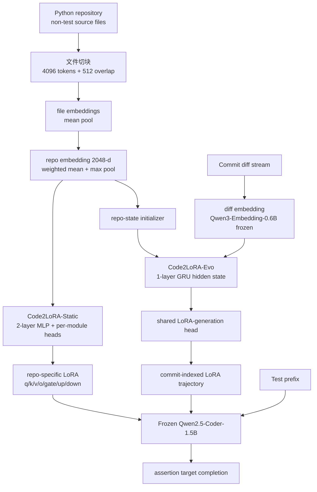

# Paper · 论文本身

## 一句话总结

Code2LoRA 的核心想法很直接:代码助手每次做仓库内补全时,不再把 repository context(整个仓库的 API、imports、命名约定、测试习惯)反复塞进 prompt,而是先把仓库快照或 commit diff 压成向量,再用一个 **hypernetwork(白话:一个专门“生成另一个网络权重”的网络)** 一次性生成该仓库专属的 **LoRA adapter(低秩适配器,白话:插在大模型线性层旁边的小参数补丁)**;稳定仓库用 Code2LoRA-Static,持续演化的仓库用带 GRU 状态的 Code2LoRA-Evo,在 RepoPeftBench 的 Python assertion-completion 任务上,Static 达到 **63.8% cross-repo EM / 66.2% in-repo EM**,Evo 在 commit-derived track 达到 **60.3% cross-repo EM**,但证据范围仍窄:单一 Python 任务、Qwen2.5-Coder-1.5B backbone、Exact Match 指标有盲区,且作者给出的匿名代码仓库本轮无法 clone/API 读取。[^abs][^limits][^repoaudit]

## 问题(Problem)

- 真实代码仓库不是一段短上下文:一个测试断言往往依赖跨文件 imports、项目自定义 enum、helper 函数、命名习惯、异常类型和历史测试约定。传统 RAG / dependency-resolved context 的做法是**每次推理都把检索到的上下文塞进输入**;这会消耗 token,也会把噪声上下文推给模型。[^intro]
- 另一条路是 fine-tuning 或 per-repository LoRA:把知识写进参数。但 per-repo training 对每个仓库都要训练,新仓库/新 commit 来了就容易过期,规模化成本高。[^intro]
- 作者的问题定义是:能不能把“仓库本身”变成一次性条件,让模型在推理时不额外吃上下文 token,同时在软件演化时按 commit 更新仓库状态?[^method]

> [!key] 立场
> 这篇最值得学的不是“又一个 LoRA 变体”,而是一个工程抽象:把 repo context 从 **per-query token memory** 改成 **versioned parameter memory**。对代码 agent 来说,这等价于把“我知道这个仓库”从 prompt 层搬到 adapter 层,再用 commit diff 管理失效与更新。

## 关键术语(Key terms)

| 术语 | 大白话解释 |
| --- | --- |
| **repository context** | 一个仓库里非测试源码携带的项目知识:导入路径、类/函数定义、配置约定、测试 helper、错误类型、命名风格。本文把它当成模型需要吸收的“本地知识库”。 |
| **LoRA adapter** | 不改大模型主体参数,只在若干线性层旁边加低秩矩阵 `A/B`。推理时相当于给原权重加一个小补丁。 |
| **hypernetwork** | 一个网络负责生成另一个网络的参数。这里不是直接训练每个仓库的 LoRA,而是训练一个生成器:输入仓库 embedding,输出该仓库 LoRA。 |
| **Code2LoRA-Static** | 稳定仓库版本:仓库快照 -> repo embedding -> MLP head -> LoRA。适合“读一个固定代码库”。 |
| **Code2LoRA-Evo** | 演化仓库版本:初始仓库 embedding 初始化 GRU state,每个 commit diff 继续更新 hidden state,再从当前 state 生成 LoRA。适合“仓库每天在变”。 |
| **RepoPeftBench** | 作者构造的评测集:604 个 Python 仓库,静态 track 有 39,612 train / 11,636 test assertion-completion tasks,演化 track 有 215,129 train / 86,793 test commit-derived tasks。[^bench] |
| **Exact Match(EM)** | 生成的断言目标值和 reference 字符串精确匹配。作者做了空白/尾标点/overgeneration 的 relaxed 处理,但它仍不能等价于语义正确。[^metrics][^limits] |

## 核心方法(Core method)

Code2LoRA 分成三个层次:

1. **Repository Encoder(仓库编码器)**:用冻结的 Qwen3-Embedding-0.6B 编码源码文件。每个文件按 4096-token chunk、512-token overlap 切块,chunk embedding 做 mean pooling 得到 file vector;仓库级 embedding 是加权均值池化和 max pooling 拼接,维度为 `2d`,其中 `d=1024`,所以 repo embedding 是 2048 维。权重来自内容 distinctiveness、文件大小和路径重要性。[^encoder]
2. **Static hypernetwork(静态生成器)**:把 2048 维 repo embedding 送进 2-layer GELU MLP,再由每个 module type 的独立 head 生成 LoRA 的 `A_m/B_m`。覆盖 `{q,k,v,o,gate,up,down}` 七类 attention/MLP projection,LoRA rank `r=16`,alpha `32`,同一类 `A/B` 在 Qwen2.5-Coder-1.5B 的 28 层之间共享。论文主文写 Static 约 **720M trainable parameters**。[^static]
3. **Evo recurrent hypernetwork(演化生成器)**:不把每个 commit 都重新编码完整仓库,而是把每个 production-code diff 编成 2048 维向量,用 1-layer GRU 更新隐藏状态。初始 hidden state 来自初始仓库 embedding;每个 commit 后,当前 hidden state 进入同一类 LoRA-generation head,形成 adapter trajectory。Evo 比 Static 多约 **25M** 参数,总计约 **745M trainable parameters**;训练用 truncated BPTT,每 **K=16** steps detach。[^evo]

> [!warn] 一个细节不要读错
> “zero inference-time token overhead”不是“零成本”。它指推理时不额外拼 RAG/DRC token;但训练 hypernetwork、预计算 repo/diff embeddings、存储生成器、维护 commit-indexed adapter state 都有成本。论文效率表也把 Code2LoRA-Static 的 shared extra storage 写成 **679 MB**,Evo 写成 **65 MB**,不是免费。[^eff]

## 架构 / 流程(Architecture / pipeline)

## 创新点(Innovation points)

| 创新 | 新在哪 | 为什么重要 |
| --- | --- | --- |
| 仓库 -> LoRA 的 hypernetwork | 不是为每个 repo 单独训练 adapter,而是训练一个跨仓库生成器,输入新 repo embedding 即生成 adapter | 对 FDE / coding agent 更接近“新客户仓库 onboarding”:不为每个客户从零训练 |
| 参数化 repo memory | 把仓库知识写入 LoRA 权重,推理时不额外塞 token | 绕开 RAG/DRC 的 per-query token 成本和检索噪声 |
| Static / Evo 双场景 | 稳定快照和 commit 演化分开建模 | 软件仓库天然有时间轴;只看最后快照会漏掉 commit-time 状态 |
| GRU diff state | 每个 diff 更新一次 hidden state,不重跑完整仓库编码 | 把“adapter 失效”变成版本化状态更新问题 |
| RepoPeftBench | 604 个 Python repo,静态 + commit-derived 两条 track,CR/IR/OOD split | 给 repository-level PEFT 一个比 toy repo 更像真实软件演化的评测面 |

## 实验 / 证据(Experiments / evidence)

**数据集与任务**:RepoPeftBench 包含 **604** 个公开 permissively licensed Python 仓库;按 **2025-04-01** cutoff 分成 **512** 个 in-distribution repo 和 **92** 个 post-cutoff OOD repo。in-distribution 再分 CR/IR:CR 完整 hold out **103** 个 repo(51 val / 52 test),IR 使用其余 **409** 个 repo。任务是 assertion completion:模型看到测试文件 prefix,预测断言的 expected value。[^bench]

**Table 1 数据规模**:[^t1]

| track/split | repos | commits | tasks |
| --- | ---: | ---: | ---: |
| Static Train | 409 | 409 | 39,612 |
| Static CR Val / Test | 51 / 52 | 51 / 52 | 6,213 / 6,414 |
| Static IR Val / Test | 409 / 409 | 409 / 409 | 4,833 / 5,222 |
| Evolution Train(Code2LoRA-Static/baselines) | 400 | 400 | 44,149 |
| Evolution Train(Code2LoRA-Evo) | 400 | 45,516 | 215,129 |
| Evolution CR Val / Test | 49 / 51 | 8,614 / 6,618 | 58,944 / 44,732 |
| Evolution IR Val / Test | 389 / 389 | 5,710 / 6,179 | 38,783 / 42,061 |
| OOD Test | 92 | 1,950 | 14,813 |

**Static track 主结果(Table 2)**:Code2LoRA-Static 的 CR EM 是 **63.8%**,比最强 baseline FFT+RAG 的 **53.9%** 高 **+9.9 pp**;IR EM 是 **66.2%**,超过/匹配 per-repo LoRA upper bound 的 **64.0%**,且不需要为每个 repo 单独训练。[^t2]

| 方法 | CR EM | IR EM |
| --- | ---: | ---: |
| Pretrained | 45.7 | 46.8 |
| RAG(k=3) | 39.7 | 42.1 |
| Dep.-Resolved Context | 48.2 | 49.5 |
| FFT | 51.4 | 55.9 |
| FFT + RAG | 53.9 | 56.8 |
| Single LoRA | 47.4 | 50.4 |
| Per-repo LoRA | 不适用 | 64.0 |
| Text2LoRA(增强版) | 45.8 | 46.7 |
| Code2LoRA-Static | **63.8** | **66.2** |

**Evolution track 主结果(Table 3)**:commit-derived 任务更难,Pretrained CR EM 从 static 的 45.7% 掉到 **31.5%**。Code2LoRA-Evo 达到 **60.3% CR EM / 64.5% IR EM**,比 Single LoRA 的 **55.1% CR EM** 高 **+5.2 pp**,IR 也高于 per-repo LoRA 的 **64.2%**。Code2LoRA-Static 在这个 track 只有 **55.7% / 60.6%**,说明静态快照确实会 stale。[^t3]

| 方法 | CR EM | IR EM |
| --- | ---: | ---: |
| Pretrained | 31.5 | 29.3 |
| RAG(k=3) | 23.6 | 23.0 |
| Dep.-Resolved Context | 31.1 | 31.6 |
| Single LoRA | 55.1 | 61.3 |
| Per-repo LoRA | 不适用 | 64.2 |
| Text2LoRA | 41.7 | 43.5 |
| Code2LoRA-Static | 55.7 | 60.6 |
| Code2LoRA-Evo | **60.3** | **64.5** |

**OOD 结果(Table 4)要谨慎读**:在 92 个 post-cutoff repo 上,Code2LoRA-Evo 是 **74.1% EM**,Code2LoRA-Static **72.2%**,Single LoRA **72.3%**。但作者明确指出 OOD assertion targets 更短,median **7 characters**,而 CR/IR test median **12-13 characters**,会整体抬高 EM;所以应看表内相对差异,Evo 只比 next-best fine-tuned adapter 高约 **+1.8 pp**。[^t4][^ood]

**效率表(Table 12)**:RAG 约 **1,500** extra tokens/query,DRC 约 **500-2,000** extra tokens/query;FFT 需要约 **4h** adaptation 和 **3.1 GB** per repo model copy;per-repo LoRA 约 **5 min/repo** 和 **32 MB/repo**;Code2LoRA-Static/Evo 是 **0 extra tokens**,adapter generation **<10ms**,但 shared storage 是 **679 MB / 65 MB**。[^eff]

**附录里最有用的补充证据**:

- DRC coverage:CR-test 中 **70.3%** pairs 有非空 DRC(4,511/6,414),其余 **29.7%** 无可解析 repo context;DRC 只在可解析子集上比 pretrained 高 **+1.8 pp**,在无 DRC 子集上反而 **-7.3 pp**。Code2LoRA-Static 在两边几乎平(67.0 vs 66.9)。[^drc]
- per-repo LoRA 方差大:389 个共同评测 repo 中,per-repo LoRA EM 跨 **[0,100]%**,std **20.9**,有 **10.5%** repo 低于 pretrained;Code2LoRA-Static/Evo 低于 pretrained 的比例只有 **1.3% / 1.8%**。[^var]
- 训练 repo 数量 scaling:只用 **10** 个 repo(约 2% full training set)时,Code2LoRA-Static 已有 **57.7% CR EM**,高于 full-data FFT 的 **51.4%**;约 200 个 repo 后增长趋于平。[^scale]
- 错误分类:Code2LoRA-Static 的 **2,321** 个 CR-test 错误中,wrong literal **31.0%**,syntax error **28.0%**,type mismatch **19.0%**,near-miss **10.8%**,wrong identifier **10.2%**,hallucinations 和 empty outputs 各低于 1%。[^err]

## 仓库与复现状态(Repo audit)

论文摘要脚注和 HF 页面给出代码 URL `https://anonymous.4open.science/r/code2lora-6857`,模型/数据 URL `https://huggingface.co/code2lora`。但本轮在 2026-06-08 的实测结果是:

- `git clone https://anonymous.4open.science/r/code2lora-6857` 返回 `repository not found`。
- `git ls-remote` 对无 `.git` 和 `.git` 两种 URL 均返回 `repository not found`。
- 4open 页面会重定向到 `/api/repo/code2lora-6857/file/`,随后 API 返回 401 `{"error":"not_connected"}`。
- `https://huggingface.co/api/models/code2lora` 和 raw README 探测返回 401。
- 论文 Limitations 又写明 “Code, RepoPeftBench, and hyperparameters will be released upon acceptance”,这与摘要脚注“code can be found”存在可访问性张力。[^repoaudit][^limits]

因此本文对源码只能写成**作者自报 / 当前不可审计**,不能写成“已读仓库源码发现”。如果后续链接恢复,需要单独补一轮 code audit。

## 限制与风险(Limitations and risks)

- **任务窄**:只评 Python 仓库 + assertion completion,不是一般代码生成、bug fixing、multi-file edit 或 agentic coding。作者也把多语言、多 backbone、多任务留到 future work。[^limits]
- **backbone 小**:主结果基于 Qwen2.5-Coder-1.5B;大模型下是否还需要 GRU diff aggregation,论文说是 open question。[^limits]
- **指标不等于语义正确**:EM 会漏掉功能等价;作者用 EditSim、CodeBLEU 和 runnable CR slice 的 pytest probe 缓解,但没有全量 execution-based eval。[^limits]
- **OOD 数字有 target-length artifact**:74.1% OOD EM 不能直接和 CR/IR 数字横比,只能在 OOD 表内看相对排序。[^ood]
- **hypernetwork 很大**:Static/Evo 约 720M/745M trainable parameters,不是轻量“小插件”。[^limits]
- **生产风险**:repo-conditioned model 可能输出不安全、错误或 license-resembling code;私有仓库输入还会放大 attribution/privacy 风险。作者未声称可直接生产部署。[^limits]
- **复现成熟度不足**:代码与 HF artifact 本轮不可访问,只能以论文表格为准,不能把结果当作已复现实测。[^repoaudit]

## 先读什么(What to read first)

1. **Introduction**:看清“context as tokens vs context as parameters”的问题定义。[^intro]
2. **Method §3 + Figure 1**:读 Repository Encoder、Static head、Evo GRU 三件事如何拼起来。[^method]
3. **Table 2 / Table 3**:这是主结论的证据核心:Static 强于 RAG/FFT/sLoRA,Evo 强于 static/sLoRA under commits。[^t2][^t3]
4. **Limitations + Appendix E**:尤其 OOD target-length artifact 和 single-backbone/single-task 限制。[^limits][^ood]
5. **Appendix F.7 / F.8**:DRC coverage 与 deployment efficiency 最贴近工程落地。[^drc][^eff]

[^abs]: arXiv abs 与 HTML 全文: *Code2LoRA: Hypernetwork-Generated Adapters for Code Language Models under Software Evolution*, arXiv:2606.06492(v1, submitted 2026-06-04), University of Waterloo. https://arxiv.org/abs/2606.06492
[^intro]: 同上,Introduction: repository context via RAG/dependency analysis/per-repo LoRA 的成本与 stale 问题。
[^method]: 同上,Section 3 Method: shared repository encoder + hypernetwork + frozen base LLM;Static vs Evo 两种 usage scenario。
[^encoder]: 同上,Section 3.1 Repository Encoder: Qwen3-Embedding-0.6B,4096-token chunks,512 overlap,`d=1024`,weighted mean + max pool。
[^static]: 同上,Section 3.2 / Appendix D.2-D.5: seven projection types,rank 16,alpha 32,28 layers sharing,Static trainable parameters 与 architecture details。
[^evo]: 同上,Section 3.3 / 3.4 / Appendix D.2-D.5: GRU diff state,initial repo embedding,truncated BPTT `K=16`,Evo parameter count。
[^bench]: 同上,Section 4 RepoPeftBench:604 Python repositories,512 ID,92 OOD,2025-04-01 cutoff,assertion-completion task。
[^metrics]: 同上,Section 5 Evaluation metrics:EM/EditSim/CodeBLEU 定义。
[^t1]: 同上,Table 1 Dataset statistics。
[^t2]: 同上,Table 2 Static track results。
[^t3]: 同上,Table 3 Evolution track results。
[^t4]: 同上,Table 4 OOD set results。
[^limits]: 同上,Limitations:scope,OOD artifact,surface-level metrics,model size,reproducibility,potential risks。
[^ood]: 同上,Appendix E OOD Evaluation Caveats:median 7 chars vs 12-13 chars,within-OOD comparison。
[^drc]: 同上,Appendix D.1 与 F.7:DRC construction/coverage,Table 11。
[^var]: 同上,Appendix F.1:per-repository variance and data sparsity。
[^scale]: 同上,Appendix F.2,Table 10:training repository count scaling。
[^err]: 同上,Appendix F.5:2,321 incorrect CR-test predictions error taxonomy。
[^eff]: 同上,Appendix F.8,Table 12:deployment efficiency。
[^repoaudit]: 本轮本地复现实测(2026-06-08):`git clone`/`git ls-remote`/4open API/HF `code2lora` model API/raw README 访问失败;因此源码与 artifacts 未能审计,以论文表格为准。
