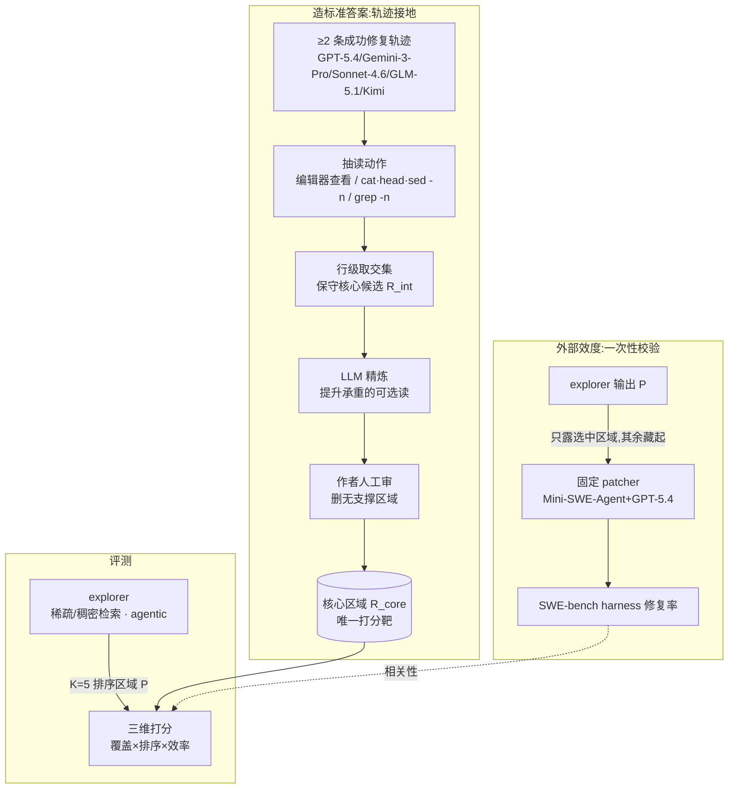

# Paper · 论文本身

## 一句话总结

SWE-Explore 把 SWE-bench 那种"补丁过没过测试"的**二值黑箱**拆开，单拎出**"仓库探索（repository exploration）"**这一环来量：给一个 issue 和一个仓库，让 explorer 在固定行数预算内交一份**排好序的代码区域清单**，再拿"曾经真把这 issue 修好的 agent 轨迹读过哪些行"当 ground truth 打分——口号式概括：**别只问'修好没',先问'它有没有翻到该翻的那几行代码'**。[^abs]

## 问题(Problem)

- SWE-bench 这类仓库级编码基准把任务压成单个 pass/fail 预测——直接可比，但**遮住了成功的内部机理**：到底是"读对了相关代码 / 定位对了 bug / 生成对了补丁 / 验证对了"哪一步成了或败了，分不出来。
- 一旦把这个单一预测拆开，会冒出两类失败：① agent **没探索到**修复所需的相关代码；② 它**搜集够了证据但没合成出对的补丁**。后者已被可执行基准捕捉，**前者基本是隐形的**。
- 真实仓库动辄上千文件、十几万行，"哪几行承载了这个 issue 的证据"连最终修好它的 agent 都难说清。于是**仓库探索能力长期处于"测不准"状态**：文件级/函数级定位只说明 agent 到了"大概街区"，没有任何指标揭示"到底读了哪几行"。
- SWE-Explore 补的就是这个**行级（line-level）、可比的探索评测靶子**。

> [!key] 立场
> 这篇最该学的是它对 ground truth 的**狡猾构造**：不靠人工标"必要上下文"（贵且十个人画十种边界），而是从**至少两条独立成功的 agent 轨迹**里取交集——不同解题路径都自然读过的行，就是核心上下文。它把"人类标注"换成了"成功行为的共识信号"。再加一条最有产品价值的实测结论：**现在的 coding agent 文件级定位已经很强，真正的瓶颈是行级 recall（召回）**——它们能早早翻到对的文件，却漏掉修复真正需要的那些具体行。换句话说，差距不在"找没找到对的文件"，在"翻得够不够全"。

## 关键术语(Key terms)

| 术语 | 大白话解释 |
| --- | --- |
| **repository exploration（仓库探索）** | agent 在写补丁前"翻仓库找相关代码"的能力，被本文单拎出来当独立评测对象。[^expl] |
| **explorer（探索器）** | 输入 (issue, 仓库)、输出一份排好序的代码区域清单的系统；可以是稀疏检索、稠密检索、或交互式 agent。 |
| **trajectory-grounded ground truth（轨迹接地的标准答案）** | 不靠人工标注，而是从≥2 条成功修复轨迹里取"读过的行"的交集 + LLM 精炼 + 人工审，得到核心区域。 |
| **ranked region list（排序区域清单）** | 输出格式 $P=(r_1,\dots,r_K)$，每个区域 $r_i=(文件路径, 起始行, 结束行)$；本文固定 K=5。 |
| **line budget（行数预算 B）** | 评分时只看清单前缀里累计行数不超过 B 的部分——惩罚"一个啰嗦大区域吃光预算却没带来对应收益"。 |
| **context efficiency（上下文效率）** | 预测的可见行里落在"核心+可选 ground truth"内的比例；衡量选的上下文有多少是真证据、多少是噪声。 |
| **restricted-context validation（受限上下文验证）** | 一次性方法学校验：把仓库里 explorer 没选的全藏起来，只给固定 patcher 这点上下文，看补丁过不过原测试——证明探索指标真能预测修复。 |

## 核心方法(Core method)

把它想成**给"找资料"这件事单独打分**，分三步：

1. **造标准答案（不靠人手标）**：只保留那些有**≥2 条强模型成功修复轨迹**的 issue（轨迹来自 GPT-5.4、Gemini-3-Pro、Sonnet-4.6、GLM-5.1、Kimi-K2.6 等）。把每条轨迹里"读代码"的动作（编辑器查看、`cat/head/tail/sed -n`、`grep -n` 命中）抽成 (文件,起,止) 区域，对多条轨迹**取行级交集**得保守核心候选，再用 LLM 精炼把少量"虽不在交集但对修复承重"的可选读提上来，最后**作者逐条人工审**删掉无支撑区域。
2. **让 explorer 答题**：给 (issue, 仓库快照)，explorer 不写补丁、不碰 ground truth、甚至不必和仓库交互，只交 K=5 个排好序的区域。
3. **沿三维度打分**：覆盖（行级 precision/recall/F1、文件级 HitFile、区域级 HitRegion）× 排序（行预算下的 nDCG@B、首个有用命中 FUH）× 效率（context efficiency、noise rate）。

外加一道**外部效度校验**（不进常规评测循环）：受限上下文环境里把 explorer 选的当**唯一可见上下文**喂给固定 patcher（Mini-SWE-Agent + GPT-5.4/Gemini-3-Pro），看修复率——以此证明"上游探索指标"真的预测"下游修复"。

## 架构 / 流程(Architecture / pipeline)

## 创新点(Innovation points)

| 创新 | 新在哪 | 为什么重要 |
| --- | --- | --- |
| 探索独立成评测靶 | 把仓库探索从端到端修复里剥出来，形式化成排序的行级上下文选择任务 | 让稀疏检索/搜索 agent/长上下文选择器在"它们各自想改进的轴"上可比 |
| 轨迹接地的行级监督 | 从≥2 条成功轨迹取读区交集 + LLM 精炼 + 人工审，几乎免人工标注 | 用"成功行为的共识"替代昂贵且边界不一致的人工标注 |
| 行预算下的指标族 | nDCG@B 用行数预算而非 rank 截断、FUH、context efficiency | 既奖励"早翻到有用证据"，又惩罚"啰嗦区域吃光预算" |
| 指标用下游修复反向验证 | 受限上下文协议量每个上游指标对修复率的相关性 | 把"该信哪个探索指标"从拍脑袋变成实测（CtxEff r=0.950 最高） |

## 实验 / 证据(Experiments / evidence)

> 数字均为**作者自报**（本文自测）；逐格表值以原文 Table 3–6 为准。HF 页面当前显示 #2 Paper of the day、107 upvotes。下游验证用 n=150 子集、K=5；正文 §4.2 写的是 Mini-SWE-Agent patcher backed by GPT-5.4 and Gemini-3-Pro 并取平均，但 Table 3 caption 又标注为 GPT-5.4 with Mini-SWE-Agent——这里按“原文存在口径差异”处理，不替作者补全。[^tables][^hf]

- **规模**：848 个实例、10 种语言、203 个开源仓库（源自 SWE-bench Verified + SWE-bench-Pro + SWE-bench Multilingual，过"≥2 条成功轨迹"滤）。每实例平均 4.3 个 ground-truth 文件、4.7 个区域、1,578 行；所在仓库平均 759 文件、179.6K 行非测试代码。Python 占 64.5%。[^data]
- **agentic explorer 明显高于经典检索（自报）**：BM25/TF-IDF/轻量稠密检索（Potion）在多数指标上接近 Random；每个 agentic explorer 都大幅领先——说明仓库探索**靠一次性词法/嵌入检索抓不住，必须多步交互**。
- **文件级强、行级 recall 是瓶颈（自报，核心结论）**：通用 coding agent（Claude Code/Codex/OpenHands/Mini-SWE-Agent/AweAgent）HitFile 普遍 0.64–0.68、nDCG@500 0.88–0.95 都很高，但**行级 recall（Rec ℓ）只有约 0.14–0.19**，F1 因此偏低。即"早早找到对的文件，却漏掉很多该读的具体行"。
- **通用 coding agent 表现惊人相似（自报）**：五个 harness 复杂度各异，探索画像（高文件命中/高早期排序/紧凑上下文/低行 recall）几乎落在同一工作点——暗示**研究探索子问题不必上复杂修复 harness**，简单 explorer 接口就能暴露大部分行为。
- **CoSIL 是高 recall 例外（自报）**：其迭代代码图搜索拿到远超其它非 oracle 的 Rec ℓ 0.788、F1 0.602——说明**高召回探索靠的是更好的探索机制（图搜索），不是换更强的 patching 模型**。
- **指标对下游修复的相关性（自报，原文 Table 4）**：Context Efficiency Pearson r=0.950（最高）；Rec@100 Spearman ρ=0.845（最强秩相关）；nDCG@500 Pearson 高（0.921）但 Spearman 弱（0.460）——擅长分大档次、不擅长给相近 explorer 排序。故论文主张**报一组混合指标**而非单一分。
- **下游修复率（自报，原文 Table 3；patcher 口径见上方说明）**：Oracle 59.7%、CoSIL 59.3%、Codex 50.3%、Mini-SWE-Agent 50.0%、Claude Code 48.0%；经典检索 TF-IDF 26.0 / BM25 12.7 / Random 4.7——上游探索质量确实换来下游修复。
- **缺上下文比冗余上下文更致命（自报，§4.4）**：阈值式跳变——核心证据在 α=50→75 之间补齐后修复率才猛涨；跨过阈值后冗余无关代码伤害很小（patcher 能容忍）。即**高覆盖区时，召回改进比小幅过滤更值钱**。
- **仓库实读（非论文实验复现）**：官方仓库 HEAD `3c12dc5` 当前含 `bench_build.py`（从 `cat/head/tail/nl/less/more/sed -n/grep -n/rg`、bash block 和 tool call 抽 read 区域并做行级交集/optional）、`line_refine.py`（LLM line-range refinement）、`eval.py`/`quality/bench_metrics.py`（precision/recall/HitFile/nDCG@100/300/500/FUH/CtxEff/noise 等指标）、`eval_runner.py`（BM25/TF-IDF/Potion/RAG/Oracle/Random/Claude Code/Cursor/CoSIL/LocAgent/OrcaLoca/Mini-SWE-Agent/AweAgent 等 explorer wrapper）。这证明仓库确实发布了评测脚手架；我没有跑全量 benchmark 复现分数。[^repo]

> [!warn] 别被带偏
> ① 全是作者自报、无第三方复测；下游验证是**一次性方法学校验**，不属常规评测循环。② ground truth 是"成功轨迹**读过**的行的交集 + LLM 精炼 + 人工审"，本身带**LLM 精炼与人工判断的主观性**，且偏向"多数成功路径都走的保守核心"，可能漏掉非主流但有效的探索路径。③ "≥2 条成功轨迹"这道滤**天然偏向已被强模型解出的 issue**——更难、没人解出的 issue 不在基准里，探索难度被系统性低估。④ K 固定为 5、行预算等关键超参会影响排名，换设定结论未必稳。

## 限制与风险(Limitations and risks)

- ground truth 依赖"已有≥2 条成功轨迹"，把未被解出的难题排除在外，存在选择偏置。
- 轨迹接地 + LLM 精炼 + 人工审混合构造，精炼/审环节引入主观性；附录 B 自承有交集/精炼/并集多种变体的取舍。
- 空上下文基线在规范仓库上可能被"记忆"抬高（§4.4 易档 α=0→25 的下陷），需谨慎解读。
- 全部 agentic explorer 在主表里由 GPT-5.4 驱动，跨基座的稳健性仅在 Table 5 部分验证。
- 代码仓库发布的是 benchmark/evaluator/wrapper 脚手架与 HF 数据集入口；若要复现实验表，还需要下载数据集、拉取对应 repo snapshots、配置外部 CLI/LLM endpoint，成本不低。[^repo]

## 先读什么(What to read first)

1. Abstract + §1 引言 + Figure 1 —— 为什么 pass/fail 遮住了探索这一环。
2. §3.1 任务形式化（输出排序区域清单，不写补丁）。
3. §3.3 ground truth 构造（≥2 成功轨迹 → 取交集 → LLM 精炼 → 人工审）—— 全文最巧的一块。
4. §3.4 指标族（行预算 nDCG、FUH、context efficiency）。
5. §4.2 下游验证 + Table 4 相关性 —— "该信哪个指标"的实测依据。
6. §4.3 探索质量分析（文件级强/行级 recall 弱、CoSIL 例外）+ §4.4 缺 vs 冗余上下文。

## 技术细节(选读)

### ground truth 的取交集与精炼（§3.3）
- **大白话**：不同成功轨迹都读过的行＝铁打的核心；只有某些模型读过、但对修复确实承重的，再补进来；最后人工删噪。
- **精确机制（原文 §3.3）**：保守交集候选 $R_{int}=\bigcap_{\tau\in T}R(\tau)$；模型族特有的可选读 $R_{opt}^{(m)}=(\bigcup_{\tau\in T_m}R(\tau))\setminus R_{int}$。交并都在**行级按文件**做（parser.py:40–80 与 60–100 的交＝60–80）。最终 $R_{core}$ 是 $R_{int}$ 的 LLM 精炼+人工审版本，是主实验唯一打分靶。

### 行预算下的 nDCG（§3.4）
- **大白话**：把"早翻到有用行"奖励出来，同时让"一个啰嗦区域占满预算却没带来对应收益"和"漏掉有用内容"一样挨罚。
- **精确机制（原文 §3.4）**：$\text{DCG@}B=\sum_{i\in P_{\le B}} g_i/\log_2(i+2)$，$g_i$=区域 $r_i$ 覆盖的核心行数，$P_{\le B}$=累计行数不超 B 的最长前缀；nDCG@B 用同实例同预算下的最优排序归一。FUH=$1-i^\star/|P|$，$i^\star$ 是首个命中核心靶的 rank。

### 防张冠李戴
- **打分靶是"读过的行"，不是"补丁改的行"。** ground truth 来自成功轨迹的 **read 动作**交集（平均 4.3 文件、4.7 区域、1578 行），与"补丁实际修改的文件"（平均仅 1.4 文件）是两码事。把 SWE-Explore 理解成"评 bug 定位/补丁定位"会错——它评的是**修复前要读够的证据上下文**，比修改点更宽。
- **下游修复协议不是主基准。** 它是**一次性**的方法学校验（证明上游指标预测下游），作者明说不进标准评测循环；新 explorer 只用上游指标就能跑分，不必跑 patcher。
- **"agent 探索惊人相似"指的是探索画像，不是修复能力。** Table 6 比的是探索质量工作点，不能据此说这些 agent 修复能力也一样。

## 后续演化 · 这方法后来怎样了

> 本文 2026-06-05 提交，过新，尚无可独立核实的前向引用工作；下列为它在仓库级评测谱系中的位置，非"后来者优化它"。
- 它显式承接并区别于 **ContextBench（人工标 gold context）、SWE-Pruner（上下文压缩）、SWE-ContextBench（经验复用）**——这些是它的**同期对照**，SWE-Explore 的差异是行级 + 轨迹接地 + 探索/修复联合评测（原文 §2.1 Table 1）。_[置信度:高（原文直接陈述）]_
- 它建立在 **SWE-bench Verified / -Pro / Multilingual** 之上取数据，并用 SWE-bench harness 做下游验证。_[置信度:高（原文 §3.2）]_
- 真实前向影响需待后续工作出现再核实。_[置信度:低]_

[^abs]: 论文 *SWE-Explore: Benchmarking How Coding Agents Explore Repositories*, arXiv:2606.07297 v1, submitted 2026-06-05；arXiv 摘要与 §1。https://arxiv.org/abs/2606.07297
[^expl]: 同上，§3.1 任务形式化、§3.3 ground-truth annotation、§3.4 metrics。
[^data]: 同上，§3.2、Table 2、Appendix A / Table 7：848 instances、203 repositories、10 languages、Python 547/848。
[^tables]: 同上，Table 3 restricted-context resolve rate、Table 4 metric correlation、Table 5 model ablation、Table 6 main exploration quality；注意正文 §4.2 与 Table 3 caption 对 restricted-context patcher 口径表述不完全一致。
[^repo]: 官方仓库 `Qiushao-E/SWE-Explore-Bench`, HEAD `3c12dc5`（本地 clone 实读 2026-06-11）；README/项目结构、`bench_build.py`、`line_refine.py`、`eval.py`、`quality/bench_metrics.py`、`eval_runner.py`。GitHub 页面当前显示 13 stars、0 forks、1 commit。https://github.com/Qiushao-E/SWE-Explore-Bench
[^hf]: Hugging Face paper page 2026-06-11 核验：#2 Paper of the day、107 upvotes；linked dataset `SWE-Explore-Bench/SWE-Explore-Bench`。https://huggingface.co/papers/2606.07297
