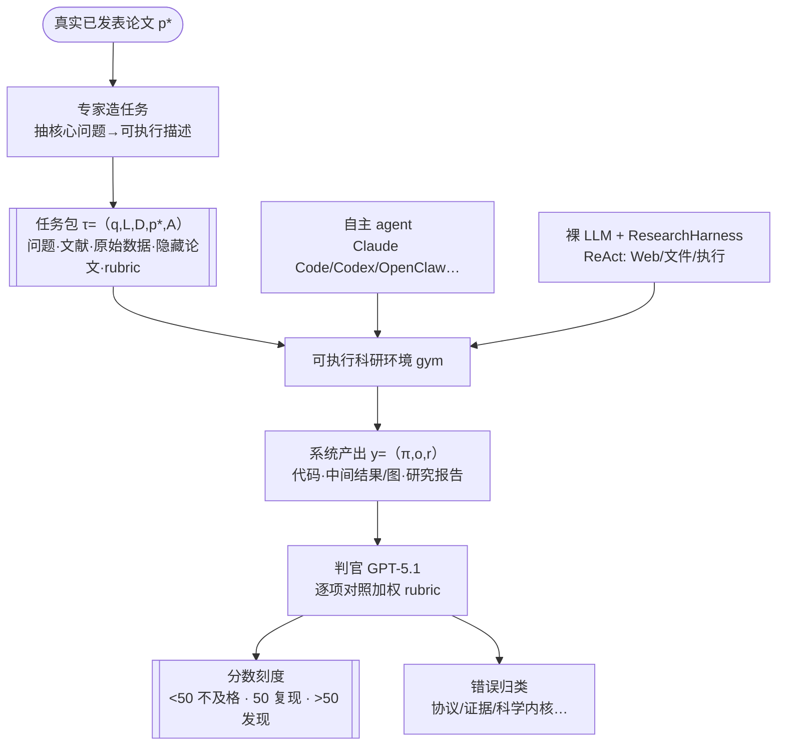

# Paper · 论文本身

## 一句话总结

ResearchClawBench（RCBench）是一个**端到端自主科研能力的考卷**：给 agent 一道真实科学问题 + 相关文献 + 原始数据，但**把对应的那篇真论文藏起来**，让它从零做实验、出图、写报告，再用专家拆解出来的**加权评分细则**去对照——分数 50 分代表"复现到了原论文水平",超过 50 才算"新发现"。结论很冷峻：当前最强的自主科研 agent（Claude Code）平均只有 **21.5 分**。一句话口号：**测的不是会不会写报告，而是能不能把科学证据链真正复刻出来。**[^1]

## 问题(Problem)

- OpenClaw、Claude Code、Codex CLI 这类 coding agent 越来越被宣传成"能自主做科研",但**没有一个原则性的办法去检验这种说法到底站不站得住**。
- 已有 benchmark 各管一段、都不完整：科学问答/推理（GPQA、HLE）、交互式科学环境（ScienceWorld、DiscoveryWorld）、论文复现（PaperBench、CORE-Bench）——但**没有一个**要求系统"从原始实验数据出发、产出完整科研成果、并用可验证的锚点来评判"。
- 难点有三：① 任务得**科学上有意义**、贴近真实科研；② 科研产出是**开放式**的，没法用 exact-match 或单测打分，而 LLM-as-judge 又会引入偏置；③ 科学是**异构**的（数据模态/分析方法/证据标准各不同），覆盖太窄会让系统过拟合到少数技能。

> [!key] 立场
> RCBench 最该被学的判断有两点。其一是**"隐藏目标论文 + 专家加权 rubric"这套评测设计**：把"开放式科研报告"这种没法机器判分的东西，拆成"围绕真论文关键科学产物的、带权重的可验证子项",再把 50 分钉成"复现线"、>50 才是"发现"——一个**同时能测复刻、又给真发现留空间**的刻度尺。其二是它给行业泼的冷水：**最强 agent 才 21.5/100，连复现线一半都没到**，而且失败不在"跑不出报告",而在**实验协议跑偏、证据对不上、缺了科学内核**。对你（应用型 builder）这是一面镜子：当下"自主科研 agent"的瓶颈是**科学严谨性**，不是工程花活。

## 关键术语(Key terms)

| 术语 | 大白话解释 |
| --- | --- |
| **re-discovery（再发现）** | 不给目标论文，让系统从数据+文献独立"重新发现"出原论文的核心结论。50 分 = 复刻到了原论文。 |
| **hidden target paper（隐藏目标论文）** | 每道题背后都有一篇真论文 `p*`，但**评测时对系统隐藏**——系统只能看到任务描述、文献、原始数据。 |
| **rubric（评分细则）** | 专家把目标论文的关键科学产物拆成若干**带权重的可验证子项**（文本类/图像类），判官逐项核对。 |
| **ResearchHarness** | 论文自带的一个**轻量 ReAct 式工具壳**，让没有完整 agent 脚手架的"裸 LLM"也能参赛（Web 搜索/读文件/跑命令）。 |
| **target optimization vs diagnostic analysis** | 两类任务：前者奖励"更强的定量结果",后者奖励"更完整的解释/机制/新洞见"。 |
| **scientific core missing（缺科学内核）** | 一类典型失败：报告写得漂亮，但**核心机制或关键发现没了**。 |

## 核心方法(Core method)

把 RCBench 想成一场**"闭卷复原实验"的考试**：

1. **出题（专家造任务）**：领域专家挑"问题清晰、数据可得、有研究价值"的真论文，把核心问题改写成**可执行的任务描述**，再配上相关文献和原始数据，围绕目标论文的关键产物**拆出加权 rubric**，最后多位专家交叉核对、删掉不合适的样本。一道任务形式化为 `τ=(q, L, D, p*, A)`：问题、文献、原始数据、隐藏目标论文、评测产物。
2. **作答（系统跑全流程）**：系统在可执行环境里产出 `y=(π, o, r)`：实验代码与执行过程、中间结果/图/文件、最终研究报告。
3. **判分（隐藏论文当答案）**：判官（GPT-5.1）拿系统输出对照 rubric 逐项打分；**50 分=复刻原论文，>50=超越（真发现）**。另设 4 个补充维度（全面性、深度、指令遵循、专业性）。

为让"裸 LLM"也能比，论文还提供 **ResearchHarness**：一个刻意做小的 ReAct 工具壳——Web（Serper 搜索 + Jina Reader 抓网页）、文件（含 MinerU 抽 PDF）、执行（一次性 shell + 持久终端），并在历史逼近 128k token 时**自动压缩上下文**继续跑。壳越小，越能测出**模型自己的能力**。

## 架构 / 流程

## 创新点(Innovation points)

| 创新 | 新在哪 | 为什么重要 |
| --- | --- | --- |
| 隐藏目标论文 + 加权 rubric | 把开放式科研产出拆成围绕真论文关键产物的、带权重的可验证子项 | 解决"科研报告没法 exact-match、LLM 裸判分有偏置"的评测死结 |
| 50=复现 / >50=发现 的刻度 | 在同一评分空间里同时刻画"复刻"和"超越" | 既能量化当前差距，又给真发现留出测量空间 |
| 端到端、从原始数据起步 | 要求走完文献→处理原始数据→设计执行实验→出图→写报告全流程 | 补上已有 benchmark"只测某一段"的缺口 |
| ResearchHarness 统一壳 | 给裸 LLM 一个极简 ReAct 壳，与带脚手架的 agent 同台可比 | 把"模型能力"和"脚手架红利"分开测 |
| 6 类错误归因 | 对 280 次运行做细粒度错误分类 | 指出瓶颈在科学严谨（协议/证据/内核），不在工程执行 |

## 实验 / 证据(Experiments / evidence)

规模：**40 个任务 × 10 个科学领域**（天文、化学、地球科学、能源、信息科学、生命科学、材料、数学、神经科学、物理）；评测 **7 个自主科研 agent + 17 个裸 LLM**（经 ResearchHarness）；判官为 **GPT-5.1**。满分 100，50=复现线。以下均为论文**自报**。[^2]

- **主结果（Table 5）**：最强自主 agent **Claude Code 平均仅 21.5**；取每题最优 agent 的"自主-agent 前沿均值"也只有 **24.6**。最强裸 LLM **Claude-Opus-4.7 平均 20.7**；"LLM 前沿均值" **26.5**。**全部远低于 50 的复现线。**
- **没有谁通吃**：Claude Code 虽总分第一，40 题里**只赢 14 题**；7 个 agent 的任务级难度高度一致（21 对两两相关性中位数 0.79，区间 0.64–0.86）。不同模型在不同领域领先（如 GLM-5.1 领先化学、GPT-5.4 领先生命科学、Qwen3.7-Max 领先物理）。
- **报告漂亮 ≠ 内容到位（Table 6）**：4 个补充维度里，系统**专业性常 >70**，但其余维度低很多；且这 4 维与 rubric 分**弱相关**——核心挑战是**复刻科学证据，不是把报告写漂亮**。
- **多花资源 ≠ 更准**：成本/耗时与分数**只有弱正相关**，且主要被"高分高成本高耗时"的 Claude Code 抬起来。成本效率拐点是 Qwen3.7-Max，耗时效率拐点是 OpenClaw。说明任务**还在现有模型稳定能力边界之外**，多算不必然更好。
- **失败长什么样（Figure 5，280 次运行）**：集中在**实验协议不符（Experiment Design Mismatch）、证据不符（Evidence Mismatch）、缺科学内核（Scientific Core Missing）**，而非目标跑偏/可靠性/执行失败。即 agent 不是跑不出报告，而是**在协议、关键证据、机制解释上逐渐偏离原论文**。
- **案例（Physics 002）**：OpenClaw 此题全场最高，也只有 **27.45**。它复刻了最直接的趋势（counts-weighted linear XEB，保真度随深度下降；第 5 项 rubric 拿 47/50、N=40 深度缩放 40/50），但**整条证据链没补全**——固定 d=12 的 qubit 缩放缺 log-XEB 与多指标一致性、N=56 验证缺 MB 回归/depth-24 镜像电路推断、**gate-counting 保真度模型完全缺失**。典型表现：**停在最直观的可观测趋势，漏掉精细验证与物理建模**。

> [!warn] 别被带偏
> ① 这是**评测论文**：它精确量化了"当前 agent 离可靠科研有多远",但**不给方法**去缩小差距。② 全部分数**自报**，且判官是单一模型（GPT-5.1）——judge 偏置只是被"rubric 拆细+技术关键词核对"缓解，不是消除。③ 只覆盖**干实验室（dry-lab）**研究（基于已有数据/代码/文献），**做不了湿实验**（要真实验台/样品/仪器）。④ 评分主要看**最终报告**，不是细粒度的研究步骤；评"真正的新结论"仍缺比 rubric 更可靠的方法（作者自承）。

## 限制与风险(Limitations and risks)

- **只能评干实验室**：依赖已有数据、代码、文献的研究；需要真实实验平台、样品制备、仪器操作的湿实验无法评估。
- **评的是终点不是过程**：当前打分主要针对最终报告，而非细粒度的研究步骤——一个走对了大半、最后一步崩掉的过程，和一个一直敷衍的过程可能拿到相近分。
- **rubric 锚定已有论文的天花板**：评"超越目标论文的真发现"需要比"围绕已有目标论文构造的 rubric"更可靠的评测方法，目前没有。
- **规模小**：40 任务 / 10 领域，覆盖广度有限，单领域样本稀薄。

## 先读什么(What to read first)

1. Abstract + §1 —— 抓住"隐藏目标论文 + 加权 rubric + 50=复现/>50=发现"的核心命题与冷峻结论。
2. §3.1–3.4 + Table 2 —— 任务形式 `τ=(q,L,D,p*,A)`、数据构造、ResearchHarness、评分刻度（天文 000 的 rubric 示例最直观）。
3. §4.2 Table 5 —— 主结果（各系统×各领域分数）。
4. §4.5 Figure 5 —— 6 类错误分布（瓶颈在科学严谨）。
5. §4.6 Figure 6 —— Physics 002 案例：看"复刻了什么 vs 漏了什么"。
6. §6 Limitations —— 干实验室边界、评终点不评过程。
7. 数据集：`huggingface.co/datasets/InternScience/ResearchClawBench`，代码 `github.com/InternScience/ResearchClawBench`。

## 技术细节(选读)

**rubric 是怎么把"开放式报告"变成可判分的**
- 大白话：把"这篇报告做得好不好"这种主观问题，换成一串"它有没有做到这几件具体的事"的勾选题，每件事配一个权重。
- 精确机制（§3.4）：每个 rubric 子项围绕目标论文里的**一个具体科学产物**构造，分**文本类/图像类**两种，含"从目标论文关键贡献抽出的具体判据 + 判官要核对的技术关键词 + 权重"。判官按子项内容和类型选评测模式打分。以天文 000 为例，三条 rubric 权重分别是 0.20（正确读入后验样本、总结质量/自旋后验）、0.30（产出 M33 X-7 排除曲线）、0.50（用排除曲线推自相互作用耦合上限）。

**ResearchHarness 的工具面与上下文管理**
- 精确机制（§3.3）：三类工具——Web（Serper 搜索、Jina Reader 抓页）、本地文件（找文件/读文本/看图/MinerU 抽 PDF）、本地执行（一次性 shell + 持久终端做长分析）。长任务自动压缩：消息历史逼近输入预算时摘要成"紧凑记忆"再续跑，**默认 128k token 触发**。
- **防张冠李戴**：RCBench 的"50=复现/>50=发现"是**评分刻度设计**，不是模型机制；它和 PaperBench 这类"论文复现"benchmark 的关键区别在于**目标论文对系统隐藏、且要求从原始数据端到端再发现**，而非给定论文/代码做复现——把两者混为一谈是错的。

## 后续演化 · 这方法后来怎样了

RCBench 处在"自主科研 agent 评测"这条快速堆叠的线上，它在论文里把自己定位为对以下工作的补全：

- PaperBench（`arXiv:2504.xxxxx`，作者引为 starace2025paperbench）做"给定目标论文的复现",RCBench 反过来**隐藏目标论文**做再发现。_[置信度:中]_（注：原文用引用键 starace2025paperbench，未在正文给出可解析 arXiv 号，故 arXiv ID 待核。）
- ScienceAgentBench、SciCode、MLE-bench、MLGym 等聚焦"科学编码/数据分析/ML 工程"的局部能力，RCBench 要求走完**自然科学全流程**。_[置信度:中]_
- 系统侧 The AI Scientist、AI Co-Scientist、AI-Researcher、InternAgent-1.5 等"会做科研的系统",正是 RCBench 想用一把**系统无关**的尺子去横向比较的对象。_[置信度:中]_

（本文 2026-06 提交；上述为论文自身的引用关系定位，多数引用键未给可解析 arXiv 号，故整体降级标注，暂无可独立核实的前向"被改进"引用。）

[^1]: Xu, Li, Ye et al., *ResearchClawBench: A Benchmark for End-to-End Autonomous Scientific Research*, arXiv:2606.07591（Shanghai AI Laboratory · 上海交大 · 复旦等；HF upvotes 85）。代码 github.com/InternScience/ResearchClawBench，数据 huggingface.co/datasets/InternScience/ResearchClawBench。
[^2]: 主结果 §4.2 Table 5；补充维度 §4.3 Table 6；资源-分数 §4.4 Figure 4；错误分析 §4.5 Figure 5（280 次运行=7 agent×40 任务）；案例 §4.6 Figure 6（Physics 002）；任务形式与刻度 §3.1/§3.4；ResearchHarness §3.3 Table 4。判官为 GPT-5.1。
