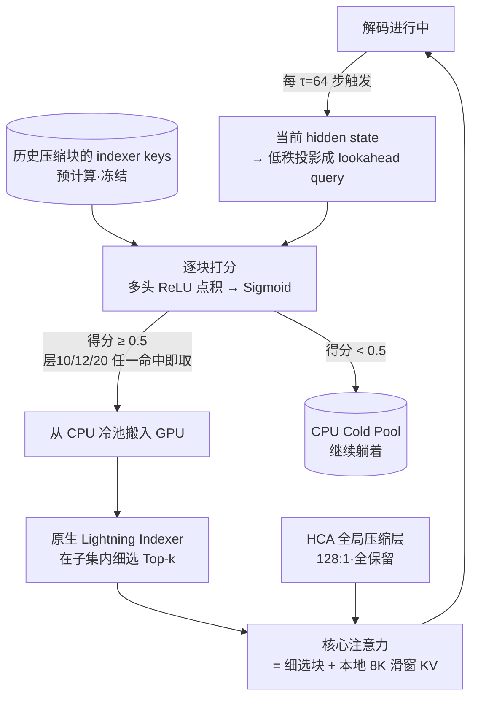

# Paper · 论文本身

## 一句话总结

FlashMemory-DeepSeek-V4 给超长上下文推理换了个内存哲学:解码时**不再把全部 KV cache 压在 GPU 上**,而是用一个独立训练的小检索器(Memory Indexer)**每 64 步预测一次"接下来会用到哪些历史块"**,只把这些块从 CPU 冷池搬进显存——作者自报平均物理 KV cache 降到 DeepSeek-V4-Flash 基线的 13.5%,精度还略涨(+0.6 个百分点)[^paper]。口号式概括:**与其全带在身上,不如先想好要用什么再去拿**。

## 问题(Problem)

- 超长上下文的真瓶颈是**显存,不是算力**:现代稀疏注意力已把每步解码的 FLOPs 压到近常数,但 KV cache 的 GPU 占用仍随序列长度**线性涨**。
- DeepSeek-V4、Qwen3.5 这类模型用重压缩注意力(HCA)/线性注意力**减缓**了增长速度,但为了保住细粒度事实召回,仍要保留相当比例的低压缩层——线性增长本身没被消灭。
- 作者从真实推理日志里观察到巨大浪费:**超过 90% 的 64K+ 上下文请求,其实只靠最后 8K token 就能答对**——绝大部分显存养着"当前这步根本用不上"的历史。
- 但反过来直接丢历史(滑动窗口)又会在**真需要全局综合的任务上整体崩盘**。"全局推理能力"和"不交全量内存税"是硬矛盾,这就是长上下文服务贵的根源。

> [!key] 立场
> 这是一篇**把检索系统思维塞进注意力机制的工程报告**:它把"该留哪些 KV"重新表述成一个标准双塔检索问题,从而能**完全不加载万亿参数骨干**、用单个 H20 GPU-hour 训完索引器、一周扫 500 组配置。看它学两件事:**解耦训练范式**(冻住贵的、只训便宜小件,实验吞吐本身就是架构发现的前提)和**罕见诚实的失败剖析**(项目中途被叫停,作者把 MRCR 崩盘、O(1) 假设破产、长度泛化天花板全写成了正式章节)。别照抄它的超参——τ=64 和 0.5 阈值作者自认**没做过消融**。

## 关键术语(Key terms)

| 术语 | 大白话解释 |
| --- | --- |
| **LSA(Lookahead Sparse Attention,前瞻稀疏注意力)** | 不被动地对全部历史做注意力,而是周期性**预测未来若干步要用的历史块**、只把它们留在 GPU 的推理范式[^paper]。 |
| **Memory Indexer(记忆索引器)** | 做这个预测的小模块:结构上照搬 DeepSeek-V4 原生 Lightning Indexer,只把最后激活换成 Sigmoid,输出"这块未来用得上吗"的 0~1 概率[^s21]。 |
| **HCA / CSA** | DeepSeek-V4 里的两类注意力层:HCA=重压缩注意力(128:1 压缩,管全局粗语义);CSA=压缩稀疏注意力(管细粒度召回)。LSA 动的是 CSA 层,HCA 全保留[^paper]。 |
| **CPU Cold Pool(CPU 冷池)** | 历史压缩 KV 块平时存放的地方;被索引器判为"要用"才搬进 GPU 显存[^s21]。 |
| **阈值召回(threshold-based recall)** | 不用固定 Top-k,而是召回所有得分 ≥0.5 的块——召回数量**动态**,理论上允许"一块都不召"[^s21]。 |
| **golden label(金标签)** | 训练索引器用的"哪些块真被用到了"标签,由冻结骨干离线跑出、再经三步去噪得到[^s22]。 |
| **跨层多数投票(cross-layer majority voting)** | 金标签去噪的核心:一个历史块要被 21 个 CSA 层里**至少 3 层**独立选中才算正样本,滤掉单层噪声[^s22]。 |
| **双塔/dual-encoder(双编码器)** | 检索系统标准架构:查询、文档各自编码再算相似度。这里"文档塔"(历史块表示)完全冻结,**只训查询塔**[^s23]。 |

## 核心方法(Core method)

类比:把 GPU 想成**办公桌**,CPU 想成**仓库**。常规做法是把整个图书馆搬上办公桌——写每个字都背着全部藏书。LSA 的做法是雇一个图书管理员(Memory Indexer),每写完 64 个字抬头看一眼你正在写的内容,**预测接下来这一节会引用哪几本书**,只把那几本从仓库搬上桌,其余照旧躺仓库。

两级选择,粗细分工:

1. **粗选(LSA 预测)**:每 τ=64 步解码触发一次,用当前 hidden state 对所有历史压缩块打分(Sigmoid 概率),**≥0.5 的全部**从 CPU 冷池搬进 GPU——数量动态,不设固定 k。
2. **细选(原生机制)**:DeepSeek-V4 自带的 Lightning Indexer 只在这个已搬进来的小子集里做 token 级 Top-k 精选,再和不可卸载的本地 8K 滑窗 KV / 已解码 token KV 拼起来做核心注意力。底层 FlashAttention/FlashInfer 内核始终只摸"高度浓缩的驻留序列"。

训练上最聪明的一步:**历史块的表示(indexer keys)是现成的、冻结的**,所以整个问题退化成"只训双塔的查询塔"——三个低秩投影矩阵,不到全模型 0.1% 的参数。标签、表示、hidden state 全部离线预抽,**万亿参数骨干全程不进显存**,单个 H20 GPU-hour 收敛。

## 架构 / 流程(Architecture / pipeline)

## 创新点(Innovation points)

| 创新 | 新在哪 | 为什么重要 |
| --- | --- | --- |
| 前瞻预测式 KV 管理 | 从"被动对全历史注意"变成"主动预测未来 τ 步的需求再去取" | 把显存占用从"和序列长度绑定"变成"和真实需求绑定" |
| 阈值召回替代 Top-k | 召回数量动态,允许多召也允许(理论上)零召 | 固定 Top-k 强迫召回固定数量,正是标签噪声和内存浪费的来源 |
| Backbone-free 解耦训练 | 把索引器当独立双塔检索模型,在预抽表示上训,骨干永不加载 | 单个 H20 GPU-hour 收敛 → 8×H20 一周 500 次配置扫描;实验吞吐成了架构发现的引擎 |
| 跨层多数投票金标签 | Softmax → Top-p(0.6) → ≥3/21 层共识,正样本从 ~10,000/窗 压到 100–1,000 | 没有这步去噪,naive 并集标签会让索引器学一堆跨层噪声 |
| 3 层 OR 路由 | 只在第 10/12/20 层放索引器,任一层判"要"就取 | 单层容量不够,8 层联合又召回 30–49% 历史块(失去意义);3 层是 Pareto 甜点 |

## 实验 / 证据(Experiments / evidence)

以下数字均为**作者自报**(sglang 部署日志,8×H20;对照 DS-V4-Flash;所有配置都保留 HCA 全局压缩层、最后 8K prompt 对应 CSA 块和已解码 token 的本地窗口)[^t1]:

- **总平均**:FM-DS-V4 准确率 77.5 vs 基线 76.9(+0.6);Table 1 的 Avg 行平均物理 KV cache 是 0.10 GB vs 0.93 GB(直接相除约 10.8%)。原文 §3.2 文字另把逐基准内存占比平均汇总为**13.5%**(即平均减少 86.5%),两者是不同口径[^t1]。
- **越长越赚**:LongBench-v2-L(493K)70.0 vs 68.1(+1.9),物理 KV cache 0.18 vs 1.80 GB(约 10.0%);LongMemEval-M(500K)40.2 vs 39.3,0.17 vs 1.82 GB(约 9.3%)。
- **不是全赢**:RULER 128K(93.2 vs 94.3)和 256K(88.2 vs 90.5)**掉分**;RULER 64K/512K 略胜。"+0.6%"是平均数,不是处处更好。
- **对照组崩盘证明预测真有用**:同等内存预算下,只留近期(Recency Only)平均 33.3、随机留 10% 平均 38.7——靠 HCA 全局粗语义 + 局部 8K 能撑住部分题,但凡需要细粒度历史召回就全军覆没。
- **对抗测试(No-Context)**:历史完全无关的题,精度保持(95.0 / 92.5 vs 基线 96.7 / 91.2),但**没拿到理想的 O(1) 内存**——500K 时占比降到 8.4%,绝对块数却比 125K 时涨了约 2.5 倍:Sigmoid 在超大干扰池里持续泄漏假阳性[^s331]。
- **MRCR 崩盘**:多区间上下文检索基准上 76.0 → **48.0**。oracle 模拟(把真·金块直接喂给它)显示:三个主流基准只要 10–25% 金块就能 100% 保住基线,而 MRCR 连给 50% 真金块都还比全量 KV 掉约 2%——这类任务**本质需要密集全局记忆**,粗粒度预取范式天花板就在这[^s332]。
- 训练集约 10,000 篇长文档(16K–512K);索引器最长训到 512K。
- **仓库实读**:GitHub release 不是完整 DeepSeek-V4 服务栈,而是 `retriever.py`、`demo.py`、`toy_flashmemory_inference.py`、`requirements.txt` 和 README。`retriever.py` 实现三层 `l10/l12/l20` scorer、FP8 compressed-K dequant、YaRN RoPE、Hadamard、`max/mean` ensemble 与 top-k/threshold 选择;toy loop 只用 mask `-inf` 模拟"没召回到 GPU"。README 明说生产版依赖内部 sglang + DeepSeek-V4 CSA 框架,真实 KV swap、attention-sink、threshold fallback、per-request routing 不在开源 release 里[^repo]。

> [!warn] 别被带偏
> ① "13.5%"是原文 §3.2 文字给出的逐基准内存占比平均;Table 1 的 Avg 行实值是 0.10 GB vs 0.93 GB,直接相除约 10.8%,两者不要混用。**推断**:LongBench-v2-S(46K)基线仅 0.17 GB,应只计可裁剪的历史 CSA 块物理 KV,原文未明示完整分母。HCA 全局层和本地 8K/已解码窗口在实验设置中照常保留;对照对象是 DS-V4-Flash(本就是稀疏架构),不是 dense full attention。② **长度泛化有硬天花板**:索引器只在训练长度的 2 倍内可靠,再往外块选择退化成接近随机;>1M 作者自己都不敢保证。③ 项目因组织调整**中途叫停**:τ=64、阈值 0.5 没消融,key 表示从没调过,所有数字是"资源受限下的第一版",不是范式上限,也别当成熟方案直接抄。④ 配套 repo 截至 2026-06-10 核验为 GitHub 25★ / HF model 13 likes,只有 retriever 参考实现与 toy loop,无第三方复现、无生产 swap 引擎。

## 限制与风险(Limitations and risks)

- **三个作者自认的架构性局限**[^s332]:key 表示冻结(从未微调过 DeepSeek-V4 原生压缩 key);双塔只有一次粗点积交互,缺 ColBERT 式 late-interaction 的细匹配能力;与骨干完全解耦,学的是静态伪标签,看不到真实自回归漂移。
- Sigmoid 点式打分在超长序列下假阳性累积,拿不到常数内存下限;密集全局检索任务(MRCR 类)直接崩。
- 训练数据来自冻结骨干自己的注意力模式——**索引器学的是"这个骨干习惯看哪",不是"任务需要看哪"**,换骨干需重抽标签重训。
- 项目已暂停,roadmap(可学习 key、late-interaction、联合训练)无人认领;工程成熟度停在技术报告阶段。

## 先读什么(What to read first)

1. Abstract + Figure 1 —— "13.5% 显存 + 精度持平"的全景图。
2. §2.1 —— 两级选择机制(Sigmoid 阈值粗选 → 原生 Top-k 细选),全文核心。
3. §2.2 —— 金标签三步去噪管线(这是数据工程的精华)。
4. §2.3–2.4 —— 解耦训练 + 500 次扫描怎么找到 3 层配置、哪些 trick 被排除。
5. §3.3 —— 三个失败剖析(O(1) 破产 / MRCR oracle 诊断 / 2× 长度天花板),全文最值钱的诚实。
6. 代码:GitHub `libertywing/FlashMemory-Deepseek-V4`;HF 模型 `libertywing/FlashMemory-Deepseek-V4`。先看 README 的 "What it is / is NOT",再看 `retriever.py` 的 scorer 与 `toy_flashmemory_inference.py` 的 64 步循环。

## 技术细节(选读)

**打分函数(粗选)**
大白话:每个索引头各自算"当前查询和这个历史块像不像",ReLU 砍掉负相关,按头的动态权重加和,最后 Sigmoid 压成 0~1 概率。
精确机制(原文 §2.1, Eq.1–5):hidden state 经低秩下投影 W^DQ 再上投影 W^IUQ 得多头查询 q,另投影出逐头权重 w;得分 I_{t,s}=σ(Σ_h w_h·ReLU(q_h·K_s^IComp))。**Sigmoid 是与原生 Lightning Indexer 唯一的结构差异**——原生用 ReLU 边界做原始注意力打分,这里要对齐二分类目标 y∈{0,1} 所以归一到 (0,1)。

**金标签去噪管线**
大白话:把骨干 21 个 CSA 层各自"想看哪些块"的票收上来,只有 ≥3 层都投的块才算真需要;naive 并集会有近万正样本/窗,投票后压到 100–1,000。
精确机制(原文 §2.2, Eq.7–11):逐层 Softmax → Top-p 截断(p=0.6,留累计概率前 60% 的块)→ 跨层计票 V_{i,s},θ=3 层共识成金块 → 对未来窗口 [t, t+τ-1] 取并集成该触发点的正标签集。

**训练配方与被排除的 trick**
大白话:最终配方=随机初始化 + 大查询低秩维度 + Focal Loss;三个检索界常用 trick 在 500 次扫描里被实测排除。
精确机制(原文 §2.4):Focal Loss γ=2,无 α 类平衡系数,类不平衡靠 3:1 负采样 + 逐样本权重调度;被排除的:pairwise→pointwise 链式训练(无统计增益)、LLM 标注语义块当强负例(引入二次标签噪声,随机负采样反而稳)、按层匹配数加权 loss(精度微涨但牺牲召回下界,违背"安全网"目标)。
**防张冠李戴 ①**:文中 r=2048 的 query low-rank 是 DeepSeek 架构里 `q_lora_rank` 这个**固定结构维度**(V3 默认 1536),**不是 PEFT 式 LoRA 微调**(后者 rank 8–64、在冻结权重上学扰动)——把它说成"用 LoRA 训了个索引器"是错的,原文 §2.4 专门辟了谣。
**防张冠李戴 ②**:Memory Indexer(本文新增,Sigmoid 二分类,metric learning 训练)≠ Lightning Indexer(DeepSeek-V4 原生,ReLU 打分,端到端自蒸馏训练)。两者结构镜像但**训练范式完全不同**,且推理时**串联使用**(前者粗选、后者细选),不是替换关系。

**仓库 release 到底能跑什么**
大白话:你能跑一个真的 retriever scorer,也能跑一个玩具 decode loop,但跑不出真实 DeepSeek-V4 长上下文服务。
精确机制(仓库实读):`retriever.py` 是 torch-only reference implementation,读取 joint checkpoint 后构建三层 scorer;`toy_flashmemory_inference.py` 每 64 步调用 retriever,把没选中的 chunk attention logit mask 成 `-inf`。README 明确:CPU↔GPU KV cache transfer、生产 swap engine、internal sglang + DeepSeek-V4 CSA integration、threshold fallback、per-request routing 均未开源[^repo]。

## 解法是怎么找到的(选读)

这篇技术报告罕见地写了真实的探索轨迹,以下每条均锚定原文章节:

- **"放哪几层"是试出来的**:早期探索发现浅层表示只装着低级 token 统计、lookahead 预测奇差,索引器必须放在"已有成熟全局语境感知"的层(§2.4 开头);单层容量不够,激进上 8 层联合(6–20 层)又把召回 mask 撑得太松——实测要取 30–49% 的历史块进显存,直接违背省内存的初衷(§2.4);最终经 Pareto 前沿扫描定格在 10/12/20 三层 + OR 路由(§2.4, Eq.13)。
- **500 次实验是解耦训练买来的**:正因为索引器训练完全离线、单个 H20 GPU-hour 即可收敛,团队才能在 8×H20 上一周内跑约 500 组配置系统扫出上述结论——传统端到端联合蒸馏下这种探索"计算上不可行"(§2.3 末段)。
- **三个常用 trick 被实测否决**(§2.4 列表):pairwise 链式训练无增益、LLM 强负例挖掘反而注入二次噪声、按匹配数加权 loss 伤召回下界——全部从最终管线移除。
- **两个初始假设被自己的对抗实验推翻**:原假设"上下文无关查询时 Sigmoid 门会自然塌缩到近零召回 → O(1) 内存",No-Context 增强测试证伪(占比降但绝对量涨 2.5 倍,§3.3.1);原假设"点式打分不受候选池规模影响 → 短训长推到 1M+",实测在训练长度 2 倍处硬性崩坏,归因于位置编码出分布(§3.3.3)。
- 注意:τ=64、阈值 0.5 等关键超参**不是**这条探索链的产物——作者明说因项目中止只来自初期试探、未经消融(§2.4 末"Note on Hyperparameter Selection")。

## 后续演化 · 这方法后来怎样了

- 论文 2026-06-08 提交、2026-06-09 v2,截至 2026-06-10 暂无可核实的前向引用——本节数据不足,无法给出真正"后来怎样"的继承脉络。_[置信度:高]_
- HF 评论区有人提示 NOSA(arXiv:2510.13602)与 SparDA(arXiv:2606.04511)是相邻方向,作者回复会在下一版正式稿里阅读补充;这只是**相关工作补全线索**,不是 FlashMemory 的后续演化或复现。_[置信度:中][^hf]_
- 作者在 §3.3/§4 留下的正式 roadmap(可学习 key 表示、ColBERT 式 late-interaction、与骨干联合优化)因项目暂停**无人认领**;社区是否接手待观察。_[置信度:高——基于原文自述,非前向引用]_

[^paper]: FlashMemory-DeepSeek-V4 技术报告,arXiv:2606.09079v2(2026-06-08 提交,2026-06-09 v2;Tencent + HKUST(GZ) + 清华 + 独立研究者)。Abstract 与 §1;HF 页面 2026-06-10 核验 Upvote 52。
[^s21]: 原文 §2.1 Memory Indexer for Lookahead Selection,Eq.1–6。
[^s22]: 原文 §2.2 Lookahead Dataset Construction,Eq.7–11。
[^s23]: 原文 §2.3 Optimization and Decoupled Training,Eq.12。
[^t1]: 原文 §3.1 实验设置与 §3.2 Table 1;KV 开销由 sglang 部署日志测得(8×H20)。逐格数值以原文 Table 1 为准;0.10/0.93 GB 是表中 "Avg." 行,直接相除约 10.8%;13.5% 是原文 §3.2 文字给出的逐基准占比平均,完整分母口径原文未明示。
[^s331]: 原文 §3.3.1 Context-Independent Overhead,Table 2。
[^s332]: 原文 §3.3.2 Dense Global Memory Breakdown(MRCR oracle 诊断)与文末三条架构局限。
[^repo]: GitHub `libertywing/FlashMemory-Deepseek-V4`,2026-06-10 clone 实读 commit `73be3ba`;文件包括 README、`retriever.py`、`demo.py`、`toy_flashmemory_inference.py`、`requirements.txt`;README 明示生产 KV swap / internal sglang + DeepSeek-V4 CSA integration 不在开源 release。
[^hf]: Hugging Face paper page `https://huggingface.co/papers/2606.09079`,2026-06-10 核验:评论区提到 NOSA 与 SparDA,作者回复会在下一版正式稿阅读补充;Models citing this paper 1,Datasets/Spaces 0。
