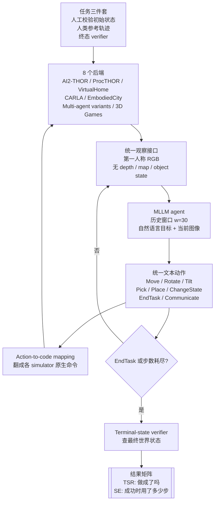

# Paper · 论文本身

## 一句话总结

SpatialWorld 把空间推理评测从“看一张图答空间关系”推进到“agent 只能看第一人称 RGB，一步步走、转、拿、放、沟通，最后由终态脚本判成败”：它把 **8 个异构 3D 后端**包进同一套文本动作接口，做了 **760 个**人工标注任务，并用 **TSR(任务成功率)** + **SE(步效率)** 同时揭露当前 MLLM agent 的短板——论文自报最强 GPT-5 平均 TSR 也只有 **17.4%**，物理任务 Overall 只有 **14.4%**。[^arxiv]

## 问题(Problem)

空间推理听起来像“模型会不会判断左边/右边、远/近、物体关系”，但真正的物理世界不是一张静态图。你站在厨房门口时，看不到冰箱里面；要完成“把坏掉的 lettuce 扔进垃圾桶”，你得先转头、走近、打开、拿起、放进、确认。[^intro]

现有 benchmark 主要有两类问题：

- **静态 VQA / VideoQA 只问答案**：模型看图或视频回答问题，能测空间关系识别，但测不到“主动探索、更新空间信念、闭环行动”。
- **embodied benchmark 常被模拟器绑死**：有的依赖特定后端、传感器、低层动作或非视觉状态，最后分数很难分清是“通用空间推理强”，还是“适配某个 simulator 的接口强”。[^protocol]
- **只看成功率会漏掉代价**：一个 agent 可能靠反复试错终于成功；另一个更快但成功少。只报 TSR 会把“真懂”和“乱试”混在一起。[^metric]

所以 SpatialWorld 的问题定义更像一句工程追问：**一个现成 MLLM，不做特定 simulator 训练，只靠第一人称图像和文本动作，能不能跨多种 3D 世界完成开放式空间任务？**

> [!key] 立场
> 这篇最值得学的不是“又有一个 embodied benchmark”，而是**怎么把跨环境 agent eval 做得可归因**：统一观察与动作接口，让模型不能靠后端私有信息取巧；用终态 verifier 判产物，不强迫轨迹一样；把成功率和效率拆开报；再用室内/室外、单人/多人、写实/抽象游戏的切片找断崖。它对 AI-Brief / 自进化 agent 的直接价值是：评一个 agent 不能只问“做成了吗”，还要问“在同一接口下、跨任务族、用了多少代价、断在哪个能力格子”。

## 关键术语(Key terms)

| 术语 | 大白话解释 |
| --- | --- |
| **interactive spatial reasoning(交互式空间推理)** | 不是看图答题，而是在只看到局部视野时，一边行动一边补全“我在哪、目标在哪、下一步怎么走/拿/放”的空间信念。[^related] |
| **vision-only partial observability(视觉单一部分可观测)** | agent 只能拿到第一人称 RGB 截图，没有 depth、global map、object coordinates、semantic metadata 这类“上帝视角小抄”。[^formulation] |
| **POMDP(部分可观测马尔可夫决策过程)** | 可以理解成“世界真实状态藏在幕后，agent 每一步只看到一张局部照片，再选一个动作”。论文用它形式化每个任务。[^formulation] |
| **unified action space(统一动作空间)** | 把不同模拟器的动作都翻译成一套 MLLM 能写的文本动作，比如 `Move`、`Rotate`、`Pick`、`Place`、`ChangeState`、`EndTask`、`Communicate`。[^action] |
| **action-to-code mapping(动作到代码映射)** | agent 写 `Move(forward, Medium)`，接口层再把它翻成 AI2-THOR、CARLA、VirtualHome 各自能执行的命令。模型策略不用为每个后端改写。[^repo] |
| **terminal-state verifier(终态验证器)** | 不比对 agent 走的每一步是否等于参考轨迹，只检查最后世界状态是否满足任务条件，比如 Laptop 是否真的 `isToggled=true`。[^metric] |
| **TSR(Task Success Rate, 任务成功率)** | 760 个任务里最终成功的比例。它回答“做没做成”。[^metric] |
| **SE(Step Efficiency, 步效率)** | 只在成功任务上算：人类参考步数 / agent 实际步数。它回答“做成时是不是绕了很多路”。[^metric] |

## 核心方法(Core method)

可以把 SpatialWorld 看成一个“多世界统一考场”。考场里有厨房、城市街道、无人机视角、多人协作房间、3D maze、Snake、Rubik’s Cube；但考生只能用同一套答题纸：看当前截图，写下一步文本动作。

核心管线有四层：

1. **任务被统一成 vision-only POMDP**：每一步输入是自然语言目标 + 当前第一人称 RGB；没有 privileged state。模型根据历史 `H_t` 产生一个高层动作，环境执行后返回下一张图。[^formulation]
2. **8 个后端被包进同一套接口**：室内是 AI2-THOR、ProcTHOR、VirtualHome；室外是 CARLA、EmbodiedCity；多人协作是 Multi-AI2THOR、Multi-ProcTHOR；抽象空间能力由 3D Games 补上。[^suite]
3. **动作层做“文本动作 → 后端命令”翻译**：论文定义四类动作，仓库的 `actions/parser.py` 也实装了这层，把 `Move/Rotate/Tilt/ChangePosture/Pick/Place/ChangeState/Manipulate/EndTask/Communicate` 映射到不同后端。[^repo]
4. **评测只看终态 + 代价**：每个任务有人工校验初始状态、人类参考轨迹、task-specific verifier。agent 一旦 `EndTask(DONE)` 或到达步数预算，就用 verifier 查终态；步数预算按 `2g+10`，其中 `g` 是人类 golden action count。[^metric]

这套设计的关键不是让 simulator 更像真实机器人，而是把**接口差异压低**：模型面对的是同一类第一人称观察和同一套文本动作，分数才更可能归因到空间探索、状态追踪、长程规划和终止判断。

## 架构 / 流程

## 创新点(Innovation points)

| 创新 | 新在哪 | 为什么重要 |
| --- | --- | --- |
| 多后端统一 I/O 瓶颈 | 8 个 simulator 共享第一人称 RGB 输入和文本动作输出 | 降低“模型只是适配某个后端 API”的噪声，让跨环境比较更可归因 |
| vision-only partial observability | 不给 depth、global map、object coordinates、semantic metadata | 逼 agent 主动探索和更新空间信念，更接近真实使用约束 |
| 终态验证而非轨迹匹配 | verifier 查最终状态，开放中间路径 | 不惩罚合理替代路线，适合开放式 agent 行为 |
| TSR + SE 双指标 | 成功率和成功代价分开报 | 揭露“成功靠穷举试错”的模型，不把低效成功当同等能力 |
| 写实环境 + 抽象 3D 游戏 | 真实语义任务测 grounding / manipulation，游戏剥离语义捷径测几何和状态追踪 | 能看到“会看厨房”与“会做几何变换”不是同一种能力 |
| 任务三件套生产流程 | 每题有初始状态、参考轨迹、终态 verifier，并经交叉复核 | 把 benchmark 从题目文本推进到可执行、可复现的评测资产 |

## 实验 / 证据(Experiments / evidence)

**数据规模(论文自报)**：SpatialWorld 有 **760** 个 human-annotated tasks，覆盖 **8** 个 simulation backends、**6** 个 scenario categories、**3** 个 complexity labels。后端分布是：AI2-THOR **311**、ProcTHOR **127**、VirtualHome **38**、CARLA **80**、EmbodiedCity **53**、Multi-AI2THOR **29**、Multi-ProcTHOR **17**、3D Games **105**。场景总计：Daily **350**、Work **59**、Entertainment **173**、Travel **132**、Social **46**。[^dist]

**实验设置(论文自报)**：评测 **15** 个 MLLM agent，既有 open-source / open-weight，也有 proprietary APIs；所有模型不做 task-specific fine-tuning。主实验温度 `τ=1.0`，历史窗口 `w=30`，每题步数预算 `2g+10`。开源模型部署在 **8× NVIDIA H200** GPU server，完整 GPU-server evaluation 消耗约 **5,000 GPU hours**；proprietary models 通过官方 API 访问。[^setup]

**主结果：整体仍很低(论文自报 Table 3)。**[^t3]

| 模型 | Physical Overall TSR | Digital TSR | 备注 |
| --- | ---: | ---: | --- |
| GPT-5 | 14.4 | 36.4 | 物理任务 overall 第一 |
| Qwen-3.5-397B-A17B | 12.2 | 26.0 | open-source / open-weight 组第一 |
| Gemini-3.1-Pro | 9.2 | 39.0 | digital 3D games 第一 |
| Kimi-K2.5 | 9.2 | 31.0 | physical overall 与 Gemini-3.1-Pro 同为 9.2 |
| Gemini-3-Flash | 7.2 | 38.1 | outdoor 细分较强 |
| GPT-5.4 | 6.6 | 11.9 | 论文专门做了 GPT-5 vs GPT-5.4 case study |

论文摘要里的 **GPT-5 平均 TSR 17.4%**、**Qwen-3.5 14.1%** 是跨全 benchmark 的 headline；Table 3 的 **14.4% / 12.2%** 是 Physical Overall，不含 digital column。不要把两个口径混在一起。[^arxiv]

**成功率和效率会分离(论文自报 Table 4)。**[^t4]

| 对比 | TSR 口径 | SE 口径 | 解释 |
| --- | ---: | ---: | --- |
| Kimi-K2.5 vs GPT-5.4 | Physical Overall 9.2 vs 6.6 | Physical Overall SE 0.486 vs 0.569 | TSR 接近但 GPT-5.4 成功时更省步，Kimi-K2.5 更像靠更多试错 |
| GPT-5 | Physical Overall TSR 14.4 | Physical Overall SE 0.511 | 成功率高，但成功轨迹不一定高效 |
| Doubao-2.0-Lite | Physical Overall TSR 5.8 | Physical Overall SE 0.704 | SE 高但成功样本少，不能单独拿 SE 说模型强 |

这里有一个重要统计陷阱：**SE 只在成功集上算**。当两个模型 TSR 差很多时，SE 的样本难度也变了，不能直接当全局能力排序。

**能力断崖：复合任务最难(论文自报 Figure 6)。**[^analysis]

| Complexity mode | Mean TSR | 说明 |
| --- | ---: | --- |
| Interaction | 50.2 | 只做对象状态变化，不要求大量探索 |
| Navigation-Interaction | 4.2 | 同时要长程导航 + 多步操作，难度断崖 |
| Navigation | 以原文 Figure 6 为准 | 图中给柱状趋势，正文给 Gemini-series leading Navigation 8.6% |

这个断崖比单一 leaderboard 更有用：它告诉你当前 MLLM agent 不只是“空间感差”，而是**把导航进度和对象操作串起来**时最容易崩。

**室内/室外差异(论文自报 Table 6)。**[^t6]

| 模型 | Indoor Overall TSR | Outdoor Overall TSR |
| --- | ---: | ---: |
| GPT-5 | 14.1 | 8.3 |
| Qwen-3.5-397B-A17B | 13.7 | 4.5 |
| Gemini-3-Flash | 6.9 | 9.0 |
| Gemini-3.1-Pro | 9.7 | 7.5 |

论文解释为能力偏置不同：GPT-5 / Qwen-3.5 在室内对象 grounding 和细操作上更强；Gemini 系列在 outdoor 长程空间导航上相对突出。

**多人协作和程序化布局很硬(论文自报 Figure 8a)。** GPT-5 pooled Social TSR 是 **34.8%**，Qwen-3.5-397B-A17B 是 **19.6%**，Kimi-K2.5 是 **17.4%**；但 Multi-ProcTHOR 最好也只有 **5.9%**。作者认为这说明 current agents 在熟悉手工室内布局里还可协调，一进 procedural multi-agent layout，共享进度追踪和角色分配可靠性急降。[^analysis]

**游戏拆解显示几何/状态变换仍弱(论文自报 Table 7)。**[^t7]

| 模型 | B3D | Maze | M3D | Rubik | Snake | Overall |
| --- | ---: | ---: | ---: | ---: | ---: | ---: |
| Gemini-3.1-Pro | 40.0 | 5.0 | 20.0 | 45.0 | 90.0 | 39.0 |
| GPT-5 | 0.0 | 65.0 | 20.0 | 10.0 | 91.2 | 36.4 |
| Gemini-3-Flash | 35.0 | 10.0 | 16.0 | 50.0 | 85.0 | 38.1 |
| Qwen3-VL-235B-Thinking | 5.0 | 70.0 | 32.0 | 10.0 | 23.8 | 28.3 |

写实环境里模型可能靠视觉常识和对象语义撑住一部分；Block3D / Rubik 这类任务剥掉语义捷径后，几何变换和多步状态追踪问题更明显。

**消融(论文自报 Appendix B/C)。** 温度方面，除 Gemini-3-Flash 外，几乎所有模型在 `τ=1.0` 达到最优；历史窗口 `w=30` 对多数模型是较好默认，再继续增大没有普遍增益；连续 vs 离散动作没有统一赢家，所以主实验采用 discrete actions 保持接口一致。分辨率曲线整体较平，FOV 更大通常更好但收益会 plateau，主实验仍用接近人类第一人称视野的默认 FOV 60。[^ablation]

**失败模式(论文自报 Appendix H)**：作者人工检查 **100** 条失败轨迹，归为 Spatial Disorientation、Object Hallucination、Premature Termination、Action Loop 四类。GPT-5 vs GPT-5.4 case study 里，共享 **609** 个单 agent 物理任务上，GPT-5 成功 **78** 个(**12.8%**)，GPT-5.4 成功 **40** 个(**6.6%**)；GPT-5.4 的失败里 **32.4%** 是 premature DONE，**48.5%** 是 explicit FAIL，而 GPT-5 更多是探索到步数上限。[^case]

**仓库实读(2026-06-10)**：`Hongcheng-Gao/SpatialWorld` 当前 HEAD 为 `55d8d47abed8b648b5064d12632b37f5a81f8d77`，仓库包含论文 PDF、`actions/` 统一动作 parser、`actions/max_steps.py` 的 `10+2n` 预算逻辑、`evaluation/` verifier/metrics、`mllm_base_agent/` runner/prompts、`data/` 任务 JSON、`experiments/csv/` 结果/任务 CSV、各后端 configs 和 scripts。仓库自带 PDF 与 arXiv PDF大小接近；运行完整 benchmark 还依赖 CARLA / VirtualHome / EmbodiedCity 等外部 simulator runtime。[^repo]

> [!warn] 别被带偏
> 1. **“Real-World Tasks”不是实机机器人实测**：任务类型面向现实世界，但评测发生在 simulated environments；sim-to-real 没有被解决。[^limits]
> 2. **TSR 和 SE 不能揉成一个分数**：SE 只在成功样本上算，成功少的模型可能 SE 好看，不能据此说整体更强。[^metric]
> 3. **高层文本动作屏蔽了低层控制难题**：它适合评估 MLLM 的探索/规划/终止判断，不等价于评估 VLA 或机器人控制栈。[^action]
> 4. **人工质量没有完整统计量**：原文说 cross-check 和 expert review，但未披露 inter-annotator agreement 数字；应按“人工流程自报”看待。[^human]
> 5. **模型名是论文实验对象，不是本站对当前产品的外部声明**：GPT-5、GPT-5.4、Gemini-3.1-Pro 等能力与版本只按论文自报口径引用。[^setup]

## 限制与风险(Limitations and risks)

- **模拟器边界**：原文承认 SpatialWorld 在模拟环境而非真实机器人平台中运行；真实传感噪声、物理执行误差、硬件安全约束都未覆盖。[^limits]
- **任务规模与细格子波动**：总量 760 不小，但切到 8 后端、6 场景、3 复杂度后，有些格子很薄，如 VirtualHome 38、Multi-ProcTHOR 17。细分结果要看趋势，不宜过读小格子。
- **接口适配敏感**：同一 GPT 系列里 GPT-5 与 GPT-5.4 差异很大，case study 指向 premature termination；这说明分数会受 prompt、终止策略、动作接口适配影响。
- **评估只覆盖高层动作 agent**：低层连续控制、力反馈、多传感器融合不在本 benchmark 的评估范围。
- **成本高**：论文自报完整 GPU server 评测约 5,000 GPU hours；如果把它作为持续回归 benchmark，必须抽样或分层跑。
- **安全双刃剑**：更强空间 agent 可能改善机器人/AR/导航可靠性，也可能被误用于 surveillance 或非预期物理世界操作；原文在 broader impact 中明确提醒这一点。[^limits]

## 先读什么(What to read first)

1. **Introduction + Table 1**：先弄清它为什么不满意静态 VQA 和 simulator-specific embodied benchmark。[^intro]
2. **§2.1-2.3 + Figure 1/3**：读 POMDP、统一 observation/action interface、action-to-code mapping。[^formulation]
3. **Table 2 + §2.4**：看 760 题怎么分布，任务三件套怎么做。[^dist]
4. **Table 3/4**：集中看 TSR / SE，不要把 headline average、Physical Overall、Digital column 混口径。[^t3]
5. **§3.3 + Appendix A-G**：看能力断崖、室内/室外、游戏、消融、GPT-5 vs GPT-5.4。
6. **仓库 README + `actions/` + `evaluation/` + `data/`**：确认它已经发布了数据/代码骨架，但完整跑起来依赖多个外部 simulator。[^repo]

## 技术细节(选读)

### 统一动作接口到底统一了什么

**大白话**：它不是让所有环境变成同一个世界，而是让 agent 写同一种“操作语”。厨房里走 0.5 米、CARLA 里沿车道前进、VirtualHome 里角色向前走，这些后端动作不同，但都被包成 `Move(...)` 这类文本动作。

**精确机制**：Appendix F 把动作分成四类：Navigation(`Move`)、Viewpoint & Posture(`Rotate/Tilt/ChangePosture`)、Interaction(`Pick/Place/ChangeState/Manipulate`)、Task-Control & Coordination(`EndTask/Communicate`)。仓库 `actions/parser.py` 实装对应 parser，并按 `env_type` 翻译到 AI2-THOR / ProcTHOR / VirtualHome / CARLA 等原生命令。[^action]

### 终态 verifier 为什么比轨迹匹配重要

**大白话**：同一个任务可以有很多合理路线。人类参考轨迹只是“有一条能做成的路”，不是唯一答案。评 agent 时应该看最终状态有没有满足目标，而不是走法像不像参考答案。

**精确机制**：论文的 TSR 用 task-specific verifier `V_i(s_T)` 判断终态是否满足目标。仓库任务 JSON 里能看到 `success_conditions`，例如 `ai2thor05010` 的目标是 turn on laptop，success condition 要求 `Laptop` 的 `isToggled=true`；runner 在 `EndTask(DONE)` 时调用 evaluator，而不是直接比对 golden action 序列。[^repo]

### 步数预算和 SE 的关系

**大白话**：给太少步，长任务不公平；给太多步，模型可以乱撞到成功。SpatialWorld 用人类参考步数 `g` 生成预算，再用 SE 看成功时是否绕路。

**精确机制**：主实验预算是 `2g+10`。仓库 `actions/max_steps.py` 从 `golden_actions.actions` 或 `golden_actions.steps` 推出 `n`，然后返回 `10+2n`。SE 定义为成功任务集合上 `n_i* / n_i` 的平均；失败任务不进入 SE。[^metric]

### 防张冠李戴

SpatialWorld **不是训练方法**：它不提出新的 agent policy、RL 算法或 VLA 控制器；它是 benchmark + toolkit。把 GPT-5 的低 TSR 说成“某个训练算法失败”是不对的。[^setup]

SpatialWorld **不是真实机器人 benchmark**：它的“real-world tasks”指任务语义和交互形态贴近现实，评测本体仍是 simulation。把结论外推到实体机器人成功率是不对的。[^limits]

SpatialWorld **不是低层控制 benchmark**：统一动作是高层文本 primitives，后端 wrapper 执行原生命令。它主要测 MLLM 的感知、探索、规划、终止与状态追踪，不测电机控制、力控或硬件闭环。[^action]

## 后续演化 · 这方法后来怎样了

截至 2026-06-10，这篇是 2026-06-08 新提交论文，HF 页面显示 models / datasets / spaces citing this paper 均为 **0**；我没有找到可核实的后续工作已经改进 SpatialWorld。因此不伪造前向引用，只标相邻/先行脉络：[^hf]

- **OSWorld**(NeurIPS 2024)：先行的 computer-use agent 终态验证思路，SpatialWorld 明确借鉴其 terminal-state verification，但把场景换到 3D 空间交互。_[置信度:高]_。[^metric]
- **Spider2-V**(NeurIPS 2024)：先行的视觉 agent 任务终态/执行式评测脉络，同样被 SpatialWorld 引为 execution-based verification 参考。_[置信度:高]_。[^metric]
- **EmbodiedBench**(2025)：相邻 embodied agent eval；SpatialWorld 在 related work 中强调差异：它评 foundation MLLM 在统一闭环协议下的高层文本动作，而非低层 atomic action prediction。_[置信度:高]_。[^related]
- **SpatialWorld 官方仓库**：截至本次实读，代码/数据已发布并随主分支更新；后续真正值得关注的是第三方复现、是否有 leaderboard、以及是否扩到 real robot / AR / VLA。_[置信度:高]_。[^repo]

[^arxiv]: arXiv 摘要页与 PDF：*SpatialWorld: Benchmarking Interactive Spatial Reasoning of Multimodal Agents in Real-World Tasks*, arXiv:2606.09669v1, submitted 2026-06-08。https://arxiv.org/abs/2606.09669
[^hf]: Hugging Face paper page, `2606.09669`, published Jun 8, submitted Jun 9, HF upvote 39 at 2026-06-10 read time; page links project/GitHub/PDF and shows citing models/datasets/spaces as 0。https://huggingface.co/papers/2606.09669
[^intro]: 原文 §1 Introduction：从 static VQA / pre-recorded video / simulator-specific embodied benchmarks 引出 three key properties。
[^protocol]: 原文 §2.2 Benchmark Protocol 与 Table 1/5：pure egocentric vision、cross-platform unification、factored complexity、execution-based verification。
[^formulation]: 原文 §2.1 Task Formulation：vision-only POMDP，输入 natural-language goal + raw egocentric RGB observation，无 depth/global maps 等 privileged state。
[^action]: 原文 §2.3 与 Appendix F / Table 9：unified high-level action space；四类 action category 与参数化。
[^suite]: 原文 §2.3 Environment Suite 与 Appendix D：Indoor Simulation、Outdoor Navigation、Digital Game Environments。
[^metric]: 原文 §2.3 Execution-Based Evaluation：terminal-state verification、TSR、SE、`2g+10` step budget；README/Evaluation Protocol 也写明模型历史和指标。
[^dist]: 原文 Table 2 与项目页 Scenario Distribution：8 backends、6 scenario categories、760 tasks 的分布。
[^setup]: 原文 §3.1 Experimental Setup、Appendix J/K：15 models、official APIs/open-weight checkpoints、`τ=1.0`、`w=30`、8×H200、约 5,000 GPU hours、LLM usage。
[^t3]: 原文 Table 3：15 models 的 main-benchmark TSR across task categories。
[^t4]: 原文 Table 4：main-benchmark Step Efficiency across task categories。
[^analysis]: 原文 §3.3 Analysis、Figure 6/8：complexity modes、social collaboration、perceptual profiles。
[^t6]: 原文 Appendix A.3 Table 6：indoor/outdoor per-environment TSR。
[^t7]: 原文 Appendix A.4 Table 7：Block3D、Maze、Maze3D、Rubik、Snake game-family TSR。
[^ablation]: 原文 Appendix B/C 与 Figure 7/9：temperature、history window、continuous vs discrete motion、resolution/FOV sensitivity。
[^case]: 原文 Appendix G/H、Figure 10、Table 10：GPT-5 vs GPT-5.4 shared-task case study 与 100 failed trajectories failure-mode breakdown。
[^human]: 原文 §2.4 Data Construction 与 Appendix E：task design、human execution、verification、cross-check；未披露 agreement 数字。
[^limits]: 原文 Appendix I Limitations and Broader Impact：simulation-only、handcrafted 760 tasks、misuse risks。
[^related]: 原文 §4 Related Work：multimodal agents、3D simulators、spatial reasoning；SpatialWorld 与 EmbodiedBench 等差异。
[^repo]: 官方 GitHub `Hongcheng-Gao/SpatialWorld`，2026-06-10 实读 HEAD `55d8d47abed8b648b5064d12632b37f5a81f8d77`；README、`actions/parser.py`、`actions/max_steps.py`、`mllm_base_agent/agent/runner.py`、`evaluation/`、`data/`、`experiments/csv/`。GitHub API 同日返回 stars=40。https://github.com/Hongcheng-Gao/SpatialWorld
