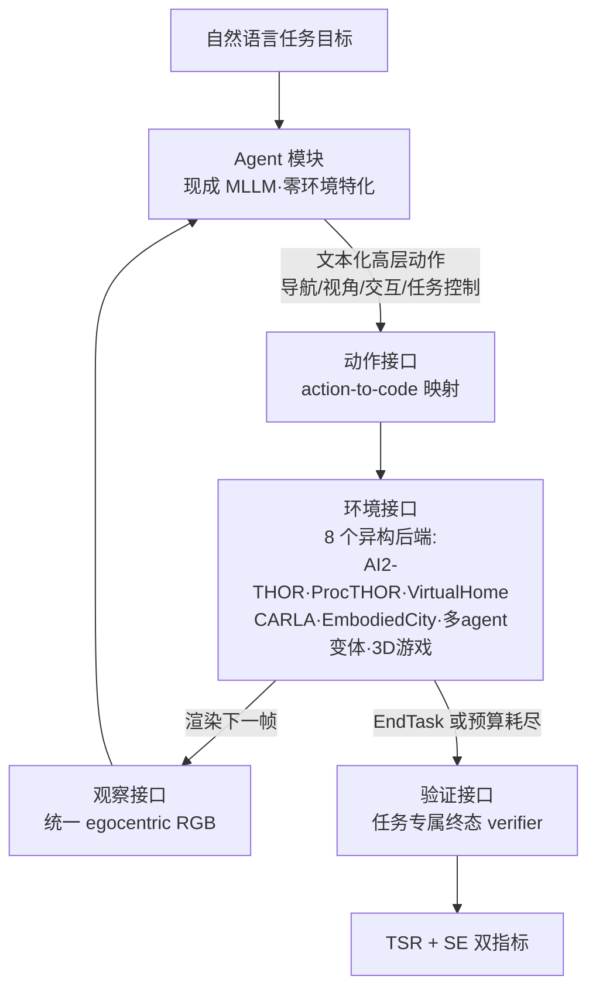

# Paper · 论文本身

## 一句话总结

SpatialWorld 把"空间推理"的考法从**看图答题改成真下场干活**:760 个人工标注任务、8 个异构 3D 模拟器,统一成一个"只给第一人称 RGB 图、只许说话式动作"的封闭循环协议,按**终态**判成败——15 个前沿多模态模型里最强的 GPT-5 平均任务成功率也只有 17.4%[^paper]。口号式概括:**会描述空间 ≠ 会在空间里办事**。

## 问题(Problem)

- 现有空间推理评测绝大多数是**被动范式**:静态 VQA(看一张图答方位题)或看预录视频——考的是"识别空间关系",不是"在部分可观测的环境里边走边看边干"。
- 现有具身(embodied)基准虽然可交互,但**深度绑定单个模拟器**:各家有自己的传感器假设、动作接口、执行管线,模型得分到底反映"通用空间智能"还是"适配了那个模拟器",分不开。
- 真实物理空间是**部分可观测**的:单视角拿不到全貌,agent 必须主动移动收集视觉证据、更新空间信念、再规划下一步——这正是被动评测考不到的核心环节。
- 缺的是一个**模拟器无关**的统一协议:现成多模态模型(不做任何环境特化微调)能否仅凭第一人称视觉 + 语言化高层决策,在异构 3D 环境里闭环解题?

> [!key] 立场
> 这篇的护城河不在"又一个 leaderboard 分数",而在**评测工程的三件套设计**:① 把 8 个异构模拟器封装进同一个"观察-动作瓶颈接口"(语言化高层动作 → 各模拟器专属执行码),让"换环境不换 agent"成为可能;② **终态验证替代轨迹匹配**——允许 agent 走任何路径,只查最后世界状态对不对;③ 用**抽象 3D 游戏**(魔方/贪吃蛇/积木)剥掉照片级语义,把"几何推理"从"视觉常识捷径"里隔离出来单独考。这三件对任何做 agent 评测的人都是可抄的结构件;760 个任务本身反而是消耗品。

## 关键术语(Key terms)

| 术语 | 大白话解释 |
| --- | --- |
| **交互式空间推理(interactive spatial reasoning)** | 不是看图说话,而是在 3D 环境里边移动边收集视觉证据、边更新"我在哪/东西在哪"的信念、边执行任务[^paper]。 |
| **vision-only 部分可观测** | agent 每步只拿到一张第一人称 RGB 截图——没有深度图、没有物体坐标、没有全局地图等"特权信息",和人类玩家同等条件[^s21]。 |
| **统一跨平台接口** | 把 8 个模拟器各自的观察渲染和物理执行封装成同一套 I/O:观察统一成 egocentric RGB,动作统一成文本化高层指令(Move/Rotate/Pick/Place/EndTask 四大类)[^s23]。 |
| **终态验证(execution-based verification)** | 不比对 agent 走的步骤和参考答案像不像,只用任务专属 verifier 查**最终环境状态**是否满足目标——开放路径,客观判分[^s23]。 |
| **TSR(任务成功率)** | 终态验证通过的任务占比,主指标。 |
| **SE(步效率)** | 成功任务上"人类参考步数 ÷ agent 实际步数"的平均——区分"高效解题"和"靠穷举试错蹭过"[^s23]。 |
| **factored complexity(复杂度因子分解)** | 在写实模拟器之外特意自建抽象 3D 游戏(Block3D/Snake3D/魔方):剥掉照片级语义和场景先验,单独度量纯几何/拓扑推理[^s23]。 |

## 核心方法(Core method)

类比:以前考空间能力像**看着照片考驾照理论**;SpatialWorld 是把考生塞进 8 辆不同品牌的教练车(室内家务、城市驾驶、无人机、多人协作、抽象游戏),但**方向盘和仪表盘全部换成同一套**——你只能看挡风玻璃(第一人称 RGB),只能用普通话发指令("前进""左转""拿起杯子"),考官只看你最后**有没有把车停进库**,不管你倒了几把。

任务形式化为 vision-only POMDP:每步给自然语言目标 g + 当前第一人称 RGB 观察,模型基于完整交互历史输出下一个高层动作,模拟器执行后渲染新观察,直到 EndTask 或步数预算耗尽(预算 = 2×人类参考步数 + 10)。

数据构建三段流水线:**任务设计**(标注者写指令 + 配置初始状态)→ **人类执行**(受训标注者亲自在模拟器里解题,录下真值终态 + 参考动作序列)→ **交叉验证**(独立专家复核可行性、指令清晰度、判分脚本正确性)。每个任务因此自带三件套:人工校验的初始状态、参考轨迹、终态 verifier。

## 架构 / 流程(Architecture / pipeline)

## 创新点(Innovation points)

| 创新 | 新在哪 | 为什么重要 |
| --- | --- | --- |
| 模拟器无关统一协议 | 观察/动作接口做成严格 I/O 瓶颈,8 个后端共用一套 agent 策略 | 得分终于能归因到"通用空间能力",而非"适配了哪个模拟器" |
| 终态验证 | 跟随 OSWorld/Spider2-V 的执行验证思路引入空间域,替代轨迹匹配 | 开放解法路径;判分客观、可复现 |
| 抽象游戏对照组 | 自建 Block3D/Snake3D/魔方等,剥离照片级语义 | 把"几何推理弱"和"视觉常识强"解耦,定位真瓶颈 |
| TSR+SE 双指标 | 成功率之外单独量"靠不靠穷举" | 暴露"成功但低效"这类单指标看不见的失败模式 |
| 任务三件套 | 每任务=人工校验初始状态+人类参考轨迹+终态 verifier,独立专家交叉复核 | 评测信号的一致性/可复现性有工序保障 |

## 实验 / 证据(Experiments / evidence)

15 个模型(开源 9 + 闭源 6),官方 API/开源权重直接评,零微调;温度 1.0,保留最近 30 轮交互;以下均为**论文自报**[^t3]:

- **全员不及格**:最强 GPT-5 全基准平均 TSR 仅 **17.4%**(物理域 14.4%,数字游戏 36.4%);最强开源 Qwen-3.5-397B-A17B 14.1%(物理 12.2%);多数模型物理域在 3–10% 区间。
- **成功 ≠ 高效**:Kimi-K2.5 与 GPT-5.4 物理 TSR 相近(9.2% vs 6.6%),但 SE 反过来(0.486 vs 0.569)——前者靠大量试错蹭成功。论文同时承认 TSR 差距大时 SE **不可比**(完成任务集合不同)。
- **没有全能冠军**:GPT-5 领跑家务/旅行/社交协作,Qwen-3.5 在工作学习与 GPT-5 打平(16.9%)、领跑实体娱乐,Gemini-3.1-Pro 数字游戏第一(39.0%);室内 GPT-5/Qwen-3.5 强,室外 Gemini-3-Flash 反超(9.0%)。
- **复合任务是断崖**:纯交互类任务平均 TSR 50.2%(GPT-5 达 69.4%),纯导航 8.6%,而"导航+交互"复合任务**只有 4.2%**——瓶颈在"边走边干"的长程组合,不在单项操作。
- **多 agent 协作分两层**:GPT-5 社交协作 34.8% 主要来自手工布局的 Multi-AI2THOR;程序化生成布局的 Multi-ProcTHOR 上**最好的模型也只有 5.9%**——共享进度追踪和角色分配在陌生布局里急剧失效。
- **游戏内分化**:贪吃蛇/导航类反应式控制尚可,魔方/Block3D 这类需要显式几何变换和多步状态追踪的**系统性溃败**。
- **感知消融**:分辨率曲线平坦(不是瓶颈);视野(FOV)调大整体有益但会饱和,默认保留 60° 模拟人类视角;温度影响边际,历史窗口/动作参数化的最优值**完全因模型而异**。

> [!warn] 别被带偏
> ① 标题里的"Real-World Tasks"指**任务类型贴近真实生活**,环境全部还是模拟器——没有任何真实机器人/真实街景实验。② "GPT-5 17.4%"是含数字游戏的全均值,物理域其实是 14.4%,引用时别混。③ **GPT-5.4 大幅差于 GPT-5**(物理 6.6% vs 14.4%,游戏 11.9% vs 36.4%),论文未解释——这暗示分数对"模型×接口适配"敏感,排行榜名次别太当真。④ 判分链路的人工交叉验证**没报一致性数字**(对比:AdaPlanBench 报了 89.76% 人机一致率),verifier 质量只能信工序。⑤ 跑一遍 15 模型 × 760 任务 × 多轮带图交互的 API 成本未披露——数据不足。

## 限制与风险(Limitations and risks)

- 全模拟器评测,sim-to-real 鸿沟未触及;物理引擎的简化(抓取/碰撞)可能高估或低估真实难度。
- SE 只在成功任务上计算,天然有幸存者偏差;论文自己也限定了它的可比范围。
- 高层动作空间屏蔽了低层控制难度——这是设计选择(考推理不考控制),但也意味着结论不能外推到 VLA/机器人控制栈。
- 任务量 760 对 8 环境 × 5 域 × 3 复杂度来说切得较薄(如 VirtualHome 仅 38 题、Multi-ProcTHOR 仅 17 题),细分格子的数字波动会很大。
- 步数预算 2g+10 以人类参考步数为锚,对探索风格不同的模型可能松紧不一。

## 先读什么(What to read first)

1. Figure 1 + §2.2 四条设计原则 —— 全文的"为什么这样考"。
2. §2.3 观察/动作接口 + Figure 3 —— 统一协议怎么落地(action-to-code 映射是工程核心)。
3. §2.4 + Figure 2 —— 任务三件套的生产工序。
4. Table 3 + §3.3 Complexity Modes —— 50.2% vs 4.2% 的断崖是全文最重要的数字。
5. Appendix F(动作空间定义)+ Appendix A.2(任务特化判分)—— 想复用协议的人必读。
6. 代码:GitHub `Hongcheng-Gao/SpatialWorld`(37★);数据:HF `TTTCHHDDD/SpatialWorld-data`;项目页 spatial-world.github.io。

## 技术细节(选读)

**POMDP 形式化与交互预算**
大白话:每一步=看一张图、说一个动作;什么时候停=自己宣布完成,或步数花光。
精确机制(原文 §2.1, Eq.1):任务为 ⟨S,O,A,T,Ω,R⟩ 的 POMDP,策略基于完整轨迹历史 H_t 出动作;步数预算动态设为 2g+10(g=人工标注的黄金动作数);主实验上下文窗口 w=30 轮、温度 1.0(§3.1)。

**统一动作空间**
大白话:四类动作——走路、转头、动手、收工/喊话,全部用文字表达,各模拟器后端自己翻译成自家执行码。
精确机制(原文 §2.3, Fig.3, Appendix F):Navigation(如 Move)/ Viewpoint & Posture(如 Rotate)/ Interaction(如 Pick/Place)/ Task-Control & Coordination(如 EndTask)四类;Action Interface 做 action-to-code 映射,同一 agent 策略跨环境零修改部署。具体动作清单与参数定义在 Appendix F,正文未全列——逐项以原文附录为准。

**双指标定义**
大白话:TSR=办成事的比例;SE=办成的事里走了多少冤枉路。
精确机制(原文 §2.3):TSR = (1/N)·Σ 1[V_i(s_T)=1];SE = 成功集合上 n*/n 的均值(n*=人类参考步数)。注意 SE 的分母集合随模型变化,跨模型可比性有条件。

**防张冠李戴**:① 终态验证不是本文首创——作者明确标注**跟随 OSWorld 和 Spider2-V**(计算机使用域),本文的贡献是把它带进异构 3D 空间域并配上统一接口;② 它考的是**高层语言动作**,与 EmbodiedBench 等"预测低层原子动作 + 喂传感器数据"的 VLA 路线是**不同赛道**,两边的分数不可互比;③ 自报 vs 实测:全部 benchmark 数字为论文团队实测第三方模型(官方 API),但对各模型的 prompt/接口适配未公开逐模型调优细节,GPT-5.4 异常低分提示适配方差存在。

## 后续演化 · 这方法后来怎样了

- 论文 2026-06-08 提交,**暂无可核实的前向引用**——本节数据不足。
- 可独立观察的现状:GitHub 37★、HF 数据集已挂出(更新于 2026-06-10)、项目页在线;能否像 OSWorld 一样成为领域标准测床,取决于社区跑分采用度,现在下结论为时尚早。_[置信度:高——基于可直接核验的仓库/数据集状态,非前向引用]_

[^paper]: SpatialWorld,arXiv:2606.09669(清华、重大、北大、上交、港大等 10 机构,2026-06-08 提交,HF 39 赞)。Abstract 与 §1。
[^s21]: 原文 §2.1 Task Formulation。
[^s23]: 原文 §2.2 Benchmark Protocol、§2.3 SpatialWorld Architecture(观察/动作空间、环境套件、执行验证)。
[^t3]: 原文 §3.2 Table 3(TSR)、§3.3 Table 4(SE)及 Fig.5–8;逐格数值以原文表为准。
