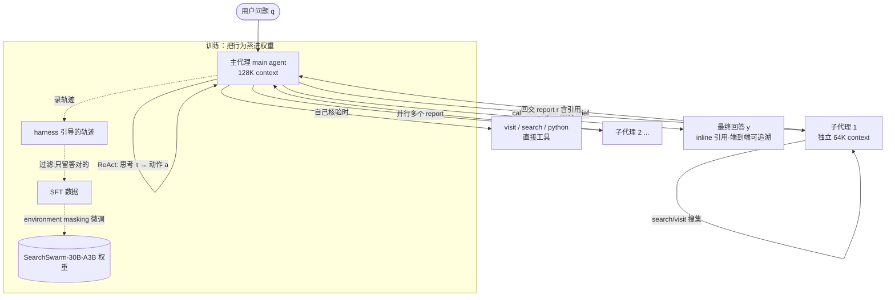

# Paper · 论文本身

## 一句话总结

SearchSwarm 把"主代理拆任务、子代理干活、只回收摘要"这套**委托（delegation）**打法，先用一套精心设计的 **harness（运行壳：工具集 + 系统提示词）**在推理时逼出高质量委托轨迹，再把这些轨迹**蒸馏进模型权重**（监督微调），让一个本来不会委托的 30B 小模型学会"像项目经理一样指挥自己"——口号式概括：**把"会指挥"这件事训练成模型的本能，而不是靠外挂提示词临时撑住**。[^abs]

## 问题(Problem)

- 长程（long-horizon）深度研究任务的信息需求可以无上限增长，但模型 context window 是有限的——这是结构性矛盾。
- 现有的上下文管理（context management）大多是**被动**的：等 context 快满了才压缩、或按固定规则丢弃旧的工具输出。本质是"撑不住了再删"。
- 一个更**主动**的范式是：主代理提前规划拆解，把子任务派发给独立 context 的子代理，只收回**压缩后的摘要报告**。但把这件事做好需要一种能力——作者称之为 **delegation intelligence（委托智能）**：会拆、知道何时该委托什么、能把回收的结果接回主线。
- 卡点在数据：自然语料里几乎不存在"显式的多代理协作"轨迹，所以**怎么合成这种训练数据、怎么把这种能力训进模型**，开源社区基本没人系统做过。SearchSwarm 补的就是这个缺口。

> [!key] 立场
> 这篇最该看的不是它的 benchmark 分数，而是它对**"多代理"的祛魅**：它反复强调 SearchSwarm **只有一个模型**，子代理是"同一个模型在新开的干净 context 里跑"，不是另外的模型。于是"主派发-子执行"被它**重新定义为单模型的智能上下文管理**——主代理生成的 brief（任务简报）和 report（回收报告）只是一种"内容感知的压缩"，替代了固定规则的截断/摘要。这个 reframe 是它整篇论证的地基（也是它敢和其它上下文管理方法"同台比较"的理由），比分数重要得多。

## 关键术语(Key terms)

| 术语 | 大白话解释 |
| --- | --- |
| **delegation intelligence（委托智能）** | 主代理"会指挥"的能力：会把大任务拆成子任务、判断何时该委托什么、把子代理交回的结果接回主线。[^deleg] |
| **harness（运行壳）** | 套在模型外面的"工作环境"：一组工具（search/visit/python/call_sub_agent）+ 一套系统提示词，引导模型按预期方式干活。本身不改模型权重。[^harness] |
| **main-distributes, sub-executes（主派发-子执行）** | 主代理负责规划与派发，子代理在独立 context 里执行具体搜集，只回交一份摘要。 |
| **brief（任务简报）/ report（回收报告）** | brief 是主代理派给子代理的全部上下文（子代理只看得到它）；report 是子代理干完回交的压缩结论。两者都由模型自己生成。 |
| **context management（上下文管理）** | 在有限 context 里选择保留/压缩哪些信息的策略。SearchSwarm 把"委托"论证成它的一种**主动**形态。 |
| **SFT with environment masking（带环境屏蔽的监督微调）** | 微调时只对模型自己产出的 token（思考 + 工具调用）算 loss，把环境返回的工具结果全部 mask 掉——只学"该怎么决策"，不背"环境内容"。 |

## 核心方法(Core method)

把它想成**训练一个新晋项目经理**：

1. **先给他一套规矩（harness）**，让他在真实项目里按规矩干活。规矩有四条核心原则（见下）。
2. **录下他干得好的那些项目过程（轨迹）**——这些过程里天然包含了"什么时候该把活分出去、怎么写交接说明、怎么核对下属的结论"这些正确决策。
3. **只挑做对了的项目录像，剪掉坏习惯**（重复搜同样的词、编造引用、拿 python 当浏览器用），当成教材。
4. **让他反复看这些教材直到形成肌肉记忆**（监督微调，把决策模式写进权重）——以后不靠贴在墙上的规矩，他自己就会指挥。

harness 的四条设计原则（§2.2）：
- **鼓励委托**：多步信息搜集是"花 token 多、认知含量低"的体力活，应该外包给子代理，主代理的注意力留给规划/核验/综合。只有子任务浅到"外包的开销 > 省下的 context"时主代理才自己动手。
- **写全交接简报**：子代理在全新 context 里开工，brief 是它唯一的信息来源。要求主代理把 brief 当成"给新加入的同事的入职说明"来写：这个子任务为什么重要、目前已确认什么、还有什么不确定、哪些方向已排除。
- **主代理保留核心判断**：只有主代理纵观全部子任务，方向性决策（追哪个假设、何时收尾、矛盾报告怎么裁决）必须由它独立做出；不能无条件信子代理的结论，否则错误会累积传播。
- **引用落地的报告**：主代理看不到子代理的中间执行，所以要求子代理的报告对每个重要结论挂 inline 引用（指向具体源 URL），主代理才能核验真伪、并把引用传播到最终回答里实现端到端可追溯。

## 架构 / 流程(Architecture / pipeline)

## 创新点(Innovation points)

| 创新 | 新在哪 | 为什么重要 |
| --- | --- | --- |
| harness→轨迹→权重的完整配方 | 不只给架构/算法，而是把 **harness 设计 + 数据合成 + 训练**串成可复现的开源全套 | 解决了"委托智能没有训练数据"这个真正卡点 |
| 委托=单模型上下文管理的 reframe | 论证子代理是同一模型的 fresh context，brief/report 是内容感知压缩 | 让"主派发-子执行"能与上下文管理方法公平同台比较，去掉"多代理"光环 |
| 两配置数据采集 | 配置 1 同模型兼任主/子；配置 2 强模型当主、弱模型当子，只留主轨迹 | 弱子代理逼主代理更严格地把控主线与核验，产出更优质的决策轨迹 |
| environment masking | 只对模型输出算 loss，mask 掉所有工具返回 | 学"怎么决策"而非"背环境内容"，避免记忆噪声 |

## 实验 / 证据(Experiments / evidence)

> 全部数字为**作者自报**（technical report 自测，baseline 取自各家技术报告/模型卡）；逐格表值以原文 Table 1/2 为准。判定模型为 DeepSeek-V4-Flash 并人工复核。

- **主结果（自报）**：SearchSwarm-30B-A3B 在 BrowseComp **68.1**、BrowseComp-ZH **73.3**、GAIA **82.5**、xbench-DeepSearch-2505 **80.8**——在所有 30B-A3B 同量级模型里全面 SOTA（超过前最佳 MiroThinker-1.7-mini 的 67.9 / 72.3 / 80.3）。
- **训练增益（自报）**：base 模型（Tongyi DeepResearch，无上下文管理）BrowseComp 仅 43.4 → 训练后 68.1，**+24.7 绝对分**。
- **跨量级竞争力（自报）**：BrowseComp 上追平 DeepSeek V3.2（671B-A37B，67.6）、超过 GPT-5.2-Thinking（65.8）；GAIA 上超 GPT-5（76.4）、Seed-2.0-Pro（78.6），仅次于 Step-3.5-Flash（84.5）。即"小 10 倍仍有竞争力"。
- **harness 消融（自报，200 题子集，DeepSeek V3.2）**：原 Tongyi DR 框架 47.7 → 只加 call_sub_agent 工具描述 50.0（+2.3）→ 完整 harness **57.7**（+10.0）。说明"光给委托工具"提升很小，**带四原则的完整 harness 才是关键**。
- **关键负面发现（自报）**：把 harness 套在**未微调**的 Tongyi DR 上（Tongyi DR Swarm），模型**从不调用 call_sub_agent**，行为退化成普通 Tongyi DR——证明委托行为**不会从 harness 自发涌现，必须显式训练**。
- **泛化（自报）**：① 单代理设定（禁用 call_sub_agent）下仍 52.0/53.3，优于 Tongyi DR 的 43.5/46.5，尽管训练数据**不含**任何无子代理工具的轨迹；② 开放式深研 4 benchmark 平均 +14.2（64.2 vs base 50.0）；③ 换底座 Qwen3-30B-A3B-Thinking-2507 用同一份数据微调，200 题 BrowseComp 子集达 66.5——证明是**数据/harness 质量**而非某个底座的功劳。
- **行为分析（自报）**：主代理 call_sub_agent 占比在 BrowseComp/-ZH 超 70%，GAIA/xbench 43–51%；主代理直接用工具时 visit 远多于 search（沿子代理报告里的引用 URL 去核验）。

> [!warn] 别被带偏
> ① 这是 **preliminary exploration（初步探索）**，作者自己这么定位；分数全是自报，没有第三方复测。② "委托"在本文里**只省主代理的 context，不省总算力**——子代理把搜集成本付在自己 context 里，总 token 花费可能更多（行为分析显示难题会触发更多轮子代理探索）。③ 委托限制为**单层**（子代理不能再派子代理），并非任意深度的层级编排。④ 整套只在 **deep research（短答+开放式）**一类任务上验证，是否迁移到编码、具身等长程任务未知。

## 限制与风险(Limitations and risks)

- 作者明确定位为初步探索，结果可能随底座/数据规模变化。
- 委托深度被刻意限制为单层，回避了多层编排的协调复杂度。
- 强依赖**可验证答案过滤**（只留答对的主轨迹）来保证数据质量——这套过滤在没有清晰对错信号的任务上难以照搬。
- 评测用 LLM 当判官（DeepSeek-V4-Flash + 人工复核），判官偏置无法完全排除。

## 先读什么(What to read first)

1. Abstract + §1 引言 —— 为什么"委托"是主动的上下文管理、数据为什么稀缺。
2. §2.1 Formulation 里的 "Delegation as context management" 段 —— **全文地基**：为什么这是单模型而非多代理系统。
3. §2.2 Harness Design 四原则 —— 护城河所在。
4. §2.3 监督微调（两配置数据采集 + environment masking）。
5. §3.3 harness 消融 + §3.2 末尾 Tongyi DR Swarm 负面发现 —— "harness 不训练就失效"的证据。
6. 仓库 + Appendix B 完整提示词（把四原则写成了可抄的系统提示词）。

## 技术细节(选读)

### 委托的形式化（§2.1）
- **大白话**：主代理走 ReAct（思考→动作→观察）循环；当动作是 `call_sub_agent(b)` 时，开一条只看得到 brief `b`、看不到主代理历史的独立子轨迹，子轨迹跑完只把 report `r` 当作这一步的 observation `o_t` 喂回主代理。
- **精确机制（原文 §2.1）**：子轨迹 $H^{sub}=(b,(\tau_0^s,a_0^s,o_0^s),\dots,r)$ 仅条件于 `b`，对主代理历史 $H_{t-1}$ 不可见；主代理只观察到最终 report，中间步骤不可见。两份（brief 与 report）都由模型生成，不是固定规则——这正是它自称"内容感知压缩替代固定规则截断"的依据。

### 训练目标（§2.3）
- **大白话**：让模型预测下一个 token，但只对"模型自己说的话"算分，工具返回的内容一律不算分。
- **精确机制（原文式 5）**：$\mathcal{L}=-\sum_t\sum_j \log p_\theta(a_t^{(j)}\mid a_t^{(<j)},\tau_{<t})$，loss 只覆盖模型输出 $a_t$，所有环境返回 $o_t$ 被 mask。主代理与子代理轨迹同等对待。

### 防张冠李戴
- **SearchSwarm 用的是 SFT（监督微调），不是 RL。** 把强化学习算在它头上是错的——用 RL 训主代理派发策略（且冻结子代理参数）的是 Kimi 团队的 **Agent Swarm**（原文 §1、§4.1 明确区分）。SearchSwarm 的贡献恰恰是"用 harness 合成 SFT 数据"这条更轻的路线。
- **SearchSwarm 是单模型，不是多模型多代理系统。** "子代理"= 同一个模型在独立 fresh context 里被再次调用，没有第二个模型（原文 §2.1 明确声明）。把它描述成"多个不同模型协作"是错的。
- 主结果用**完整 1266 题 BrowseComp**；部分消融/换底座实验用 **200 题子集**，两者数字不可直接混比（原文脚注 1 自己提醒了）。

## 解法是怎么找到的(选读)

> 锚定原文 §3.2 末尾 + §2.3，是论文真实呈现的设计逻辑，非反推。

- **隐含假设**：一套足够好的 harness（四条原则的系统提示词）应该能在推理时直接"激发"出委托行为，也许根本不需要训练。
- **失败证据（原文 §3.2 "Tongyi DR Swarm"）**：把完整 harness 套在未微调的 Tongyi DeepResearch 上，模型**从不调用 `call_sub_agent`**，表现与不带 harness 时完全一致——委托行为没有自发涌现。
- **走到最终方案**：因此作者转向"harness 先把好轨迹逼出来 → 过滤 → SFT 蒸进权重"。harness 消融（47.7→50.0→57.7，§3.3）进一步说明：委托工具本身只值 +2.3，真正起作用的是四原则把轨迹质量拉高，而这份质量必须被训练固化才稳定。这条"假设失败→改走训练"的链条是论文自己给出的，不是从 abstract 倒推的动机。

## 后续演化 · 这方法后来怎样了

> 本文 2026-06-08 提交，过新，尚无可独立核实的前向引用工作；下列为它所处的同期脉络，非"后来者优化它"。
- 它显式承接并区别于 **Kimi Agent Swarm（RL 路线）** 与 huang2026step 的层级设计——这是它的**同期对照**而非后继。_[置信度:高（原文 §1/§4.1 直接陈述）]_
- 它开源了 harness/权重/训练数据，定位为"给社区做委托智能研究的起点"；真实的前向影响需待后续工作出现后再核实。_[置信度:低]_

[^abs]: 论文 Abstract 与 §1；SearchSwarm: Towards Delegation Intelligence in Agentic LLMs for Long-Horizon Deep Research, arXiv:2606.09730（Tsinghua / PKU / Ant Group / RUC，2026-06-08，HF ▲49）。
[^deleg]: 概念定义见原文 §1 与 §4.1（delegation 作为人类管理复杂度的基本策略，类比迁移到 context window 这一资源约束）。
[^harness]: harness 的工具集与四原则见 §2.2；完整系统提示词见 Appendix B Table 3/4。
