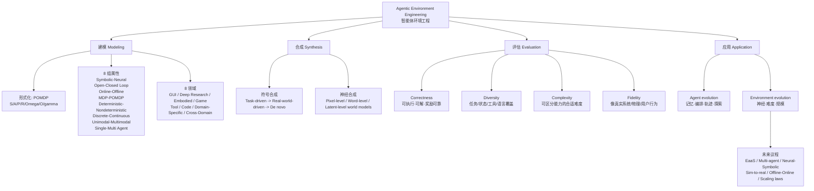

# Paper · 论文本身

## 一句话总结

这是一篇**地图型综述**：它把“给 LLM agent 造可交互环境”从零散 benchmark / sandbox / world model 工作，整理成一门 **agentic environment engineering（智能体环境工程）**——先定义环境是什么，再按 8 组属性和 8 个任务领域定位环境，最后把自动造环境、评环境、用环境推动 agent 和环境一起进化串成一条生命周期。口号可以浓缩成一句：**agent 要长期变强，不能只靠模型和数据；环境是第三种训练燃料。**[^arxiv]

## 问题(Problem)

- 现在很多 agent 论文都会造一个环境：网页、终端、GUI、工具 API、游戏、代码仓库、科研任务、机器人模拟器。问题是这些环境通常**各造各的**，接口、反馈、验证方式、难度、可复现性都不统一。
- 传统数据工程喂的是静态样本，agent 环境喂的是**可行动、会反馈、会改变状态的世界**。如果还用“数据集”那套语言去描述它，就会漏掉多轮交互、错误恢复、工具反馈、奖励设计、课程难度这些关键问题。[^pre]
- 作者想补的是一张领域坐标系：一个环境该从哪些属性看、落在哪些任务域、怎么自动合成、合成后怎么评、它又怎么反过来推动 agent 的记忆、工作流、轨迹和 RL 训练。[^intro]

> [!key] 立场
> 这篇最值得学的不是某个新算法，而是**把“环境”升格成 agent 工程的一等公民**。它给自进化 agent 补上了过去容易忽略的一侧：我们常盯着 agent 自己怎么记忆、怎么规划、怎么 RL，却很少系统问“它在什么环境里学，环境难度怎么变，环境质量怎么量，环境接口怎么标准化”。这篇的强项是把问题铺成地图；弱项也正是地图型综述的弱项——分类和空白诊断多为作者定性归纳，不等于已经有统一实测证明。

## 关键术语(Key terms)

| 术语 | 大白话解释 |
| --- | --- |
| **agentic environment（智能体环境）** | 给 LLM agent 训练或评测用的“可交互世界”：agent 能观察、行动、拿反馈，环境状态也会跟着变。它比静态数据集多了动作、状态转移和奖励。[^pre] |
| **POMDP（部分可观测马尔可夫决策过程）** | 像玩只露出局部地图的游戏：真实世界状态不全给你，agent 只能根据一路看到的观察和反馈做决策。作者用它形式化环境。[^pre] |
| **环境工程生命周期** | 把环境相关工作拆成“建模 / 合成 / 评估 / 应用”四段：先说清环境长什么样，再自动造，造完评质量，最后拿来推动 agent 进化。[^intro] |
| **符号环境（symbolic environment）** | 用代码、规则、数据库、测试器来驱动状态变化。好处是可控、可验证；坏处是覆盖真实世界复杂性时很费工程。[^attr] |
| **神经环境（neural environment）** | 用神经网络或 world model 预测下一步状态和反馈。好处是可生成、可扩展；坏处是黑箱、不稳定、难验证。[^attr] |
| **de novo synthesis（从零环境合成）** | 不再只包装现成数据或真实网页，而是让生成模型从零造出带工具、规则和验证逻辑的环境。自由度最高，也最怕逻辑不严。[^syn] |
| **环境质量四维** | correctness / diversity / complexity / fidelity：能不能跑对、够不够多样、难度是否合适、像不像真实世界。作者强调后三维还很初级。[^eval] |
| **EaaS（Environment-as-a-Service）** | 把环境像云服务一样封装成统一 API，让 agent 开发者不用每次亲自部署浏览器、容器、模拟器和依赖。[^future] |

## 核心方法(Core method)

这篇没有提出一个可运行的新模型，而是提出一套**分类和组织框架**。可以把它想成给 agent 环境领域做了一本“工程地图册”：

1. **先给环境建模**：作者把环境写成 `E = <S, A, P, R, Ω, O, γ>`。大白话说，就是环境有隐藏状态 `S`、可行动作 `A`、行动后怎么变 `P`、给什么奖励 `R`、agent 能看到什么 `Ω/O`，以及未来奖励怎么折扣 `γ`。[^pre]
2. **再用 8 组属性定位环境**：不是只说“这是网页环境”，还要问它是符号还是神经、开环还是闭环、在线还是离线、完全可观测还是部分可观测、确定还是随机、离散还是连续、单模态还是多模态、单 agent 还是多 agent。[^attr]
3. **再按 8 个任务领域铺开地图**：GUI、Deep Research、Embodied、Game、Tool、Code、Domain-Specific、Cross-Domain。每个领域强调的能力不同：GUI/Tool/Code 偏外部操作，Embodied/Game 偏感知控制与规划，Deep Research/Domain-Specific 偏证据综合和知识推理，Cross-Domain 看跨环境泛化。[^domain]
4. **合成环境分两大路**：符号合成像“搭可执行规则工厂”，从 task-driven 到 real-world-driven 再到 de novo；神经合成像“训练一个可想象世界的模拟器”，按 pixel / word / latent 三种表示粒度切分。[^syn]
5. **应用层看双向进化**：环境让 agent 进化有四条路：记忆中心、编排中心、轨迹中心、探索中心；环境自己进化有三条路：神经驱动、难度驱动、规模驱动。[^agent-evo][^env-evo]

## 架构 / 流程

## 创新点(Innovation points)

| 创新 | 新在哪 | 为什么重要 |
| --- | --- | --- |
| 把“环境工程”作为生命周期来讲 | 不是只列 benchmark，而是按建模、合成、评估、应用组织整片领域 | 让环境从“临时测试台”变成可设计、可比较、可演化的工程对象 |
| 8 组属性 + 8 领域双坐标 | 同一个环境既能按底层机制定位，也能按任务域定位 | 避免把 WebArena、SWE-Bench、OSWorld、ToolBench 只粗暴叫“agent benchmark” |
| 符号合成三段演进 | task-driven → real-world-driven → de novo，自由度越来越高，验证压力也越来越大 | 点出了环境 scaling 的核心张力：越想大规模自动造，越要更强验证 |
| 神经合成三层表示 | pixel / word / latent 三种世界模型，各自牺牲和获得不同东西 | 帮读者理解为什么“用 LLM 模拟网页”和“用视频模型模拟机器人”不是一类问题 |
| 环境质量四维 | correctness 之外，把 diversity、complexity、fidelity 单独拎出来 | 很多环境看似能跑，但太同质、太简单、太不像真实系统，训不出泛化能力 |
| agent 进化 4 路径 × 环境进化 3 范式 | 把“agent 怎么变强”和“环境怎么变强”拆开 | 对自进化系统很关键：别把 agent 记忆更新、环境课程调难度、任务规模扩展混成一团 |

## 实验 / 证据(Experiments / evidence)

这是一篇 **survey**，没有作者自做 benchmark，也没有“我们的方法比 baseline 提升 X%”这类实验数字。因此这里的证据层只放可核实的范围、分类、表格和页面信息。

| 证据项 | 数字 / 结论 | 来源属性 |
| --- | ---: | --- |
| 论文规模 | 63 pages, 10 figures | arXiv 自报 comments[^arxiv] |
| 作者与单位 | 15 位作者；Jun Zhao 通讯作者；前 11 位等贡献；单位为中科院自动化所复杂系统认知与决策智能重点实验室 | TeX 源 `main.tex` 自报[^authors] |
| 参考文献规模 | `main.bbl` 中 582 条 `\bibitem` | 本地 TeX 源计数，非论文正文声称 |
| HF 热度 | 2026-06-11 页面显示 #3 Paper of the day，55 upvotes，Chinese Academy of Sciences | HF 页面动态信息[^hf] |
| 环境属性 | 8 组二分属性：Symbolic/Neural、Open/Closed Loop、Online/Offline、MDP/POMDP、Deterministic/Nondeterministic、Discrete/Continuous、Unimodal/Multimodal、Single/Multi-Agent | 原文 §3 自报分类[^attr] |
| 任务领域 | 8 类：GUI、Deep Research、Embodied、Game、Tool、Code、Domain-Specific、Cross-Domain | 原文 §4 自报分类[^domain] |
| 合成范式 | 2 大类：Symbolic Synthesis 与 Neural Synthesis；符号合成再分 3 段，神经合成再分 3 层 | 原文 §5 自报分类[^syn] |
| 环境质量评估 | 4 维：correctness、diversity、complexity、fidelity；作者认为后三维仍 preliminary / under-researched | 原文 §5.3 定性判断[^eval] |
| agent 进化路径 | 4 类：Memory-Centric、Orchestration-Centric、Trajectory-Centric、Exploration-Centric | 原文 §6 自报分类[^agent-evo] |
| 环境进化范式 | 3 类：Neural-Driven、Difficulty-Driven、Scaling-Driven | 原文 §7 自报分类[^env-evo] |

表格层面，正文包含多张大型综述表：4 张环境领域表（GUI/Deep Research、Embodied/Game、Tool/Code、Domain-Specific/Cross-Domain）、符号合成代表方法表、神经合成代表方法表、4 张 agent evolution 方法统计表、1 张 environment evolution 方法统计表。逐格归类请以原文表格为准；本文只抽主线，不还原每个被引工作的表格位置。

> [!warn] 别被带偏
> 1. **这不是“环境工程已经被解决”的论文**。它是综述和议程设定，不是一个可下载运行的环境平台。
> 2. **作者的分类不是自然定律**。8 属性、8 领域、4+3 进化路径是有用坐标，但边界会有争议，例如某些 GUI / Tool / Code / Cross-Domain 工作会跨类。
> 3. **“多智能体环境不足”“神经-符号未平衡”“后三维评估欠研究”是定性观察**。可作为研究判断，不应写成量化实测结论。
> 4. **没有配套代码仓库**。arXiv 与 HF 页面未披露官方 repo；搜索未找到作者绑定代码。综述表中被引工作的仓库不等于本论文仓库。

## 限制与风险(Limitations and risks)

- **证据形态偏综述**：它用大量文献归类支撑地图，但不做新实验，因此“哪种环境合成路线更强”不能从本文直接得出。
- **分类主观性**：属性和领域的切法对读者很有帮助，但不是唯一切法；落地到具体系统时需要重新裁剪。
- **前沿工作时效短**：agent 环境领域 2025-2026 变化很快，63 页综述也会迅速过期，尤其是 EaaS、MCP、world model、agentic RL 相关部分。
- **工程落地缺口大**：EaaS、neural-symbolic environment、environment scaling law 都是方向，不是现成方案。
- **环境质量量化仍薄**：correctness 可以靠执行、单测、verifier，diversity / complexity / fidelity 还没有统一度量，容易被漂亮但弱的指标误导。

## 先读什么(What to read first)

1. **Abstract + Introduction**：先拿全局生命周期、3 个 RQ 和 4+3 进化框架。[^intro]
2. **§2 Preliminaries**：读 POMDP 定义，以及为什么环境工程不是传统数据工程的平替，而是从静态数据变成闭环互动。[^pre]
3. **§3 Environment Attribute**：重点记住 8 组属性，尤其 Symbolic/Neural、Open/Closed Loop、Single/Multi-Agent。[^attr]
4. **§5 Environment Synthesis**：读符号合成三段、神经合成三层，以及 quality control 四维。[^syn][^eval]
5. **§6–§7**：如果你关心自进化 agent，直接看 agent evolution 4 路径和 environment evolution 3 范式。[^agent-evo][^env-evo]
6. **§8 Future Directions**：把 EaaS、多智能体、神经-符号、sim-to-real、offline-online 统一、environment scaling law 当成后续追踪清单。[^future]

## 技术细节(选读)

**1. 为什么用 POMDP 来定义环境**

大白话：agent 面对的不是“题目 + 标准答案”，而是一个只露出局部状态的世界。它每一步动作都会改变后续观察，所以要记录历史，不是只看当前 prompt。

精确机制：作者把环境写成 `E = <S, A, P, R, Ω, O, γ>`：隐藏状态、动作、转移、奖励、观察空间、观察函数和折扣因子；agent 的历史 `h_t` 由过去观察、动作和奖励组成，策略 `π` 根据历史选下一个动作。这里的 agentic environment 与传统 RL simulator 的差异在于，它更开放、语言中心、工具增强，动作可以是自然语言 token 或工具调用。[^pre]

**2. 8 组属性为什么重要**

大白话：给环境贴“网页”或“代码”标签不够。两个代码环境可能一个是离线单步模仿，一个是在线容器交互；两个网页环境可能一个只看缓存快照，一个要实时操作动态网页。属性决定了 agent 到底在学什么。

精确机制：§3 的 8 组属性分别从转移函数实现、反馈闭环、交互机制、可观测性、随机性、动作空间、观察模态、agent 数量切入。尤其要注意 **Single-Agent vs Multi-Agent**：多 agent 环境的转移由联合动作 `a_t = <a_t^1,...,a_t^N>` 驱动，每个 agent 可以有自己的策略和奖励，合作、竞争或混合都会改变学习问题。[^attr]

**3. 符号合成 vs 神经合成不是“旧 vs 新”**

大白话：符号合成像搭一个有规则和测试的游乐场，神经合成像训练一个会想象后果的世界模型。前者更可控，后者更会铺开复杂世界；真正难的是把两者的优点合起来。

精确机制：符号合成用代码或规则控制 `P` 和 `R`，作者按自由度分 task-driven、real-world-driven、de novo。神经合成用 world model 表示环境，按表示层分 pixel-level（视觉细节多但冗余）、word-level（抽象强但可能丢保真）、latent-level（压缩结构但可解释性弱）。§8 的 neural-symbolic environments 正是针对这两边缺点提出的未来方向。[^syn][^future]

**4. 防张冠李戴：agent evolution 和 environment evolution 是两件事**

大白话：agent 自己变聪明和环境变难/变广不是一回事。前者是“学生进步”，后者是“训练场升级”。课程学习调难度属于环境侧；记忆库、技能库、工作流、RL 参数更新属于 agent 侧。

精确机制：§6 的 agent evolution 分为 memory-centric、orchestration-centric、trajectory-centric、exploration-centric；§7 的 environment evolution 分为 neural-driven、difficulty-driven、scaling-driven。把 “Difficulty-Driven Evolution” 说成 agent 自己的 memory evolution，或把 “Trajectory-Centric Offline Evolution” 说成环境本身变了，都会混淆作者的框架。[^agent-evo][^env-evo]

## 后续演化 · 这方法后来怎样了

这是 2026-06-10 刚提交的综述，当前没有可独立核实的后续改进论文。因此这里不写“谁已经改进了它”，只写它在原文中明确提出、值得后续追踪的研究议程：

- **Environment-as-a-Service**：标准化 observation/action/reward/interaction API，把复杂环境封装成云端服务，降低部署和复现实验成本。_[置信度:高，原文 §8.1 明确倡议]_。[^future]
- **从 single-agent 到 multi-agent environments**：让环境表达协作、竞争、战略互动、信用分配和涌现行为，而不只是一名 agent 对静态世界。_[置信度:高，原文 §8.3 明确列为方向]_。[^future]
- **Neural-Symbolic Environments**：把神经环境的表达力和符号环境的可解释、可控、可验证结合起来。_[置信度:高，原文 §8.4 明确列为方向]_。[^future]
- **Science of Environment Engineering**：研究环境 scaling laws、environment learnability、环境属性和 agent 能力之间的映射。_[置信度:中，属于作者展望，是否形成可复现实证体系仍待观察]_。[^future]

[^arxiv]: arXiv 页面：*Agentic Environment Engineering for Large Language Models: A Survey of Environment Modeling, Synthesis, Evaluation, and Application*, arXiv:2606.12191 v1, submitted 2026-06-10；comments: 63 pages, 10 figures。https://arxiv.org/abs/2606.12191
[^hf]: Hugging Face Papers 页面，2026-06-11 核验：Published on Jun 10, submitted by Zhuoran Jin on Jun 11, #3 Paper of the day, Chinese Academy of Sciences, 55 upvotes。https://huggingface.co/papers/2606.12191
[^authors]: arXiv TeX source `main.tex` 作者块：15 位作者；Jun Zhao 为通讯作者；前 11 位作者等贡献；单位为 Key Laboratory of Cognition and Decision Intelligence for Complex Systems, Institute of Automation, Chinese Academy of Sciences。
[^intro]: 原文 §1 Introduction：给出 3 个 RQ、生命周期视角、8 属性、8 领域、符号/神经合成、4 条 agent 进化路径、3 条环境进化范式与未来方向。
[^pre]: 原文 §2 Preliminaries：POMDP 形式化、Agent / Environment-Agent Alignment、PPO/GRPO/DAPO 背景，以及 data engineering 到 environment engineering 的三段迁移。
[^attr]: 原文 §3 Environment Attribute：8 组属性为 Symbolic vs Neural、Open-Loop vs Closed-Loop、Online vs Offline、MDP vs POMDP、Deterministic vs Nondeterministic、Discrete vs Continuous、Unimodal vs Multimodal、Single-Agent vs Multi-Agent。
[^domain]: 原文 §4 Environment Domain：GUI、Deep Research、Embodied、Game、Tool、Code、Domain-Specific、Cross-Domain 八个领域，以及 Takeaway 4 对能力侧重点和环境设计演化的总结。
[^syn]: 原文 §5 Environment Synthesis：Symbolic Synthesis 分 Task-Driven、Real-World-Driven、De Novo；Neural Synthesis 分 Pixel-Level、Word-Level、Latent-Level。
[^eval]: 原文 §5 Quality Control and Evaluation of Environments：四维 quality control 为 correctness、diversity、complexity、fidelity；Takeaway 5.3 指出后三维研究仍 preliminary。
[^agent-evo]: 原文 §6 Agent Evolution：Memory-Centric Experience Evolution、Orchestration-Centric Workflow Evolution、Trajectory-Centric Offline Evolution、Exploration-Centric Online Evolution。
[^env-evo]: 原文 §7 Environment Evolution：Neural-Driven、Difficulty-Driven、Scaling-Driven 三类，以及表格统计多种代表方法。
[^future]: 原文 §8 Challenges & Future Directions：EaaS、环境属性演化、多智能体环境、神经-符号环境、sim-to-real gap、agent-environment co-evolution、offline-online 统一、environment scaling laws / learnability / capability mapping。
